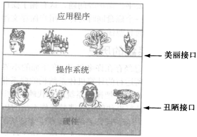

    <a href="#操作系统" style="color: white; border-right: 1px solid white; text-decoration: none; font-size: 14px; font-weight: bold; display: inline-block; padding: 5px 8px; line-height: 20px;">back to top ▲</a>
    <a style="cursor: pointer; color: white; border-right: 1px solid white; text-decoration: none; font-weight: bold; display: inline-block; padding: 5px 8px; line-height: 20px;" onclick="(function(){document.querySelector('.btn.pull-left.js-toolbar-action').click()})()"><i class="fa fa-align-justify"></i></a>

# 操作系统

* 操作系统是一种运行在内核态的软件，为应用程序提供一个资源集的清晰抽象，并管理这些硬件资源；
* 操作系统是管理和控制计算机软硬件资源的计算机程序，是直接运行在“裸机”上的最基本的系统软件，任何其他软件都必须在操作系统的支持下才能运行；
* 操作系统是管理计算机硬件资源，控制其他程序运行并为用户提供交互操作界面的系统软件的集合。操作系统是计算机系统的关键组成部分，负责管理与配置内存、决定系统资源供需的优先次序、控制输入与输出设备、操作网络与管理文件系统等基本任务。

### POSIX

Portable Operating System Interface of UNIX，可移植操作系统接口。POSIX标准定义了操作系统应该为应用程序提供的接口标准，是IEEE为在各种UNIX操作系统上运行的软件定义的一系列API标准的总称，其正式称呼为IEEE 1003。POSIX标准意在期望获得源代码级别的软件可移植性。换句话说，为一个POSIX兼容的操作系统编写的程序，应该可以在任何POSIX操作系统（即使是来自另一个厂商）上编译执行。
