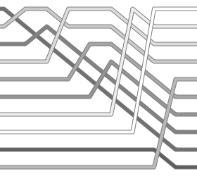
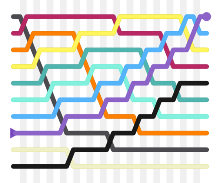
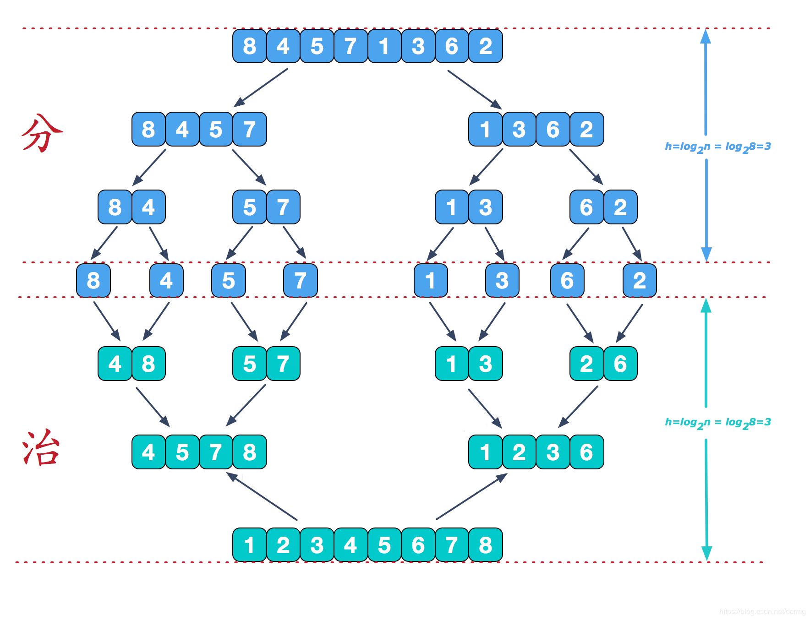
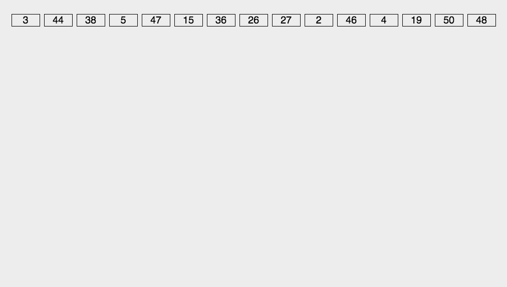

<div style="position: fixed; bottom: 20px; right: 39px; border-radius: 5px; background-color: #797979; z-index: 100;">
    <a href="#目录" style="color: white; border-right: 1px solid white; text-decoration: none; font-size: 14px; font-weight: bold; display: inline-block; padding: 5px 8px; line-height: 20px;">back to top ▲</a>
    <a style="cursor: pointer; color: white; border-right: 1px solid white; text-decoration: none; font-weight: bold; display: inline-block; padding: 5px 8px; line-height: 20px;" onclick="(function(){document.querySelector('.btn.pull-left.js-toolbar-action').click()})()"><i class="fa fa-align-justify"></i></a>
</div>

# 目录

[iOS开发培训之十大编程算法助程序员走上大神路](http://www.sohu.com/a/66747709_252502)
[The Algorithms](https://github.com/TheAlgorithms)

[一个算法可视化网站](https://visualgo.net/zh/sorting)

<sub>（带*标的属于八大排序）</sub>

* [比较排序](#比较排序)
    * [直接插入排序（Straight Insertion Sort）*](#直接插入排序（straight-insertion-sort）*)
    * [希尔排序（Shell Sort）*](#希尔排序（shell-sort）*)
    * [简单选择排序（Simple Select Sort）*](#简单选择排序（simple-select-sort）*)
    * [堆排序（Heap Sort）*](#堆排序（heap-sort）*)
    * [冒泡排序（Bubble Sort）*](#冒泡排序（bubble-sort）*)
    * [快速排序（Quick Sort）*](#快速排序（quick-sort）*)
    * [归并排序（Merge Sort）*](#归并排序（merge-sort）*)
* [非比较排序](#非比较排序)
    * [基数排序（Radix Sort）*](#基数排序（radix-sort）*)
    * [计数排序（Counting Sort）](#计数排序（counting-sort）)
    * [桶排序（Bucket Sort）](#桶排序（bucket-sort）)


<table>
	<tr>
		<th rowspan="2">排序方法</th>
		<th colspan="3">时间复杂度</th>
		<th>空间复杂度</th>
		<th rowspan="2">稳定性</th>
	</tr>
	<tr>
		<th>平均情况</th>
		<th>最好情况</th>
		<th>最坏情况</th>
		<th>辅助存储</th>
	</tr>
	<tr>
		<th>直接插入排序（Straight Insertion Sort）</th>
		<td>O(n<sup>2</sup>)</td>
		<td>O(n)</td>
		<td>O(n<sup>2</sup>)</td>
		<td>O(1)</td>
		<td>稳定</td>
	</tr>
	<tr>
		<th>希尔排序（Shell Sort）</th>
		<td>O(n<sup>1.3</sup>)</td>
		<td>O(n)</td>
		<td>O(n<sup>2</sup>)</td>
		<td>O(1)</td>
		<td>不稳定</td>
	</tr>
	<tr>
		<th>简单选择排序（Simple Select Sort）</th>
		<td>O(n<sup>2</sup>)</td>
		<td>O(n<sup>2</sup>)</td>
		<td>O(n<sup>2</sup>)</td>
		<td>O(1)</td>
		<td>不稳定</td>
	</tr>
	<tr>
		<th>堆排序（Heap Sort）</th>
		<td>O(nlogn)</td>
		<td>O(nlogn)</td>
		<td>O(nlogn)</td>
		<td>O(nlogn)</td>
		<td>不稳定</td>
	</tr>
	<tr>
		<th>冒泡排序（Bubble Sort）</th>
		<td>O(n<sup>2</sup>)</td>
		<td>O(n)</td>
		<td>O(n<sup>2</sup>)</td>
		<td>O(1)</td>
		<td>稳定</td>
	</tr>
	<tr>
		<th>快速排序（Quick Sort）</th>
		<td>O(nlogn)</td>
		<td>O(nlogn)</td>
		<td>O(n<sup>2</sup>)</td>
		<td>O(nlogn)</td>
		<td>不稳定</td>
	</tr>
	<tr>
		<th>归并排序（Merge Sort）</th>
		<td>O(nlogn)</td>
		<td>O(nlogn)</td>
		<td>O(nlogn)</td>
		<td>O(n)</td>
		<td>稳定</td>
	</tr>
	<tr>
		<th>基数排序（Radix Sort）</th>
		<td>O(d(r+n))</td>
		<td>O(d(n+rd))</td>
		<td>O(d(r+n))</td>
		<td>O(rd+n)</td>
		<td>稳定</td>
	</tr>
	<tr>
		<th>计数排序（Counting Sort）</th>
		<td>O()</td>
		<td>O()</td>
		<td>O()</td>
		<td>O()</td>
		<td>稳定</td>
	</tr>
	<tr>
		<th>桶排序（Bucket Sort）</th>
		<td>O()</td>
		<td>O()</td>
		<td>O()</td>
		<td>O()</td>
		<td>稳定</td>
	</tr>
</table>

**注：基数排序复杂度中，r代表关键字的基数，d代表长度，n代表关键字的个数。**


```python
class Sort():
    def __init__(self, target):
        self._target = target
    
    def show(self):
        print(self._target)
    
    def less(self, m, n):
        return self._target[m] <= self._target[n]
    
    def exch(self, m, n):
        foo = self._target[m]
        self._target[m] = self._target[n]
        self._target[n] = foo
        
    def isSorted(self):
        for i in range(len(self._target)-1):
            if not self.less(i, i+1):
                return False
        return True
    
    def sort(self):
        pass
    
    def main(self):
        print("Original List:")
        self.show()
        print("---------------------")
        self.sort()
        if self.isSorted():
            print('Sort Successfully!')
            self.show()
        else:
            print("Sort Unsuccessfully!")
            self.show()
```

## 直接插入排序（straight-insertion-sort）*

直接插入排序中，我们把初始的未排序序列分成两部分：已排序部分 和 未排序部分。

1. 最开始，已排序部分只有一个元素；
2. 然后把未排序部分的元素一个一个拿出来插入到已排序部分的对应位置。

已排序部分（未排序部分）每次增加（减少）一个元素。



##### JavaScript 实现

```javascript
function straightInsertionSort(arr){
	var len = arr.length;
	for(var i=1; i<len; i++){
		var temp = arr[i];	// 从未排序部分取出的，要插入到已排序部分的元素
		// 挨个与已排序部分中的元素比较，移动已排序部分中的元素，找到合适的插入位置
		for(var j=i-1; j>=0 && (arr[j]>temp); j--){
			arr[j+1] = arr[j];
		}
		// 插入
		arr[j+1] = temp;
	}
	return arr;
}
```

##### Python 实现

```python
def straightInsertionSort(myList):
	for index in range(1, len(myList)): # index，从未排序部分取出的元素的下标
		# 挨个与已排序部分中的元素比较，交换位置，直到位置合适
		while index>0 and myList[index-1]>myList[index]: # 
			myList[index], myList[index-1] = myList[index-1], myList[index]
			index -= 1
	return myList
```

## 希尔排序（Shell Sort）*

* 直接插入排序在操作时几乎已经排好序的数据时，效率更高；
* 直接插入排序低效是因为每次只能将数据移动一位。

希尔排序是直接插入排序的变种，将待排序序列根据一定步长分成若干子序列，分别对子序列进行直接插入排序，待整个序列中的记录“基本有序”时，缩短步长，继续对整个序列排序，直到步长为 1（此时即为直接插入排序）。

__设置步长是为了可以将元素交换到较远的位置。__

步长的选择：

* interval = interval * 3 + 1
* 目前已知的最好的步长序列，由 Marcin Ciura 设计：[1, 4, 10, 23, 57, 132, 301, 701, 1750, ...]
* 另一个在大数组中表现优异的步长序列：[1, 9, 34, 182, 836, 4025, 19001, 90358, 428481, ...]


##### JavaScript 实现

```javascript
function shellSort(arr){
	var interval = 1;
	while(interval < arr.length/3){
		interval = interval * 3 + 1;
	}

	while(interval > 0){
		for(var outer = interval; outer < arr.length; outer++){
			var value = arr[outer];
			var inner = outer;
			while(inner > interval - 1 && arr[inner - interval] >= value){
				arr[inner] = arr[inner - interval];
				inner = inner - interval;
			}
			arr[inner] = value;
		}
		interval = (interval - 1) / 3;
	}
	return arr;
}
```

##### Python 实现

```python
def shell_sort(myList):
    gaps = [1750, 701, 301, 132, 57, 23, 10, 4, 1]

    for gap in gaps:
        i = gap
        while i < len(myList):
            temp = myList[i]
            j = i
            while j >= gap and myList[j - gap] > temp:
                myList[j] = myList[j - gap]
                j -= gap
            myList[j] = temp
            i += 1

    return myList
```


## 简单选择排序（simple-select-sort）*

简单选择排序中，我们把初始的未排序序列分成两部分：已排序部分 和 未排序部分。

1. 最开始，已排序部分为空；
2. 然后找出未排序部分中的最小（大）元素，放到已排序部分的末尾；
4. 重复第2步，直到所有元素均排序完毕。

已排序部分（未排序部分）每次增加（减少）一个元素。


##### JavaScript 实现

```javascript
function simpleSelectionSort(arr){
    var length = arr.length;
    for(var i=0; i<length-1; i++){
        var min = i;
        for(var j=i+1; j<length; j++){
            if(arr[j] < arr[min]){
                min = j;
            }
        }
        if(min != i){
            var tmp = arr[i];
            arr[i] = arr[min];
            arr[min] = tmp;
        }
    }
}
```

##### Python 实现

```python
def simpleSelectionSort(myList):
    length = len(myList)
    for i in range(length - 1):
        least = i
        for k in range(i + 1, length):
            if myList[k] < myList[least]:
                least = k
        myList[least], myList[i] = myList[i], myList[least]
    return myList
```


## 堆排序（Heap Sort）*

算法思想(以大顶堆为例)：

1. 将长度为n的待排序的序列进行堆有序化构造成一个大顶堆；
2. 将根节点与尾节点交换并输出此时的尾节点；
3. 将剩余的n-1个节点重新进行堆有序化；
4. 重复步骤2，步骤3直至构造成一个有序序列。


##### JavaScript 实现

```javascript
function heapSort(arr) {

 let length = arr.length;

  for (let i = Math.floor(length / 2) - 1; i > -1; i--) {
    arr.heapify(i, length);
  }
  for (let j = length -1; j > 0; j--) {
    let tmp = arr[0];
    arr[0] = arr[j];
    arr[j] = tmp;
    arr.heapify(0, j);
  }
  return arr;
}
```


##### Python 实现

```python
def heapify(myList, index, heap_size):
    largest = index
    left_index = 2 * index + 1
    right_index = 2 * index + 2
    if left_index < heap_size and myList[left_index] > myList[largest]:
        largest = left_index

    if right_index < heap_size and myList[right_index] > myList[largest]:
        largest = right_index

    if largest != index:
        myList[largest], myList[index] = myList[index], myList[largest]
        heapify(myList, largest, heap_size)

def heapSort(myList):
    n = len(myList)
    for i in range(n // 2 - 1, -1, -1):
        heapify(myList, i, n)
    for i in range(n - 1, 0, -1):
        myList[0], myList[i] = myList[i], myList[0]
        heapify(myList, 0, i)
    return myList
```


## 冒泡排序（bubble-sort）*

重复遍历待排序序列，一次比较两个元素，如果顺序错误就把它们交换过来。当某趟遍历没有发生交换，说明该序列已排序完成。

这个算法的名字由来是因为越小的元素会经由交换慢慢“浮”到数列的顶端。



##### JavaScript 实现

```javascript
function bubbleSort(arr){
    let swapped = true;
    while(swapped){
        swapped = false;
        for(let i=0; i<arr.length-1; i++){
            if(arr[i] > arr[i + 1]){
                let temp = arr[i];
                arr[i] = arr[i + 1];
                arr[i + 1] = temp;
                swapped = true;
            }
        }
    }
    return arr;
}
```

##### Python 实现

```python
def bubbleSort(myList):
    length = len(myList)
    for i in range(length-1):
        swapped = False
        for j in range(length-1-i):
            if myList[j] > myList[j+1]:
                swapped = True
                myList[j], myList[j+1] = myList[j+1], myList[j]
        if not swapped: break
    return myList
```


## 快速排序（Quick Sort）*


快速排序使用分治策略（Divide and Conquer）来把一个序列分为两个子序列：

1. 从序列中挑一个元素作为“基准”（pivot）；
2. 把所有比基准值小的元素放在基准前面，所有比基准值大的元素放在基准的后面（相同的数可以放到任一边），这个称为分区（partition）操作；
3. 对每个分区递归地进行步骤1~2，递归的结束条件是序列的大小是0或1，这时序列整体已经排序好了。


##### JavaScript 实现

```javascript
function quickSort(arr){
	var len = arr.length;
	if(len <= 1){
		return arr;
	}
	var PIVOT = arr[0],
		GREATER = [],
		LESSER = [];

	for(var i = 1; i < len; i++){
		arr[i]>PIVOT ? GREATER.push(arr[i]) : LESSER.push(arr[i]);
	}

	var sorted = quickSort(LESSER);
	sorted.push(PIVOT);
	sorted = sorted.concat(quickSort(GREATER));

	return sorted;
}
```

##### Python 实现

```python
# 写法一：
def quickSort(myList, start, end):
    # 判断low是否小于high,如果为false,直接返回
    if start < end:
        i, j = start, end
        # 设置枢轴
        pivot = myList[i]
        while i < j:
            # 如果列表后边的数,比枢轴大或相等,则前移一位直到有比枢轴小的数出现
            while (i < j) and (myList[j] >= pivot):
                j = j - 1
            # 如找到,则把第j个元素赋值给第个元素i,此时表中i,j个元素相等
            myList[i] = myList[j]
            # 同样的方式比较前半区
            while (i < j) and (myList[i] <= pivot):
                i = i + 1
            myList[j] = myList[i]
        # 做完第一轮比较之后,列表被分成了两个半区,并且i=j,需要将这个数设置回pivot
        myList[j] = pivot
        # 递归前后半区
        QuickSort(myList, start, i - 1)
        QuickSort(myList, j + 1, end)
    return myList

# 写法二：超级直观简单！！！
def quickSort(myList):
	if len(myList) < 2:
		return myList
	else:
		mid = myList[0]
		less = [i for i in myList[1:] if i <= mid]
		more = [i for i in myList[1:] if i > mid]
	return QuickSort(less) + [mid] + QuickSort(more)
```


## 归并排序（Merge Sort）*





##### JavaScript 实现

```javascript
function merge(arr1, arr2){
	var results = [];

	while(arr1.length && arr2.length){
		if(arr1[0] <= arr2[0]){
			results.push(arr1.shift());
		}else{
			results.push(arr2.shift());
		}
	}
	return results.concat(arr1, arr2);
}

function mergeSort(arr){
	if(arr.length < 2){
		return arr
	};

	var arrHalf = Math.floor(arr.length/2);
	var subArr1 = arr.slice(0, arrHalf);
	var subArr2 = arr.slice(arrHalf, arr.length);

	return merge(mergeSort(subArr1), mergeSort(subArr2));
}
```


##### Python 实现

```python
def mergeSort(myList):
    def merge(left, right):
        result = []
        while left and right:
            result.append(left.pop(0) if left[0]<=right[0] else right.pop(0))
        return result + left + right
    if len(myList) <= 1:
        return myList
    mid = len(myList) // 2
    return merge(merge_sort(myList[:mid]), merge_sort(myList[mid:]))
```


## 基数排序（Radix Sort）*




##### JavaScript 实现

```javascript
function radixSort(arr, RADIX){
	if(RADIX === undefined || RADIX < 1){
		RADIX = 10;
	}

	var maxLength = false;
	var placement = 1;

	while(!maxLength){
		maxLength = true;
		var buckets = [];

		for(var i=0; i<RADIX; i++){
			buckets.push([]);
		}

		for(var j=0; j<arr.length; j++){
			var tmp = arr[j] / placement;
			buckets[Math.floor(tmp % RADIX)].push(arr[j]);
			if(maxLength && tmp>0){
				maxLength = false;
			}
		}

		var a = 0;
		for(var b=0; b<RADIX; b++){
			var buck = buckets[b];
			for(var k=0; k<buck.length; k++){
				arr[a] = buck[k];
				a++;
			}
		}
		placement *= RADIX;
	}
	return arr;
}
```

##### Python 实现

```python
def radixSort(myList):
    RADIX = 10
    placement = 1

    # get the maximum number
    max_digit = max(myList)

    while placement < max_digit:
        # declare and initialize buckets
        buckets = [list() for _ in range(RADIX)]

        # split myList between lists
        for i in myList:
            tmp = int((i / placement) % RADIX)
            buckets[tmp].append(i)

        # empty lists into myList array
        a = 0
        for b in range( RADIX ):
            buck = buckets[b]
            for i in buck:
                myList[a] = i
                a += 1

        # move to next
        placement *= RADIX
```


## 计数排序（Counting Sort）


##### JavaScript 实现

```javascript

```


##### Python 实现

```python
def countingSort(myList):
    if myList == []:
        return []
        
    list_len = len(myList)
    list_max = max(myList)
    list_min = min(myList)

    # create the counting array
    counting_list_length = list_max + 1 - list_min
    counting_list = [0] * counting_list_length

    # count how much a number appears in the myList
    for number in myList:
        counting_list[number - list_min] += 1

    # sum each position with it's predecessors. now, counting_list[i] tells
    # us how many elements <= i has in the myList
    for i in range(1, counting_list_length):
        counting_list[i] = counting_list[i] + counting_list[i-1]

    # create the output myList
    ordered = [0] * list_len

    # place the elements in the output, respecting the original order (stable
    # sort) from end to begin, updating counting_list
    for i in reversed(range(0, list_len)):
        ordered[counting_list[myList[i] - list_min]-1] = myList[i]
        counting_list[myList[i] - list_min] -= 1

    return ordered
```


## 桶排序（Bucket Sort）


##### JavaScript 实现

```javascript

```


##### Python 实现

```python

```