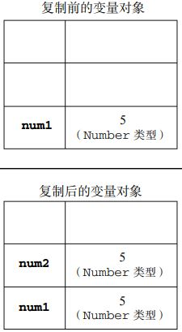
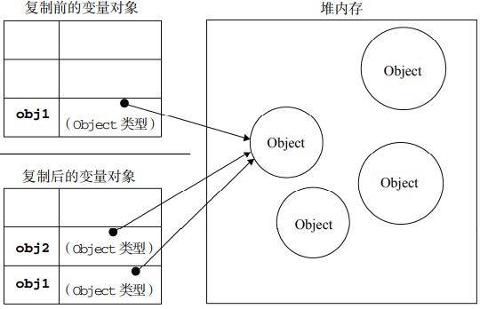
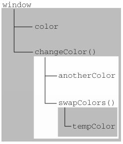
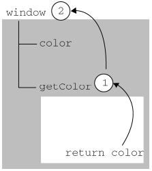

###### [<p align="right" style="position: fixed; bottom: 20px; right: 30px; background-color: #797979; line-height: 20px; z-index: 100; color: white; border-radius: 5px; padding: 5px; font-size: 12px; vertical-align: middle;">back to top ▲</p>](#目录)

# 目录

* [数据类型](#数据类型)
    * [五种基本数据类型](#五种基本数据类型)
        * [Undefined类型](#undefined类型)
        * [Null类型](#null类型)
        * [Boolean类型](#boolean类型)
        * [Number类型](#number类型)
        * [String类型](#string类型)
    * [一种复杂数据类型](#一种复杂数据类型)
    * [引用类型](#引用类型)
        * [Object类型](#object类型)
        * [Array类型](#array类型)
        * [Date类型](#date类型)
        * [RegExp类型](#regexp类型)
        * [Function类型](#function类型)
        * [基本包装类型](#基本包装类型)
* [变量、作用域和内存问题](#变量、作用域和内存问题)
* [XMLHttpRequest](#xmlhttprequest)
    * [Get](#get)
    * [Post](#post)


* 不要使用new Number()、new Boolean()、new String()创建包装对象；
* 用parseInt()或parseFloat()来转换任意类型到number；
* 用String()来转换任意类型到string，或者直接调用某个对象的toString()方法；
* 通常不必把任意类型转换为boolean再判断，因为可以直接写if (myVar) {...}；
* typeof操作符可以判断出number、boolean、string、function和undefined；
* 判断Array要使用Array.isArray(arr)；
* 判断null请使用myVar === null；
* 判断某个全局变量是否存在用typeof window.myVar === 'undefined'；
* 函数内部判断某个变量是否存在用typeof myVar === 'undefined'。


# <p align="center" style="border-bottom: 3px solid #e7e7e7;">数据类型</p>

## 五种基本数据类型

#### Undefined类型

* Undefined类型只有一个值，即undefined；
* 在使用var声明变量但未对其加以初始化时，这个变量的值就是undefined；

    ```javascript
    var message;
    alert(message == undefined);    //true
    //等价于
    var message = undefined;
    alert(message == undefined);    //true
    ```

* 对于尚未声明过的变量，只能执行一项操作，即使用typeof操作符检测其数据类型。

    ```javascript
    //下面这个变量没有声明
    // var age;
    alert(age);         //Uncaught ReferenceError: age is not defined
    alert(typeof age);  //"undefined"
    ```

#### Null类型

* Null类型只有一个值，即null；
* null值表示一个空对象指针，所以用typeof检测null值时会返回"object"；
* 如果声明的变量准备在将来用于保存对象，那么最好将该变量初始化为null而不是其他值。这样只要直接检查null值就可以知道该变量是否已经保存了一个对象的引用；

    ```javascript
    if(car != null){
        //对car对象执行某些操作
    }
    ```

* undefined值派生自null值， alert(null == undefined);   //true

#### Boolean类型

* Boolean类型有两个值， true和false；
* Boolean类型的字面值只有两个，但ECMAScript中所有类型的值都有与这两个boolean值等价的值。要将一个值转换为其对应的boolean值，可以调用转型函数Boolean()；

    ```javascript
    var message = "Hello World!";
    var messageAsBoolean = Boolean(message);    //true
    ```

|数据类型|转换为true的值|转换为false的值|
|:---|:---|:---|
|boolean|true|false|
|string|任何非空字符串|""（空字符串）|
|number|任何非零数字值（包括无穷大）|0和NaN|
|object|任何对象|null|
|undefined|不适用|undefined|

#### Number类型

* 整数
    * 十进制："var intNum = 55;"；
    * 八进制：八进制字面值的第一位必须是零（0），然后是八进制数字序列（0～7）。如果字面值中的数值超出了范围，那么前导零将被忽略，后面的数值将被当作十进制数值解析。八进制字面量在严格模式无效，会使JavaScript引擎报错："SyntaxError: Octal literals are not allowed in strict mode."；

        ```javascript
        var octalNum1 = 070;    //八进制的56
        var octalNum2 = 079;    //无效的八进制数值——解析为79
        var octalNum3 = 08;     //无效的八进制数值——解析为8
        ```
    * 十六进制：十六进制字面值的前两位必须是0x，后跟任何十六进制数字（0～9及A～F/a~f）；

        ```javascript
        var hexNum1 = 0xA;  //十六进制的10
        var hexNum2 = 0x1f; //十六进制的31
        var hexNum3 = 0x1g; //Uncaught SyntaxError: Invalid or unexpected token
        ```
    * 进行算术计算时，所有以八进制和十六进制表示的数值最终都将被转换成十进制数值。
* 浮点数

    ```javascript
    var floatNum1 = 1.1
    var floatNum2 = 0.1
    var floatNum3 = .1  //有效，但不推荐
    //保存浮点数需要的内存空间是整数的两倍，
    //因此ECMAScript会不失时机地将浮点数值转换为整数值。
    //如果浮点数值本身表示的就是一个整数（如 1.0），那么该值也会被转换为整数。
    var floatNum4 = 1.      //小数点后没有数字——解析为1
    var floatNum5 = 10.0    //整数——解析为10

    //对于极大或极小的数值，可以用科学计数法表示。
    var floatNum6 = 3.125e7 //等于3125000
    var floatNum7 = 3e-17    //等于0.00000000000000003
    //ECMASctipt默认会将小数点后面带有6个零以上的浮点数值转换为科学计数法。
    var floatNum8 = 0.0000003
    floatNum8   //3e-7

    //浮点数进行算术运算时精确度远不如整数。
    0.1 + 0.2   //0.30000000000000004
    0.05 + 0.25 //0.3
    0.15 + 0.15 //0.3
    if(a + b == 0.3){   //永远不要测试某个特定的浮点数值。
        alert("You got 0.3!")
    }
    ```

* 数值范围

    ```javascript
    Number.MIN_VALUE    //ECMAScript能够表示的最小数值：5e-324
    Number.MAX_VALUE    //ECMAScript能够表示的最大数值：1.7976931348623157e+308

    //如果某次计算结果超出JavaScript数值范围的值，
    //那么这个数值会被自动转换成特殊的Infinity值。
    //如果这个数值是负数，会被转换成-Infinity（负无穷），
    //如果这个数值是正数，会被转换成Infinity（正无穷）。
    //Infinity是不能够参与计算的数值。

    //可以使用isFinite()函数确定一个数值是不是有穷的，
    //这个函数在参数位于最小与最大数值之间时会返回true：
    var result = Number.MAX_VALUE + Number.MAX_VALUE;
    alert(isFinite(result)); //false

    Number.NEGATIVE_INFINITY    //-Infinity
    Number.POSITIVE_INFINITY    //Infinity
    ```

* NaN
    * 非数值（Not a Number），一个特殊的数值，用于表示一个本来要返回数值的操作未返回数值的情况，这样就不会报错了；

        ```javascript
        0/0     //NaN
        正数/0  //Infinity
        负数/0  //-Infinity
        ```

    * 任何涉及NaN的操作都会返回NaN（如NaN/10）；
    * NaN与任何值都不相等，包括NaN本身（alert(NaN == NaN);   //false）;
    * isNaN()，这个函数帮我们确定一个数是否“不是数值”。

        ```javascript
        //isNaN()在接收到一个值之后，会尝试将这个值转换为数值，
        //而任何不能被转换为数值的值都会导致这个函数返回true。   
        alert(isNaN(NaN));      //true
        alert(isNaN(10));       //false（10是一个数值）
        alert(isNaN("10"));     //false（可以被转换成数值10）
        alert(isNaN("blue"));   //true（不能转换成数值）
        alert(isNaN(true));     //false（可以被转换成数值1）

        //isNaN()也适用于对象,
        //用isNaN()测试对象时，会先调用对象的valueOf()方法，确定其返回值是否能转换为数值；
        //如果对象没有valueOf()方法，则调用对象的toString()方法，确定该其返回值是否能转换为数值；
        //如果对象没有valueOf()和toString()方法，返回true；
        ```

* 数制转换
    * Number()：可以用于任何数据类型；
        * Boolean值：true和false将分别被转换为1和0；
        * 数字值：只是简单的传入和返回；
        * null值：返回0；
        * undefined：返回NaN；
        * 字符串，遵循下列规则：
            * 只含数字（包括前面带正号或负号的情况），转换为十进制数值，"1"变成1，"123"变成123，"011"、"0011"变成11（注意：前导的零被忽略）；
            * 包含有效的浮点格式，如"1.1"，转换为对应的浮点数值（同样忽略前导零）；
            * 包含有效的十六进制格式，例如"0xf"，转换为相同大小的十进制整数值；
            * 空串（不包含任何字符），转换为0；
            * 包含除上述格式之外的字符，转换为NaN。
        * 对象：调用对象的valueOf()方法，然后依照前面的规则转换返回的值；如果对象没有valueOf()方法，则调用toString()方法，再前面的规则转换返回的字符串值；如果对象没有valueOf()和toString()方法，则返回NaN。
    * parseInt()：用于转换String类型，其余类型值会先转换为String类型；
        1. 忽略字符串前面的空格，直至找到第一个非空格字符；
        2. 如果第一个字符不是数字字符或者负号，返回NaN（parseInt("")-->NaN， Number("")-->0）；
        3. 如果第一个字符是数字字符，则继续解析第二个字符，直到解析完所有后续字符或者遇到一个非数字字符；
        4. parseInt()能够识别十六进制整数：如果字符串以"0x"开头且后跟数字字符，会将其当作一个十六进制整数；
        5. 在ECMAScript 5 JavaScript引擎中， parseInt()已不具有解析八进制值的能力， parseInt("070")-->70；
        6. 可以为parseInt()提供第二个参数：转换时使用的基数，即多少进制。
            ```javascript
            var num1 = parseInt("0xAF", 16);	//175
            var num2 = parseInt("AF", 16); 		//175，指定16作第二个参数，字符串前可以不带"0x"
            var num3 = parseInt("10", 2); 		//2 （按二进制解析）
            var num4 = parseInt("10", 8); 		//8 （按八进制解析）
            var num5 = parseInt("10", 10); 		//10（按十进制解析）
            var num6 = parseInt("10", 16); 		//16（按十六进制解析）

            //不指定基数意味着让parseInt()决定如何解析输入的字符串，
            //为了避免错误的解析，建议任何情况下都明确指定基数。
            ```
    * parseFloat()：用于转换String类型，其余类型值会先转换为String类型。
        1. 从第一个字符（位置 0）开始解析每个字符；
        2. 一直解析到字符串末尾，或遇见一个无效的浮点数字字符为止；
        3. 字符串中第一个小数点是有效的，第二个小数点是无效的，它后面的字符串将被忽略；
        4. parseFloat()只解析十进制值，它没有用第二个参数指定基数的用法；
        5. 十六进制格式的字符串则始终会被转换成0；
        6. 如果字符串是一个可解析为整数的数（没有小数点，或者小数点后都是零）， parseFloat()会返回整数。
        ```javascript
        var num1 = parseFloat("1234blue"); 	//1234 （整数）
        var num2 = parseFloat("0xA"); 		//0
        var num3 = parseFloat("22.5"); 		//22.5
        var num4 = parseFloat("22.34.5"); 	//22.34
        var num5 = parseFloat("0908.5"); 	//908.5
        var num6 = parseFloat("3.125e7"); 	//31250000
        ```
    


#### String类型

字符串：由零或多个16位Unicode字符组成的字符序列。

* 字符字面量：String类型数据包含一些特殊的字符字面量，也叫转义序列，用于表示非打印字符，或者一些特殊字符。

|字面量|含义|
|:---|:---|
|\n|换行|
|\t|制表|
|\b|空格|
|\r|回车|
|\f|进纸|
|\\\ |斜杠|
|\\'|单引号（'），在用单引号表示的字符串中使用。例如：'He said, \\'hey.\\' '|
|\\"|双引号（"），在用双引号表示的字符串中使用。例如："He said, \\"hey.\\" "|
|\xnn|以十六进制代码nn表示的一个字符（其中n为0～F）。例如， \x41表示"A"|
|\unnnn|以十六进制代码nnnn表示的一个Unicode字符（其中n为0～F）。例如，\u03a3表示希腊字符Σ|

这些字符字面量可以出现在字符串中的任意位置，而且也将被作为一个字符来解析：

```javascript
var sigma = "\u03a3";
sigma;          //"Σ"
sigma.length;   //1
```

* 字符串特点：ECMAScript中的字符串是不可变的，字符串一旦创建，它的值就不能改变。要改变某个变量保存的字符串，首先要销毁原来的字符串，再用另一个包含新值的字符串填充该变量。

* 转换为字符串

    要把一个值转换为一个字符串有两种方式：

    1. 使用几乎每个值都有的toString()方法，改方法返回相应值的字符串表现；

        ```javascript
        true.toString();	// 字符串"true"
        "abc".toString();	// 字符串"abc"

        10.toString();	//Uncaught SyntaxError: Invalid or unexpected token
        var num = 10;
        var numAsString = num.toString();	// 字符串"11"
        alert(num.toString());		// "10"
        // 通过传递基数， toString()可以输出二、八、十六进制，乃至任意有效进制格式的字符串值。
        alert(num.toString(2));		// "1010"
        alert(num.toString(8));		// "12"
        alert(num.toString(10));	// "10"
        alert(num.toString(16));	// "a"
        ```

    2. 在不知道要转换的值是不是null或undefined的情况下，可以使用转型函数String()，这个函数能将任何类型的值转换为字符串。

        * 值有toString()方法，调用该方法（没有参数）并返回相应的结果；
        * 值是null，返回"null"；
        * 值是undefined，返回"undefined"。


## 一种复杂数据类型

#### Object 类型

ECMAScript中的对象其实就是一组数据和功能的集合。对象可以通过执行 new 操作符后跟要创建的对象类型的名称来创建：

```javascript
var obj1 = new Object();
// 如果不给构造函数传递参数，可以省略后面的那一对圆括号，但不推荐
var obj2 = new Object;
```

Object的每个实例都具有下列属性和方法：

* constructor：保存用于创建当前对象的函数；
* hasOwnProperty(propertyName)：用于检查给定的属性在当前对象实例中（而不是在实例的原型中）是否存在。作为参数的属性名（propertyName）必须以字符串形式指定（例如：o.hasOwnProperty("name")）；
* isPrototypeOf(object)：用于检查传入的对象是否是传入对象的原型；
* propertyIsEnumerable(propertyName)：用于检查给定的属性是否能够使用for-in语句来枚举。作为参数的属性名必须以字符串形式指定；
* toLocaleString()：返回对象的字符串表示，该字符串与执行环境的地区对应；
* toString()：返回对象的字符串表示；
* valueOf()：返回对象的字符串、数值或布尔值表示。通常与toString()方法的返回值相同。

__在ECMAScript中Object是所有对象的基础，因此所有对象都具有这些基本的属性和方法：__


## 引用类型

引用类型的值（对象）是**引用类型**的一个实例。在 ECMAScript 中，引用类型是一种数据结构，用于将数据和功能组织在一起。

它也常被称为**类**，但这种称呼并不妥当。尽管 ECMAScript 从技术上讲是一门面向对象的语言，但它不具备传统的面向对象语言所支持的类和接口等基本结构。

引用类型有时候也被称为**对象定义**，因为它们描述的是一类对象所具有的属性和方法。

> 虽然引用类型与类看起来相似，但它们并不是相同的概念。

对象是某个特定引用类型的实例。新对象是使用 new 操作符后跟一个构造函数来创建的。

构造函数本身就是一个函数，只不过该函数是出于创建新对象的目的而定义的。

```javascript
var person = new Object();
// 这行代码创建了 Object 引用类型的一个新实例，然后把该实例保存在了变量 person 中。
// Object 是构造函数，为新对象定义了默认的属性和方法。
// ECMAScript 提供了很多原生引用类型（例如 Object），以便开发人员用以实现常见的计算任务。
```


#### Object类型

虽然 Object 的实例不具备多少功能，但对于在应用程序中存储和传输数据而言，它们确实是非常理想的选择。

创建 Object 实例的方式有两种：

```javascript
// 1. new 操作符后跟 Object 构造函数：
var person = new Object();
person.name = "Nicholas";
person.age = 29;

// 2. 对象字面量表示法：
var person = {
    name : "Nicholas",
    age : 29
};
// 对象字面量是对象定义的一种简写形式，
// 目的在于简化创建包含大量属性的对象的过程。

// age 是这个对象的最后一个属性，后面不能加逗号，
// 在最后一个属性后面添加逗号，会在 IE7 及更早版本和 Opera 中导致错误。
```

访问对象属性:

```javascript
// 1. 点表示法
alert(person.name); //"Nicholas"

// 2. 方括号表示法
alert(person["name"]); //"Nicholas"

// 2.1 方括号语法的主要优点是可以通过变量来访问属性：
var propertyName = "name";
alert(person[propertyName]); //"Nicholas"

// 2.2 属性名中可以包含非字母非数字，这时需要使用方括号表示法来访问它们：
person["first name"] = "Nicholas";
// "first name"中包含一个空格，所以不能使用点表示法来访问它。

// 除非必须使用变量来访问属性，否则一般建议使用点表示法。
```


#### Array类型

数组，有序，最多可包含4,294,967,295个项。

1. ECMAScript 数组的每一项可以保存任何类型的数据；
2. ECMAScript 数组的大小可以动态调整。


创建数组的基本方式有两种：

```javascript
// 1. 使用 Array 构造函数：
var colors = new Array();
var colors = new Array(20); // 创建 length 值为 20 的数组
var colors = new Array("red", "blue", "green"); // 创建了一个包含 3 个字符串值的数组
// 使用 Array 构造函数时也可以省略 new 操作符：
var colors = Array(3);      // 创建一个包含 3 项的数组
var names = Array("Greg");  // 创建一个包含 1 项，即字符串"Greg"的数组


// 2. 数组字面量表示法：
var colors = ["red", "blue", "green"];  // 创建一个包含 3 个字符串的数组
var names = [];         // 创建一个空数组

var values = [1,2,];    // 不要这样！这样会创建一个包含 2 或 3 项的数组
var options = [,,,,,];  // 不要这样！这样会创建一个包含 5 或 6 项的数组
// 在 IE 中， values 会成为一个包含 3 个项且每项的值分别为 1、 2 和 undefined 的数组；
// 在其他浏览器中， values 会成为一个包含 2 项且值分别为 1 和 2 的数组。
// 原因是 IE8 及之前版本中的 ECMAScript 实现在数组字面量方面存在 bug。
```

读取和设置数组的值：

```javascript
var colors = ["red", "blue", "green"];  // 定义一个字符串数组
alert(colors[0]);       // 显示第一项
colors[2] = "black";    // 修改第三项
colors[3] = "brown";    // 新增第四项

alert(colors.length);   // 3
alert([].length);   // 0
// 数组的 length 不是只读的
colors.length = 2;
alert(colors[2]);   // undefined
colors.length = 4;
alert(colors[3]);   // undefined
```

```javascript
// 利用 length 属性可以方便地在数组末尾添加新项
var colors = ["red", "blue", "green"];
colors[colors.length] = "black";    //（在位置 3）添加一种颜色
colors[colors.length] = "brown";    //（在位置 4）再添加一种颜色
```

```javascript
var colors = ["red", "blue", "green"];  // 创建一个包含 3 个字符串的数组
colors[99] = "black";   // （在位置 99）添加一种颜色
alert(colors.length);   // 100

// 位置 3 到位置 98 实际上都是不存在的，访问它们都将返回 undefined。
```


检测数组

```javascript
if(value instanceof Array){
    // 对数组执行某些操作
}

if(Array.isArray(value)){
    // 对数组执行某些操作
}
// 支持 Array.isArray()方法的浏览器有 IE9+、 Firefox 4+、 Safari 5+、 Opera 10.5+和 Chrome。
```

转换方法

```javascript
// 所有对象都具有 toLocaleString()、 toString()和 valueOf()方法。

var colors = ["red", "blue", "green"];  // 创建一个包含 3 个字符串的数组
alert(colors.toString());   // red,blue,green
alert(colors.valueOf());    // ["red", "blue", "green"]
alert(colors);              // red,blue,green
// alert()要接收字符串参数，所以它会在后台调用 toString()方法


// 调用数组的 toLocaleString()方法时，也会创建一个数组值的以逗号分隔的字符串，
// 此时为了取得每一项的值，调用的是每一项的 toLocaleString()方法，而不是 toString()方法。
var person1 = {
    toLocaleString : function () {
        return "Nikolaos";
    },
    toString : function() {
        return "Nicholas";
    }
};

var person2 = {
    toLocaleString : function () {
        return "Grigorios";
    },
    toString : function() {
        return "Greg";
    }
};
var people = [person1, person2];
alert(people);  //Nicholas,Greg
alert(people.toString());       //Nicholas,Greg
alert(people.toLocaleString()); //Nikolaos,Grigorios
```

```javascript
// join()接收一个参数，即用作分隔符的字符串，然后返回包含所有数组项的字符串：
var colors = ["red", "green", "blue"];
alert(colors.join(","));    //red,green,blue
alert(colors.join("||"));   //red||green||blue
```

栈方法

栈， LIFO（Last-In-First-Out，后进先出），栈中项的插入（推入）和移除（弹出）只发生在一个位置：栈顶。

结合使用 pop()和 push()方法，可以像使用队列一样使用数组。

```javascript
// push()，接收任意数量的参数，把它们逐个添加到数组末尾，并返回修改后数组的长度；
// pop()，从数组末尾移除最后一项，减少数组的 length 值，然后返回移除的项。

var colors = new Array();   // 创建一个数组
var count = colors.push("red", "green");    // 推入两项，["red", "green"]
alert(count);   // 2
count = colors.push("black");   // 推入另一项
alert(count);   // 3
var item = colors.pop();    // 取得最后一项
alert(item);    // "black"
alert(colors.length);   // 2
```

队列方法

队列， FIFO（First-In-First-Out，先进先出），在列表末端添加项，从列表的前端移除项。

结合使用 shift()和 push()方法，可以像使用队列一样使用数组：

```javascript
var colors = new Array();   // 创建一个数组
var count = colors.push("red", "green");    // 推入两项
alert(count);   // 2
count = colors.push("black");   // 推入另一项
alert(count);   // 3
var item = colors.shift();      // 取得第一项
alert(item);    // "red"
alert(colors.length);   // 2
```

unshift()，在数组前端添加任意个项并返回新数组的长度：

```javascript
var colors = new Array();   // 创建一个数组
var count = colors.unshift("red", "green"); // 推入两项， colors，(2) ["red", "green"]
alert(count);   // 2
count = colors.unshift("black");    // 推入另一项， colors，(3) ["black", "red", "green"]
alert(count);   // 3
var item = colors.pop();    // 取得最后一项， colors，(2) ["black", "red"]
alert(item);    // "green"
alert(colors.length);   // 2
```

> IE7 及更早版本对 JavaScript 的实现中存在一个偏差，其 unshift()方法总是返回 undefined 而不是数组的新长度。 IE8 在非兼容模式下会返回正确的长度值。


重排序方法

reverse()：反转数组项的顺序；
sort()：默认按升序排列数组项。

**为了实现排序， sort()会调用每个数组项的 toString()方法，然后比较得到的字符串，以确定如何排序。即使数组中的每一项都是数值， sort()方法比较的也是字符串。**

```javascript
var values = [0, 1, 5, 10, 15];
values.sort();
alert(values);  // 0,1,10,15,5
```

sort()可以接收一个比较函数作为参数，以便指定哪个值位于哪个值的前面：

* 如果第一个参数应该位于第二个之前则返回一个负数；
* 如果两个参数相等则返回 0；
* 如果第一个参数应该位于第二个之后则返回一个正数。

```javascript
function compare(value1, value2) {
    if (value1 < value2) {
        return -1;
    } else if (value1 > value2) {
        return 1;
    } else {
        return 0;
    }
}

// 对于数值类型或者其 valueOf()方法会返回数值类型的对象类型，
// 可以使用一个更简单的比较函数。
function compare(value1, value2){
    return value2 - value1;
}
```


操作方法

concat()：先创建当前数组一个副本，然后将接收到的参数添加到这个副本的末尾，最后返回新构建的数组。

* 如果没有给 concat()传递参数，它只复制当前数组并返回副本；
* 如果传递给 concat()的是一或多个数组，该方法会将这些数组中的每一项都添加到结果数组中；
* 如果传递的值不是数组，这些值就会被简单地添加到结果数组的末尾。

```javascript
var colors = ["red", "green", "blue"];
var colors2 = colors.concat("yellow", ["black", "brown"]);
alert(colors);  // red,green,blue
alert(colors2); // red,green,blue,yellow,black,brown
```

slice()：基于当前数组中的一或多个项创建一个新数组。

* slice()可以接受一或两个参数，即要返回项的起始和结束位置；
* 只有一个参数时，返回从该参数指定位置开始到当前数组末尾的所有项；
* 如果有两个参数，返回起始和结束位置之间的项——不包括结束位置的项；
* slice()方法不会影响原始数组。

```javascript
var colors = ["red", "green", "blue", "yellow", "purple"];
var colors2 = colors.slice(1);
var colors3 = colors.slice(1, 4);
alert(colors2); // green,blue,yellow,purple
alert(colors3); // green,blue,yellow
```

splice()：主要用途是向数组的中部插入、删除项，返回由所删除项组成的 **数组**。

splice(起始位置, 要删除的项数, 插入项1, 插入项2...)；

* splice(0, 2)，删除数组中的前两项。
* splice(2, 0, "red", "green")，从数组的位置 2 处开始插入字符串"red"和"green"。
* splice(2, 1, "red", "green")，删除数组位置 2 处的项，再从位置 2 处开始插入字符串"red"和"green"。

```javascript
var colors = ["red", "green", "blue"];
var removed = colors.splice(0, 1);   // 删除第一项
// removed，["red"]
alert(colors);  // green,blue
removed = colors.splice(1, 0, "yellow", "orange");  // 从位置 1 开始插入两项
// removed，[]
alert(colors);  // green,yellow,orange,blue
removed = colors.splice(1, 1, "red", "purple"); // 插入两项，删除一项
// removed，["yellow"]
alert(colors);  // green,red,purple,orange,blue
```


位置方法

indexOf()：从前向后查找；

lastIndexOf()：从后向前查找。

* 两个参数：要查找的项，查找起点位置的索引（可选）；
* 两个方法都返回要查找的项在数组中的位置，没找到时返回-1。

在比较第一个参数与数组中的每一项时使用全等操作符；也就是说，要求查找的项必须严格相等：

```javascript
var numbers = [1,2,3,4,5,4,3,2,1];
alert(numbers.indexOf(4));          // 3
alert(numbers.lastIndexOf(4));      // 5
alert(numbers.indexOf(4, 4));       // 5
alert(numbers.lastIndexOf(4, 4));   // 3

var person = { name: "Nicholas" };
var people = [{ name: "Nicholas" }];
var morePeople = [person];
alert(people.indexOf(person));      // -1
alert(morePeople.indexOf(person));  // 0
```

迭代方法

两个参数：要在每一项上运行的函数，运行该函数的作用域对象（可选）——影响 this 的值。

* every()：对数组中的每一项运行给定函数，如果该函数对每一项都返回 true，则返回 true；
* some()：对数组中的每一项运行给定函数，如果该函数对任一项返回 true，则返回 true；

    ```javascript
    var numbers = [1,2,3,4,5,4,3,2,1];

    var everyResult = numbers.every(function(item, index, array){
        return (item > 2);
    });
    alert(everyResult); // false

    var someResult = numbers.some(function(item, index, array){
        return (item > 2);
    });
    alert(someResult);  // true
    ```
    
* map()：对数组中的每一项运行给定函数，返回每次函数调用的结果组成的数组。
* filter()：对数组中的每一项运行给定函数，返回该函数会返回 true 的项组成的数组；
* forEach()：对数组中的每一项运行给定函数，没有返回值；

    ```javascript
    var numbers = [1,2,3,4,5,4,3,2,1];
    var mapResult = numbers.map(function(item, index, array){
        return item * 2;
    });
    alert(mapResult);   // [2,4,6,8,10,8,6,4,2]

    var numbers = [1,2,3,4,5,4,3,2,1];
    var filterResult = numbers.filter(function(item, index, array){
        return (item > 2);
    });
    alert(filterResult);    // [3,4,5,4,3]

    var numbers = [1,2,3,4,5,4,3,2,1];
    numbers.forEach(function(item, index, array){
        // 执行某些操作
    });
    ```

**以上方法都不会修改数组中的包含的值。**


归并方法

reduce()：从数组的第一项开始，逐个遍历到最后；

reduceRight()：从数组的最后一项开始，向前遍历到第一项。

* 两个参数：一个在每一项上调用的函数，作为归并基础的初始值（可选）；
* 传给 reduce()和 reduceRight()的函数：
    * 接收 4 个参数：前一个值、当前值、当前项的索引和数组对象；
    * 这个函数返回的任何值都会作为第一个参数自动传给下一项。

```javascript
var values = [1,2,3,4,5];
var sum = values.reduceRight(function(prev, cur, index, array){
    return prev + cur;
});
alert(sum); // 15
```


#### Date类型

* Date 类型使用自 UTC（Coordinated Universal Time，国际协调时间） 1970 年 1 月 1 日午夜（零时）开始经过的毫秒数来保存日期；
    > UTC = GMT +/- 0.9 s
* Date 类型保存的日期能够精确到 1970 年 1 月 1 日之前或之后的 285 616 年。


* 调用 Date 构造函数而不传递参数，新创建的对象自动获得当前日期和时间；
* 要根据特定日期和时间创建日期对象，必须传入表示该日期的毫秒数（即从 UTC 时间 1970 年 1 月 1 日午夜起至该日期止经过的毫秒数）；
* Date.parse()：接收一个表示日期的字符串参数，根据这个字符串返回相应日期的毫秒数； 
    * “月/日/年”： 6/13/2004；
    * “英文月名 日,年”： January 12,2004；
    * “英文星期几 英文月名 日 年 时:分:秒 时区”： Tue May 25 2004 00:00:00 GMT-0700。
    * ISO 8601 扩展格式： YYYY-MM-DDTHH:mm:ss.sssZ（例如 2004-05-25T00:00:00）。
* 如果直接将表示日期的字符串传递给 Date 构造函数，也会在后台调用 Date.parse()；
    
    ```javascript
    var someDate = new Date("May 25, 2004");
    // 等效于：var someDate = new Date(Date.parse("May 25, 2004"));
    ```

* Date.UTC()：返回表示日期的毫秒数；
    * 参数：年份、月份（一月是 0，二月是 1……）、月中的哪一天（1 到 31）、小时（0 到 23）、分钟、秒以及毫秒数；
    * 只有前两个参数（年和月）是必需的。

    ```javascript
    // GMT 时间 2000 年 1 月 1 日午夜零时
    var y2k = new Date(Date.UTC(2000, 0));
    // GMT 时间 2005 年 5 月 5 日下午 5:55:55
    var allFives = new Date(Date.UTC(2005, 4, 5, 17, 55, 55));
    ```

* Date 构造函数也会模仿 Date.UTC()；

    ```javascript
    // 本地时间 2000 年 1 月 1 日午夜零时
    var y2k = new Date(2000, 0);
    // 本地时间 2005 年 5 月 5 日下午 5:55:55
    var allFives = new Date(2005, 4, 5, 17, 55, 55);
    ```

* Data.now()：返回表示调用这个方法时的日期和时间的毫秒数，可用于统计代码的运行时间。

    ```javascript
    // 取得开始时间
    var start = Date.now();
    // 调用函数
    doSomething();
    // 取得停止时间
    var stop = Date.now(),
    result = stop – start;
    ```

**日期和时间都基于本地时区来创建。**


继承的方法

与其他引用类型一样， Date 类型也重写了toLocaleString()、toString()和 valueOf()方法：

* toLocaleString()：按照与浏览器设置的地区相适应的格式返回日期和时间；
* toString()：返回带时区信息的日期和时间；
* valueOf()：返回日期的毫秒表示，方便比较日期。

```javascript
var date = new Date(2018,9,13,10,30)
date
// Sat Oct 13 2018 10:30:00 GMT+0800 (中国标准时间)
date.toLocaleString()
// "2018/10/13 上午10:30:00"
date.toString()
// "Sat Oct 13 2018 10:30:00 GMT+0800 (中国标准时间)"
date.valueOf()
// 1539397800000
```

* toDateString()：显示星期几、月、日和年；
* toTimeString()：显示时、分、秒和时区；
* toLocaleDateString()：显示星期几、月、日和年；
* toLocaleTimeString()：显示时、分、秒；
* toUTCString()：显示完整的 UTC 日期。

> 与 toLocaleString()和 toString()一样，以上这些字符串格式方法的输出因浏览器而异，没有哪个方法能用来在用户界面中显示一致的日期信息。

```javascript
var date = new Date(2018,9,13,10,30)
date
// Sat Oct 13 2018 10:30:00 GMT+0800 (中国标准时间)

date.toDateString()
// "Sat Oct 13 2018"
date.toTimeString()
// "10:30:00 GMT+0800 (中国标准时间)"
date.toLocaleDateString()
// "2018/10/13"
date.toLocaleTimeString()
// "上午10:30:00"
date.toUTCString()
// "Sat, 13 Oct 2018 02:30:00 GMT"
```


日期/时间组件方法

直接取得和设置日期值中特定部分的方法：

|方法|说明|
|:---|:---|
|getTime()|返回表示日期的毫秒数；与valueOf()方法返回的值相同|
|setTime(毫秒)|以毫秒数设置日期，会改变整个日期|
|getFullYear()|取得4位数的年份（如2007而非仅07）|
|getUTCFullYear()|返回UTC日期的4位数年份|
|setFullYear(年)|设置日期的年份。传入的年份值必须是4位数字（如2007而非仅07）|
|setUTCFullYear(年)|设置UTC日期的年份。传入的年份值必须是4位数字（如2007而非仅07）|
|getMonth()|返回日期中的月份，其中0表示一月， 11表示十二月|
|getUTCMonth()|返回UTC日期中的月份，其中0表示一月， 11表示十二月|
|setMonth(月)|设置日期的月份。传入的月份值必须大于0，超过11则增加年份|
|setUTCMonth(月)|设置UTC日期的月份。传入的月份值必须大于0，超过11则增加年份|
|getDate()|返回日期月份中的天数（1到31）|
|getUTCDate()|返回UTC日期月份中的天数（1到31）|
|setDate(日)|设置日期月份中的天数。如果传入的值超过了该月中应有的天数，则增加月份|
|setUTCDate(日)|设置UTC日期月份中的天数。如果传入的值超过了该月中应有的天数，则增加月份|
|getDay()|返回日期中星期的星期几（其中0表示星期日， 6表示星期六）|
|getUTCDay()|返回UTC日期中星期的星期几（其中0表示星期日， 6表示星期六）|
|getHours()|返回日期中的小时数（0到23）|
|getUTCHours()|返回UTC日期中的小时数（0到23）|
|setHours(时)|设置日期中的小时数。传入的值超过了23则增加月份中的天数|
|setUTCHours(时)|设置UTC日期中的小时数。传入的值超过了23则增加月份中的天数|
|getMinutes()|返回日期中的分钟数（0到59）|
|getUTCMinutes()|返回UTC日期中的分钟数（0到59）|
|setMinutes(分)|设置日期中的分钟数。传入的值超过59则增加小时数|
|setUTCMinutes(分)|设置UTC日期中的分钟数。传入的值超过59则增加小时数|
|getSeconds()|返回日期中的秒数（0到59）|
|getUTCSeconds()|返回UTC日期中的秒数（0到59）|
|setSeconds(秒)|设置日期中的秒数。传入的值超过了59会增加分钟数|
|setUTCSeconds(秒)|设置UTC日期中的秒数。传入的值超过了59会增加分钟数|
|getMilliseconds()|返回日期中的毫秒数|
|getUTCMilliseconds()|返回UTC日期中的毫秒数|
|setMilliseconds(毫秒)|设置日期中的毫秒数|
|setUTCMilliseconds(毫秒)|设置UTC日期中的毫秒数|
|getTimezoneOffset()|返回本地时间与UTC时间相差的分钟数。例如，美国东部标准时间返回300。在某地进入夏令时的情况下，这个值会有所变化|


#### RegExp类型

ECMAScript 通过 RegExp 类型来支持正则表达式。

`var expression = / pattern / flags ;`

* 模式（pattern）部分可以是任何简单或复杂的正则表达式；
* 每个正则表达式可带有一或多个标志（flags），用以标明正则表达式的行为：
    * g：全局（global）模式，模式将被应用于所有字符串，而非在发现第一个匹配项时立即停止；
    * i：不区分大小写（case-insensitive）模式，在确定匹配项时忽略模式与字符串的大小写；
    * m：多行（multiline）模式，在到达一行文本末尾时还会继续查找下一行中是否存在与模式匹配的项。


模式中使用的所有元字符都必须转义。正则表达式中的元字符包括：`( [ { \ ^ $ | ) ? * + .]}`

```javascript
// 匹配第一个"bat"或"cat"，不区分大小写
var pattern1 = /[bc]at/i;

// 匹配第一个" [bc]at"，不区分大小写
var pattern2 = /\[bc\]at/i;

// 匹配所有以"at"结尾的 3 个字符的组合，不区分大小写
var pattern3 = /.at/gi;

// 匹配所有".at"，不区分大小写
var pattern4 = /\.at/gi;
```

定义的正则表达式有两种方式：

1. 以字面量形式定义正则表达式；
2. 使用 RegExp 构造函数，它接收两个参数：要匹配的字符串模式，标志字符串（可选）。

```javascript
// 匹配第一个"bat"或"cat"，不区分大小写
var pattern1 = /[bc]at/i;
// 与 pattern1 相同，只不过是使用构造函数创建的
var pattern2 = new RegExp("[bc]at", "i");
```

由于 RegExp 构造函数的模式参数是字符串，在某些情况下要对字符进行双重转义：

```
字面量模式           等价的字符串
/\[bc\]at/          "\\[bc\\]at"
/\.at/              "\\.at"
/name\/age/         "name\\/age"
/\d.\d{1,2}/        "\\d.\\d{1,2}"
/\w\\hello\\123/    "\\w\\\\hello\\\\123"
```


RegExp 实例属性

* global：布尔值，表示是否设置了 g 标志；
* ignoreCase：布尔值，表示是否设置了 i 标志；
* multiline：布尔值，表示是否设置了 m 标志；
* lastIndex：整数，表示开始搜索下一个匹配项的字符位置，从 0 算起；
* source：正则表达式的字符串表示，按照字面量形式而非传入构造函数中的字符串模式返回。

RegExp 实例方法

exec()，该方法是专门为捕获组而设计的。exec()接受一个参数，即要应用模式的字符串，然后返回包含第一个匹配项信息的数组；或者在没有匹配项的情况下返回 null。

返回的数组虽然是 Array 的实例，但包含两个额外的属性：

* index 匹配项在字符串中的位置；
* input 应用正则表达式的字符串。

```javascript
var text = "mom and dad and baby";
var pattern = /mom( and dad( and baby)?)?/gi;
var matches = pattern.exec(text);
alert(matches.index);   // 0
alert(matches.input);   // "mom and dad and baby"
alert(matches[0]);      // "mom and dad and baby"
alert(matches[1]);      // " and dad and baby"
alert(matches[2]);      // " and baby
```

// 未完待续……


#### Function类型

函数实际上是对象。每个函数都是 Function 类型的实例，而且都与其他引用类型一样具有属性和方法。函数名实际上是一个指向函数对象的指针，不会与某个函数绑定。

定义函数：

```javascript
// 1. 使用 函数声明语法 定义函数：
function sum (num1, num2) {
    return num1 + num2;
}

// 2. 使用 函数表达式 定义函数：
var sum = function(num1, num2){
    return num1 + num2;
};  // 注意末尾有一个分号，就像声明其他变量时一样。

// 3. 使用 Function 构造函数定义函数：
var sum = new Function("num1", "num2", "return num1 + num2"); // 不推荐
// 这种语法会导致解析两次代码，从而影响性能：
// 第一次是解析常规 ECMAScript 代码；
// 第二次是解析传入构造函数中的字符串。
```

函数名仅仅是指向函数的指针，因此函数名与包含对象指针的其他变量没有什么不同：

```javascript
function sum(num1, num2){
    return num1 + num2;
}
alert(sum(10,10));          // 20
var anotherSum = sum;
alert(anotherSum(10,10));   // 20
sum = null;
// 将 sum 设置为 null，让它与函数对象“断绝关系”

alert(anotherSum(10,10));   // 20
// 仍然可以正常调用 anotherSum()
```

函数声明与函数表达式

* 解析器在向执行环境中加载数据时会率先读取函数声明（**函数声明提升， function declaration hoisting**），并使其在执行任何代码之前可用（可以访问）；
* 而函数表达式必须等到解析器执行到它所在的代码行时，才会真正被解释执行。

```javascript
alert(sum(10,10));
function sum(num1, num2){
    return num1 + num2;
}
// 以上代码完全可以正常运行

// 以下代码之所以会在运行期间产生错误
alert(sum(10,10));
var sum = function(num1, num2){
    return num1 + num2;
};
```


作为值的函数

函数名本身就是变量，所以函数也可以作为值来使用。

* 不仅可以像传递参数一样把一个函数传递给另一个函数；

    ```javascript
    function callSomeFunction(someFunction, someArgument){
        return someFunction(someArgument);
    }

    function add10(num){
        return num + 10;
    }
    var result1 = callSomeFunction(add10, 10);
    alert(result1); // 20
    function getGreeting(name){
        return "Hello, " + name;
    }
    var result2 = callSomeFunction(getGreeting, "Nicholas");
    alert(result2); // "Hello, Nicholas"
    ```

* 而且可以将一个函数作为另一个函数的结果返回。
```javascript
function createComparisonFunction(propertyName) {
    return function(object1, object2){
        var value1 = object1[propertyName];
        var value2 = object2[propertyName];
        if (value1 < value2){
            return -1;
        } else if (value1 > value2){
            return 1;
        } else {
            return 0;
        }
    };
}

var data = [{name: "Zachary", age: 28}, {name: "Nicholas", age: 29}];

// 按照对象的 name 属性值进行排序
data.sort(createComparisonFunction("name"));
alert(data[0].name); //Nicholas

// 按照对象的 age 属性值进行排序
data.sort(createComparisonFunction("age"));
alert(data[0].name); //Zachary
```


函数内部属性

函数内部有两个特殊的对象：

* arguments：
    * 类似数组的对象，包含着传入函数中的所有参数；
    * arguments对象有一个 callee 属性，该属性是一个指针，指向拥有这个 arguments 对象的函数。
        * （在严格模式下，访问 arguments.callee 会导致错误）

    ```javascript
    function factorial(num){
        if (num <=1) {
            return 1;
        } else {
            return num * factorial(num-1);
        }
    }
    // 在函数有名字，且名字以后也不会变的情况下，这样定义没问题；
    // 但这个函数的执行与函数名 factorial 紧紧耦合在了一起；
    // 为了消除这种紧密耦合的现象，可以使用 arguments.callee。
    function factorial(num){
        if (num <=1) {
            return 1;
        } else {
            return num * arguments.callee(num-1);
        }
    }
    ```

* this:
    * this 引用的是函数据以执行的环境对象
    * 当在网页的全局作用域中调用函数时， this 对象引用的是 window。

    ```javascript
    window.color = "red";
    var o = { color: "blue" };
    function sayColor(){
        alert(this.color);
    }

    // 在调用函数前， this 的值并不确定，
    // 因此 this 可能会在代码执行过程中引用不同的对象。

    sayColor(); //"red"
    // 相当于 window.sayColor()；
    // 在全局作用域中调用sayColor()时， this 引用的是全局对象 window，
    // 即对 this.color 求值会转换成对window.color 求值。

    o.sayColor = sayColor;
    o.sayColor(); //"blue"
    // sayColor 函数赋给对象 o 并调用 o.sayColor()时， this 引用的是对象 o，
    // 因此对 this.color 求值会转换成对 o.color 求值。

    // 函数的名字仅仅是一个包含指针的变量而已，
    // 全局的 sayColor函数（即 window.sayColor）与 o.sayColor 指向的是同一个函数。
    ```

* caller：
    * （在严格模式不能为函数的 caller 属性赋值，否则会导致错误）

    ```javascript
    function outer(){
        inner();
    }
    function inner(){
        alert(inner.caller);
    }

    outer();
    // function outer(){
    //     inner();
    // }

    // 为了实现更松散的耦合：
    // function inner(){
    //     alert(arguments.callee.caller);
    // }
    ```


函数属性和方法

* length：函数希望接收的命名参数的个数；

    ```javascript
    function sayName(name){
        alert(name);
    }
    function sum(num1, num2){
        return num1 + num2;
    }
    function sayHi(){
        alert("hi");
    }

    alert(sayName.length);  // 1
    alert(sum.length);      // 2
    alert(sayHi.length);    // 0
    ```

* prototype：

对于 ECMAScript 中的引用类型而言， prototype 是保存它们所有实例方法的真正所在。

诸如 toString()和 valueOf()等方法实际上都保存在 prototype 名下，只不过是通过各自对象的实例访问罢了。

在 ECMAScript 5 中， prototype 属性是不可枚举的，因此使用 for-in 无法发现。

每个函数都包含两个非继承而来的方法： apply()和 call()。

这两个方法的用途都是在特定的作用域中调用函数，实际上等于设置函数体内 this 对象的值。

apply()接收两个参数：

1. 在其中运行函数的作用域；
2. 参数数组，可以是 Array 的实例，也可以是 arguments 对象。

```javascript
function sum(num1, num2){
    return num1 + num2;
}
function callSum1(num1, num2){
    return sum.apply(this, arguments);      // 传入 arguments 对象
}
function callSum2(num1, num2){
    return sum.apply(this, [num1, num2]);   // 传入数组
}

alert(callSum1(10,10)); // 20
alert(callSum2(10,10)); // 20
```

call()与 apply()作用相同，区别仅在于接收参数的方式不同：

1. 第一个参数是 this 值没有变化；
2. 其余参数都直接传递给函数。换句话说，在使用 call()方法时，传递给函数的参数必须逐个列举出来。

```javascript
function sum(num1, num2){
    return num1 + num2;
}
function callSum(num1, num2){
    return sum.call(this, num1, num2);
}
alert(callSum(10,10));  // 20
```

使用 apply()还是 call()，完全取决于你采取哪种给函数传递参数的方式最方便。


apply()和 call()真正强大的地方是能够扩充函数赖以运行的作用域：

```javascript
window.color = "red";
var o = { color: "blue" };
function sayColor(){
    alert(this.color);
}

sayColor();             // red
sayColor.call(this);    // red
sayColor.call(window);  // red
sayColor.call(o);       // blue
```

bind()： 创建一个函数的实例，其 this 值会被绑定到传给 bind()函数的值：

```javascript
window.color = "red";
var o = { color: "blue" };
function sayColor(){
    alert(this.color);
}

var objectSayColor = sayColor.bind(o);
objectSayColor();   // blue
```

每个函数继承的 toLocaleString()， toString()和valueOf()都返回函数的代码，返回代码的格式则因浏览器而异。这些信息在调试代码时很有用。


#### 基本包装类型

为了便于操作基本类型值， ECMAScript 提供了 3 个特殊的引用类型：

1. Boolean
2. Number
3. String

实际上，每当读取一个基本类型值的时候，后台就会创建一个对应的基本包装类型的对象，从而让我们能够调用一些方法来操作这些数据。

```javascript
var s1 = "some text";
var s2 = s1.substring(2);
```

基本类型值不是对象，因此从逻辑上讲它们不应该有方法。

为了让我们能实现这种直观的操作，后台自动完成了一系列的处理。当第二行代码访问 s1 时，访问过程处于一种读取模式，也就是要从内存中读取这个字符串的值。

而在读取模式中访问字符串时，后台都会自动完成下列处理：

1. 创建 String 类型的一个实例；
2. 在实例上调用指定的方法；
3. 销毁这个实例。

```javascript
var foo = new String("some text");
var s2 = foo.substring(2);
foo = null;
```

经过此番处理，基本的字符串值就变得跟对象一样了。上面这三个步骤也分别适用于 Boolean 和 Number 类型对应的布尔值和数字值。

引用类型与基本包装类型的主要区别就是对象的生存期。

使用 new 操作符创建的引用类型的实例，在执行流离开当前作用域之前都一直保存在内存中；
自动创建的基本包装类型的对象，只存在于一行代码的执行瞬间，然后立即被销毁；
所以我们不能在运行时为基本类型值添加属性和方法。

```javascript
var s1 = "some text";
s1.color = "red";
alert(s1.color);    // undefined
```

可以显式地调用 Boolean、 Number 和 String 创建基本包装类型的对象：

* 尽量不要这样做，因为这样很容易让人分不清自己是在处理基本类型还是引用类型的值；
* 对基本包装类型的实例调用 typeof 会返回"object"；
* 所有基本包装类型的对象都会被转换为布尔值 true ，因为Boolean(对象) --> true。

    ```javascript
    var foo = new Number(0);
    console.log(Boolean(foo))   // true
    console.log(Boolean(0))     // true
    ```

Object 构造函数会根据传入值的类型返回相应基本包装类型的实例：

```javascript
var obj = new Object("some text");
alert(obj instanceof String); //true
```

使用 new 调用基本包装类型的构造函数，与直接调用同名的转型函数是不一样的：

```javascript
var value = "25";
var number = Number(value);     //转型函数
alert(typeof number);           //"number"
var obj = new Number(value);    //构造函数
alert(typeof obj);              //"object"
```


##### Boolean 类型

Boolean 类型是与布尔值对应的引用类型。

`var booleanObject = new Boolean(true);`

```javascript
var falseObject = new Boolean(false);
var result = falseObject && true;
// 布尔表达式中的所有对象都会被转换为 true
// Boolean(对象) --> true
alert(result);  // true

var falseValue = false;
result = falseValue && true;
alert(result);  // false

// typeof 操作符对基本类型返回"boolean"，对引用类型返回"object"：
alert(typeof falseObject);  // object
alert(typeof falseValue);   // boolean
// Boolean 对象是 Boolean 类型的实例：
alert(falseObject instanceof Boolean);  // true
alert(falseValue instanceof Boolean);   // false
```

**建议永远不要使用 Boolean 对象。**


##### Number 类型

Number 是与数字值对应的引用类型。

`var numberObject = new Number(10);`

Number 类型还提供了一些用于将数值格式化为字符串的方法：

* toFixed()：按照指定的小数位返回数值的字符串表示；

    ```javascript
    var num = 10;
    alert(num.toFixed(2));  // "10.00"

    var num = 10.005;
    alert(num.toFixed(2));  // "10.01"
    // 不同浏览器给这个方法设定的舍入规则可能不同
    ```

* toExponential()：返回指数表示法（e表示法）；

    ```javascript
    var num = 10;
    alert(num.toExponential(1));    // "1.0e+1"
    alert(num.toExponential(2));    // "1.00e+1"
    alert(num.toExponential(3));    // "1.000e+1"
    ```

* toPrecision()：返回最适合表示这个数值的格式，接收一个参数，表示数值所有数字的位数（不含指数部分）；

    ```javascript
    var num = 99;
    alert(num.toPrecision(1));  //"1e+2"
    alert(num.toPrecision(2));  //"99"
    alert(num.toPrecision(3));  //"99.0"

    // toPrecision()会根据要处理的数值决定到底是调用 toFixed()还是调用 toExponential()
    ```

```javascript
var numberObject = new Number(10);
var numberValue = 10;
alert(typeof numberObject); //"object"
alert(typeof numberValue);  //"number"
alert(numberObject instanceof Number);  //true
alert(numberValue instanceof Number);   //false
```

##### String 类型

String 类型是字符串的对象包装类型。

`var stringObject = new String("hello world");`

String 类型提供了很多字符串的解析和操作的方法：

* charAt()：返回给定位置的那个字符，接受一个参数，基于0的字符位置；

    ```javascript
    var stringValue = "hello world";
    alert(stringValue.charAt(1));   //"e"
    ```

* charCodeAt()：返回给定位置的那个字符的字符编码，接受一个参数，基于0的字符位置；

    ```javascript
    var stringValue = "hello world";
    alert(stringValue.charCodeAt(1));   //"101"
    ```

* concat(): 将一或多个字符串拼接起来，返回拼接后的新字符串；

    ```javascript
    var stringValue = "hello ";
    var result = stringValue.concat("world", "!");
    alert(result);      //"hello world!"
    alert(stringValue); //"hello"
    ```

    > 实践中拼接字符串使用更多的是加号操作符（+）

* slice() 和 substring()：返回被操作字符串的一个子字符串。接受一或两个参数，第一个参数为子字符串的开始位置，第二个参数（如果有）为子字符串最后一个字符后面的位置；

    ```javascript
    var stringValue = "hello world";
    // slice()方法会将负值与字符串的长度相加
    alert(stringValue.slice(3));        //"lo world"
    alert(stringValue.slice(-3));       //"rld"
    alert(stringValue.slice(3, 7));     //"lo w"
    alert(stringValue.slice(3, -4));    //"lo w"

    // substring()方法会把所有负值参数都转换为0
    alert(stringValue.substring(3));    //"lo world"
    alert(stringValue.substring(-3));   //"hello world"
    alert(stringValue.substring(3, 7)); //"lo w"
    alert(stringValue.substring(3, -4));//"hel"
    ```

* substr()：返回被操作字符串的一个子字符串。接受一或两个参数，第一个参数为子字符串的开始位置，第二个参数（如果有）为返回的字符个数；

    ```javascript
    var stringValue = "hello world";
    // substr()方法将负的第一个参数加上字符串的长度，而将负的第二个参数转换为0
    alert(stringValue.substr(3));       //"lo world"
    alert(stringValue.substr(-3));      //"rld"
    alert(stringValue.substr(3, 7));    //"lo worl"
    alert(stringValue.substr(3, -4));   //""（空字符串）
    ```

* indexOf()：从前向后得在字符串中搜索给定的子串，然后返该子串的位置（没有找到则返回-1）；

    ```javascript
    var stringValue = "hello world";
    alert(stringValue.indexOf("o"));        //4
    alert(stringValue.indexOf("o", 6));     //7，第二个参数表示从字符串中哪个位置开始搜索
    ```

* lastIndexOf()：从后向前得在字符串中搜索给定的子串，然后返该子串的位置（没有找到则返回-1）；

    ```javascript
    var stringValue = "hello world";
    alert(stringValue.lastIndexOf("o"));    //7
    alert(stringValue.lastIndexOf("o", 6)); //4，第二个参数表示从字符串中哪个位置开始搜索
    ```

* trim()：创建一个字符串的副本，删除前置及后缀的所有空格，然后返回结果；

    ```javascript
    var stringValue = " hello world ";
    var trimmedStringValue = stringValue.trim();
    alert(stringValue);         //" hello world "
    alert(trimmedStringValue);  //"hello world"
    // Firefox 3.5+、Safari 5+和Chrome 8+还支持非标准的trimLeft()和trimRight()方法，
    // 分别用于删除字符串开头和末尾的空格。
    ```

* toLowerCase()、toLocaleLowerCase()、toUpperCase()和toLocaleUpperCase()：

    ```javascript
    var stringValue = "hello world";
    alert(stringValue.toLocaleUpperCase()); //"HELLO WORLD"
    alert(stringValue.toUpperCase());       //"HELLO WORLD"
    alert(stringValue.toLocaleLowerCase()); //"hello world"
    alert(stringValue.toLowerCase());       //"hello world"
    // toLocaleLowerCase()和toLocaleUpperCase()是针对特定地区的实现，
    // 少数语言（如土耳其语）会为 Unicode 大小写转换应用特殊规则，
    // 这时必须使用针对地区的方法来保证实现正确的转换。
    // 一般来说，如果不知道代码将在哪种语言环境中运行，使用针对地区的方法会更稳妥。
    ```

* match()：本质上与调用 RegExp 的exec()方法相同，接受一个参数，正则表达式或RegExp对象；

    ```javascript
    var text = "cat, bat, sat, fat";
    var pattern = /.at/;
    //与 pattern.exec(text)相同
    var matches = text.match(pattern);
    alert(matches.index);       //0
    alert(matches[0]);          //"cat"
    alert(pattern.lastIndex);   //0
    ```

* search()：接受一个正则表达式或RegExp对象为参数，从前向后查找，返回字符串中第一个匹配项的索引，如果没有匹配项，返回-1；

```javascript
var text = "cat, bat, sat, fat";
var pos = text.search(/at/);
alert(pos); //1
```

* replace()：接受两个参数，参数一可以是一个RegExp对象或字符串，参数二可以是一个字符串或函数。

```javascript
// 如果参数一是字符串，则只会替换第一个匹配的子字符串；
// 要想替换所有子字符串，参数一必须是正则表达式，而且要指定全局（g）标志。
var text = "cat, bat, sat, fat";
var result = text.replace("at", "ond");
alert(result); //"cond, bat, sat, fat"
result = text.replace(/at/g, "ond");
alert(result); //"cond, bond, sond, fond" 

// 如果参数二是字符串，还可以使用一些特殊的字符序列，
// 将正则表达式操作得到的值插入到结果字符串中。
var text = "cat, bat, sat, fat";
result = text.replace(/(.at)/g, "word ($1)");
alert(result); //word (cat), word (bat), word (sat), word (fat)
```

|字符序列|替换文本|
|:---|:---|
|$$|$|
|$&|匹配整个模式的子字符串。与RegExp.lastMatch的值相同|
|$'|匹配的子字符串之前的子字符串。与RegExp.leftContext的值相同|
|$`|匹配的子字符串之后的子字符串。与RegExp.rightContext的值相同|
|$n|匹配第n个捕获组的子字符串，其中n等于0～9。例如，$1是匹配第一个捕获组的子字符串，$2是匹配第二个捕获组的子字符串，以此类推。如果正则表达式中没有定义捕获组，则使用空字符串|
|$nn|匹配第nn个捕获组的子字符串，其中nn等于01～99。例如，$01是匹配第一个捕获组的子字符串，$02是匹配第二个捕获组的子字符串，以此类推。如果正则表达式中没有定义捕获组，则使用空字符串|

// 未完待续......


# <p align="center" style="border-bottom: 3px solid #e7e7e7;">变量、作用域和内存问题</p>

## 基本类型和引用类型的值

变量可能包含两种不同数据类型的值：基本类型值和引用类型值。

基本类型值指简单的数据段，引用类型值指那些可能由多个值构成的对象。

五种基本数据类型：Undefined、Null、Boolean、Number 和 String，按值访问，变量中保存实际的值。

引用类型，值是保存在内存中的对象。JavaScript不允许直接访问内存中的位置。变量中保存对象的引用。所以引用类型的值是按引用访问的。

当复制保存着对象的某个变量时，操作的是对象的引用。但在为对象添加属性时，操作的是实际的对象。





## 执行环境及作用域

* 执行环境（execution context，亦可简称“环境”）：执行环境定义了变量或函数有权访问的其他数据，决定了它们各自的行为；
    * 全局执行环境：最外围的执行环境。在浏览器中，全局执行环境是 window 对象，所有全局变量和函数都是作为 window 对象的属性和方法创建的。
    * 某个执行环境中的所有代码执行完毕后，该环境被销毁，保存在其中的所有变量和函数定义也随之销毁（全局执行环境直到应用程序退出——例如关闭网页或浏览器时才会被销毁）。
* 变量对象（variable object）：每个执行环境都关联了一个变量对象，执行环境中定义的所有变量和函数都保存在这个对象中；
* 作用域链（scope chain）：当代码在一个环境中执行时，会创建一个由变量对象组成的作用域链，以保证对执行环境有权访问的所有变量和函数的有序访问。
    * 作用域链的前端，始终都是当前执行的代码所在环境的变量对象。如果这个环境是函数，则将其活动对象（activation object）作为变量对象。活动对象在最开始时只包含一个变量，即 arguments 对象（这个对象在全局环境中是不存在的）；
    * 作用域链中的下一个变量对象来自包含（外部）环境，再下一个变量对象则来自下一个包含环境，这样一直延续到全局执行环境；
    * 全局执行环境的变量对象始终都是作用域链中的最后一个对象。

每个函数都有自己的执行环境。当执行流进入一个函数时，函数的环境会被推入一个环境栈中，函数执行后，栈将其环境弹出，把控制权返回给之前的执行环境。

```javascript
var color = "blue";
function changeColor(){
    var anotherColor = "red";
    function swapColors(){
        var tempColor = anotherColor;
        anotherColor = color;
        color = tempColor;
        // 这里可以访问 color、anotherColor 和 tempColor
    }
    // 这里可以访问 color 和 anotherColor，但不能访问 tempColor
    swapColors();
}
// 这里只能访问 color
changeColor();
```



> 矩形表示特定的执行环境。每个环境都可以向上搜索作用域链，以查询变量和函数名；但任何环境都不能通过向下搜索作用域链进入另一个执行环境。


__标识符解析__：沿着作用域链一级一级地搜索标识符的过程。从作用域链的前端开始，然后逐级地向后回溯，直至找到标识符为止（如果找不到标识符，会导致错误发生）。


#### 延长作用域链

以下两个语句会在作用域链前端添加一个变量对象：

* try-catch 语句的 catch 块：将被抛出的错误对象添加到作用域链前端；
* with 语句：将指定的对象添加到作用域链前端。

    ```javascript
    function buildUrl(){
        var qs = "?debug=true";
        // with 语句接收到 location 对象，
        // 其变量对象中包含了 location 对象的所有属性和方法，
        // 这个变量对象被添加到了作用域链的前端。
        with(location){
            var url = href + qs;
        }
        return url;
    }
    ```

#### 没有块级作用域

```javascript
if(true){
    var color = "blue";
}
alert(color);   //"blue"

for(var i=0; i<10; i++){
    doSomething(i);
}
alert(i);       //10
```

1. __声明变量__

使用 var 声明的变量会自动被添加到最接近的环境中：

* 在函数内部，最接近的环境是函数的局部环境；
* 在 with 语句中，最接近的环境是最近的函数环境；
* 如果初始化变量时没用 var 声明，该变量会被添加到全局环境；
* 严格模式下，初始化未经声明的变量会导致错误。

```javascript
function add(num1, num2) {
    var sum = num1 + num2;
    return sum;
}
var result = add(10, 20); //30
alert(sum); //Uncaught ReferenceError: sum is not defined
```

```javascript
function add(num1, num2) {
    sum = num1 + num2;
    return sum;
}
var result = add(10, 20); //30
alert(sum); //30 
```

2. __查询标识符__



```javascript
var color = "blue";
function getColor(){
    return color;
}
alert(getColor()); //"blue"

// 搜索过程从作用域链的前端开始，向上逐级查询与给定名字匹配的标识符。

// 首先，搜索 getColor()的变量对象，查找其中是否包含名为 color 的标识符；
// 没找到，搜索下一个变量对象（全局环境的变量对象）；
// 找到名为 color 的标识符，搜索过程结束。
```

```javascript
var color = "blue";
function getColor(){
    var color = "red";
    return color;
}
alert(getColor()); //"red" 
```

#### 垃圾收集

1. __标记清除（mark-and-sweep）__

最常用，不同浏览器的垃圾收集的时间间隔不同。

    1. 垃圾收集器给内存中的所有变量都加上标记；
    2. 然后去掉环境中的变量以及被环境中的变量引用的变量的标记；
    3. 在此之后仍被标记的变量被视为准备删除的变量，因为环境中的变量已经无法访问到这些变量了；
    4. 最后，垃圾收集器销毁那些带标记的值并回收它们所占用的内存空间。


2. __引用计数（reference counting）__

跟踪每个值被引用的次数。

    1. 当声明一个变量并将一个引用类型值赋给该变量时，则这个值的引用次数就是 1；
    2. 如果同一个值又被赋给另一个变量，则该值的引用次数加 1；
    3. 相反，如果包含对这个值引用的变量又取得了另外一个值，则这个值的引用次数减 1；
    4. 当这个值的引用次数变成 0 时，说明没有办法再访问这个值，可以将其占用的内存空间回收回来；
    5. 这样，当垃圾收集器下次再运行时，它就会释放那些引用次数为零的值所占用的内存。

循环引用问题：

对象 A 中包含一个指向对象 B 的指针，而对象 B 中也包含一个指向对象 A 的引用：

```javascript
function problem(){
    var objectA = new Object();
    var objectB = new Object();
    objectA.someOtherObject = objectB;
    objectB.anotherObject = objectA;
}
//objectA和objectB通过各自的属性相互引用，这两个对象的引用次数都是2；
//如果采用标记清除策略：函数执行后，这两个对象都离开了作用域，因此这种相互引用不是问题。
```

3. __性能问题__

__垃圾收集器是周期性运行的，确定垃圾收集的时间间隔是个非常重要的问题。__

IE的垃圾收集器是根据内存分配量运行的：

256个变量、4096个对象（或数组）字面量和数组元素（slot）或者64KB的字符串，达到任何一个临界值，垃圾收集器就会运行。

问题：

如果一个脚本中包含那么多变量，那么该脚本可能会在其生命周期中一直保有那么多变量，垃圾收集器就不得不频繁地运行。

解决：

IE7的JavaScript引擎的垃圾收集例程改变了工作方式，触发垃圾收集的变量分配、字面量和（或）数组元素的临界值被调整为动态修正：

    1. 各项临界值在初始时与 IE6 相等；
    2. 如果垃圾收集例程回收的内存分配量低于 15%，则变量、字面量和（或）数组元素的临界值就会加倍；
    3. 如果例程回收了 85%的内存分配量，则将各种临界值重置回默认值。

这一调整极大地提升了IE在运行包含大量 JavaScript 的页面时的性能。

4. __管理内存__

确保占用最少的内存可以让页面获得更好的性能。

优化内存占用的最佳方式，就是为执行中的代码只保存必要的数据。一旦数据不再有用，最好通过将其值设置为 null 来释放其引用——这个做法叫做解除引用（dereferencing）。

```javascript
function createPerson(name){
    var localPerson = new Object();
    localPerson.name = name;
    return localPerson;
}
var globalPerson = createPerson("Nicholas");
// 手工解除 globalPerson 的引用
globalPerson = null;

// localPerson在createPerson()函数执行完毕后就离开了其执行环境，无需显式地去解除引用，
// 但是全局变量globalPerson需要在不使用它时手动解除引用。

// 解除一个值的引用并不意味着自动回收该值所占用的内存，
// 解除引用的作用是让值脱离执行环境，以便垃圾收集器下次运行时将其回收。
```

#### 小结

JavaScript 变量可以保存两种类型的值：基本类型值和引用类型值。

基本类型的值源自以下 5 种基本数据类型：Undefined、Null、Boolean、Number 和 String。

* 基本类型值在内存中占据固定大小的空间，保存在栈内存中；
* 从一个变量向另一个变量复制基本类型的值，会创建这个值的一个副本；
* 引用类型的值是对象，保存在堆内存中；
* 包含引用类型值的变量实际上包含的不是对象本身，而是指向该对象的指针；
* 从一个变量向另一个变量复制引用类型的值，复制的是指针，两个变量最终指向同一对象；
* 确定一个值是哪种基本类型可以使用 typeof 操作符，确定一个值是哪种引用类型可以使用 instanceof 操作符。


所有变量都存在于一个执行环境（也称作用域）中，执行环境决定了变量的生命周期，以及哪一部分代码可以访问其中的变量：

* 执行环境有全局执行环境（也称为全局环境）和函数执行环境之分；
* 每次进入一个新执行环境，都会创建一个用于搜索变量和函数的作用域链；
* 函数的局部环境不仅有权访问函数作用域中的变量，而且有权访问其包含（父）环境和全局环境；
* 全局环境只能访问在全局环境中定义的变量和函数，不能直接访问局部环境中的任何数据；
* 变量的执行环境有助于确定应该何时释放内存。


JavaScript 有自动垃圾收集机制，开发人员不必关心内存分配和回收问题：

* 离开作用域的值将被自动标记为可回收，将在垃圾收集期间被删除；
* “标记清除”是主流的垃圾收集算法：给当前不使用的值加上标记，然后再回收其内存；
* 另一种垃圾收集算法是“引用计数”：跟踪记录所有值被引用的次数。JavaScript引擎目前都不再使用这种算法；
* 当代码中存在循环引用时，“引用计数”算法会导致问题；
* 解除变量的引用不仅有助于消除循环引用现象，而且对垃圾收集也有好处。为了确保有效地回收内存，应该及时解除不再使用的全局对象、全局对象属性以及循环引用变量的引用。


# <p align="center" style="border-bottom: 3px solid #e7e7e7;">面向对象的程序设计</p>

面向对象（Object-Oriented， OO）

ECMA-262 把对象定义为：无序属性的集合，其属性可以包含基本值、对象或者函数。

对象是一组没有顺序的值。对象的每个属性或方法都有一个名字，而每个名字都映射到一个值。可以把 ECMAScript 的对象想象成散列表：一组键值对，其中值可以是数据或函数。

每个对象都是基于一个引用类型创建的。

## 创建对象

* Object构造函数方法

```javascript
var person = new Object();
person.name = "Nicholas";
person.age = 29;
person.job = "Software Engineer";
person.sayName = function(){
    alert(this.name);
};
```

* 对象字面量方法

```javascript
var person = {
    name: "Nicholas",
    age: 29,
    job: "Software Engineer",
    sayName: function(){
        alert(this.name);
    }
};
```

#### 属性类型

ECMA-262 第 5 版用的特性（attribute）描述属性（property）的各种特征。这些特性是为了实现 JavaScript 引擎用的，在 JavaScript 中不能直接访问它们。特性用两对儿方括号表示，例如[[enumerable]]。

ECMAScript中有两种属性：数据属性和访问器属性。

* __数据属性__，数据属性有 4 个描述其行为的特性：

    1. [[configurable]]：能否通过 delete 删除属性从而重新定义属性，能否修改属性的特性，或者能否把属性修改为访问器属性。默认值为 true；
    2. [[enumerable]]：能否通过 for-in 循环返回属性。默认值为 true；
    3. [[writable]]：示能否修改属性的值。默认值为 true；
    4. [[value]]：包含这个属性的数据值。读取属性值的时候，从这个位置读；写入属性值的时候，把新值保存在这个位置。默认值为 undefined。

    > 要修改属性的特性，必须使用 Object.defineProperty() 方法，它接收三个参数：属性所在对象、属性名和一个描述符对象。描述符（descriptor）对象的属性必须是：configurable、enumerable、writable 和 value。

    ```javascript
    var person = {};
    Object.defineProperty(person, "name", {
        writable: false,
        value: "Nicholas"
    });
    alert(person.name); //"Nicholas"
    person.name = "Greg";
    // 非严格模式下，赋值操作将被忽略；
    // 严格模式下，赋值操作将会导致抛出错误。
    alert(person.name); //"Nicholas"
    ```

    ```javascript
    var person = {};
    Object.defineProperty(person, "name", {
        configurable: false,
        value: "Nicholas"
    });
    alert(person.name); //"Nicholas"
    delete person.name;
    // 对这个属性调用 delete，非严格模式下什么也不会发生，
    // 严格模式下会导致抛出错误。
    alert(person.name); //"Nicholas"

    // 而且一旦把属性定义为不可配置，就不能再把它变回可配置了，
    // 此时，再调用 Object.defineProperty()方法会导致错误。
    Object.defineProperty(person, "name", {
        configurable: true,
        value: "Nicholas"
    }); 
    ```

    > 多数情况下都没有必要利用 Object.defineProperty() 方法提供的这些高级功能。不过，理解这些概念对理解 JavaScript 对象非常有用。


* __访问器属性__，访问器属性有 4 个描述其行为的特性：

    1. [[configurable]]：能否通过 delete 删除属性从而重新定义属性，能否修改属性的特性，或者能否把属性修改为数据属性。默认值为 true；
    2. [[enumerable]]：能否通过 for-in 循环返回属性。默认值为 true；
    3. [[get]]：在读取属性时调用的函数。默认值为 undefined；
    4. [[set]]：在写入属性时调用的函数。默认值为 undefined。

    > 访问器属性不包含数据值，它包含一对儿 getter 和 setter 函数（都不是必需的）。在读取访问器属性时，调用 getter 函数，返回有效的值；在写入访问器属性时，调用 setter 函数并传入新值，这个函数负责决定如何处理数据。

    访问器属性不能直接定义，必须用 Object.defineProperty()定义：

    ```javascript
    // 访问器属性的常见用法：设置一个属性的值会导致其他属性发生变化

    var book = {
        _year: 2004,
        edition: 1
    };
    Object.defineProperty(book, "year", {
        get: function(){
            return this._year;
        },
        set: function(newValue){
            if (newValue > 2004) {
                this._year = newValue;
                this.edition += newValue - 2004;
            }
        }
    });
    book.year = 2005;
    alert(book.edition); //2
    ```

    > 在严格模式下，尝试写入只指定了 getter 函数的属性会抛出错误。只指定 setter 函数的属性也不能读，否则非严格模式下会返回 undefined，严格模式下会抛出错误。


#### 定义多个属性

ECMAScript 5 定义了 Object.defineProperties()方法，可以通过描述符一次定义多个属性。

这个方法接收两个对象参数：

1. 目标对象；
2. 第二个对象的属性与目标对象中要添加或修改的属性对应。

```javascript
// 在 book 对象上定义了两个数据属性（_year 和 edition）和一个访问器属性（year）
var book = {};
Object.defineProperties(book, {
	_year: { value: 2004 },
	edition: { value: 1 },
	year: {
		get: function(){
			return this._year;
		},
		set: function(newValue){
			if(newValue > 2004){
				this._year = newValue;
				this.edition += newValue - 2004;
			}
		}
	}
}); 
```

#### 读取属性的特性

使用 ECMAScript 5 的 Object.getOwnPropertyDescriptor()方法可以取得给定属性的描述符。

这个方法接收两个参数：

1. 属性所在的对象；
2. 要读取其描述符的属性名称。

返回值是一个对象。

```javascript
var book = {};
Object.defineProperties(book, {
    _year: { value: 2004 },
    edition: { value: 1 },
    year: {
        get: function(){
            return this._year;
        },
        set: function(newValue){
            if(newValue > 2004){
                this._year = newValue;
                this.edition += newValue - 2004;
            }
        }
    }
});
var descriptor = Object.getOwnPropertyDescriptor(book, "_year");
alert(descriptor.value);        //2004
alert(descriptor.configurable); //false 
alert(typeof descriptor.get);   //"undefined"
var descriptor = Object.getOwnPropertyDescriptor(book, "year");
alert(descriptor.value);        //undefined
alert(descriptor.enumerable);   //false
alert(typeof descriptor.get);   //"function" 
```


## 创建对象

使用Object构造函数或对象字面量创建单个对象有个明显的缺点：__创建很多对象时会产生大量重复代码__。


#### 工厂模式

工厂模式抽象了创建具体对象的过程。

在 ECMAScript 中无法创建类，开发人员就发明了一种函数，用函数来封装以特定接口创建对象的细节：

```javascript

function createPerson(name, age, job){
    var o = new Object();
    o.name = name;
    o.age = age;
    o.job = job;
    o.sayName = function(){
        alert(this.name);
    };
    return o;
}
var person1 = createPerson("Nicholas", 29, "Software Engineer");
var person2 = createPerson("Greg", 27, "Doctor"); 
```


#### 构造函数模式

ECMAScript 中的构造函数可用来创建特定类型的对象。

```javascript
function Person(name, age, job){
    this.name = name;
    this.age = age;
    this.job = job;
    this.sayName = function(){
        alert(this.name);
    };
}
var person1 = new Person("Nicholas", 29, "Software Engineer");
var person2 = new Person("Greg", 27, "Doctor");
```

Person()函数与createPerson()函数的区别：
nom
* 没有显式地创建对象；
* 直接将属性和方法赋给了 this 对象；
* 没有 return 语句。

> 按照惯例，构造函数应该以一个大写字母开头，非构造函数应该以一个小写字母开头。

构造函数本身也是函数，只不过可以用来创建对象而已。

要创建 Person 的实例，必须使用 new 操作符。以这种方式调用构造函数会经历 4 个步骤：

1. 创建一个新对象；
2. 将构造函数的作用域赋给新对象（this 就指向了这个新对象）；
3. 执行构造函数中的代码（为这个新对象添加属性）；
4. 返回新对象。


# <p align="center" style="border-bottom: 3px solid #e7e7e7;">XMLHttpRequest</p>

```javascript
var xhr = new XMLHttpRequest();
console.log(xhr.readyState);    // 0

xhr.onreadystatechange = function(){
    console.log("readyState:", xhr.readyState);    // 1, 2, 3, 4

    console.log(xhr.getResponseHeader('Server'));
    console.log(xhr.getAllResponseHeaders());
    // HTTP状态码，200
    console.log(xhr.status);
    // HTTP状态说明，OK
    console.log(xhr.statusText);
    // 响应内容的文本
    console.log(xhr.responseText);
    // 若响应内容类型为"text/xml"或"application/xml"，该属性中将保存包含响应数据的XML DOM文档
    console.log(xhr.responseXML);
}

// xhr.open(http-method, url, isAsynchronous)
xhr.open('GET', 'http://xxx', true);

// 必须在调用open()方法之后且调用send()方法之前调用setRequestHeader()
xhr.setRequestHeader('MyHeader', 'MyValue');

// 发送请求
xhr.send();
```

|xhr.readyState|意义|
|:---|:---|
|0 xhr.UNSENT|未初始化，刚刚new出xhr对象，还未调用open()方法|
|1 xhr.OPENED|建立连接，已调用open()方法|
|2 xhr.HEADERS_RECEIVED|已调用send()方法，所有Response Header已接收完成|
|3 xhr.LOADING|已接收到部分Response Body|
|4 xhr.DONE|已接收到全部Response Body，可以在客户端使用了|


## Get

```javascript
function addURLParam(url, name, value){
    url += (url.indexOf('?') == -1 ? '?' : '&');
    url += encodeURIComponent(name) + '=' + encodeURIComponent(value);
    return url;
}

var url = "example.php";
// 添加参数
url = addURLParam(url, "name", "Nicholas");
url = addURLParam(url, "book", "Professional JavaScript");
// 初始化请求
xhr.open("get", url, true);
xhr.send();
```

## Post

```javascript
function serialize(form){
	var parts = [],
	field = null,
	i, len, j, optLen, option, optValue;

	for(i=0, len=form.elements.length; i<len; i++){
		field = form.elements[i];
		switch(field.type){
			case "select-one":
			case "select-multiple":
				if(field.name.length){
					for(j=0, optLen=field.options.length; j<optLen; j++){
						option = field.options[j];
						if (option.selected){
							optValue = "";
							if (option.hasAttribute){
								optValue = (option.hasAttribute("value") ? option.value : option.text);
							}else{
								optValue = (option.attributes["value"].specified ? option.value : option.text);
							}
							parts.push(encodeURIComponent(field.name) + "=" + encodeURIComponent(optValue));
						}
					}
				}
				break;
			case undefined: // 字段集
			case "file":	// 文件输入
			case "submit":  // 提交按钮
			case "reset": 	// 重置按钮
			case "button": 	// 自定义按钮
				break;
			case "radio": 	// 单选按钮
			case "checkbox":// 复选框
				if(!field.checked){
					break;
				}
			/* 执行默认操作 */
			default:
				// 不包含没有名字的表单字段
				if(field.name.length){
					parts.push(encodeURIComponent(field.name) + "=" + encodeURIComponent(field.value));
				}
		}
	}
	return parts.join("&");
}

xhr.open("post", "example.php", true);
xhr.setRequestHeader("Content-Type", "application/x-www-form-urlencoded");
var form = document.getElementById("form");
xhr.send(serialize(form));
```

