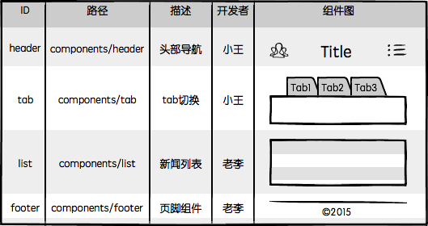
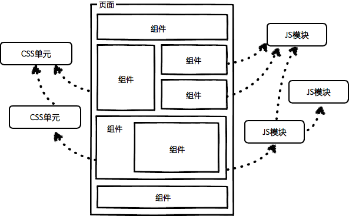

# 目录
* [前端工程](#前端工程)
* [大公司如何开发和部署前端](#大公司如何开发和部署前端)

# <p align="center">前端工程</p>
###### [<p align="right">back to top ▲</p>](#目录)

> 从本质上讲，所有Web应用都是一种运行在网页浏览器中的软件，这些软件的图形用户界面（Graphical User Interface，简称GUI）即为前端。


## 前端工程的三个阶段
1. 库/框架选型

    根据项目特征进行技术选型。

    
2. 简单构建优化

    选择构建工具，对代码进行压缩，校验，之后再以页面为单位进行简单的资源合并。

    
3. JS/CSS模块化开发
    
    分而治之是软件工程中的重要思想，是复杂系统开发和维护的基石，这点放在前端开发中同样适用。

    ***模块化开发的最大价值是分治***

    

## 前端工程的第四阶段：组件化开发与资源管理

前端是一种技术问题较少、工程问题较多的软件开发领域。

当我们要开发一款完整的Web应用时，前端将面临更多的工程问题，比如：

* __大体量__：多功能、多页面、多状态、多系统；
* __大规模__：多人甚至多团队合作开发；
* __高性能__：CDN部署、缓存控制、文件指纹、缓存复用、请求合并、按需加载、同步/异步加载、移动端首屏CSS内嵌、HTTP 2.0服务端资源推送。

进入第四阶段，我们只需做好两件事就能大幅提升前端开发效率，并且兼顾运行性能，那就是——组件化开发与资源管理。

#### **1. 组件化开发**

分治是非常重要的工程优化手段。前端作为一种GUI软件，光有JS/CSS的模块化还不够，对于UI组件的分治也有着同样迫切的需求：


1. 页面上的每个**独立的**可视/可交互区域视为一个组件；
2. **每个组件对应一个工程目录**，组件所需的各种资源都在这个目录下**就近维护**；
3. 组件具有独立性，因此组件与组件之间可以**自由组合**；
4. 页面只不过是组件的容器，负责组合组件形成功能完整的界面；
5. 当不需要某个组件，或者想要替换组件时，可以整个目录删除/替换。

> 就近维护原则，是最具工程价值的地方，它为前端开发提供了很好的分治策略，每个开发者都将清楚的知道自己所开发维护的功能单元，其代码必然存在于对应的组件目录中，在那个目录下能找到有关这个功能单元的所有内部逻辑，样式也好，JS也好，页面结构也好，都在那里。

> 组件化开发具有较高的通用性，无论是前端渲染的单页面应用，还是后端模板渲染的多页面应用，组件化开发的概念都能适用。组件HTML部分根据业务选型的不同，可以是静态的HTML文件，可以是前端模板，也可以是后端模板，不同的技术选型决定了不同的组件封装和调用策略。


基于这样的工程理念，我们很容易将系统以独立的组件为单元进行分工划分：



系统功能被分治到独立的模块或组件中，粒度比较精细，组织形式松散，开发者之间不会产生开发时序的依赖，大幅提升并行的开发效率，理论上允许随时加入新成员认领组件开发或维护工作，也更容易支持多个团队共同维护一个大型站点的开发。

结合前面提到的模块化开发，整个前端项目可以划分为以下几种开发概念：

|名称|说明|举例|
|:---|:---:|:---|
|JS模块|独立的算法和数据单元|浏览器环境检测(detect)，网络请求(ajax)，应用配置(config)，DOM操作(dom)，工具函数(utils)，以及组件里的JS单元。|
|CSS模块|独立的功能性样式单元|栅格系统(grid)，字体图标(icon-fonts)，动画样式(animate)，以及组件里的CSS单元。|
|UI模块|独立的可视/可交互功能单元|页头(header)，页尾(footer)，导航栏(nav)，搜索框(search)。|
|页面|前端这种GUI软件的界面状态，是UI组件的容器|首页(index)，列表页(list)，用户管理(user)。|
|应用|整个项目或整个站点被称之为应用，由多个页面组成| |

以上5种开发概念以相对较少的规则组成了前端开发的基本工程结构，基于这些理念，前端开发就成了这个样子：

|示意图|描述|
|:---:|:---:|
||整个Web应用由页面组成|
||页面由组件组成|
||一个组件一个目录，资源就近维护|
||组件可以组合，组件的JS可以依赖其他JS模块，CSS可以依赖其他CSS单元|

综上所述，对于一般中小规模的项目，大致可以规划出这样的源码目录结构：


如果项目规模较大，涉及多个团队协作，还可以将具有相关业务功能的页面组织在一起，形成一个子系统，进一步将整个站点拆分出多个子系统来分配给不同团队维护。

#### **2. 资源管理**

模块化/组件化开发之后，我们最终要解决的，就是模块/组件加载的技术问题。然而前端与客户端GUI软件有一个很大的不同：***前端是一种远程部署，运行时增量下载的GUI软件***。

前端应用没有安装过程，其所需程序资源都部署在远程服务器，用户使用浏览器访问不同的页面来加载不同的资源，随着页面访问的增加，渐进式的将整个程序下载到本地运行，“增量下载”是前端在工程上有别于客户端GUI软件的根本原因。


上图展示了一款界面繁多功能丰富的应用，如果采用Web实现，相信也是不小的体量，如果用户第一次访问页面就强制其加载全站静态资源再展示，相信会有很多用户因为失去耐心而流失。

根据“增量”的原则，我们应该精心规划每个页面的资源加载策略，使得用户无论访问哪个页面都能按需加载页面所需资源，没访问过的无需加载，访问过的可以缓存复用，最终带来流畅的应用体验。

***这正是Web应用“免安装”的魅力所在。***

由“增量”原则引申出的前端优化技巧几乎成为了性能优化的核心:
* 有加载相关的按需加载、延迟加载、预加载、请求合并等策略；
* 有缓存相关的浏览器缓存利用，缓存更新、缓存共享、非覆盖式发布等方案；
* 还有复杂的BigRender、BigPipe、Quickling、PageCache等技术。

这些优化方案无不围绕着如何将增量原则做到极致而展开。

***第四阶段前端开发最迫切需要做好的就是在基础架构中贯彻增量原则。***

**第三阶段前端工程缺少点什么呢？**

我觉得是在其基础架构中缺少这样一种“智能”的资源加载方案。没有这样的方案，很难将前端应用的规模发展到第四阶段，很难实现落地前面介绍的那种组件化开发方案，也很难让多方合作高效率的完成一项大型应用的开发，并保证其最终运行性能良好。在第四阶段，我们需要强大的工程化手段来管理”玩具般简单“的前端开发。

Facebook的一些产品数据：
* Facebook整站有10000+个静态资源；
* 每个静态资源都有可能被翻译成超过100种语言版本；
* 每种资源又会针对浏览器生成3种不同的版本；
* 要针对不同带宽的用户做5种不同的打包方法；
* 有3、4个不同的用户组，用于小批次体验新的产品功能；
* 还要考虑不同的送达方法，可以直接送达，或者通过iframe的方式提升资源并行加载的速度；
* 静态资源的压缩和非压缩状态可切换，用于调试和定位线上问题。

这是一个状态爆炸的问题，将所有状态乘起来，整个网站的资源组合方式会达到几百万种之多（去重之后统计大概有300万种组合方式）。

支撑这么大规模前端项目运行的底层架构是Facebook的[Static Resource Management System](http://http://velocity.oreilly.com.cn/2010/ppts/VelocityChina2010Dec7StaticResource.pdf)(静态资源管理系统)，用以解决Facebook项目中有关前端工程的3D问题（Development，Deployment，Debugging）。

> 静态资源管理系统 = 资源表 + 资源加载框架

**资源表**是一份数据文件（比如JSON），是项目中所有静态资源（主要是JS和CSS）的构建信息记录，通过构建工具扫描项目源码生成，是一种k-v结构的数据，以每个资源的id为key，记录了资源的类别、部署路径、依赖关系、打包合并等内容，比如：

```json
{
    "a.js": {
        "url": "/static/js/a.5f100fa.js",
        "dep": [ "b.js", "a.css" ]
    },
    "a.css": {
        "url": "/static/css/a.63cf374.css",
        "dep": [ "button.css" ]
    },
    "b.js": {
        "url": "/static/js/b.97193bf.js"
    },
    "button.css": {
        "url": "/static/css/button.de33108.css"
    }
}
```

**资源加载框架**则提供一些资源引用的API，让开发者根据id来引用资源，替代静态的script/link标签来收集、去重、按需加载资源。调用这些接口时，框架通过查表来查找资源的各项信息，并递归查找其依赖的资源的信息，然后我们可以在这个过程中实现各种性能优化算法来“智能”加载资源。

根据业务场景的不同，加载框架可以在浏览器中用JS实现，也可以是后端模板引擎中用服务端语言实现，甚至二者的组合，不一而足。


这种设计很快被验证具有足够的灵活性，能够完美支撑不同团队不同技术规范下的性能优化需求，前面提到的按需加载、延迟加载、预加载、请求合并、文件指纹、CDN部署、Bigpipe、Quickling、BigRender、首屏CSS内嵌、HTTP 2.0服务端推送等等性能优化手段都可以很容易的在这种架构上实现，甚至可以根据性能日志自动进行优化（Facebook已实现）。

因为有了资源表，我们可以很方便的控制资源加载，通过各种手段在运行时计算页面的资源使用情况，从而获得最佳加载性能。无论是前端渲染的单页面应用，还是后端渲染的多页面应用，这种方法都同样适用。

此外，它还很巧妙的约束了构建工具的职责——只生成资源表。资源表是非常通用的数据结构，无论什么业务场景，其业务代码最终都可以被扫描为相同结构的表数据，并标记资源间的依赖关系，有了表之后我们只需根据不同的业务场景定制不同的资源加载框架就行了。


***深耕静态资源加载框架可以带来许多收益，而且有足够的灵活性和健壮性面向未来的技术变革.***

**前端相比其他软件开发，在基础架构上更加迫切的需要组件化开发和资源管理**，而解决资源管理的方法其实一点也不复杂：

> 一个通用的资源表生成工具 + 基于表的资源加载框架

近几年来各种你听到过的各种资源加载优化策略大部分都可以在这样一套基础上实现，而这种优化对于业务来说是完全透明的，不需要重构的性能优化。

**前端工程师应该思考的问题：**
* **如何选型技术**
* **如何定制规范**
* **如何分治系统**
* **如何优化性能**
* **如何加载资源**


# <p align="center">大公司如何开发和部署前端</p>
###### [<p align="right">back to top ▲</p>](#目录)
