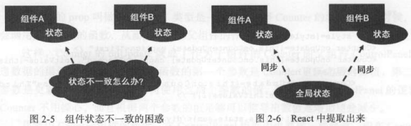
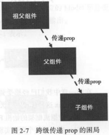
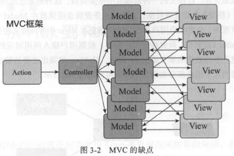
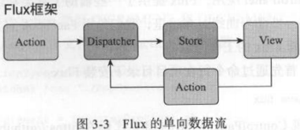

# React

## UI = render(data)

## prop
***prop(property的简写)是从外部传递给组件的数据，一个React组件通过定义自己能够接受的prop就定义了自己的对外公共接口。***

当外部世界要传递一些数据给React组件，一个最直接的方式就是通过prop；同样，React组件要反馈数据给外部世界，也可以用prop，因为prop的类型不限于纯数据，也可以是函数，函数类型的prop等于让父组件交给了子组件一个回调函数，子组件在恰当的实际调用函数类型的prop，可以带上必要的参数，这样就可以反过来把信息传递给外部世界。


```js
import React, {Component} from 'react';
// 在使用JSX的范围内必须要有React
// 即使代码中并没有直接使用React
// 因为JSX最终会被转译成依赖于React的表达式
import PropTypes from 'prop-types';
// prop是组件的对外接口，使用propTypes让组件声明自己的接口规范

class Counter extends Component{
    constructor(props){
        super(props);
        
        this.onClickIncrementButton = this.onClickIncrementButton.bind(this);
        this.onClickDecrementButton = this.onClickDecrementButton.bind(this);
        // 在构造函数中给成员函数绑定了当前this的执行环境
        // 因为ES6方法创造的React组件类并不自动给我们绑定this到当前实例对象
        
        this.state = {
            count: props.initValue
        }
        // 通常在组件类构造函数的结尾处初始化state
        // 组件的state必须是一个JavaScript对象
        // 不能是string或者number这样的简单数据类型
        // 即使要存储的只是一个数字类型的数据，也只能把它存作state某个字段对应的值
    }
    
    onClickIncrementButton(){
        this.setState({count: this.state.count + 1});
    }
    onClickDecrementButton(){
        this.setState({count: this.state.count - 1});
    }
    // 改变组件state必须使用this.setState函数，不能直接修改this.state
    // 直接修改this.state的值，虽然事实上改变了组件的内部状态，但没有驱动组件进行重新渲染
    // this.setState()首先改变this.state的值，然后驱动组件经历更新过程，这样才有机会让this.state里新的值出现在界面上
    
    render(){
        const {caption} = this.props;
        // ES6的解构赋值（destructuring assignment）语法从this.props中获得了名为caption的prop值
        
        return (
            <div>
                <button style={buttonStyle} onClick={this.onClickIncrementButton}>+</button>
                <button style={buttonStyle} onClick={this.onClickDecrementButton}>-</button>
            </div>
        );
    }
}

Counter.propTypes = {
    caption: PropTypes.string.isReauired,
    initValue: PropTypes.number
};
// 这不只是声明，而且是一种限制
// 在运行时和静态代码检查时，都可以根据propTypes判断外部世界是否正确地使用了组件的属性
// propTypes检查只是一个辅助开发的功能，并不会改变组件的行为
// 没有propTypes定义，组件依然能够正常工作
// 即使在上面propTypes检查出错的情况下，组件依旧能工作

// 定义类的propTypes要占用一些代码空间
// propTypes检查要消耗CPU计算资源
// 在产品环境下做propTypes检查在最终用户的浏览器Console中输出错误信息没什么意义
// 所以最好的方式是，开发者在代码中定义propTypes，避免在开发过程中犯错，但在发布产品代码时，去掉propTypes，这样最终部署到产品环境的代码就会更优
// babel-react-optimize具有这个功能，但应该确保只在发布产品代码时使用它

Counter.defaultProps = {
    initValue: 0
};
// propTypes声明中initValue没有用isRequired要求必须有值
// 我们需要在代码中判断所给initValue值是否存在，如果不存在就给一个默认的初始值
// this.state = {
//     count: props.initValue || 0
// }
// 这样的判断逻辑充斥在我们组件的构造函数中并不美观且容易遗漏
// 可以用React的defaultProps功能让代码更加易懂

export default Counter;
```
***给this.props赋值是React.Component构造函数的工作之一***

如果一个组件需要定义自己的构造函数，一定要记得在构造函数的第一行通过super调用父类也就是React.Component的构造函数。如果在构造函数中没有调用super(props)，那么组件实例被构造之后，类实例的所有成员函数就无法通过this.props访问到父组件传递过来的props值。

## state
***state代表组件的内部状态。由于React组件不能修改传入的prop，所以需要记录自身数据变化，就要使用state。***

## prop与state的对比
* prop定义外部接口，state记录内部状态；
* prop的赋值在外部世界使用组件时，state的赋值在组件内部；
* 组件不应该改变prop的值，而state存在的目的就是让组件来改变的。

## 组件的生命周期
* **装载过程（Mount）**，组件第一次在DOM树中渲染的过程
    * constructor
        * 并不是每个组件都需要定义自己的构造函数
        * 无状态的React组件往往不需要定义构造函数
        * 一个React组件需要构造函数，往往是为了下面的目的：
            1. 初始化state
            2. 绑定成员函数的this环境
    * ~~getlnitialState~~
    * ~~getDefaultProps~~
        ```js
        const Sample = React.createClass({
            getInitialState: function(){
                return {foo: 'bar'};
            },
            getDefaultProps: function(){
                return {sampleProp: 0};
            }
        });
        ```
        > getlnitialState的返回值用来初始化组件的this.state，getDefaultProps的返回值可以作为props的初始值。
        
        > 这两个函数只在React.createClass方法创造的组件类中才会用到，在ES6的方法定义的React组件中根本不会用到。
        
        > React.createClass已经被Facebook官方逐渐废弃，强烈建议不再要使用React.createClass。
        
        > getlnitialState只出现在装载过程中，在一个组件的整个生命周期过程中只被调用一次，不要在里面放置预期会被多次执行的代码。

    * componentWillMount
        * 通常不用定义componentWillMount函数
        > componentWilJMount发生在“将要装载”时，这个时候没有任何渲染出来的结果，即使调用this.setState修改状态也不会引发重新绘制。
        
        > 换句话说，所有可以在componentWillMount 中做的事情，都可以提前到constructor中做，可以认为这个函数存在的主要目的就是为了和componentDidMount对称。
        
    * render
        * render函数是React组件中最重要的函数
        > 一个React组件可以忽略其他所有函数都不实现，但是一定要实现 render 函数，因为所有 React 组件的父类 React.Component类对除render之外的生命周期函数都有默认实现。
        
        * render函数并不做实际的谊染动作
        > 它只返回一个JSX描述的结构，最终由React来操作渲染过程。
        
        * 组件在某些情况下选择没有东西可画
        > 那就让render函数返回一个null或者false，等于告诉React，这个组件这次不需要渲染任何DOM元素。
        
    * componentDidMount
        * render函数被调用完之后，componentDidMount函数并不是会被立刻调用。
        > componentDidMount被调用的时候，render函数返回的东西已经引发了渲染，组件已经被“装载”到了DOM树上。
        
        ```nohighlight
        enter constructor: First
        enter componentWillMount First
        enter render First
        enter constructor: Second
        enter componentWillMount Second
        enter render Second
        enter constructor: Third
        enter componentWillMount Third
        enter render Third
        enter componentDidMount First
        enter componentDidMount Second
        enter componentDidMount Third
        ```
        > 之所以会有上面的现象，是因为render函数本身并不往DOM树上渲染或者装载内容，它只是返回一个JSX表示的对象，然后由React库来根据返回对象决定如何渲染。
        
        > 而React库肯定是要把所有组件返回的结果综合起来，才能知道该如何产生对应的DOM修改。所以，只有React库调用所有组件的render函数之后，才有可能完成装载，这时候才会依次调用各个组件的componentDidMount函数作为装载过程的收尾。
        
        * componentWillMount可以在服务器端被调用，也可以在浏览器端被调用；而componentDidMount只能在浏览器端被调用，在服务器端使用React的时候不会被调用。

        * componentDidMount被调用的时候，组件已经被装载到DOM树上了，可以放心获取渲染出来的任何DOM。
* **更新过程（Update）**，当组件被重新渲染的过程
    > 组件被装载到DOM树上之后，用户在网页上可以看到组件的第一印象，但是要提供更好的交互体验，就要让该组件可以随着用户操作改变展现的内容，当props或者state被修改的时候，会引发组件的更新过程。

    * componentWillReceiveProps(nextProps)
        * 只要父组件的render函数被调用，在render函数里面被渲染的子组件就会经历更新过程，不管父组件传给子组件的props有没有改变，都会触发子组件的componentWillReceiveProps函数。

        * componentWillReceiveProps(nextProps)把传入的参数nextProps和this.props作对比。nextProps是这一次渲染传入的props值，this.props是上一次渲染时的props值，只有两者有变化时才会调用this.setState更新state。

        * 通过this.setState触发的更新过程不会调用该函数。
        > 因为componentWillReceiveProps(nextProps)根据nextProps计算是否通过this.setState更新state，如果this.setState导致componentWillReceiveProps(nextProps)再次被调用，那就形成了死循环。

    > this.forceUpdate()，每个React组件都可以通过forceUpdate函数强行引发一次重新绘制。

    * shouldComponentUpdate(nextProps, nextState)
        * render函数决定了该渲染什么，shouldComponentUpdate函数决定了一个组件什么时候不需要渲染。

        * render和shouldComponentUpdate，也是React生命周期函数中仅有的两个要有返回结果的函数。
        > render函数的返回结果用于构造DOM对象，shouldComponentUpdate函数返回一个布尔值，告诉React库这个组件在这次更新过程中是否要继续。

        * 通过this.setState函数引发更新过程，并不是立刻更新组件的state值。
        > 在执行到函数shouldComponentUpdate时，this.state依然是this.setState函数执行之前的值，所以我们要做的实际上就是在nextProps、nextState、this.props和this.state中互相比对。

    * componentWillUpdate
    > 如果组件的shouldComponentUpdate函数返回true，React就会依次调用对应组件的componentWillUpdate、render和componentDidUpdate函数。

    * render
    * componentDidUpdate
        * 无论更新过程发生在服务器端还是浏览器端，componentDidUpdate函数都会被调用。
        > 和装载过程的componentDidMount函数不同，componentDidUpdate函数并不是只在浏览器端才执行。

        > 在介绍componentDidMount函数时，我们说到可以利用componentDidMount函数执行其他UI库的代码，如jQuery代码。当React组件被更新时，原有的内容被重新绘制，这时候就需要在componentDidUpdate函数中再次调用jQuery代码。

        > 使用React做服务器端渲染时，基本不会经历更新过程，因为服务器端只需要产出HTML字符串，一个装载过程就足够产出HTML了，所以正常情况下服务器端不会调用componentDidUpdate函数，如果调用了，说明我们的程序有错误，需要改进。

* **卸载过程（Unmount）**，组件从DOM中删除的过程
    > React组件的卸载过程只涉及一个函数componentWillUnmount，当React组件要从DOM树上删除掉之前，对应的componentWillUnmount函数会被调用，所以这个函数适合做一些清理性的工作。

    * componentWillUnmount
        * componentWillUnmount中的工作往往和componentDidMount有关。
        > 在componentDidMount中用非React的方法创造的一些DOM元素，如果撒手不管可能会造成内存泄露，那就需要在componentWillUnmount中把这些创造的DOM元素清理掉。

## 组件通过prop向外传递数据
* 父组件通过prop传递数据给子组件
* 组件的prop可以是任何JavaScript对象
> 函数可以被看做一种对象，既可以像其他对象一样作为prop的值从父组件传递给子组件，又可以被子组件作为函数调用。

```js
import React, { Component, PropTypes } from 'react';

class Counter extends Component {
    ...
}

Counter.propTypes = {
    caption: PropTypes.string.isRequired,
    initValue: PropTypes.number,
    onUpdate: PropTypes.func
    // React虽然有PropType能够检查prop的类型
    // 但没有任何机制来限制prop的参数规格
    // 参数的一致性只能靠开发者来保证
};

Counter.defaultProps = {
    initValue: 0,
    onUpdate: f => f //什么都不做的函数
};

export default Counter;
```

## React组件state和prop的局限
* 使用state存储状态的缺点：数据的冗余和重复

    子组件和父组件的数据可能发生重复

    
    > 数据如果出现重复，带来的一个问题就是如何保证重复数据一致，如果数据存多份而且不一致，那就很难决定到底使用哪个数据作为正确结果了。
* 利用prop在组件之间传递信息也会遇到问题

    
    > 在一个包含三级或者三级以上组件结构应用中，顶层的祖父级组件想要传递一个数据给最低层的子组件，如果用prop的方式，就只能通过父组件中转。也许中间那一层父组件根本用不上这个prop，但是依然需要支持这个prop，扮演好搬运工的角色，只因为子组件用得上，这明显违反了低耦合的设计要求。

# 从Flux到Redux
## Flux
在MVC( Model-View-Controller）的世界里，React相当于V（也就是View）的部分，只涉及页面的渲染，一旦涉及应用的数据管理部分，还是交给Model和Controller。

MVC框架提出的数据流很理想，用户请求先到达Controller，由Controller调用Model获得数据，然后把数据交给View，**但是，在实际框架实现中，总是允许View和Model可以直接通信**：



* 服务器端MVC框架往往就是每个请求就只在Controller-Model-View三者之间走一圈，结果就返回给浏览器去渲染或者其他处理了，然后这个请求生命周期的Controller-Model-View就可以回收销毁了，这是一个严格意义的单向数据流；
* 对于浏览器端MVC框架，存在用户的交互处理，界面渲染出来之后，Model和View依然存在于浏览器中，这时候就会诱惑开发者为了简便，让现存的Model和View直接对话。

> 对于MVC框架，为了让数据流可控，Controller应该是中心，当View要传递消息给Model时，应该调用Controller的方法，同样，当Model要更新View时，也应该通过Controller引发新的渲染。

### **Flux的特点：更严格的数据流控制。**



__一个Flux应用包含四个部分：__
* __Dispatcher (MVC-Controller)__，处理动作分发，维持Store之间的依赖关系；
* __Store (MVC-Model)__，负责存储数据和处理数据相关逻辑；
* __Action (对应给MVC框架的用户请求)__，驱动Dispatcher的JavaScript对象；
* __View (MVC-View)__，视图部分，负责显示用户界面。

> 当需要扩充应用所能处理的“请求”时，MVC方法需要增加新的Controller，而Flux则是增加新的Action。

## 创建一个Flux应用
**1、Dispatcher**
```js
// src/AppDispatcher.js
import {Dispatcher} from 'flux';
export default new Dispatcher();
// Dispatcher存在的作用是用来派发action
```
**2、Action**
> action代表一个“动作”，是一个普通的JavaScript对象，代表一个动作的纯数据。action对象不自带方法，就是纯粹的数据。

```js
// 定义action通常需要两个文件，
// ActionTypes定义action的类型，
// Actions定义action的构造函数（也称为action Creator）。

// 分成两个文件的主要原因是在Store中会根据action类型做不同操作，
// 也就有单独导入action类型的需要。

// src/ActionTypes.js
export const INCREMENT = 'increment';
export const DECREMENT = 'decrement';

// src/Actions.js
// 出于业界习惯，这个文件被命名为Actions.js，
// 但是里面定义的并不是action对象本身，
// 而是能够产生并派发action对象的函数。
import * as ActionTypes from './ActionTypes.js';
import AppDispatcher from './AppDispatcher.js';

export const increment = (counterCaption) => {
    AppDispatcher.dispatch({
        type: ActionTypes.INCREMENT,
        counterCaption: counterCaption
    });
};

export const decrement = (counterCaption) => {
    AppDispatcher.dispatch({
        type: ActionTypes.DECREMENT,
        counterCaption: counterCaption
    });
};
// Actions.js导出两个action构造函数increment和decrement，
// 当这两个函数被调用的时候，创造了对应的action对象，
// 并立即通过AppDispatcher.dispatch函数派发出去。
```

**3、Store**
> Store是一个对象，存储应用状态，同时还要接受Dispatcher派发的动作，根据动作来决定是否要更新应用状态。

```js
// src/stores/CounterStore.js
import AppDispatcher from '../AppDispatcher.js';
import * as ActionTypes from '../ActionTypes.js';
import {EventEmitter} from 'events';

const CHANGE_EVENT = 'changed';

const counterValues = {
    'First': 0,
    'Second': 10,
    'Third': 30
};

// 当Store的状态发生变化的时候，需要通知应用的其他部分（View）做必要的响应。
// 应该用消息的方式建立Store和View的联系。
// 因此我们让CounterStore扩展了EventEmitter.prototype，
// 等于让CounterStore成了EventEmitter对象。
// 一个EventEmitter实例对象支持下列相关函数：
// 1.emit(事件名称)，广播一个特定事件；
// 2.on(事件名称, 处理函数)，增加一个挂在这个EventEmitter对象特定事件上的处理函数；
// 3.removeListener(事件名称, 处理函数)，和on相反，
// 删除挂在这个EventEmitter对象特定事件上的处理函数。

// CounterStore对象的emitChange、addChangeListener和removeChangeListener函数，
// 就是利用EventEmitter上述的三个函数完成对CounterStore状态更新的广播、添加监听函数和删除监听函数等操作。
const CounterStore = Object.assign({}, EventEmitter.prototype, {
    // CounterStore还提供一个getCounterValues函数，
    // 用于让应用中其他模块可以读取当前的计数值，
    // 当前的计数值存储在文件模块级的变量counterValues中。
    getCounterValues: function(){
        // 严格来说，getCountervalue这样的getter函数应该返回一个不可变（Immutable）数据，
        // 这样调用者即使通过getCounterValues获得了当前计数值对象，
        // 也不能够修改这个对象从而扰乱其他代码的使用。 
        return counterValues;
        // 为简单起见，这里我们并不使用Immutable。
    },
    emitChange: function(){
        this.emit(CHANGE_EVENT);
    },
    addChangeListener: function(callback){
        this.on(CHANGE_EVENT, callback);
    },
    removeChangeListener: function(callback){
        this.removeChangeListener(CHANGE_EVENT, callback);
    }
});

// 上面实现的Store只有注册到Dispatcher实例上才能真正发挥作用。

// 当通过register函数把一个回调函数注册到Dispatcher之后，
// 所有派发给Dispatcher的action对象，都会传递到这个回调函数中来，
// 回调函数要做的，就是根据唯一的一个参数action对象来决定改如何更新自己的状态。
CounterStore.dispatchToken = AppDispatcher.register((action) => {
    if(action.type === ActionTypes.INCREMENT){
        counterValues[action.counterCaption]++;
        CounterStore.emitChange();
    }else if(action.type === ActionTypes.DECREMENT){
        counterValues[action.counterCaption]--;
        CounterStore.emitChange();
    }
});
// 如果action.type是INCREMENT，就根据action对象字段counterCaption确定是哪个计数器，
// 把counterValues上对应的字段做加一操作；
// 如果action.type代表DECREMENT，就做对应的减一的操作。

// 无论加一减一，最后都要调用CounterStore.emitChange函数，
// 假如有调用者通过Counter.addChangeListner关注了CounterStore的状态变化，
// 这个emitChange函数调用就会引发监听函数的执行。
```

```js
// src/stores/SummaryStore.js
import AppDispatcher from '../AppDispatcher.js';
import * as ActionTypes from '../ActionTypes.js';
import CounterStore from './CounterStore.js';
import {EventEmitter} from 'events';

const CHANGE_EVENT = 'changed';

function computeSummary(counterValues){
    let summary = 0;
    for(const key in counterValues){
        if(counterValues.hasOwnProperty(key)){
            summary += counterValues[key];
        }
    }
    return summary;
}

const SummaryStore = Object.assign({}, EventEmitter.property, {
    // SummaryStore没有存储自己的状态，
    // 当getSummary被调用时，直接从CounterStore里获取状态计算。
    // 可见，虽然名为Store，但并不表示一个Store必须要存储什么东西，
    // Store只是提供获取数据的方法，Store提供的数据完全可以由另一个Store计算得来。
    getSummary: function(){
        return computeSummary(CounterStore.getCounterValues());
    },

    emitChange: function(){
        this.emit(CHANGE_EVENT);
    },

    addChangeListener: function(callback){
        this.on(CHANGE_EVENT, callback);
    },

    removeChangeListener: function(callback){
        this.removeListener(CHANGE_EVENT, callback);
    }
});

// Dispatcher的register函数，只提供了注册一个回调函数的功能，
// 但不能让调用者在register时选择只监听某些action。
// 当一个动作被派发的时候，Dispatcher只是简单地把所有注册的回调函数全都调用一遍，
// 至于这个动作是不是对方关心的，Flux的Dispatcher不关心，而是要求每个回调函数去鉴别。
// 这个设计让Flux的Dispatcher逻辑最简单化，Dispatcher的责任越简单，就越不会出现问题。
//  由回调函数全权决定如何处理action对象，也是非常合理的。
SummaryStore.dispatchToken = AppDispatcher.register((action) => {
    if((action.type === ActionTypes.INCREMENT) || (action.type === ActionTypes.DECREMENT)){
        // 可以认为Dispatcher调用回调函数的顺序完全是无法预期的，
        // 不要假设它会按照我们期望的顺序逐个调用。

        // Dispatcher的waitFor可以接受一个数组作为参数，
        // 数组中每个元素都是一个Dispatcher.register函数的返回结果，即dispatchToken。
        // waitFor函数告诉Dispatcher,当前的处理必须要暂停，
        // 直到dispatchToken代表的那些已注册回调函数执行结束才能继续。
        AppDispatcher.waitFor([CounterStore.dispatchToken]);
        // JavaScript是单线程的语言，不存在线程之间的等待，
        // waitFor函数当然并用多线程实现的，
        // 只是在调用waitFor时，把控制权交给Dispatcher，
        // 让Dispatcher检查dispatchToken代表的回调函数有没有被执行，
        // 如果已经执行，就直接继续，
        // 如果还没执行，就调用dispatchToken代表的回调函数之后waitFor才返回。

        SummaryStore.emitChange();
    }
});

export default SummaryStore;
```

**4、View**

> Flux框架下，View并不是说必须要使用React，View本身是一个独立的部分，可以用任何一种UI库来实现。

存在于Flux框架中的React组件需要实现以下几个功能：
* 创建时要读取Store上状态来初始化组件内部状态；
* 当Store上状态发生变化时，组件要立刻同步更新内部状态保持一致；
* View如果要改变Store状态，必须且只能派发action。

```js
// src/views/CounterPanel.js
import React, {Component} from 'react';
import Counter from './Counter.js';
import Summary from './Summary.js';

const style = {
    margin: '20px'
};

class ControlPanel extends Component{
    render(){
        return (
            <div style={style}>
                <Counter caption="First" />
                <Counter caption="Second" />
                <Counter caption="Third" />
                <hr/>
                <Summary />
            </div>
        );
    }
}

export default ControlPanel;
```

```js
// src/views/Counter.js
import React, {Component, PropTypes} from 'react';
import * as Actions from '../Actions.js';
import CounterStore from '../stores/CounterStore.js';

const buttonStyle = {
    margin: '10px'
};

class Counter extends Component{
    constructor(props){
        super(props);

        this.onChange = this.onChange.bind(this);
        this.onClickIncrementButton = this.onClickIncrementButton.bind(this);
        this.onClickDecrementButton = this.onClickDecrementButton.bind(this);

        this.state = {
            count: CounterStore.getCounterValues()[props.caption]
        }
    }

    shouldComponentUpdate(nextProps, nextState){
        return (nextProps.caption !== this.props.caption) || (nextState.count !== this.state.count);
    }

    componentDidMount(){
        CounterStore.addChangeListener(this.onChange);
    }

    componentWillUnmount(){
        CounterStore.removeChangeListener(this.onClick);
    }

    onChange(){
        const newCount = CounterStore.getCounterValues()[this.propss.caption];
        this.setState({count: newCount});
    }

    onClickIncrementButton(){
        Actions.increment(this.props.caption);
    }

    onClickDecrementButton(){
        Actions.decrement(this.props.caption);
    }

    render(){
        const {caption} = this.props;
        return (
            <div>
                <button style={buttonStyle} onClick={this.onClickIncrementButton}>+</button>
                <button style={buttonStyle} onClick={this.onClickDecrementButton}>-</button>
                <span>{caption} count: {this.state.count}</span>
            </div>
        )
    }
}
```

```js
// src/views/Summary.js
import React, {Component} from 'react';
import SummaryStore from '../stores/SummaryStore.js';

class Summary extends Component{
    constructor(props){
        super(props);
        this.onUpdate = this.onUpdate.bind(this);
        this.state = {
            sum: SummaryStore.getSummary()
        }
    }

    componentDidMount(){
        SummaryStore.addChangeListener(this.onUpdate);
    }

    componentWillUnmount(){
        SummaryStore.removeChangeListener(this.onUpdate);
    }

    onUpdate(){
        this.setState({
            sum: SummaryStore.getSummary()
        })
    }

    render(){
        return (
            <div>Total Count: {this.state.sum}</div>
        );
    }
}

export default Summary;
```

## Flux的优势

> Flux的架构下，应用的状态被放在Store中，React组件只是扮演View的作用，被动根据Store的状态来渲染。React组件依然有自己的状态，但是已经完全沦为Store组件的一个映射，而不是主动变化的数据。

**“单向数据流”的管理方式**

在Flux的理念里，如果要改变界面，必须改变Store中的状态，如果要改变Store中的状态，必须派发一个action对象，这就是规矩。在这个规矩之下，想要追溯一个应用的逻辑就变得非常容易。

**MVC最大的问题就是无法禁绝View和Model之间直接对话**，Flux中的View对应于MVC中的View，Flux中的Store对应于MVC中的Model，在Flux中，Store只有get方法，没有set方法，根本不可能直接去修改其内部状态，View只能通过get方法获取Store的状态，无法直接去修改状态，如果View想要修改Store状态，只有派发一个action对象给Dispatcher。

**这看起来是一个“限制”，但却是一个很好的“限制”，杜绝了数据流混乱的可能。**

**在Flux体系下，驱动界面改变始于一个动作的派发，除此之外，别无他法。**


## Flux的不足

1. Store之间依赖关系 
    1. 在Flux体系中，如果两个Store之间有逻辑依赖关系，就必须要用Dispatcher的waitFor函数；
    2. CounterStore必须要把注册回调函数时产生的dispatchToken公之于众；
    3. SummaryStore必须要在代码里建立对CounterStore的dispatchToken的依赖。

    **最好的依赖管理是根本不让依赖产生。**
2. 难以进行服务器端渲染
    > 如果要在服务器端渲染，输出不是一个DOM树，而是一个全是HTML的字符串。

    > 在Flux体系中，有一个全局的Dispatcher，然后每一个Store都是一个全局唯一的对象，和一个浏览器网页只服务于一个用户不同，在服务器端要同时接受很多用户的请求，如果每个Store都是全局唯一的对象，那不同请求的状态肯定就乱套了。
3. Store混杂了逻辑和状态
    > Store封装了数据和处理数据的逻辑，用面向对象的思维来看，这是一件好事。但是，当我们需要动态替换一个Store的逻辑时，只能把这个Store整体替换掉，那也就无法保持Store中存储的状态。

## Redux

### Redux基本原则
1. 唯一数据源（Single Source of Truth）
    
    **应用的状态数据应该只存储在唯一的一个Store上**
    > 如果状态数据分散在多个Store中，容易造成数据冗余；虽然Dispatcher的waitFor方法可以保证多个Store之间的更新顺序，但这又产生了不同Store之间的显式依赖关系，这种依赖关系的存在增加了应用的复杂度，容易带来新的问题。
2. 保持状态只读（State is read-only）
    * 要修改Store的状态，必须要通过派发一个action对象完成，这点和Flux没什么区别；
    * 要驱动用户界面渲染，就要改变应用的状态，但是改变状态的方法不是去修改状态上值，而是创建一个新的状态对象返回给Redux，由Redux完成新的状态的组装。
3. 数据改变只能通过纯函数完成（Changes are made with pure functions）
    __Redux=Reducer+Flux__
    
    在Redux中，每个reducer的函数签名如下所示：

    __reducer(state, action)__

    state是当前的状态，action是接收到的action对象，reducer函数要做的事情，就是根据state和 action的值产生一个新的对象返回。

    reducer必须是纯函数，即函数的返回结果必须完全由参数state和action决定，而且不产生任何副作用，也不能修改参数state和action对象。