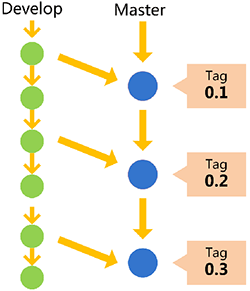

# 目录

* [常用Git命令](#常用git命令)
* [Git Cheat Sheet](#git-cheat-sheet)
* [Issue](#issue)
* [工作流程及分支管理](#工作流程及分支管理)
* [Git使用规范流程](#使用规范流程)


# <p align="center">常用Git命令</p>
###### [<p align="right">back to top ▲</p>](#目录)


* Workspace：工作区
* Index/Stage：暂存区
* Repository：仓库区（或本地仓库）
* Remote：远程仓库

## 新建代码库
```bash
# 在当前目录新建一个Git代码库
$ git init

# 新建一个目录，将其初始化为Git代码库
$ git init [project-name]

# 下载一个项目和它的整个代码历史
$ git clone [url]
```

## 配置

Git的配置文件为.gitconfig，它可以在用户主目录下（全局配置），也可以在项目目录下（项目配置）。

```bash
# 显示当前的Git配置
$ git config --list

# 编辑Git配置文件
$ git config -e [--global]

# 设置提交代码时的用户信息
$ git config [--global] user.name "[name]"
$ git config [--global] user.email "[email address]"
```

## 增加/删除文件
```bash
# 添加指定文件到暂存区
$ git add [file1] [file2] ...

# 添加指定目录到暂存区，包括子目录
$ git add [dir]

# 添加当前目录的所有文件到暂存区
$ git add .

# 添加每个变化前，都会要求确认
# 对于同一个文件的多处变化，可以实现分次提交
$ git add -p

# 删除工作区文件，并且将这次删除放入暂存区
$ git rm [file1] [file2] ...

# 停止追踪指定文件，但该文件会保留在工作区
$ git rm --cached [file]

# 改名文件，并且将这个改名放入暂存区
$ git mv [file-original] [file-renamed]
```

## 代码提交
```bash
# 提交暂存区到仓库区
$ git commit -m [message]

# 提交暂存区的指定文件到仓库区
$ git commit [file1] [file2] ... -m [message]

# 提交工作区自上次commit之后的变化，直接到仓库区
$ git commit -a

# 提交时显示所有diff信息
$ git commit -v

# 使用一次新的commit，替代上一次提交
# 如果代码没有任何新变化，则用来改写上一次commit的提交信息
$ git commit --amend -m [message]

# 重做上一次commit，并包括指定文件的新变化
$ git commit --amend [file1] [file2] ...
```

## 分支
```bash
# 列出所有本地分支
$ git branch

# 列出所有远程分支
$ git branch -r

# 列出所有本地分支和远程分支
$ git branch -a

# 新建一个分支，但依然停留在当前分支
$ git branch [branch-name]

# 新建一个分支，并切换到该分支
$ git checkout -b [branch]

# 新建一个分支，指向指定commit
$ git branch [branch] [commit]

# 新建一个分支，与指定的远程分支建立追踪关系
$ git branch --track [branch] [remote-branch]

# 切换到指定分支，并更新工作区
$ git checkout [branch-name]

# 切换到上一个分支
$ git checkout -

# 建立追踪关系，在现有分支与指定的远程分支之间
$ git branch --set-upstream [branch] [remote-branch]

# 合并指定分支到当前分支
$ git merge [branch]

# 选择一个commit，合并进当前分支
$ git cherry-pick [commit]

# 删除分支
$ git branch -d [branch-name]

# 删除远程分支
$ git push origin --delete [branch-name]
$ git branch -dr [remote/branch]
```

## 标签
```bash
# 列出所有tag
$ git tag

# 新建一个tag在当前commit
$ git tag [tag]

# 新建一个tag在指定commit
$ git tag [tag] [commit]

# 删除本地tag
$ git tag -d [tag]

# 删除远程tag
$ git push origin :refs/tags/[tagName]

# 查看tag信息
$ git show [tag]

# 提交指定tag
$ git push [remote] [tag]

# 提交所有tag
$ git push [remote] --tags

# 新建一个分支，指向某个tag
$ git checkout -b [branch] [tag]
```

## 查看信息
```bash
# 显示有变更的文件
$ git status

# 显示当前分支的版本历史
$ git log

# 显示commit历史，以及每次commit发生变更的文件
$ git log --stat

# 搜索提交历史，根据关键词
$ git log -S [keyword]

# 显示某个commit之后的所有变动，每个commit占据一行
$ git log [tag] HEAD --pretty=format:%s

# 显示某个commit之后的所有变动，其"提交说明"必须符合搜索条件
$ git log [tag] HEAD --grep feature

# 显示某个文件的版本历史，包括文件改名
$ git log --follow [file]
$ git whatchanged [file]

# 显示指定文件相关的每一次diff
$ git log -p [file]

# 显示过去5次提交
$ git log -5 --pretty --oneline

# 显示所有提交过的用户，按提交次数排序
$ git shortlog -sn

# 显示指定文件是什么人在什么时间修改过
$ git blame [file]

# 显示暂存区和工作区的差异
$ git diff

# 显示暂存区和上一个commit的差异
$ git diff --cached [file]

# 显示工作区与当前分支最新commit之间的差异
$ git diff HEAD

# 显示两次提交之间的差异
$ git diff [first-branch]...[second-branch]

# 显示今天你写了多少行代码
$ git diff --shortstat "@{0 day ago}"

# 显示某次提交的元数据和内容变化
$ git show [commit]

# 显示某次提交发生变化的文件
$ git show --name-only [commit]

# 显示某次提交时，某个文件的内容
$ git show [commit]:[filename]

# 显示当前分支的最近几次提交
$ git reflog
```

## 远程同步
```bash
# 下载远程仓库的所有变动
$ git fetch [remote]

# 显示所有远程仓库
$ git remote -v

# 显示某个远程仓库的信息
$ git remote show [remote]

# 增加一个新的远程仓库，并命名
$ git remote add [shortname] [url]

# 取回远程仓库的变化，并与本地分支合并
$ git pull [remote] [branch]

# 上传本地指定分支到远程仓库
$ git push [remote] [branch]

# 强行推送当前分支到远程仓库，即使有冲突
$ git push [remote] --force

# 推送所有分支到远程仓库
$ git push [remote] --all
```

## 撤销
```bash
# 恢复暂存区的指定文件到工作区
$ git checkout [file]

# 恢复某个commit的指定文件到暂存区和工作区
$ git checkout [commit] [file]

# 恢复暂存区的所有文件到工作区
$ git checkout .

# 重置暂存区的指定文件，与上一次commit保持一致，但工作区不变
$ git reset [file]

# 重置暂存区与工作区，与上一次commit保持一致
$ git reset --hard

# 重置当前分支的指针为指定commit，同时重置暂存区，但工作区不变
$ git reset [commit]

# 重置当前分支的HEAD为指定commit，同时重置暂存区和工作区，与指定commit一致
$ git reset --hard [commit]

# 重置当前HEAD为指定commit，但保持暂存区和工作区不变
$ git reset --keep [commit]

# 新建一个commit，用来撤销指定commit
# 后者的所有变化都将被前者抵消，并且应用到当前分支
$ git revert [commit]

# 暂时将未提交的变化移除，稍后再移入
$ git stash
$ git stash pop
```

## 其他
```bash
# 生成一个可供发布的压缩包
$ git archive

# 忽略某个文件修改，（assume，假设，unchanged，未更改）
git update-index --assume-unchanged /path/file

# 取消忽略
git update-index --no-assume-unchanged /path/file
```


# <p align="center">Git Cheat Sheet</p>
###### [<p align="right">back to top ▲</p>](#目录)

### CREATE
|description|usage|
|:---|:---|
|Clone an existing repository|$ git clone ssh://user@domain.com/repo.git|
|Create a new local repository|$ git init|

### LOCAL CHANGES
|description|usage|
|:---|:---|
|Changed files in your working directory|$ git status|
|Changes to tracked files|$ git diff|
|Add all current changes to the next commit|$ git add .|
|Add some changes in &lt;file&gt; to the next commit|$ git add -p &lt;file&gt;|
|Commit all local changes in tracked files|$ git commit -a|
|Commit previously staged changes|$ git commit|
|Change the last commit. Don't amend published commits!|$ git commit --amend|

### COMMIT HISTORY
|description|usage|
|:---|:---|
|Show all commits, starting with newest|$ git log|
|Show changes over time for a specifc file|$ git log -p &lt;file&gt;|
|Who changed what and when in &lt;file&gt;|$ git blame &lt;file&gt;|

### BRANCHES & TAGS
|description|usage|
|:---|:---|
|List all existing branches|$ git branch -av|
|Switch HEAD branch|$ git checkout &lt;branch&gt;
|Create a new branch based on your current HEAD|$ git branch &lt;new-branch&gt;|
|Create a new tracking branch based on a remote branch|$ git checkout --track &lt;remote/branch&gt;|
|Delete a local branch|$ git branch -d &lt;branch&gt;
|Mark the current commit with a tag|$ git tag &lt;tag-name&gt;|

### UPDATE & PUBLISH
|description|usage|
|:---|:---|
|List all currently confgured remotes|$ git remote -v|
|Show information about a remote|$ git remote show &lt;remote&gt;|
|Add new remote repository, named &lt;remote&gt;|$ git remote add &lt;shortname&gt; &lt;url&gt;|
|Download all changes from &lt;remote&gt;, but don't integrate into HEAD|$ git fetch &lt;remote&gt;|
|Download changes and directly merge/integrate into HEAD|$ git pull &lt;remote&gt; &lt;branch&gt;|
|Publish local changes on a remote|$ git push &lt;remote&gt; &lt;branch&gt;|
|Delete a branch on the remote|$ git branch -dr &lt;remote/branch&gt;|
|Publish your tags|$ git push --tags|

### MERGE & REBASE
|description|usage|
|:---|:---|
|Merge &lt;branch&gt; into your current HEAD|$ git merge &lt;branch&gt;|
|Rebase your current HEAD onto &lt;branch&gt;. Don't rebase published commits!|$ git rebase &lt;branch&gt;|
|Abort a rebase|$ git rebase --abort|
|Continue a rebase after resolving conflicts|$ git rebase --continue|
|Use your confgured merge tool to solve conflicts|$ git mergetool|
|Use your editor to manually solve conflicts and (after resolving) mark file as resolved|$ git add &lt;resolved-file&gt;|
| |$ git rm &lt;resolved-file&gt;|

### UNDO
|description|usage|
|:---|:---|
|Discard all local changes in your working directory|$ git reset --hard HEAD|
|Discard local changes in a specifc file|$ git checkout HEAD &lt;file&gt;|
|Revert a commit (by producing a new commit with contrary changes)|$ git revert &lt;commit&gt;|
|Reset your HEAD pointer to a previous commit …and discard all changes since then|$ git reset --hard &lt;commit&gt;|
|…and preserve all changes as unstaged changes|$ git reset &lt;commit&gt;|
|…and preserve uncommitted local changes|$ git reset --keep &lt;commit&gt;|


# <p align="center">Issue</p>
###### [<p align="right">back to top ▲</p>](#目录)


Issue（译"问题"或"事务"）指一项待完成的工作，通常与系统的改进相关：
* 一个软件的bug
* 一项功能建议
* 一项待完成的任务
* 文档缺失的报告

每个Issue应该包含该问题的所有信息和历史，使后来的人只看这个Issue，就能了解问题的所有方面和过程。


> Issue起源于客服部门。用户打电话反映问题，客服就创建一个工单（ticket），后续的每一个处理步骤、每一次与用户的交流，都要更新工单，记录全部信息。这就是Issue的前身。

> 因此，Issue的原始功能是问题追踪和工单管理，后来不断扩展，逐渐演变成全功能的项目管理工具，还可以用于制定和实施软件的开发计划。

专门管理Issue的软件，叫做Issue跟踪管理系统（Issue tracking system）。Issue跟踪管理系统应该具有以下功能：
* 项目管理 
    * 指定Issue的优先级 
    * 指定Issue所在的阶段 
    * 分配负责Issue的处理人员 
    * 制定日程 
    * 监控进度，提供统计
* 团队合作 
    * 讨论 
    * 邮件通知
* 代码管理 
    * 将Issue关联源码 
    * 将Issue关联代码提交与合并

## 基本使用

* 每个GitHub代码仓库都有一个Issues面板。

    

* 进入该面板，点击"New Issue"按钮，就可以新建Issue。

    

    上图是新建Issue的界面，左侧填入Issue的标题和内容，右侧是四个配置项（只有项目管理者才能看到）。
    * Assignees：人员
    * Labels：标签
    * Projects：项目
    * Milestone：里程碑

### Assignees

Assignees选择框用于从当前仓库的所有成员之中，指派某个Issue的处理人员。


### Labels

Issue可以贴上标签，这样有利于分类管理和过滤查看。


#### 常用 Label

对于大型项目，每个Issue至少应该有两个Label，一个表示性质，另一个表示优先级。

* 性质Label：

    

* 优先级Label：
    * 高优先级（High）：对系统有重大影响，只有解决它之后，才能去完成其他任务。
    * 普通优先级（Medium）：对系统的某个部分有影响，用户的一部分操作会达不到预期效果。
    * 低优先级（Low）：对系统的某个部分有影响，用户几乎感知不到。
    * 微不足道（Trivial）：对系统的功能没有影响，通常是视觉效果不理想，比如字体和颜色不满意。

### Milestone

Milestone，"里程碑"，用作Issue的容器，相关Issue可以放在一个Milestone里面。常见的例子是不同的版本（version）和迭代（sprint），都可以做成Milestone。

#### 新建Milestone：

1. 在Issues面板的首页，点击Milestones按钮；

    

2. 接着再点击New milestone按钮，然后填写Milestone的名称和内容，还可以指定到期时间。

## 全局视图

Issues面板只能查看和操作当前仓库，GitHub还提供全局视图，让用户查看和操作所有与自己相关的Issue。

访问[github.com/issues](https://github.com/issues)，就可以打开全局视图。里面的Issue分成三类：


* Created：你创建的Issue
* Assigned：分配给你的Issue
* Mentioned：提及你的Issue

Created和Assigned的含义显而易见，Mentioned是指他人在Issue里面@了你：

> It looks like the new widget form is broken on Safari. When I try and create the widget, Safari crashes. This is reproducible on 10.8, but not 10.9. Maybe a browser bug?/cc @kneath @jresig

全局视图还提供了搜索、过滤和排序功能:


## 看板功能

看板（Kanban）是敏捷开发的重要手段，主要用于项目的进度管理。所有需要完成的任务，都做成卡片，贴在一块白板上面，这就是看板。


常见的可将项目周期分成三列：

* Todo （待开发）
* Doing （开发中）
* Done （已完成）

可以根据实际情况，分出更多的列：


* Todo（待安排）
* Plan（计划）
* Develop（开发）
* Test（测试）
* Deploy（部署）
* Done（已完成）

### GitHub的看板功能

GitHub提供Issue看板：

1. 首先，在仓库首页进入Projects面板；

    

2. 然后，点击New Project按钮，新建一个Project，比如"2.0 版"；
3. 接着，点击Add column按钮，为该项目新建若干列；
4. 最后，将Issue分配到对应的列，就新建成功了一个看板视图。

    
    
**Issue可以从一列拖到另一列，表示从一个阶段进入另一个阶段。**


# <p align="center">工作流程及分支管理</p>
###### [<p align="right">back to top ▲</p>](#目录)

“工作流程”在英语中叫做“workflow”或者“flow”，意为水流，比喻项目像水流那样，顺畅、自然地向前流动，不会发生冲击、对撞、甚至漩涡。

> **功能驱动式开发（feature-driven development，FDD）**：需求是开发的起点，先有需求再有功能分支（feature branch）或者补丁分支（hotfix branch）。完成开发后，该分支就合并到主分支，然后被删除。

## Git flow

### 特点一：

**项目存在两个长期分支：**


* 主分支（master）：代码库应该有且仅有一个主分支，用于存放对外发布的版本，任何时候在这个分支拿到的，都是稳定的分布版。所有提供给用户使用的正式版本，都在这个主分支上发布。Git主分支的名字，默认叫做master，它是自动建立的，版本库初始化以后，默认就是在主分支上进行开发；


* 开发分支（develop）：用于日常开发，存放最新的开发版。这个分支可用来生成代码的最新隔夜版本（nightly）。如果想正式对外发布，就在Master分支上，对Develop分支进行“合并”（merge）。



```bash
# Git创建develop分支
git checkout -b develop master

# 将develop分支发布到master分支：
# 1. 切换到master分支
git checkout master

# 2. 对develop分支进行合并
git merge --no-ff develop
```

默认情况下，Git执行"快进式合并"（fast-farward merge），会直接将master分支指向develop分支；使用--no-ff参数后，会在master分支上生成一个新节点再执行合并。为保证版本演进的清晰，我们希望采用这种做法：


### 特点二：

**项目存在三种短期分支：**

常设分支只需要Master和Develop这两条就够了。但是除了常设分支，还需要一些临时性分支用于应对一些特定目的的版本开发，一旦完成开发，它们就会被合并进develop或master，然后被删除。

* 功能分支（feature branch）：为开发某种特定功能，从Develop分支上面分出来的。开发完成后，要再并入Develop。功能分支命名可以采用“feature-*”的形式；


```bash
# 创建一个功能分支
git checkout -b feature-x develop

# 开发完成后，将功能分支合并到develop分支
git checkout develop
git merge --no-ff feature-x

# 删除feature分支
git branch -d feature-x
```

* 预发分支（release branch）：发布正式版本之前（即合并到Master分支之前），可能需要有一个预发布的版本进行测试。预发布分支是从Develop分支上面分出来的，预发布结束以后，必须合并进Develop和Master分支。预发分支命名可以采用“release-*”的形式；


```bash
# 创建一个预发布分支
git checkout -b release-1.2 develop

# 确认没有问题后，合并到master分支
git checkout master
git merge --no-ff release-1.2

# 对合并生成的新节点，做一个标签
git tag -a 1.2

# 再合并到develop分支
git checkout develop
git merge --no-ff release-1.2

# 最后，删除预发布分支
git branch -d release-1.2
```

* 补丁分支（hotfix branch）：软件正式发布以后，难免会出现bug。这时就需要创建一个分支，进行bug修补。补丁分支是从Master分支上面分出来的。修补结束后再合并进Master和Develop分支。补丁分支命名可以采用“fixbug-*”的形式。


```bash
# 创建一个修补bug分支
git checkout -b fixbug-0.1 master

# 修补结束后，合并到master分支
git checkout master
git merge --no-ff fixbug-0.1
git tag -a 0.1.1

# 再合并到develop分支
git checkout develop
git merge --no-ff fixbug-0.1

# 最后，删除“修补bug分支”
git branch -d fixbug-0.1
```


## GitHub flow

GitHub flow是Git flow的简化版，专门配合"持续发布"，是github.com使用的工作流程。


1. 根据需求，从master拉出新分支，不区分功能分支或补丁分支；
2. 新分支开发完成后，或者需要讨论的时候，就向master发起一个pull request（简称PR）；
3. Pull Request既是一个通知，让别人注意到你的请求，又是一种对话机制，大家一起评审和讨论你的代码。对话过程中，你还可以不断提交代码；
4. 你的Pull Request被接受，合并进master，重新部署后，原来你拉出来的那个分支就被删除。（先部署再合并也可。）

> 对于“持续发布”的产品，GitHub flow是最合适的流程。但GitHub flow假设master分支的更新与产品的发布是一致的，既默认master分支的最新代码就是当前的线上代码。但有时实际情况并非如此，代码合并进入master分支，并不代表它就能立刻发布。比如，苹果商店的APP提交审核以后，等一段时间才能上架。这时，如果还有新的代码提交，master分支就会与刚发布的版本不一致。另一个例子是，有些公司有发布窗口，只有指定时间才能发布，这也会导致线上版本落后于master分支。上面这种情况，只有master一个主分支就不够用了。通常，你不得不在master分支以外，另外新建一个production分支跟踪线上版本。


## GitLab flow

GitLab flow是Git flow与GitHub flow的综合，它吸取了两者的优点，既有适应不同开发环境的弹性，又有单一主分支的简单和便利，是Gitlab.com推荐的做法。

#### 上游优先（upsteam first）

GitLab flow最大的原则叫做“上游优先”（upsteam first），即只存在一个主分支master，它是所有其他分支的“上游”。只有上游分支采纳的代码变化才能应用到其他分支。

GitLab flow分成两种情况，适应不同的开发流程：

* #### 持续发布

对于“持续发布”的项目，它建议在master分支以外再建立不同的环境分支。比如，“开发环境”的分支是master，“预发环境”的分支是pre-production，“生产环境”的分支是production。

开发分支是预发分支的“上游”，预发分支又是生产分支的“上游”。代码的变化，必须由“上游”向“下游”发展。比如，生产环境出现了bug，这时就要新建一个功能分支，先把它合并到master，确认没有问题，再cherry-pick到pre-production，这一步也没有问题，才进入production。

只有紧急情况，才允许跳过上游，直接合并到下游分支。


* #### 版本发布

对于“版本发布”的项目，建议每一个稳定版本都要从master分支拉出一个分支，比如2-3-stable、2-4-stable等等。

以后，只有修补bug，才允许将代码合并到这些分支，并且此时要更新小版本号。


## 小技巧

* ### Pull Request

功能分支合并进master分支，必须通过Pull Request（GitLab里叫Merge Request）。

Pull Request本质是一种对话机制，可以在提交的时候，@相关人员或团队，引起他们的注意。

* ### Protected branch

master分支应该受到保护，不是每个人都可以修改这个分支，以及拥有审批Pull Request的权力。

GitHub和GitLab都提供“保护分支”（Protected branch）功能。

* ### Issue

Issue用于Bug追踪和需求管理。建议先新建Issue，再新建对应的功能分支。功能分支总是为了解决一个或多个Issue。

功能分支的名称，可以与issue的名字保持一致，并且以issue的编号起首，比如“15-require-a-password-to-change-it”。

开发完成后，在提交说明里可以写上"fixes #14"或者"closes #67"。Github规定，只要commit message里面有以下动词 + 编号，就会关闭对应的issue。

close closes closed fix fixes fixed resolve resolves resolved

这种方式还可以一次关闭多个issue，或者关闭其他代码库的issue，格式是username/repository#issue_number。

Pull Request被接受以后，issue关闭，原始分支就应该删除。如果以后该issue重新打开，新分支可以复用原来的名字。

* ### Merge节点

Git有两种合并：

1. “直进式合并”（fast forward），不生成单独的合并节点；
2. “非直进式合并”（none fast-forword），会生成单独节点。

前者不利于保持commit信息的清晰，也不利于以后的回滚，建议总是采用后者（即使用--no-ff参数）。只要发生合并，就要有一个单独的合并节点。

* ### Squash多个commit

为了便于他人阅读你的提交，也便于cherry-pick或撤销代码变化，在发起Pull Request之前，应该把多个commit合并成一个。（前提是，该分支只有你一个人开发，且没有跟master合并过）


# <p align="center">Git使用规范流程</p>
###### [<p align="right">back to top ▲</p>](#目录)


## 第一步：新建分支

每次开发新功能，都应该新建一个单独的分支：

```bash
# 获取主干最新代码
$ git checkout master
$ git pull

# 新建一个开发分支myfeature
$ git checkout -b myfeature
```

## 第二步：提交分支commit

分支修改后，就可以提交commit了：

```bash
$ git add .

# 使用git commit命令的verbose参数，会列出diff的结果
$ git commit --verbose
```

## 第三步：撰写提交信息

提交commit时，必须给出完整扼要的提交信息，下面是一个范本。

```bash
Present-tense summary under 50 characters

* More information about commit (under 72 characters).
* More information about commit (under 72 characters).

http://project.management-system.com/ticket/123
```

第一行是提要，不要超过50个字符；然后空一行，罗列出改动原因、主要变动、以及需要注意的问题；最后，提供对应的网址（比如Bug ticket）。

## 第四步：与主干同步

```bash
# git fetch是将远程主机的最新内容拉到本地，
# 用户检查后决定是否合并到本机分支中。

# 而git pull则是将远程主机的最新内容拉下来后直接合并，
# 即：git pull = git fetch + git merge，这样可能会产生冲突，需要手动解决。

$ git fetch origin
$ git rebase origin/master
```

## 第五步：合并commit

分支开发完成后，可能有一堆commit，但是合并到主干的时候，往往希望只有一个（或最多两三个）commit，这样不仅清晰，也容易管理。

```bash
$ git rebase -i origin/master
```

## 第六步：推送到远程仓库

合并commit后，就可以推送当前分支到远程仓库了。

```bash
# git push命令要加上force参数，
# 因为rebase后，分支历史改变了，跟远程分支不一定兼容
$ git push --force origin myfeature
```

## 第七步：发出Pull Request

提交到远程仓库以后，就可以发出 Pull Request到master分支，然后请求别人进行代码review，确认后可以合并到master。