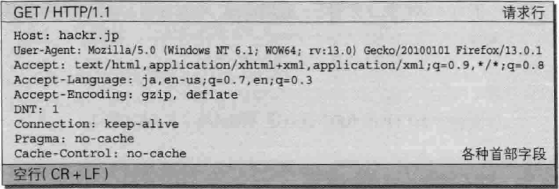
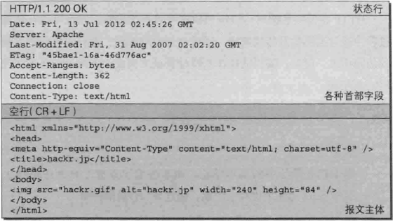

# HTTP报文

用于HTTP协议交互的信息成为HTTP报文。请求端（客户端）的HTTP报文叫请求报文，响应端（服务器端）的叫做响应报文。HTTP报文是由多行数据（用CR+LF做换行符）构成的字符串文本。HTTP报文大致可分为报文首部和报文主体两部分，两者由最初出现的空行（用CR+LF做换行符）隔开。通常，并不一定要有报文主体。

> CR（Carriage-Return），回车，ASCII 13，\r；LF（Line-Feed），换行，ASCII 10，\n。CRLF，回车换行，\r\n，表示键盘上的“Enter”键，用来模拟回车键。CRLF，LF是用来表示文本换行的方式。主流的操作系统一般使用CRLF或者LF作为文本的换行符。其中，Windows系统使用的是CRLF，Unix系统（包括Linux，MacOS近些年的版本）使用的是LF。


### HTTP请求报文格式




* HTTP请求报文
    * 报文首部
        * 请求行，包含请求方法、请求URI、HTTP版本：
            * 请求方法（GET/POST/DELETE/PUT/HEAD）
            * 请求资源的URI路径
            * HTTP版本号
            ```http
            GET /index.html HTTP/1.1
            ```
        * 首部字段（字段名: 字段值）：
            > 使用首部字段是为了给浏览器和服务器提供报文主体大小、所使用的语言、认证信息等内容。

            1. 通用首部字段（General Header Fields）
                > 请求报文和响应报文都会使用的首部。
                
                <table>
                    <tr>
                        <th>首部字段名</th><th>说明</th>
                    </tr>
                    <tr>
                        <td>Cache-Control</td><td>控制缓存的行为</td>
                    </tr>
                    <tr>
                        <td>Connection</td><td>逐跳首部、连接的管理</td>
                    </tr>
                    <tr>
                        <td>Date</td><td>创建报文的日期时间</td>
                    </tr>
                    <tr>
                        <td>Pragma</td><td>报文指令</td>
                    </tr>
                    <tr>
                        <td>Trailer</td><td>报文末端的首部一览</td>
                    </tr>
                    <tr>
                        <td>Transfer-Encoding</td><td>指定报文主体的传输编码方式</td>
                    </tr>
                    <tr>
                        <td>Upgrade</td><td>升级为其他协议</td>
                    </tr>
                    <tr>
                        <td>Via</td><td>代理服务器的相关信息</td>
                    </tr>
                    <tr>
                        <td>Warning</td><td>错误通知</td>
                    </tr>
                </table>

            2. 请求首部字段（Request Header Fields）
                > 客户端向服务器端发送请求报文时使用的首部。补充了请求的附加内容、客户端信息、响应内容相关优先级等信息。

                <table>
                    <tr>
                        <th>首部字段名</th><th>说明</th>
                    </tr>
                    <tr>
                        <td>Accept</td><td>用户代理可处理的媒体类型</td>
                    </tr>
                    <tr>
                        <td>Accept-Charset</td><td>优先的字符集</td>
                    </tr>
                    <tr>
                        <td>Accept-Encoding</td><td>优先的内容编码</td>
                    </tr>
                    <tr>
                        <td>Accept-Language</td><td>优先的语言（自然语言）</td>
                    </tr>
                    <tr>
                        <td>Authorization</td><td>Web认证信息</td>
                    </tr>
                    <tr>
                        <td>Expect</td><td>期待服务器的特定性为</td>
                    </tr>
                    <tr>
                        <td>From</td><td>用户的电子邮箱地址</td>
                    </tr>
                    <tr>
                        <td>Host</td><td>请求资源所在服务器</td>
                    </tr>
                    <tr>
                        <td>If-Match</td><td>比较实体标记（ETag）</td>
                    </tr>
                    <tr>
                        <td>If-Modified-Since</td><td>比较资源的更新时间</td>
                    </tr>
                    <tr>
                        <td>If-None-Match</td><td>比较实体标记（与If-Match相反）</td>
                    </tr>
                    <tr>
                        <td>If-Range</td><td>资源未更新时发送实体Byte的范围请求</td>
                    </tr>
                    <tr>
                        <td>If-Unmodified-Since</td><td>较资源的更新时间（与If-Modified-Since相反）</td>
                    </tr>
                    <tr>
                        <td>Max-Forwards</td><td>最大传输逐跳数</td>
                    </tr>
                    <tr>
                        <td>Proxy-Authorization</td><td>代理服务器要求客户端的认证信息</td>
                    </tr>
                    <tr>
                        <td>Range</td><td>实体的字节范围请求</td>
                    </tr>
                    <tr>
                        <td>Referer</td><td>对请求中URI的原始获取方</td>
                    </tr>
                    <tr>
                        <td>TE</td><td>传输编码的优先级</td>
                    </tr>
                    <tr>
                        <td>User-Agent</td><td>HTTP客户端程序的信息</td>
                    </tr>
                </table>

            3. 实体首部字段（Entity Header Fields）
                > 针对请求报文的实体部分使用的首部。补充了资源内容更新时间等与实体有关的信息。

                <table>
                    <tr>
                        <th>首部字段名</th><th>说明</th>
                    </tr>
                    <tr>
                        <td>Allow</td><td>资源可支持的HTTP方法</td>
                    </tr>
                    <tr>
                        <td>Content-Encoding</td><td>实体主体适用的编码方式</td>
                    </tr>
                    <tr>
                        <td>Content-Language</td><td>实体主体的自然语言</td>
                    </tr>
                    <tr>
                        <td>Content-Length</td><td>实体主体的大小（单位：字节）</td>
                    </tr>
                    <tr>
                        <td>Content-Location</td><td>替代对应资源的URI</td>
                    </tr>
                    <tr>
                        <td>Content-MD5</td><td>实体主体的报文摘要</td>
                    </tr>
                    <tr>
                        <td>Content-Range</td><td>实体主体的位置范围</td>
                    </tr>
                    <tr>
                        <td>Content-Type</td><td>实体主体的媒体联系</td>
                    </tr>
                    <tr>
                        <td>Expires</td><td>实体主体过期的日期时间</td>
                    </tr>
                    <tr>
                        <td>Last-Modified</td><td>资源的最后修改日期时间</td>
                    </tr>
                </table>

        * 其他，可能包含HTTP的RFC里未定义的首部（Cookie等）。
    * 空行（CR+LF），首部结束标志
    * 报文主体，这部分并不是每个请求必须的。

> Request For Comments（RFC），是一系列以编号排定的文件。所有关于Internet的正式标准都以RFC文档出版。

### HTTP响应报文格式




* HTTP响应报文
    * 报文首部
        * 状态行，包含HTTP版本，表名响应结果的状态码和原因短语：
            * HTTP版本号
            * 状态码
            * 原因短语
            ```http
            HTTP/1.1 200 OK
            ```
        * 首部字段，包含表示响应的各种条件和属性的各类首部：
            > 使用首部字段是为了给浏览器和服务器提供报文主体大小、所使用的语言、认证信息等内容。

            1. 通用首部字段（General Header Fields）
                > 请求报文和响应报文都会使用的首部。
                
                <table>
                    <tr>
                        <th>首部字段名</th><th>说明</th>
                    </tr>
                    <tr>
                        <td>Cache-Control</td><td>控制缓存的行为</td>
                    </tr>
                    <tr>
                        <td>Connection</td><td>逐跳首部、连接的管理</td>
                    </tr>
                    <tr>
                        <td>Date</td><td>创建报文的日期时间</td>
                    </tr>
                    <tr>
                        <td>Pragma</td><td>报文指令</td>
                    </tr>
                    <tr>
                        <td>Trailer</td><td>报文末端的首部一览</td>
                    </tr>
                    <tr>
                        <td>Transfer-Encoding</td><td>指定报文主体的传输编码方式</td>
                    </tr>
                    <tr>
                        <td>Upgrade</td><td>升级为其他协议</td>
                    </tr>
                    <tr>
                        <td>Via</td><td>代理服务器的相关信息</td>
                    </tr>
                    <tr>
                        <td>Warning</td><td>错误通知</td>
                    </tr>
                </table>

            2. 响应首部字段（Response Header Fields）
                > 服务器端向客户端返回响应报文时使用的首部。补充了响应的附加内容，也会要求客户端附加额外的内容信息。

                <table>
                    <tr>
                        <th>首部字段名</th><th>说明</th>
                    </tr>
                    <tr>
                        <td>Accept-Ranges</td><td>是否接受字节范围请求</td>
                    </tr>
                    <tr>
                        <td>Age</td><td>推算资源创建经过时间</td>
                    </tr>
                    <tr>
                        <td>ETag</td><td>资源的匹配信息</td>
                    </tr>
                    <tr>
                        <td>Location</td><td>令客户端重定向至指定URI</td>
                    </tr>
                    <tr>
                        <td>Proxy-Authenticate</td><td>代理服务器对客户端的认证信息</td>
                    </tr>
                    <tr>
                        <td>Retry-After</td><td>对再次发起请求的时机要求</td>
                    </tr>
                    <tr>
                        <td>Server</td><td>HTTP服务器的安装信息</td>
                    </tr>
                    <tr>
                        <td>Vary</td><td>代理服务器缓存的管理信息</td>
                    </tr>
                    <tr>
                        <td>WWW-Authenticate</td><td>服务器对客户端的认证信息</td>
                    </tr>
                </table>
            
            3. 实体首部字段（Entity Header Fields）
                > 针对响应报文实体部分使用的首部。补充了资源内容更新时间等与实体有关的信息。

                <table>
                    <tr>
                        <th>首部字段名</th><th>说明</th>
                    </tr>
                    <tr>
                        <td>Allow</td><td>资源可支持的HTTP方法</td>
                    </tr>
                    <tr>
                        <td>Content-Encoding</td><td>实体主体适用的编码方式</td>
                    </tr>
                    <tr>
                        <td>Content-Language</td><td>实体主体的自然语言</td>
                    </tr>
                    <tr>
                        <td>Content-Length</td><td>实体主体的大小（单位：字节）</td>
                    </tr>
                    <tr>
                        <td>Content-Location</td><td>替代对应资源的URI</td>
                    </tr>
                    <tr>
                        <td>Content-MD5</td><td>实体主体的报文摘要</td>
                    </tr>
                    <tr>
                        <td>Content-Range</td><td>实体主体的位置范围</td>
                    </tr>
                    <tr>
                        <td>Content-Type</td><td>实体主体的媒体联系</td>
                    </tr>
                    <tr>
                        <td>Expires</td><td>实体主体过期的日期时间</td>
                    </tr>
                    <tr>
                        <td>Last-Modified</td><td>资源的最后修改日期时间</td>
                    </tr>
                </table>

        * 其他，可能包含HTTP的RFC里未定义的首部（Cookie等）。
    * 空行（CR+LF），首部结束标志。
    * 报文主体