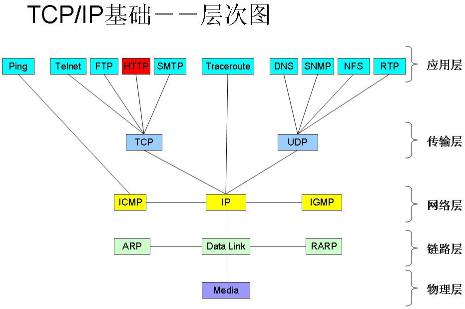
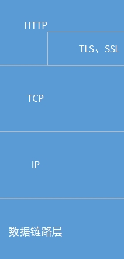
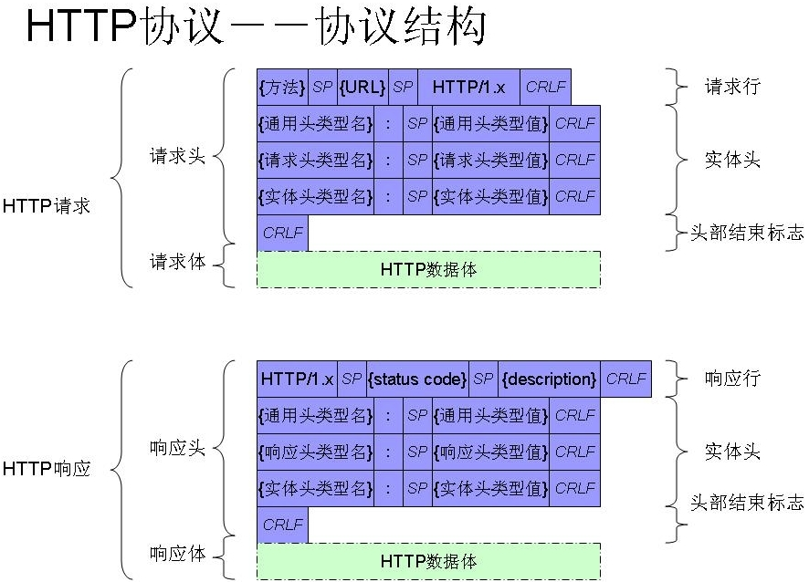
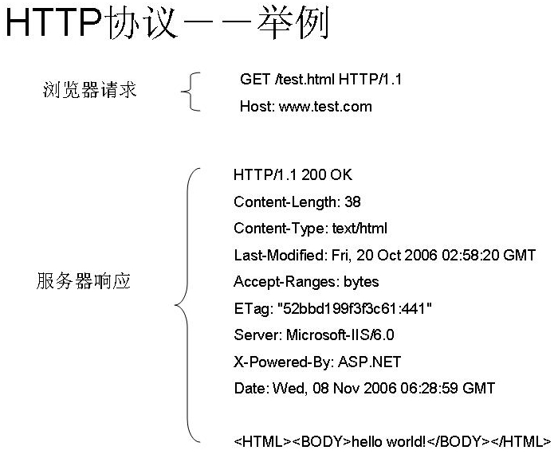
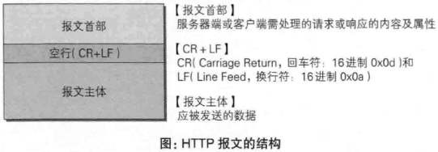
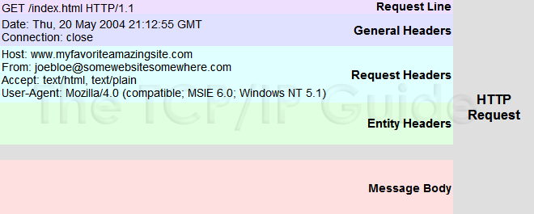
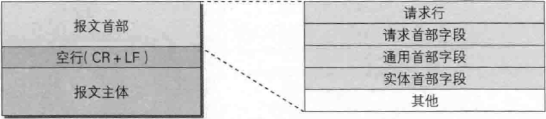
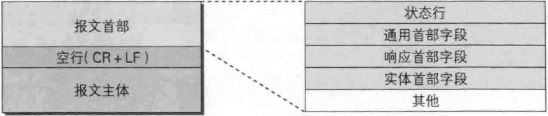

# HTTP

先简单介绍TCP/IP协议的相关内容。TCP/IP协议是分层的，从底层至应用层分别为：**物理层、链路层、网络层、传输层和应用层**：



从应用层至物理层，数据一层层封装，封装方式一般都是在原有数据前加一个数据控制头，数据封装格式如下：


对于TCP传输协议，客户端在于服务器建立连接前需要经过TCP三次握手：


HTTP是一个客户端和服务器端请求和响应的标准TCP，是建立在TCP之上的。




HTTP（HyperText Transfer Protocol），超文本传输协议，是应用层协议，是一种请求/响应式的协议。一个客户端与服务器建立连接后，发送一个请求给服务器；服务器接到请求后，给予相应的响应信息。

HTTPS，安全增强版的HTTP，S表示TLS、SSL。HTTPS是HTTP与安全套接口层(SSL)的结合，使HTTP的协议数据在传输过程中更安全。





## HTTP报文

用于HTTP协议交互的信息成为HTTP报文。请求端（客户端）的HTTP报文叫请求报文，响应端（服务器端）的叫做响应报文。HTTP报文是由多行数据（用CR+LF做换行符）构成的字符串文本。HTTP报文大致可分为报文首部和报文主体两部分，两者由最初出现的空行（用CR+LF做换行符）隔开。通常，并不一定要有报文主体。



### HTTP请求报文格式




* HTTP请求报文
    * 报文首部
        * 请求行
            * 请求方法（GET/POST/DELETE/PUT/HEAD）
            * 请求资源的URI路径
            * HTTP版本号
            ```http
            GET /index.html HTTP/1.1
            ```
        * 请求首部字段
        * 通用首部字段
        * 实体首部字段
        * 其他
    * 空行（CR+LF），首部结束标志
    * 报文主体


* #### 请求行

请求消息的第一行，由三部分组成：

请求方法（GET/POST/DELETE/PUT/HEAD）、请求资源的URI路径、HTTP的版本号：

```http
GET /index.html HTTP/1.1
```

* #### 实体头

实体头中的信息有和缓存相关的头（Cache-Control，If-Modified-Since）、客户端身份信息（User-Agent）等等：

```http
Cache-Control:max-age=0
Cookie:gsScrollPos=; _ga=GA1.2.329038035.1465891024; _gat=1
If-Modified-Since:Sun, 01 May 2016 11:19:03 GMT
User-Agent:Mozilla/5.0 (Windows NT 10.0; WOW64) AppleWebKit/537.36 (KHTML, like Gecko) Chrome/51.0.2704.84 Safari/537.36
```

* #### 消息体

消息体是客户端发给服务端的请求数据，这部分数据并不是每个请求必须的。

### HTTP响应格式




