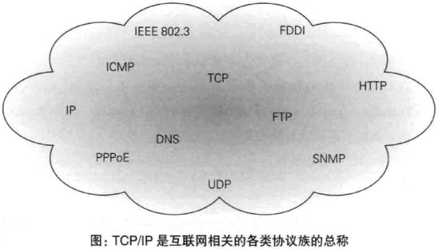
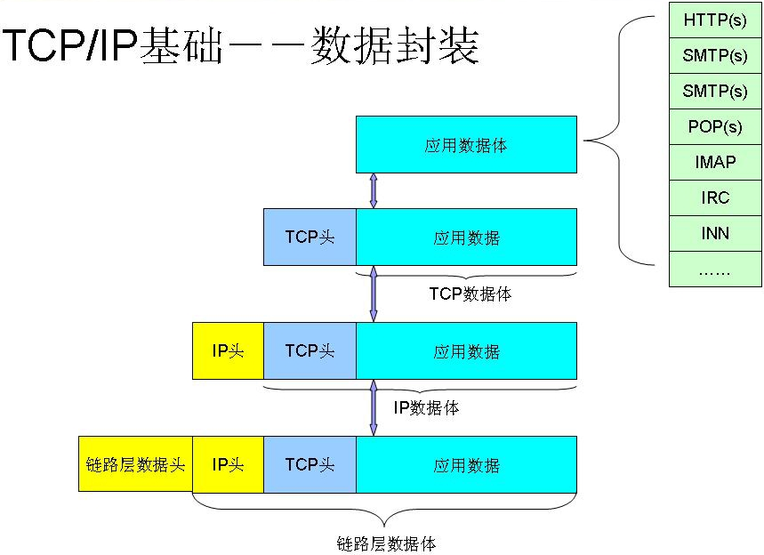
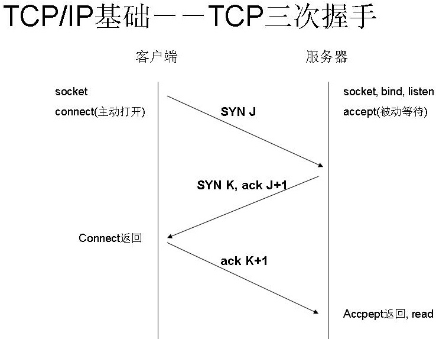
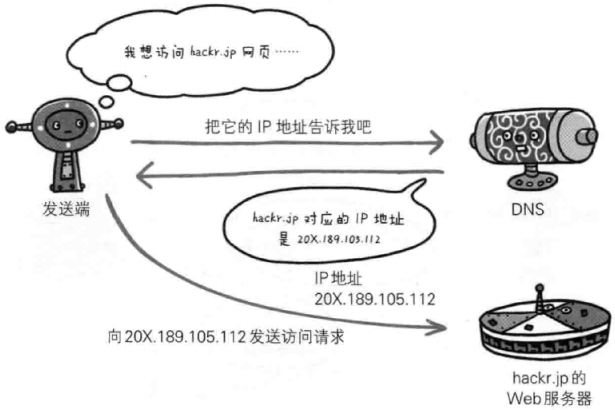
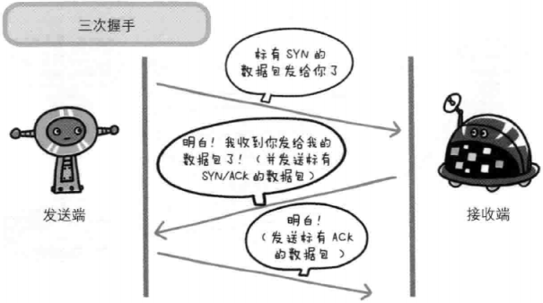
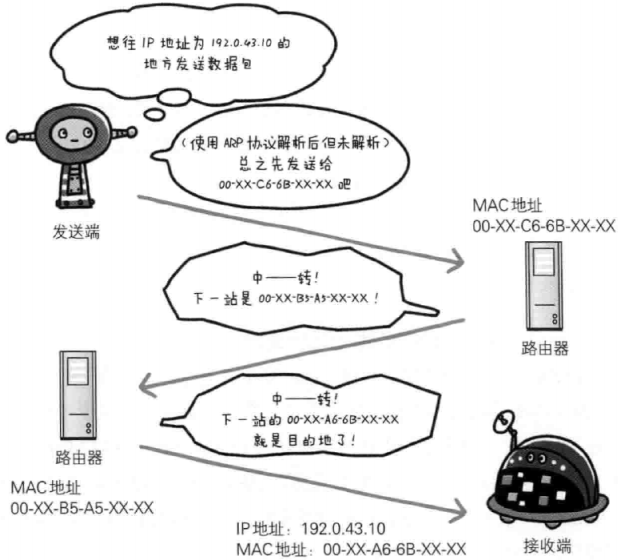
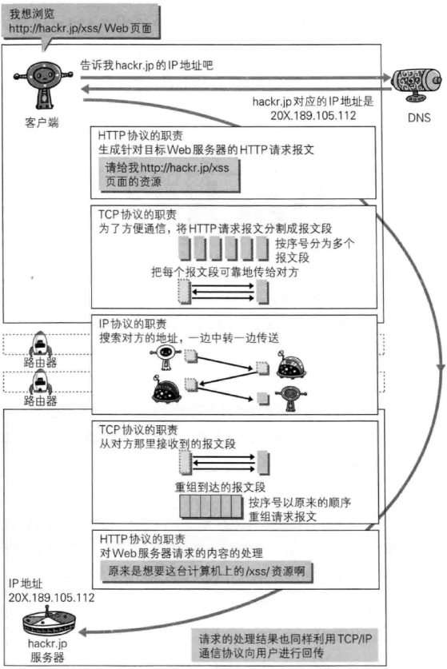

<div style="position: fixed; bottom: 20px; right: 39px; border-radius: 5px; background-color: #797979; z-index: 100;">
    <a href="#目录" style="color: white; border-right: 1px solid white; text-decoration: none; font-size: 14px; font-weight: bold; display: inline-block; padding: 5px 8px; line-height: 20px;">back to top ▲</a>
    <a style="cursor: pointer; color: white; border-right: 1px solid white; text-decoration: none; font-weight: bold; display: inline-block; padding: 5px 8px; line-height: 20px;" onclick="(function(){document.querySelector('.btn.pull-left.js-toolbar-action').click()})()"><i class="fa fa-align-justify"></i></a>
</div>

# TCP/IP协议族

* [TCP/IP四层模型](#tcpip四层模型)
* [负责域名解析的DNS服务](#负责域名解析的dns服务)
* [确保可靠性的TCP协议](#确保可靠性的tcp协议) 
* [负责传输的IP协议](#负责传输的ip协议)


先简单介绍一下tcpip协议族。通常使用的网络（包括互联网）是在tcpip协议族的基础上运作的，它包含了各种各样的内容：从电缆规格到IP地址选定方法、寻找异地用户的方法、双方建立通信的顺序，以及Web页面显示的处理步骤等等。HTTP是它的一个子集。




# <p align="center" style="border-bottom: 3px solid #e7e7e7;">TCP/IP四层模型</p>


tcpip协议族是分层的，它借鉴了OSI（Open System Interconnection）七层网络模型建立TCP/IP四层模型：
* 应用层：决定了向用户提供应用服务时的通信的活动；
* 传输层：提供处于网络连接中的两台计算机之间的数据传输；
* 网络层（又称网络互联层）：用来处理在网络上流动的数据包。数据包是网络传输的最小数据单位。该层规定了通过怎样的路径到达对方计算机，并把数据包传送给对方；
* 链路层（又称数据链路层，网络接口层）：用来处理链接网络的硬件部分。包括控制操作系统、硬件的设备驱动、NIC（Network Interface Card，网络适配器，即网卡），以及光纤等物理课件部分（还包括连接器等一切传输媒介）。硬件上的范畴均在链路层的作用范围之内。

> OSI模型，即开放式通信系统互联参考模型（Open System Interconnection, OSI/RM, Open Systems Interconnection Reference Model），是国际标准化组织(ISO)提出的一个试图使各种计算机在世界范围内互连为网络的标准框架。事实上被TCP/IP四层模型淘汰。

<table>
    <tr>
        <th>OSI七层网络模型</th>
        <th>TCP/IP四层模型</th>
        <th>对应的网络协议</th>
    </tr>
    <tr>
        <td>应用层（Application）</td>
        <td rowspan="3">应用层</td>
        <td>HTTP, TFTP, FTP, NFS, WAIS, SMTP, POP3, IMAP4, Telnet</td>
    </tr>
    <tr>
        <td>表示层（Presentation）</td>
        <td>Rlogin, SNMP, Gopher</td>
    </tr>
    <tr>
        <td>会话层（Session）</td>
        <td>SMTP, DNS</td>
    </tr>
    <tr>
        <td>传输层（Transport）</td>
        <td>传输层</td>
        <td>TCP, UDP</td>
    </tr>
    <tr>
        <td>网络层（Network）</td>
        <td>网络层（又称网络互联层）</td>
        <td>IP, ICMP, ARP, RARP, AKP, UUCP</td>
    </tr>
    <tr>
        <td>数据链路层（Data Link）</td>
        <td rowspan="2">链路层（又称数据链路层，网络接口层）</td>
        <td>FDDI, Ethernet, Arpanet, PDN, SLIP, PPP</td>
    </tr>
    <tr>
        <td>物理层（Physical）</td>
        <td>IEEE 802.1A, IEEE 802.2到IEEE 802.11</td>
    </tr>
</table>

```
FTP: File Transfer Protocol
SMTP: Simple Mail Transfer Rotocol
POP3: Post Office Protocol 3
IMAP4: Internet Mail Access Protocol
```


发送端从应用层至链路层传数据时，数据每经过一层时必定会被打上一个该层所属的首部信息，数据一层层封装（encapsulate）。反之，接收端从链路层至应用层接收数据时，数据每经过一层时会把对应的首部去掉：






# <p align="center" style="border-bottom: 3px solid #e7e7e7;">负责域名解析的DNS服务</p>


DNS（Domain Name System，域名系统），位于应用层，提供域名到IP地址之间的解析服务。

计算机可以被赋予IP地址，也可以被赋予主机名和域名。比如：www.hackr.jp。

用户通常使用主机名或域名来访问对方计算机，而计算机则是通过IP地址来寻找计算机。因此，DNS服务应运而生：DNS协议提供通过域名查找IP地址，或通过IP地址反查域名的服务。




# <p align="center" style="border-bottom: 3px solid #e7e7e7;">确保可靠性的TCP协议</p>


TCP（Transmission Control Protocol，传输控制协议），位于传输层，提供可靠地字节流服务。

字节流服务（Byte Stream Service）是指，为了传输方便，将大块数据分割为报文段（segment）为单位的数据包进行管理。

**TCP协议将大数据分割传送，并可以确认数据最终是否送达对方。**

为了确保数据到达目标，TCP协议采用三次握手（three-way handshaking）策略，握手过程中使用了TCP的标志（flag）——SYN（synchronize）和ACK（acknowledgement）：

1. 发送端先发送一个带SYN标志的数据包给接收端；
2. 接收端收到后回传一个带有SYN/ACK标志的数据包确认收到；
3. 最后发送端再回传一个带ACK标志的数据包表示“握手”结束。

若握手过程莫名中断，TCP协议会以相同的顺序再次发送相同的数据包。




# <p align="center" style="border-bottom: 3px solid #e7e7e7;">负责传输的IP协议</p>


IP（Internet Protocol，网际协议），位于网络层。可能有人会把“IP”和“IP地址”搞混，“IP”其实是一种协议名称。

IP协议的作用是把各种数据包传送给对方，而要确保传送到对方哪里，最重要满足两个条件：IP地址和MAC地址（Media Access Control Address）。

* IP地址指明节点被分配到的地址，IP地址可变换；
* MAC地址指网卡所属的固定地址，MAC地址基本不会改变。

在网络中，通信双方通常要经过多台计算机和网络设备中转才能连接到对方。在进行中转时，会利用下一站中转设备的MAC地址来搜索下一个中转目标。这是会使用ARP协议（Address Resolution Protocol，地址解析协议）：ARP是一种用来解析地址的协议，可以根据IP地址反查出对应的MAC地址。

在到达通信目标前的中转过程中，无论哪台计算机、哪台网络设备都无法全面掌握网络中的细节，它们只能获取粗略的传输路线，这种机制叫做路由选择（routing）。



**IP协议、TCP协议和DNS服务在使用HTTP协议的通信过程中各自发挥的作用：**


