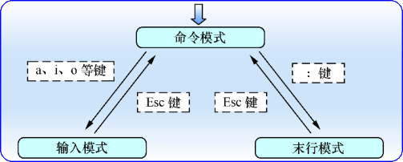

# 
Vim

#### Vim 编辑器中设置了三种模式：
* ##### 命令模式：控制光标移动，可对文本进行复制、粘贴、删除和查找等工作。
* ##### 输入模式：正常的文本录入。
* ##### 末行模式：保存或退出文档，以及设置编辑环境。

每次运行Vim编辑器时，默认进入命令模式，此时需要先切换到输入模式后再进行文档编写工作，而每次在编写完文档后需要先返回命令模式，然后再进入末行模式，执行文档的保存或退出操作。

**命令模式中最常用的一些命令：**

|命令|作用|
|:---|:---|
|dd|删除（剪切）光标所在整行|
|5dd|删除（剪切）从光标处开始的 5 行|
|yy|复制光标所在整行|
|5yy|复制从光标处开始的 5 行|
|n|显示搜索命令定位到的下一个字符串|
|N|显示搜索命令定位到的上一个字符串|
|u|撤销上一步的操作|
|p|将之前删除（dd）或复制（yy）过的数据粘贴到光标后面|

末行模式主要用于保存或退出文件，以及设置Vim编辑器的工作环境，还可以让用户执行外部的Linux命令或跳转到所编写文档的特定行数。在命令模式中输入一个冒号就可以切换到末行模式。

**末行模式中可用的命令：**

|命令|作用|
|:---|:---|
|:w|保存|
|:q|退出|
|:q!|强制退出（放弃对文档的修改内容）|
|:wq!|强制保存退出|
|:set nu|显示行号|
|:set nonu|不显示行号|
|:命令|执行该命令|
|:s/one/two|将当前光标所在行的第一个one替换成two|
|:s/one/two/g|将当前光标所在行的所有one替换成two|
|:%s/one/two/g|将全文中的所有one替换成two|
|?字符串|在文本中从下至上搜索该字符串|
|/字符串|在文本中从上至下搜索该字符串|
