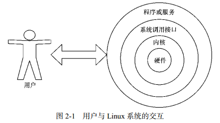
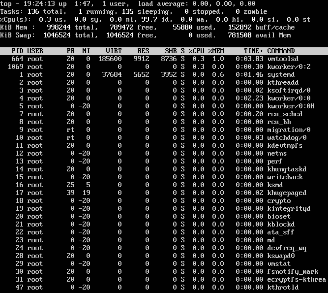
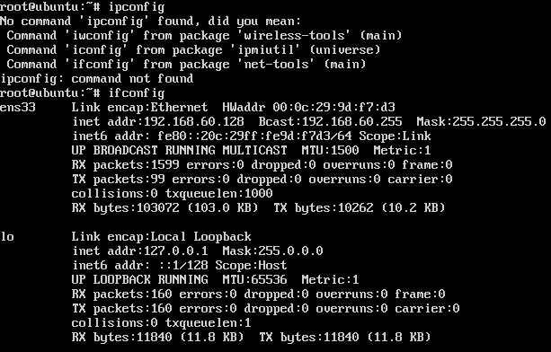

# 基本命令

* [执行查看帮助命令](#执行查看帮助命令)
* [常用系统工作命令](#常用系统工作命令)
* [系统状态检测命令](#系统状态检测命令)
* [工作目录切换命令](#工作目录切换命令)
* [文本文件编辑命令](#文本文件编辑命令)
* [文件目录管理命令](#文件目录管理命令)
* [打包压缩与搜索命令](#打包压缩与搜索命令)


计算机硬件由运算器、控制器、存储器、输入/输出设备等共同组成，让各种硬件设备各司其职且又能协同运行的东西是系统内核。Linux系统的内核负责完成对硬件资源的分配、调度等管理任务。用户通过基于系统调用接口开发出的程序或服务来管理计算机。

Shell是一个命令行工具。Shell（也称为**终端**或**壳**）充当人与内核（硬件）之间的翻译官，用户把一些命令“告诉”终端，它就会调用相应的程序服务去完成某些工作。

主流Linux系统默认的终端是Bash（Bourne-Again SHell）解释器。Bash解释器作为命令行终端有以下4项优势：

* 通过上下方向键来调取过往执行过的Linux命令；
* 命令或参数仅需输入前几位就可以用Tab键补全；
* 具有强大的批处理脚本；
* 具有实用的环境变量功能。

Linux系统中以点（.）开头的文件均代表隐藏文件，这些文件大多数为系统服务文件。



__命令名称 [命令参数] [命令对象]__

命令参数可以使用长格式，也可以用短格式，两者分别用--与-作为前缀。长格式与长格式不能合并，长格式与短格式不能合并，但短格式和短格式可以合并，合并后仅保留一个-（减号）即可。

在系统终端中执行一个命令后想立即停止它，可以同时按下Ctrl + C，这样将立即终止该命令的进程。有些命令在执行时不断在屏幕上输出信息，影响后续命令输入，可以在执行命令时在末尾加上一个&符号，这样命令会进入系统后台来执行。

# <p align="center">执行查看帮助命令</p>

###### [<p align="right">back to top ▲</p>](#基本命令)

* #### man (MANual pages)

man命令中常用按键及用途

|按键|用途|
|:---|:---|
|空格键|向下翻一页|
|PaGe down|向下翻一页|
|PaGe up|向上翻一页|
|home|直接前往首页|
|end|直接前往尾页|
|/|从上至下搜索某个关键词，如“/linux”|
|?|从下至上搜索某个关键词，如“?linux”|
|n|定位到下一个搜索到的关键词|
|N|定位到上一个搜索到的关键词|
|q|退出帮助文档|

man命令帮助信息的结构以及意义

|结构名称|代表意义|
|:---|:---|
|NAME|命令的名称|
|SYNOPSIS|参数的大致使用方法|
|DESCRIPTION|介绍说明|
|EXAMPLES|演示（附带简单说明）|
|OVERVIEW|概述|
|DEFAULTS|默认的功能|
|OPTIONS|具体的可用选项（带介绍）|
|ENVIRONMENT|环境变量|
|FILES|用到的文件|
|SEE ALSO|相关的资料|
|HISTORY|维护历史与联系方式|

# <p align="center">常用系统工作命令</p>

###### [<p align="right">back to top ▲</p>](#基本命令)

* #### echo
用于在终端输出字符串或变量提取后的值：**echo [字符串 | $变量]**

```bash
[root@linuxprobe ~]# echo Linuxprobe.Com
该命令会在终端屏幕上显示如下信息：
Linuxprobe.Com

使用$变量的方式提取变量SHELL的值，并将其输出到屏幕上：
[root@linuxprobe ~]# echo $SHELL
/bin/bash
```
* #### date
用于显示及设置系统的时间或日期：**date [选项] [+指定的格式]**

|参数|作用|
|:---|:---|
|%t|跳格[Tab 键]|
|%H|小时（00～23）|
|%I|小时（00～12）|
|%M|分钟（00～59）|
|%S|秒（00～59）|
|%j|今年中的第几天|
```bash
按照默认格式查看当前系统时间：
[root@linuxprobe ~]# date
Mon Aug 24 16:11:23 CST 2017

按照“年-月-日 小时:分钟:秒”的格式查看当前系统时间：
[root@linuxprobe ~]# date "+%Y-%m-%d %H:%M:%S"
2017-08-24 16:29:12

将系统的当前时间设置为2017年9月1日8点30分：
[root@linuxprobe ~]# date -s "20170901 8:30:00"
Fri Sep 1 08:30:00 CST 2017

参数%j可用来查看今天是当年中的第几天：
[root@linuxprobe ~]# date "+%j"
244
这个参数能够很好地区分备份时间的新旧，数字越大，越靠近当前时间。
```

* #### reboot
用于重启系统：**reboot**

重启操作涉及硬件资源的管理权限，默认只能使用root管理员来重启。
* #### poweroff
用于关闭系统：**poweroff**

关机操作涉及硬件资源的管理权限，默认只能使用root管理员来关闭电脑。
* #### wget
用于在终端中下载网络文件：**wget [参数] 下载地址**

|参数|作用|
|:---|:---|
|-b|后台下载模式|
|-P|下载到指定目录|
|-t|最大尝试次数|
|-c|断点续传|
|-p|下载页面内所有资源，包括图片、视频等|
|-r|递归下载|

```bash
使用wget命令下载网络文件：
[root@linuxprobe ~]# wget http://www.linuxprobe.com/docs/LinuxProbe.pdf

使用wget命令递归下载www.linuxprobe.com网站内所有页面数据以及文件：
[root@linuxprobe ~]# wget -r -p http://www.linuxprobe.com
下载完后会自动保存到当前路径下一个名为www.linuxprobe.com的目录中
```
* #### ps (Process Status)
显示系统的瞬间进程状态，并不动态连续：**ps [参数]**

|参数|作用|
|:---|:---|
|-a|显示所有进程（包括其他用户的进程）|
|-u|用户以及其他详细信息|
|-x|显示没有控制终端的进程|

**合理管理进程可以优化系统的性能。**

在Linux系统中，有5种常见的进程状态：

|进程状态|含义|
|:---|:---|
|R（运行）|进程正在运行或在运行队列中等待|
|S（中断）|进程处于休眠中，当某个条件形成后或者接收到信号时，则脱离该状态|
|D（不可中断）|进程不响应系统异步信号，即便用kill命令也不能将其中断|
|Z（僵死）|进程已经终止，但进程描述符依然存在, 直到父进程调用wait4()系统函数后将进程释放|
|T（停止）|进程收到停止信号后停止运行|

执行**ps aux**命令后会看到进程状态：
> ps命令允许参数不加减号（-），可直接写成ps aux。

|USER|PID|%CPU|%MEM|VSZ|RSS|TTY|STAT|START|TIME|COMMAND|
|:---|:---|:---|:---|:---|:---|:---|:---|:---|:---|:---|
|进程所有者|进程ID|运算器占用率|内存占用率|虚拟内存使用量（单位KB）|占用固定内存量（单位KB）|所在终端|进程状态|被启动的时间|实际使用CPU的时间|命令名称与参数|
* #### top
用于动态地监视进程活动与系统负载等信息：**top**

top能够动态地查看系统运维状态，可以它看作Linux中的“强化版的Windows任务管理器”。



|行数|含义|
|:---|:---|
|第1行|系统时间、运行时间、登录终端数、系统负载（三个数值分别为1分钟、5分钟、15分钟内的平均值，数值越小意味着负载越低）|
|第2行|进程总数、运行中的进程数、睡眠中的进程数、停止的进程数、僵死的进程数|
|第3行|用户占用资源百分比、系统内核占用资源百分比、改变过优先级的进程资源百分比、空闲的资源百分比等|
|第4行|物理内存总量、内存使用量、内存空闲量、作为内核缓存的内存量|
|第5行|虚拟内存总量、虚拟内存使用量、虚拟内存空闲量、已被提前加载的内存量|
* #### pidof
用于查询某个指定服务进程的PID值：**pidof [参数] [服务名称]**

每个进程的进程号码值（PID）是唯一的，可以通过PID来区分不同的进程。
```bash
使用如下命令来查询本机上sshd服务程序的PID：
[root@linuxprobe ~]# pidof sshd
2156
```
* #### kill
用于终止某个指定PID的服务进程：**kill [参数] [进程 PID]**
* #### killall
用于终止某个指定名称的服务所对应的全部进程：**killall [参数] [进程名称]**

复杂软件的服务程序会有多个进程协同为用户提供服务，可以使用killall命令来批量结束某个服务程序带有的全部进程：
```bash
[root@linuxprobe ~]# pidof httpd
13581 13580 13579 13578 13577 13576
[root@linuxprobe ~]# killall httpd
[root@linuxprobe ~]# pidof httpd
[root@linuxprobe ~]#
```

# <p align="center">系统状态检测命令</p>

###### [<p align="right">back to top ▲</p>](#基本命令)

* #### ifconfig
用于获取网卡配置与网络状态等信息：**ifconfig [网络设备] [参数]**

主要查看的是网卡名称、inet参数后面的IP地址、ether参数后面的网卡物理地址（MAC地址），以及RX、TX的接收数据包与发送数据包的个数及累计流量：


* #### uname
用于查看系统内核与系统版本等信息：**uname [-a]**

使用uname命令一般会搭配-a参数来完整地查看当前系统的内核名称、主机名、内核发行版本、节点名、系统时间、硬件名称、硬件平台、处理器类型以及操作系统名称等信息：
```bash
[root@linuxprobe ~]# uname -a
Linux linuxprobe.com 3.10.0-123.el7.x86_64 #1 SMP Mon May 5 11:16:57 EDT 2017
x86_64 x86_64 x86_64 GNU/Linux
```

要查看当前系统版本的详细信息，需要查看redhat-release文件：
```bash
[root@linuxprobe ~]# cat /etc/redhat-release
Red Hat Enterprise Linux Server release 7.0 (Maipo)
```
* #### uptime
用于查看系统的负载信息：**uptime**

uptime命令可以显示当前系统时间、系统已运行时间、启用终端数量以及平均负载值等信息。
平均负载值指的是系统在最近1分钟、5分钟、15分钟内的压力情况（下面加粗的信息部分）；负载值越低越好，尽量不要长期超过1，在生产环境中不要超过5：
```bash
[root@linuxprobe ~]# uptime
22:49:55 up 10 min, 2 users, load average: 0.01, 0.19, 0.18
```
* #### free
用于显示当前系统中内存的使用量信息：**free [-h]**

为保证Linux系统不会因资源耗尽而突然宕机，运维人员需要时刻关注内存的使用量。

在使用free命令时可以结合-h参数以更人性化的方式输出当前内存的实时使用量信息。

||内存总量|已用量|可用量|进程共享的内存量|磁盘缓存的内存量|缓存的内存量|
|:---|:---|:---|:---|:---|:---|:---|
||total|used|free|shared|buffers|cached|
|Mem|1.8GB|1.3GB|542MB|9.8MB|1.6MB|413MB|
|-/+ buffers/cache||869MB|957MB||||
|Swap|2.0GB|0|2.0GB|||||

* #### who
用于查看当前登入主机的用户终端信息：**who [参数]**

|登陆的用户名|终端设备|登录到系统的时间|
|:---|:---|:---|
|root|:0|2017-08-24 17:52 (:0)|
|root|pts/0|2017-08-24 17:52 (:0)|
* #### last
用于查看所有系统的登录记录：**last [参数]**

这些信息都是以日志文件的形式保存在系统中，因此黑客可以很容易地对内容进行篡改。不要单纯以该命令的输出信息判断系统有无被恶意入侵！
```bash
[root@linuxprobe ~]# last
root pts/0 :0 Mon Aug 24 17:52 still logged in
root :0 :0 Mon Aug 24 17:52 still logged in
(unknown :0 :0 Mon Aug 24 17:50 - 17:52 (00:02)
reboot system boot 3.10.0-123.el7.x Tue Aug 25 01:49 - 18:17 (-7:-32)
root pts/0 :0 Mon Aug 24 15:40 - 08:54 (7+17:14)
root pts/0 :0 Fri Jul 10 10:49 - 15:37 (45+04:47)
………………省略部分登录信息………………
```
* #### history
用于显示历史执行过的命令：**history [-c]**

可以自定义/etc/profile文件中的HISTSIZE变量值控制显示条数；

使用-c参数会清空所有的命令历史记录；

可以使用“!编码数字”的方式来重复执行某一次的命令；

历史命令会被保存到用户家目录中的.bash_history文件中。
```bash
[root@linuxprobe ~]# history
1 tar xzvf VMwareTools-9.9.0-2304977.tar.gz
2 cd vmware-tools-distrib/
3 ls
4 ./vmware-install.pl -d
5 reboot
6 df -h
7 cd /run/media/
8 ls
9 cd root/
10 ls
11 cd VMware\ Tools/
12 ls
13 cp VMwareTools-9.9.0-2304977.tar.gz /home
14 cd /home
15 ls
16 tar xzvf VMwareTools-9.9.0-2304977.tar.gz
17 cd vmware-tools-distrib/
18 ls
19 ./vmware-install.pl -d
20 reboot
21 history
[root@linuxprobe ~]# !15
anaconda-ks.cfg Documents initial-setup-ks.cfg Pictures Templates
Desktop Downloads Music Public Videos
```

* #### sosreport
用于收集系统配置及架构信息并输出诊断文档：**sosreport**

Linux系统出现故障需要联系技术支持人员时，大多数时候都要先用这个命令来简单收集系统的运行状态和服务配置信息，以便让技术支持人员能够远程解决一些小问题，亦或让他们能提前了解某些复杂问题。


# <p align="center">工作目录切换命令</p>

###### [<p align="right">back to top ▲</p>](#基本命令)

* #### pwd (Print Working Directory)
用于显示用户当前所处的工作目录：**pwd [选项]**

* #### cd (Change Directory)
用于切换工作路径：**cd [目录名称]**

cd -：返回到上一次所处的目录；

cd ..：进入上级目录；

cd ~：切换到当前用户的家目录；

cd ~username：切换到其他用户的家目录。

* #### ls (LiSt)
用于显示目录中的文件信息：**ls [选项] [文件]**

使用“-a”参数可以看到全部文件（包括隐藏文件），使用“-l”参数可以查看文件的属性、大小等详细信息，使用“-d”参数可以查看目录属性信息。

```bash
查看当前目录中的所有文件并输出这些文件的属性信息
[root@linuxprobe ~]# ls -al
total 60
dr-xr-x---. 14 root root 4096 May 4 07:56 .
drwxr-xr-x. 17 root root 4096 May 4 15:55 ..
-rw-------. 1 root root 1213 May 4 15:44 anaconda-ks.cfg
-rw-------. 1 root root 957 May 4 07:54 .bash_history
-rw-r--r--. 1 root root 18 Dec 28 2013 .bash_logout
-rw-r--r--. 1 root root 176 Dec 28 2013 .bash_profile
………………省略………………

查看/etc目录的权限与属性信息
[root@linuxprobe ~]# ls -ld /etc
drwxr-xr-x. 132 root root 8192 Jul 10 10:48 /etc
```


# <p align="center">文本文件编辑命令</p>

###### [<p align="right">back to top ▲</p>](#基本命令)

* #### cat (CATenate)
用于查看纯文本文件（内容较少的）：**cat [选项] [文件]**

使用“-n”参数可以显示行号。

* #### more
用于查看纯文本文件（内容较多的）：**more [选项]文件**

more命令会在最下面用百分比提示已经阅读了多少内容。还可以使用空格键或回车键向下翻页，按b键向上翻页。

|参数|作用|
|:---|:---|
|+n|从笫n行开始显示|
|-n|定义屏幕大小为n行|
|+/pattern|在每个档案显示前搜寻该字串（pattern），然后从该字串前两行之后开始显示|
|-c|从顶部清屏，然后显示|
|-d|提示“Press space to continue，'q' to quit”，禁用响铃功能|
|-l|忽略Ctrl+l（换页）字符|
|-p|通过清除窗口而不是滚屏来对文件进行换页，与-c选项相似|
|-s|把连续的多个空行显示为一行|
|-u|把文件内容中的下画线去掉|

|操作|作用|
|:---|:---|
|Enter|向下n行，需要输入。默认为1行|
|F|向下滚动一屏|
|空格键|向下滚动一屏|
|B|返回上一屏|
|=|输出当前行的行号|
|:f|输出文件名和当前行的行号|
|V|调用vi编辑器|
|!|调用Shell，并执行命令|
|q|退出more|

* #### head
用于查看纯文本文档的前N行：**head [选项] [文件]**
```bash
查看文本中前5行的内容
[root@linuxprobe ~]# head -n 5 initial-setup-ks.cfg
#version=RHEL7
# X Window System configuration information
xconfig --startxonboot
# License agreement
eula --agreed
```

* #### tail
用于查看纯文本文档的后N行或持续刷新内容：**tail [选项] [文件]**

操作与head命令相似，“tail -n 20 文件名”可以查看文本后20行的内容。

tail命令最强悍的功能是可以持续刷新一个文件的内容，可以用来实时查看最新日志文件：**tail -f 文件名**

* #### tr (TRaslate)
用于替换文本文件中的字符：**tr [原始字符] [目标字符]**

先使用cat命令读取待处理的文本，然后通过管道符把这些文本内容传递给tr命令进行替换操作。
```bash
[root@linuxprobe ~]# cat anaconda-ks.cfg | tr [a-z] [A-Z]
#VERSION=RHEL7
# SYSTEM AUTHORIZATION INFORMATION
AUTH --ENABLESHADOW --PASSALGO=SHA512
# USE CDROM INSTALLATION MEDIA
CDROM
………………省略………………
```

* #### wc (Word Count)
用于统计指定文本的行数、字数、字节数：**wc [参数] 文本**

|参数|作用|
|:---|:---|
|-l|只显示行数|
|-w|只显示单词数|
|-c|只显示字节数|

在Linux系统中，passwd用于保存系统账户信息的文件，要统计当前系统中有多少个用户，可以使用下面的命令来进行查询：
```bash
[root@linuxprobe ~]# wc -l /etc/passwd
38 /etc/passwd
```

* #### stat
用于查看文件的具体存储信息和时间等信息：**stat 文件名称**

* #### cut
用于按“列”提取文本字符：**cut [参数] 文本**

按列搜索，要使用-f参数来设置需要看的列数，还要使用-d参数来设置间隔符号。

```bash
[root@linuxprobe ~]# head -n 2 /etc/passwd
root:x:0:0:root:/root:/bin/bash
bin:x:1:1:bin:/bin:/sbin/nologin

passwd保存用户数据信息，每一项值之间是采用冒号来间隔的，
下述命令用于提取出passwd文件中的用户名信息，
即提取以冒号（：）为间隔符号的第一列内容：
[root@linuxprobe ~]# cut -d: -f1 /etc/passwd
root
bin
daemon
adm
………………省略………………
```

* #### diff (DIFFerence)
用于比较多个文本文件的差异：**diff [参数] 文件**

diff是判断文件是否被篡改的有力神器：

使用--brief参数可以确认两个文件是否不同；

使用-c参数可以详细比较出多个文件的差异之处。


# <p align="center">文件目录管理命令</p>

###### [<p align="right">back to top ▲</p>](#基本命令)

* #### touch
用于创建空白文件或设置文件的时间：**touch [选项] [文件]**

|参数|作用|
|:---|:---|
|-a|仅修改“读取时间”（atime）|
|-m|仅修改“修改时间”（mtime）|
|-d|同时修改atime与mtime|

```bash
使用ls命令查看一个文件的修改时间
[root@linuxprobe ~]# ls -l anaconda-ks.cfg
-rw-------. 1 root root 1213 May 4 15:44 anaconda-ks.cfg

修改这个文件
[root@linuxprobe ~]# echo "Visit the LinuxProbe.com to learn linux skills" >> anaconda-ks.cfg
[root@linuxprobe ~]# ls -l anaconda-ks.cfg
-rw-------. 1 root root 1260 Aug 2 01:26 anaconda-ks.cfg

通过touch命令把修改后的文件时间设置成修改之前的时间
[root@linuxprobe ~]# touch -d "2017-05-04 15:44" anaconda-ks.cfg
[root@linuxprobe ~]# ls -l anaconda-ks.cfg
-rw-------. 1 root root 1260 May 4 15:44 anaconda-ks.cfg
```

* #### mkdir (MaKe DIRectory)
用于创建空白的目录：**mkdir [选项] 目录**

可以结合-p参数来递归创建出具有嵌套叠层关系的文件目录：
```bash
[root@linuxprobe ~]# mkdir linuxprobe
[root@linuxprobe ~]# cd linuxprobe
[root@linuxprobe linuxprobe]# mkdir -p a/b/c/d/e
[root@linuxprobe linuxprobe]# cd a
[root@linuxprobe a]# cd b
[root@linuxprobe b]#
```

* #### cp (CoPy)
用于复制文件或目录：**cp [选项] 源文件 目标文件**

如果目标文件是目录，会把源文件复制到该目录中；

如果目标文件也是普通文件，会询问是否要覆盖它；

如果目标文件不存在，执行正常的复制操作。

|参数|作用|
|:---|:---|
|-p|保留原始文件的属性|
|-d|若对象为“链接文件”，则保留该“链接文件”的属性|
|-r|递归持续复制（用于目录）|
|-i|若目标文件存在则询问是否覆盖|
|-a|相当于-pdr（p、 d、 r 为上述参数）|

* #### mv (MoVe)
用于剪切文件或将文件重命名：**mv [选项] 源文件 [目标路径|目标文件名]**

剪切不同于复制，它会默认把源文件删除掉，只保留剪切后的文件。如果在同一个目录中对一个文件进行剪切操作，其实就是对其进行重命名。

* #### rm (ReMove)
用于删除文件或目录：**rm [选项] 文件**

在Linux中删除文件时，系统会默认询问是否要执行删除操作，如果不想看到这种反复的确认信息，可在rm命令后跟上-f参数来强制删除。

想要删除一个目录，需要在rm命令后面加-r参数。

* #### dd (Disk Dump)
用于按照指定大小和个数的数据块来复制文件或转换文件：**dd [参数]**

|参数|作用|
|:---|:---|
|if|输入的文件名称|
|of|输出的文件名称|
|bs|设置每个“块”的大小|
|count|设置要复制“块”的个数|

Linux系统中有一个名为/dev/zero的设备文件。这个文件不会占用系统存储空间，但却可以提供无穷无尽的数据，可以使用它作为dd命令的输入文件，来生成一个指定大小的文件。

```bash
用dd命令从/dev/zero设备文件中取出大小为560MB的数据块，
然后保存成名为560_file的文件:
[root@linuxprobe ~]# dd if=/dev/zero of=560_file count=1 bs=560M
1+0 records in
1+0 records out
587202560 bytes (587 MB) copied, 27.1755 s, 21.6 MB/s

Linux系统中可以直接使用dd命令来压制出光盘镜像文件，
将它变成一个可立即使用的iso镜像:
[root@linuxprobe ~]# dd if=/dev/cdrom of=RHEL-server-7.0-x86_64-LinuxProbe.Com.iso
7311360+0 records in
7311360+0 records out
3743416320 bytes (3.7 GB) copied, 370.758 s, 10.1 MB/s
```

bs块大小与count块个数的关系：

小明的饭量（即需求）是一个固定的值，盛饭勺子的大小即bs块大小，用勺子盛饭的次数即count块个数。小明要想吃饱（满足需求）需要在勺子大小（bs块大小）与用勺子盛饭的次数（count块个数）之间进行平衡。勺子越大，用勺子盛饭的次数就越少。

**bs与count都是用来指定容量的大小，只要能满足需求，可随意组合搭配方式。**

* #### file
用于查看文件的类型：**file 文件名**

在Linux系统中，文本、目录、设备等所有这些一切都统称为文件。
```bash
[root@linuxprobe ~]# file anaconda-ks.cfg
anaconda-ks.cfg: ASCII text
[root@linuxprobe ~]# file /dev/sda
/dev/sda: block special
```


# <p align="center">打包压缩与搜索命令</p>

###### [<p align="right">back to top ▲</p>](#基本命令)

* #### tar (Tape ARchive)
用于对文件进行打包压缩或解压：**tar [选项] [文件]**

在Linux系统中，常见的文件格式比较多，其中主要使用的是.tar或.tar.gz或.tar.bz2格式。

|参数|作用|
|:---|:---|
|-c|创建压缩文件|
|-x|解开压缩文件|
|-t|查看压缩包内有哪些文件|
|-z|用Gzip压缩或解压|
|-j|用bzip2压缩或解压|
|-v|显示压缩或解压的过程|
|-f|目标文件名|
|-p|保留原始的权限与属性|
|-P|使用绝对路径来压缩|
|-C|指定解压到的目录|

使用时根据文件的后缀来决定应使用何种格式参数进行解压。

在执行某些压缩或解压操作时，可能需要花费数个小时，推荐使用-v参数向用户不断显示压缩或解压的过程以判断打包进度。 

一般使用“**tar -czvf 压缩包名称.tar.gz 要打包的目录**”对指定的文件进行打包压缩；相应的解压命令为“**tar -xzvf 压缩包名称.tar.gz**”。

* #### grep (Global Regular Expression Print)
用于在文本中执行关键词搜索，并显示匹配的结果：**grep [选项] [文件]**

|参数|作用|
|:---|:---|
|-b|将可执行文件（binary）当作文本文件（text）来搜索|
|-c|仅显示找到的行数|
|-i|忽略大小写|
|-n|显示行号|
|-v|反向选择—仅列出没有“关键词”的行|
|-R|递归搜索，遍历所有子目录|
|-s|禁止关于不存在或不可读文件的错误消息|
|-w|匹配一个特定的单词，grep -Rw abc /etc/*会匹配到abc，但不会匹配到abcd|
|-l|仅列出包含特定文字的文件名称|
|--exclude-dir|排除特定的目录|

最最常用的参数：-n，-v，-R。
```bash
/etc/passwd文件是保存着所有的用户信息，
一旦用户的登录终端被设置成/sbin/nologin，
则不再允许登录系统，
因此可以用grep命令找出不允许登录系统的所有用户信息:
[root@linuxprobe ~]# grep /sbin/nologin /etc/passwd
bin:x:1:1:bin:/bin:/sbin/nologin
daemon:x:2:2:daemon:/sbin:/sbin/nologin
adm:x:3:4:adm:/var/adm:/sbin/nologin
lp:x:4:7:lp:/var/spool/lpd:/sbin/nologin

在/etc/目录内的所有文件（包括所有子目录）中搜索字符串maitiantian：
[root@linuxprobe ~]# grep -R maitiantian /etc/*
………………省略部分输出过程信息………………
```

* #### find
用于按照指定条件来查找文件：**find [查找路径] 寻找条件 操作**

|参数|作用|
|:---|:---|
|-name|匹配名称|
|-perm|匹配权限（mode为完全匹配， -mode为包含即可）|
|-user|匹配所有者|
|-group|匹配所有组|
|-mtime -n +n|匹配修改内容的时间（-n指n天以内，+n指n天以前）|
|-atime -n +n|匹配访问文件的时间（-n指n天以内，+n指n天以前）|
|-ctime -n +n|匹配修改文件权限的时间（-n指n天以内，+n指n天以前）|
|-nouser|匹配无所有者的文件|
|-nogroup|匹配无所有组的文件|
|-newer f1 !f2|匹配比文件f1新但比f2旧的文件|
|--type b/d/c/p/l/f|匹配文件类型（后面的字母参数依次表示块设备、目录、字符设备、管道、链接文件、文本文件）|
|-size|匹配文件的大小（+50KB为查找超过50KB的文件，而-50KB为查找小于50KB的文件）|
|-prune|忽略某个目录|
|-exec …… {}\;|后面可跟用于进一步处理搜索结果的命令|

```bash
根据文件系统层次标准（Filesystem Hierarchy Standard）协议，
Linux系统中的配置文件会保存到/etc目录中，
想获取到该目录中所有以host开头的文件列表：
[root@linuxprobe ~]# find /etc -name "host*" -print
/etc/avahi/hosts
/etc/host.conf
/etc/hosts
/etc/hosts.allow
………………省略………………

在整个系统中搜索权限中包括SUID权限的所有文件，
只需使用-4000即可：
[root@linuxprobe ~]# find / -perm -4000 -print
/usr/bin/fusermount
/usr/bin/su
/usr/bin/umount
………………省略………………
```

-exec参数用于把find命令搜索到的结果交由紧随其后的命令作进一步处理。虽然exec是长格式形式，但依然只需要一个减号（-）。

```bash
“-exec {} \;”，{}表示find命令搜索到的每一个文件，
命令结尾必须是“\;”：
[root@linuxprobe ~]# find / -user linuxprobe -exec cp -a {} /root/findresults/ \;
```
