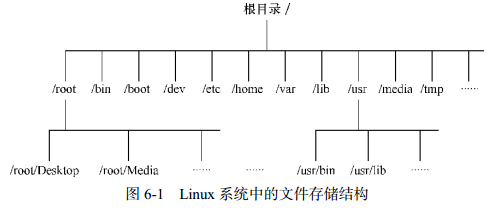
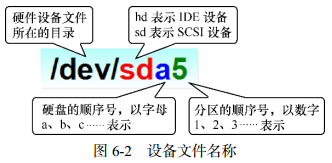
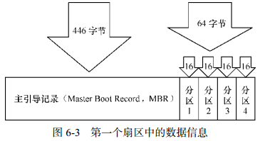
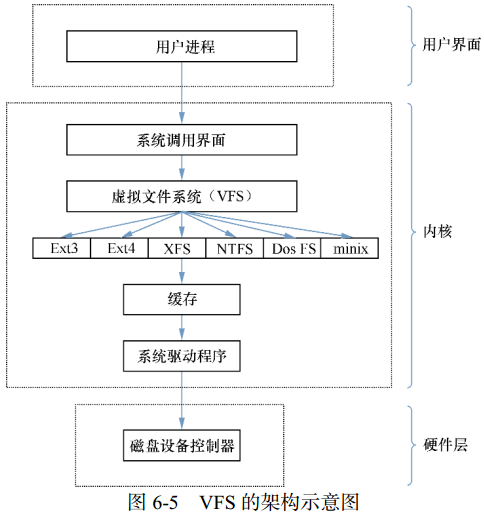

<div style="position: fixed; bottom: 20px; right: 39px; border-radius: 5px; background-color: #797979; z-index: 100;">
    <a href="#存储结构与磁盘划分" style="color: white; border-right: 1px solid white; text-decoration: none; font-size: 14px; font-weight: bold; display: inline-block; padding: 5px 8px; line-height: 20px;">back to top ▲</a>
    <a href="javascript:void(0)" style="color: white; border-right: 1px solid white; text-decoration: none; font-weight: bold; display: inline-block; padding: 5px 8px; line-height: 20px;" onclick="(function(){document.querySelector('.btn.pull-left.js-toolbar-action').click()})()"><i class="fa fa-align-justify"></i></a>
</div>

# 存储结构与磁盘划分

* [物理设备的命名规则](#物理设备的命名规则)
* [文件系统与数据资料](#文件系统与数据资料)
* [挂载硬件设备](#挂载硬件设备)
* [添加硬盘设备](#添加硬盘设备)
* [添加交换分区](#添加交换分区)
* [磁盘容量配额](#磁盘容量配额)


“Linux系统中一切都是文件”，在Linux系统中目录、字符设备、块设备、套接字、打印机等都被抽象成了文件。

Linux系统中不存在C/D/E/F等盘符，一切文件都是从“根（/）”目录开始，并按照文件系统层次化标准（FHS）采用树形结构来存放文件，以及定义了常见目录的用途。

Linux系统中的文件和目录名称严格区分大小写，root、rOOt、Root、rooT均代表不同目录，并且文件名称中不得包含斜杠（/）。



**文件系统层次化标准（FHS， Filesystem Hierarchy Standard）**
是根据无数Linux系统用户和开发者的经验而总结出来的，是用户在Linux系统中存储文件时需要遵守的规则，用于指导我们应该把文件保存到什么位置，以及告诉用户应该在何处找到所需的文件。

|目录名称|应防止文件的内容|
|:---|:---|
|/boot|开机所需文件—内核、开机菜单以及所需配置文件等|
|/dev (DEVices)|以文件形式存放任何设备与接口|
|/etc (Editable Text Configuration)|配置文件|
|/home|用户家目录|
|/bin (BINaries)|存放单用户模式下还可以操作的命令|
|/lib (LIBrary)|开机时用到的函数库，以及/bin 与/sbin 下面的命令要调用的函数|
|/sbin (Superuser BINaries)|开机过程中需要的命令|
|/media|用于挂载设备文件的目录|
|/opt (OPTional application software packages)|放置第三方的软件|
|/root|系统管理员的家目录|
|/srv|一些网络服务的数据文件目录|
|/tmp (TeMPorary)|任何人均可使用的“共享”临时目录|
|/proc (PROCesses)|虚拟文件系统，例如系统内核、进程、外部设备及网络状态等|
|/usr/local (Unix Shared Resources)|用户自行安装的软件|
|/usr/sbin|Linux系统开机时不会使用到的软件/命令/脚本|
|/usr/share|帮助与说明文件，也可放置共享文件|
|/var (VARiable)|主要存放经常变化的文件，如日志|
|/lost+found|当文件系统发生错误时，将一些丢失的文件片段存放在这里|

路径指如何定位到某个文件，分为绝对路径与相对路径。

绝对路径（absolute path）是从根目录（/）开始写起的文件或目录名称，相对路径（relative path）是相对于当前路径的写法。


# <p align="center" style="border-bottom: 3px solid #e7e7e7;">物理设备的命名规则</p>


Linux系统中一切都是文件，硬件设备也不例外。

系统内核中的udev (Userspace DEVices)设备管理器会自动把硬件名称规范起来，让用户可以通过设备文件的名字猜出设备大致的属性以及分区信息等。

udev设备管理器的服务会一直以守护进程的形式运行，并侦听内核发出的信号来管理/dev目录下的设备文件。

|硬件设备|文件名称|
|:---|:---|
|IDE设备|/dev/hd[a-d]|
|SCSI/SATA/U盘|/dev/sd[a-p]|
|软驱|/dev/fd[0-1]|
|打印机|dev/lp[0-15]|
|光驱|/dev/cdrom|
|鼠标|/dev/mouse|
|磁带机|/dev/st0或/dev/ht0|

一台主机上可以有多块硬盘，系统采用a～p来代表16块不同的硬盘（默认从a开始
分配），硬盘的分区编号也有讲究：
* 主分区或扩展分区编号从1开始，到4结束；
* 逻辑分区从编号5开始。

> /dev目录中sda设备之所以是a，并不是由插槽顺序决定的，而是由系统内核的识别顺序来决定的，恰巧很多主板的插槽顺序就是系统内核的识别顺序，因此才会被命名为/dev/sda。在使用iSCSI网络存储设备时会发现，明明主板上第二个插槽空着，系统却能识别到/dev/sdb这个设备就是这个道理。

> 分区的数字编码不一定是强制顺延下来的，也可能是手工指定的。sda3只能表示是编号为3的分区，不能判断sda设备上已经存在了3个分区。



/dev/目录中保存的应当是硬件设备文件；sd表示是存储设备；a表示系统中同类接口中第一个被识别到的设备；5表示这个设备是一个逻辑分区。

**“/dev/sda5”** 表示 **“这是系统中第一块被识别到的硬件设备中分区编号为5的逻辑分区的设备文件”**。

> 硬盘设备由大量扇区组成，每个扇区容量为512字节。其中第一个扇区最重要，它保存着主引导记录与分区表信息。第一个扇区中，主引导记录占用446字节，分区表为64字节，结束符占用2字节；分区表中每记录一个分区信息需要16字节，这样一来最多只有4个分区信息可以写到第一个扇区中，这4个分区就是4个主分区。




***主分区不能超过4个***

> 第一个扇区最多只能创建出4个分区？为了解决分区个数不够的问题，可以将第一个扇区的分区表中16字节（原本要写入主分区信息）的空间（称之为扩展分区）拿出来指向另外一个分区。也就是说，扩展分区其实并不是一个真正的分区，更像一个占用16字节分区表空间的指针——一个指向另外一个分区的指针。这样一来，用户可以选择使用3个主分区加1个扩展分区，然后在扩展分区中创建出数个逻辑分区，从而来满足多分区（大于4个）的需求。


# <p align="center" style="border-bottom: 3px solid #e7e7e7;">文件系统与数据资料</p>


用户在硬件存储设备中执行的文件建立、写入、读取、修改、转存与控制等操作都是依靠文件系统完成的。文件系统的作用是合理规划硬盘，以保证用户正常的使用需求。

Linux系统支持数十种的文件系统，而最常见的文件系统有：
* Ext3：能在系统异常宕机时避免文件系统资料丢失，能自动修复数据的不一致与错误。然而，当硬盘容量较大时，所需的修复时间也会很长，且不能百分之百地保证资料不会丢失。它把整个磁盘的每个写入动作的细节预先记录下来，在发生异常宕机后回溯追踪到被中断的部分尝试进行修复。
* Ext4：Ext3的改进版本，RHEL 6系统中默认的文件管理系统，支持高达 1EB（1EB=1,073,741,824GB）的存储容量，能够有无限多的子目录。Ext4文件系统能够批量分配block块，从而极大的提高读写效率。
* XFS：一种高性能的日志文件系统，RHEL 7系统中默认的文件管理系统，它的优势是在发生意外宕机后可以快速地恢复可能被破坏的文件，而且强大的日志功能只用花费极低的计算和存储性能。最大可支持18EB的存储容量，几乎满足了所有需求。

在拿到了一块新的硬盘存储设备后，需要先分区，然后再格式化文件系统，最后才能挂载并正常使用。硬盘的分区操作取决于需求和硬盘大小；也可以选择不进行分区，但必须对硬盘进行格式化处理。

日常在硬盘保存的数据很多，Linux系统中有一个名为super block的“硬盘地图”。Linux把每个文件的权限与属性记录在inode中，每个文件占用一个独立的inode表格，该表格的大小默认为128字节，里面记录着如下信息：
* 该文件的访问权限（read、write、execute）；
* 该文件的所有者与所属组（owner、group）；
* 该文件的大小（size）；
* 该文件的创建或内容修改时间（ctime）；
* 该文件的最后一次访问时间（atime）；
* 该文件的修改时间（mtime）；
* 文件的特殊权限（SUID、SGID、SBIT）；
* 该文件的真实数据地址（point）。

文件的实际内容保存在block块中（大小可以是1KB、2KB或4KB），一个inode默认大小仅为128B（Ext3），记录一个block消耗4B。当文件的inode被写满后，Linux系统会自动分配出一个block块，专门用于像inode那样记录其他block块的信息，这样把各个block块的内容串到一起，就能够让用户读到完整的文件内容了。

对于存储文件内容的block块，有下面两种常见情况（以4KB的block大小为例）：
* 文件很小（1KB），但依然会占用一个block，因此会潜在地浪费3KB；
* 文件很大（5KB），会占用两个block（5KB-4KB后剩下的1KB也要占用一个block）。

为了使用户在读取或写入文件时不用关心底层硬盘结构，Linux内核中的软件层为用户程序提供了一个VFS（Virtual File System，虚拟文件系统）接口，用户在操作文件时实际上是对VFS进行操作。

文件系统在VFS下隐藏了自己的特性和细节，这样用户在日常使用时会觉得“文件系统都是一样的”，也就可以随意使用各种命令在任何文件系统中进行各种操作了（比如使用cp命令来复制文件）。




# <p align="center" style="border-bottom: 3px solid #e7e7e7;">挂载硬件设备</p>


当用户需要使用硬盘设备或分区中的数据时，需要先将其与一个已存在的目录文件进行关联，这个关联动作就是“挂载”。

### mount命令
用于挂载文件系统：**mount 文件系统 挂载目录**

挂载是在使用硬件设备前所执行的最后一步操作。只需使用mount命令把硬盘设备或分区与一个目录文件进行关联，就能在这个目录中看到硬件设备中的数据了。

|参数|作用|
|:---|:---|
|-a|挂载所有在/etc/fstab中定义的文件系统|
|-t|指定文件系统类型|

对于比较新的Linux系统来讲，一般不需要使用-t参数来指定文件系统的类型，Linux系统会自动进行判断。mount的-a参数会在执行后自动检查/etc/fstab文件中有无疏漏被挂载的设备文件，如果有，则进行自动挂载操作。

```bash
把设备/dev/sdb2 挂载到/backup目录
[root@linuxprobe ~]# mount /dev/sdb2 /backup
```

按照上面的方法执行mount命令后就能立即使用文件系统了，但系统在重启后挂载会失效，也就是说我们需要每次开机后都手动挂载一下。

如果想让硬件设备和目录永久地进行自动关联，就必须把挂载信息按照格式“设备文件 挂载目录 格式类型 权限选项 是否备份 是否自检”写入到/etc/fstab文件中。这个文件中包含着挂载所需的诸多信息项目。

|字段|意义|
|:---|:---|
|设备文件|一般为设备的路径+设备名称 ，也可以写唯一识别码（UUID，Universally Unique Identifier）|
|挂载目录|指定要挂载到的目录，需在挂载前创建好|
|格式类型|指定文件系统的格式，比如Ext3、Ext4、XFS、SWAP、iso9660（此为光盘设备）等|
|权限选项|若设为defaults，则默认权限为：rw, suid, dev, exec, auto, nouser, async|
|是否备份|若为1则开机后使用dump进行磁盘备份，为0则不备份|
|是否自检|若为1则开机后自动进行磁盘自检，为0则不自检|

```bash
[root@linuxprobe ~]# vim /etc/fstab
# #
/etc/fstab
# Created by anaconda on Wed May 4 19:26:23 2017
# #
Accessible filesystems, by reference, are maintained under '/dev/disk'
# See man pages fstab(5), findfs(8), mount(8) and/or blkid(8) for more info
#
/dev/mapper/rhel-root / xfs defaults 1 1
UUID=812b1f7c-8b5b-43da-8c06-b9999e0fe48b /boot xfs defaults 1 2
/dev/mapper /rhel-swap swap swap defaults 0 0
/dev/cdrom /media/cdrom iso9660 defaults 0 0

将文件系统为ext4的硬件设备/dev/sdb2在开机后自动挂载到/backup目录上，并保持默认权限且无需开机自检
/dev/sdb2 /backup ext4 defaults 0 0
```

### umount命令 (UnMOUNT)
用于撤销已经挂载的设备文件：**umount [挂载点/设备文件]**

卸载意味着不再使用硬件的设备资源；卸载操作只要说明想要取消关联的设备文件或挂载目录的一项即可，一般不需要加其他额外的参数。

```bash
手动卸载掉/dev/sdb2设备文件
[root@linuxprobe ~]# umount /dev/sdb2
```


# <p align="center" style="border-bottom: 3px solid #e7e7e7;">添加硬盘设备</p>


### fdisk命令
用于管理磁盘分区：**fdisk [磁盘名称]**

这条命令的参是交互式的。

|参数|作用|
|:---|:---|
|m|查看全部可用的参数|
|n|添加新的分区|
|d|删除某个分区信息|
|l|列出所有可用的分区类型|
|t|改变某个分区的类型|
|p|查看分区信息|
|w|保存并退出|
|q|不保存直接退出|

```bash
使用fdisk命令来管理/dev/sdb硬盘设备
[root@linuxprobe ~]# fdisk /dev/sdb
Welcome to fdisk (util-linux 2.23.2).
Changes will remain in memory only, until you decide to write them.
Be careful before using the write command.
Device does not contain a recognized partition table
Building a new DOS disklabel with disk identifier 0x47d24a34.

输入参数p来查看硬盘设备内已有的分区信息，
其中包括了硬盘的容量大小、扇区个数等信息
Command (m for help): p
Disk /dev/sdb: 21.5 GB, 21474836480 bytes, 41943040 sectors
Units = sectors of 1 * 512 = 512 bytes
Sector size (logical/physical): 512 bytes / 512 bytes
I/O size (minimum/optimal): 512 bytes / 512 bytes
Disk label type: dos
Disk identifier: 0x47d24a34
Device Boot Start End Blocks Id System

输入参数n尝试添加新的分区
Command (m for help): n
Partition type:
p primary (0 primary, 0 extended, 4 free)
e extended

输入参数p创建主分区，
输入参数e创建扩展分区
Select (default p): p

输入主分区的编号。
主分区的编号范围是1～4
Partition number (1-4, default 1): 1

系统提示定义起始的扇区位置，
按回车保留默认设置即可，
系统会自动计算出最靠前的空闲扇区的位置
First sector (2048-41943039, default 2048):此处敲击回车
Using default value 2048

系统要求定义分区的结束扇区位置，即定义整个分区的大小是多少。
不用去计算扇区的个数，只需要输入+2G即可创建出一个容量为2GB的硬盘分区
Last sector, +sectors or +size{K,M,G} (2048-41943039, default 41943039): +2G
Partition 1 of type Linux and of size 2 GiB is set

使用参数p查看硬盘设备中的分区信息
Command (m for help): p
Disk /dev/sdb: 21.5 GB, 21474836480 bytes, 41943040 sectors
Units = sectors of 1 * 512 = 512 bytes
Sector size (logical/physical): 512 bytes / 512 bytes
I/O size (minimum/optimal): 512 bytes / 512 bytes
Disk label type: dos
Disk identifier: 0x47d24a34
Device Boot Start End Blocks Id System

看到一个名称为/dev/sdb1、
起始扇区位置为2048、结束扇区位置为4196351的主分区
/dev/sdb1 2048 4196351 2097152 83 Linux

敲击参数w后回车，这样分区信息才是真正的写入成功
Command (m for help): w
The partition table has been altered!
Calling ioctl() to re-read partition table.
Syncing disks.

Linux系统会自动把这个硬盘主分区抽象成/dev/sdb1设备文件。
我们可以用file命令查看该文件的属性，
有时候系统并没有自动把分区信息同步给Linux内核，
我们可以输入partprobe命令手动将分区信息同步到内核，
一般推荐连续两次执行该命令，效果会更好。
如果使用这个命令都无法解决问题，就重启计算机。
[root@linuxprobe ]# file /dev/sdb1
/dev/sdb1: cannot open (No such file or directory)
[root@linuxprobe ]# partprobe
[root@linuxprobe ]# partprobe
[root@linuxprobe ]# file /dev/sdb1
/dev/sdb1: block special
```

### mkfs命令 (MaKe FileSystem)
用于格式化操作：**mkfs.文件类型名称 存储设备分区**

如果硬件存储设备没有进行格式化，则Linux无法得知怎么在其上写入数据。因此，在对存储设备进行分区后还需要进行格式化操作。

在Shell终端中输入mkfs后再敲击两下Tab键，会有如下效果：
```bash
[root@linuxprobe ~]# mkfs
mkfs mkfs.cramfs mkfs.ext3 mkfs.fat mkfs.msdos mkfs.xfs
mkfs.btrfs mkfs.ext2 mkfs.ext4 mkfs.minix mkfs.vfat
```

```bash
格式化为XFS文件系统
[root@linuxprobe ~]# mkfs.xfs /dev/sdb1
meta-data=/dev/sdb1 isize=256 agcount=4, agsize=131072 blks
= sectsz=512 attr=2, projid32bit=1
= crc=0
data = bsize=4096 blocks=524288, imaxpct=25
= sunit=0 swidth=0 blks
naming =version 2 bsize=4096 ascii-ci=0 ftype=0
log =internal log bsize=4096 blocks=2560, version=2
= sectsz=512 sunit=0 blks, lazy-count=1
realtime =none extsz=4096 blocks=0, rtextents=0
```

完成存储设备的分区和格式化操作，就可以挂载并使用存储设备了：
1. 首先创建一个用于挂载设备的挂载点目录；
2. 然后用mount命令将存储设备与挂载点进行关联；
3. 最后用df -h命令查看挂载状态和硬盘使用量信息。

```bash
[root@linuxprobe ~]# mkdir /newFS
[root@linuxprobe ~]# mount /dev/sdb1 /newFS/
[root@linuxprobe ~]# df -h
Filesystem              Size    Used    Avail   Use%    Mounted on
/dev/mapper/rhel-root   18G     3.5G    15G     20%     /
devtmpfs                905M    0       905M    0%      /dev
tmpfs                   914M    140K    914M    1%      /dev/shm
tmpfs                   914M    8.8M    905M    1%      /run
tmpfs                   914M    0       914M    0%      /sys/fs/cgroup
/dev/sr0                3.5G    3.5G    0       100%    /media/cdrom
/dev/sda1               497M    119M    379M    24%     /boot
/dev/sdb1               2.0G    33M     2.0G    2%      /newFS
```

### du命令 (Disk Usage)
用于查看一个或多个文件占用了多大的硬盘空间：**du [选项] [文件]**

可以使用du -sh /*命令查看Linux系统根目录下所有一级目录分别占用的空间大小。


# <p align="center" style="border-bottom: 3px solid #e7e7e7;">添加交换分区</p>


> SWAP（交换）分区是一种通过在硬盘中预先划分一定的空间，然后将把内存中暂时不常用的数据临时存放到硬盘中，以便腾出物理内存空间让更活跃的程序服务来使用的技术，其设计目的是为了解决真实物理内存不足的问题。只有当真实的物理内存耗尽后才会调用交换分区的资源。

交换分区划分建议：在生产环境中，交换分区的大小一般为真实物理内存的1.5～2 倍。

```bash
[root@linuxprobe ~]# fdisk /dev/sdb
Welcome to fdisk (util-linux 2.23.2).
Changes will remain in memory only, until you decide to write them.
Be careful before using the write command.
Device does not contain a recognized partition table
Building a new DOS disklabel with disk identifier 0xb3d27ce1.
Command (m for help): n
Partition type:
p primary (1 primary, 0 extended, 3 free)
e extendedSelect (default p): p
Partition number (2-4, default 2):
First sector (4196352-41943039, default 4196352):
Using default value 4196352

取出一个大小为5GB的主分区作为交换分区资源
Last sector, +sectors or +size{K,M,G} (4196352-41943039, default 41943039): +5G
Partition 2 of type Linux and of size 5 GiB is set
Command (m for help): p
Disk /dev/sdb: 21.5 GB, 21474836480 bytes, 41943040 sectors
Units = sectors of 1 * 512 = 512 bytes
Sector size (logical/physical): 512 bytes / 512 bytes
I/O size (minimum/optimal): 512 bytes / 512 bytes
Disk label type: dos
Disk identifier: 0xb0ced57f
Device Boot Start End Blocks Id System
/dev/sdb1 2048 4196351 2097152 83 Linux
/dev/sdb2 4196352 14682111 5242880 83 Linux
Command (m for help): w
The partition table has been altered!
Calling ioctl() to re-read partition table.
WARNING: Re-reading the partition table failed with error 16: Device or resource busy.
The kernel still uses the old table. The new table will be used at
the next reboot or after you run partprobe(8) or kpartx(8)
Syncing disks.

使用SWAP分区专用的格式化命令mkswap，
对新建的主分区进行格式化操作
[root@linuxprobe ~]# mkswap /dev/sdb2
Setting up swapspace version 1, size = 5242876 KiB
no label, UUID=2972f9cb-17f0-4113-84c6-c64b97c40c75

使用free -m命令查看交换分区大小
[root@linuxprobe ~]# free -m
                    total   used    free    shared  buffers cached
Mem:                1483    782     701     9       0       254
-/+ buffers/cache:  526     957
Swap:               2047    0       2047

使用swapon命令把准备好的SWAP分区设备正式挂载到系统中
[root@linuxprobe ~]# swapon /dev/sdb2

使用free -m命令查看交换分区大小变化（由2047MB增加到7167MB）
[root@linuxprobe ~]# free -m
                    total   used    free    shared  buffers cached
Mem:                1483    785     697     9       0       254
-/+ buffers/cache:  530     953
Swap:               7167    0       7167

为了使新的交换分区设备在重启后依然生效，
需要按照下面格式将相关信息写入到配置文件中
[root@linuxprobe ~]# vim /etc/fstab
# #
/etc/fstab
# Created by anaconda on Wed May 4 19:26:23 2017
# #
Accessible filesystems, by reference, are maintained under '/dev/disk'
# See man pages fstab(5), findfs(8), mount(8) and/or blkid(8) for more info
#
/dev/mapper/rhel-root   /       xfs     defaults 1 1
………………省略………………
/dev/sdb2               swap    swap    defaults 0 0
```

# <p align="center" style="border-bottom: 3px solid #e7e7e7;">磁盘容量配额</p>
