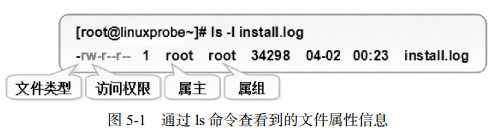

# 用户身份与文件权限

* [用户身份与能力](#用户身份与能力)
* [文件权限与归属](#文件权限与归属)
* [文件的特殊权限](#文件的特殊权限)
* [文件的隐藏属性](#文件的隐藏属性)
* [文件访问控制列表](#文件访问控制列表)
* [su命令与sudo服务](#su命令与sudo服务)


# <p align="center">用户身份与能力</p>
###### [<p align="right">back to top ▲</p>](#用户身份与文件权限)

> 设计Linux系统的初衷之一就是为了满足多个用户同时工作的需求。在安装Linux操作系统时特别要求设置root管理员密码，root管理员就是存在于所有类UNIX系统中的超级用户。它拥有最高的系统所有权，能够管理系统的各项功能，如添加/删除用户、启动/关闭服务进程、开启/禁用硬件设备等。以root管理员的身份工作时不会受到系统的限制。

Linux系统的管理员之所以是root，并不是因为它的名字叫root，而是因为该用户的身份号码即UID（User IDentification）的数值为0。在Linux系统中，UID就相当于我们的身份证号码一样具有唯一性，因此可通过用户的UID值来判断用户身份。在RHEL 7系统中，用户身份有下面这些：
* 管理员，UID为0：系统的管理员用户；
* 系统用户，UID为1～999：Linux为避免因某个服务程序出现漏洞而被黑客提权至整台服务器，默认服务程序会有独立的系统用户负责运行，进而有效控制被破坏范围；
* 普通用户，UID从1000始：由管理员创建的用于日常工作的用户。

**UID不能冲突，且管理员创建的普通用户的UID默认从1000开始（即使前面有闲置的号码）。**

为方便管理属于同一组的用户，Linux中还引入了用户组的概念。通过使用用户组号码（GID，Group IDentification），我们可以把多个用户加入到同一个组中，从而方便为组中的用户统一规划权限或指定任务。

在Linux中创建每个用户时，将自动创建一个与其同名的基本用户组，而且这个基本用户组只有该用户一个人。如果该用户以后被归纳入其他用户组，则这个其他用户组称之为扩展用户组。一个用户只有一个基本用户组，但是可以有多个扩展用户组。

### useradd命令
useradd用于创建新的用户：**useradd [选项] 用户名**

|参数|作用|
|:---|:---|
|-d|指定用户的家目录（默认为/home/username）|
|-e|账户的到期时间，格式为YYYY-MM-DD.|
|-u|指定该用户的默认UID|
|-g|指定一个初始的用户基本组（必须已存在）|
|-G|指定一个或多个扩展用户组|
|-N|不创建与用户同名的基本用户组|
|-s|指定该用户的默认Shell解释器|

使用该命令创建用户账户时，默认的用户家目录会被存放在/home目录中，默认的Shell解释器为/bin/bash，而且默认会创建一个与该用户同名的基本用户组。

### groupadd命令
groupadd用于创建用户组：**groupadd [选项] 群组名**

### usermod命令
usermod用于修改用户属性：**usermod [选项] 用户名**

|参数|作用|
|:---|:---|
|-c|填写用户账户的备注信息|
|-d -m|-m与-d连用，可重新指定用户的家目录并自动把旧的数据转移过去|
|-e|账户的到期时间，格式为YYYY-MM-DD|
|-g|变更所属用户组|
|-G|变更扩展用户组|
|-L|锁定用户禁止其登录系统|
|-U|解锁用户，允许其登录系统|
|-s|变更默认终端|
|-u|修改用户的UID|

Linux系统中的一切都是文件，因此在系统中创建用户也就是修改配置文件的过程。用户的信息保存在/etc/passwd文件中，可以直接用文本编辑器来修改其中的用户参数项目，也可以用usermod命令修改已经创建的用户信息。

### passwd命令 (PASSWorD)
passwd用于修改用户密码、过期时间、认证信息等：**passwd [选项] [用户名]**

|参数|作用|
|:---|:---|
|-l|锁定用户，禁止其登录|
|-u|解除锁定，允许用户登录|
|--stdin|允许通过标准输入修改用户密码，如echo "NewPassWord" \| passwd --stdin Username|
|-d|使该用户可用空密码登录系统|
|-e|强制用户在下次登录时修改密码|
|-S|显示用户的密码是否被锁定，以及密码所采用的加密算法名称|

普通用户只能使用passwd命令修改自身的系统密码，而root管理员则有权限修改其他所有人的密码。

### userdel命令
userdel用于删除用户：**userdel [选项] 用户名**

|参数|作用|
|:---|:---|
|-f|强制删除用户|
|-r|同时删除用户及用户家目录|

如果某位用户后续不再会登录到系统中，则可以通过userdel命令删除该用户的所有信息。在执行删除操作时，该用户的家目录默认会保留下来，此时可以使用-r参数将其删除。

# <p align="center">文件权限与归属</p>
###### [<p align="right">back to top ▲</p>](#用户身份与文件权限)

Linux系统中一切都是文件，Linux系统使用不同的字符来区分不同的文件类型：
* -：普通文件
* d：目录文件
* l：链接文件
* b：块设备文件
* c：字符设备文件
* p：管道文

每个文件都有所属的所有者和所有组，并且规定了文件的所有者、所有组以及其他人对文件所拥有的可读（r）、可写（w）、可执行（x）等权限。

**对于一般文件**：“可读”表示能够读取文件的实际内容；“可写”表示能够编辑、新增、修改、删除文件的实际内容；“可执行”则表示能够运行一个脚本程序；

**对于目录文件**：“可读”表示能够读取目录内的文件列表；“可写”表示能够在目录内新增、删除、重命名文件；而“可执行”则表示能够进入该目录。

文件的读、写、执行权限可以简写为rwx，亦可分别用数字4、2、1来表示，文件所有者，所属组及其他用户权限之间无关联。

<table>
    <tr>
        <th colspan="1" style="background-color: gray;">权限分配</th>
        <th colspan="3" style="background-color: gray;">文件所有者</th>
        <th colspan="3" style="background-color: gray;">文件所属组</th>
        <th colspan="3" style="background-color: gray;">其他用户</th>
    </tr>
    <tr>
    	<td>权限项</td>
    	<td>读</td>
    	<td>写</td>
    	<td>执行</td>
    	<td>读</td>
    	<td>写</td>
    	<td>执行</td>
    	<td>读</td>
    	<td>写</td>
    	<td>执行</td>
    </tr>
    <tr>
    	<td>字符表示</td>
    	<td>r</td>
    	<td>w</td>
    	<td>x</td>
    	<td>r</td>
    	<td>w</td>
    	<td>x</td>
    	<td>r</td>
    	<td>w</td>
    	<td>x</td>
    </tr>
    <tr>
    	<td>数字表示</td>
    	<td>4</td>
    	<td>2</td>
    	<td>1</td>
    	<td>4</td>
    	<td>2</td>
    	<td>1</td>
    	<td>4</td>
    	<td>2</td>
    	<td>1</td>
    </tr>
</table>

文件权限的数字法表示基于字符表示（rwx）的权限计算而来，其目的是简化权限的表示。例如，若某个文件的权限为7则代表可读、可写、可执行（4+2+1）；若权限为6则代表可读、可写（4+2）。

如果一个文件，其所有者拥有可读、可写、可执行的权限，其文件所属组拥有可读、可写的权限；而且其他人只有可读的权限。那么，这个文件的权限就是rwxrw-r--，数字法表示即为764。



上图包含了文件的类型、访问权限、所有者（属主）、所属组（属组）、占用的磁盘大小、修改时间和文件名称等信息。

该文件的类型为普通文件，所有者权限为可读、可写（rw-），所属组权限为可读（r--），除此以外的其他人也只有可读权限（r--），文件的磁盘占用大小是34298字节，最近一次的修改时间为4月2日的凌晨23分，文件的名称为install.log。


# <p align="center">文件的特殊权限</p>
###### [<p align="right">back to top ▲</p>](#用户身份与文件权限)

SUID、SGID与SBIT是对文件权限进行设置的特殊权限位，可以与一般权限同时使用，以弥补一般权限不能实现的功能。

### SUID
对二进制程序进行设置，可以让二进制程序的执行者临时拥有属主的权限（仅对拥有执行权限的二进制程序有效）。

例如，所有用户都可以执行passwd命令来修改自己的用户密码，而用户密码保存在/etc/shadow文件中。这个文件的默认权限是000，也就是说除了root管理员以外，所有用户都没有查看或编辑该文件的权限。但是，在使用passwd命令时如果加上SUID特殊权限位，就可让普通用户临时获得程序所有者的身份，把变更的密码信息写入到shadow文件中。

这很像古代的手持尚方宝剑的钦差大臣，他手持的尚方宝剑代表的是皇上的权威，因此可以惩戒贪官，但这并不意味着他永久成为了皇上。这只是一种有条件的、临时的特殊权限授权方法。

```bash
[root@linuxprobe ~]# ls -l /etc/shadow
----------. 1 root root 1004 Jan 3 06:23 /etc/shadow
[root@linuxprobe ~]# ls -l /bin/passwd
-rwsr-xr-x. 1 root root 27832 Jan 29 2017 /bin/passwd
```

查看passwd命令属性时发现所有者的权限由rwx变成了rws，其中x改变成s就意味着该文件被赋予了 SUID 权限。

如果原本的权限是rw-，没有x执行权限，那么被赋予特殊权限后将变成大写的S。


### SGID
SGID主要实现如下两种功能：
* 让执行者临时拥有属组的权限（对拥有执行权限的二进制程序进行设置）；
* 在某个目录中创建的文件自动继承该目录的用户组（只可以对目录进行设置）。

早期的Linux系统中，/dev/kmem是一个字符设备文件，用于存储内核程序要访问的数据，权限为：
```bash
cr--r----- 1 root system 2, 1 Feb 11 2017 kmem
```
除了root管理员或属于system组成员外，所有用户都没有读取该文件的权限。

平时我们在查看系统的进程状态时，为了能够获取到进程的状态信息，可在用于查看系统进程状态的ps命令文件上增加SGID特殊权限位。查看ps命令文件的属性信息：
```bash
-r-xr-sr-x 1 bin system 59346 Feb 11 2017 ps
```
由于ps命令被增加了SGID特殊权限位，所以当用户执行该命令时，也就临时获取到了system用户组的权限，从而可以顺利地读取设备文件了。

每个文件都有其归属的所有者和所属组，当创建或传送一个文件后，这个文件就会自动归属于执行这个操作的用户（即该用户是文件的所有者）。

如果现在需要在一个部门内设置共享目录，让部门内的所有人员都能够读取目录中的内容，那么就可以创建部门共享目录后，在该目录上设置SGID特殊权限位。这样，部门内的任何人员在里面创建的任何文件都会归属于该目录的所属组，而不再是自己的基本用户组。此时用到的是SGID的第二个功能，即在某个目录中创建的文件自动继承该目录的用户组（只可以对目录进行设置）。

```bash
[root@linuxprobe ~]# cd /tmp
[root@linuxprobe tmp]# mkdir testdir
[root@linuxprobe tmp]# ls -ald testdir/
drwxr-xr-x. 2 root root 6 Feb 11 11:50 testdir/
[root@linuxprobe tmp]# chmod -Rf 777 testdir/
[root@linuxprobe tmp]# chmod -Rf g+s testdir/
[root@linuxprobe tmp]# ls -ald testdir/
drwxrwsrwx. 2 root root 6 Feb 11 11:50 testdir/

// 上述命令设置好目录的777权限（确保普通用户可以向其中写入文件），并为该目录设置了SGID特殊权限位

[root@linuxprobe tmp]# su - linuxprobe
Last login: Wed Feb 11 11:49:16 CST 2017 on pts/0
[linuxprobe@linuxprobe ~]$ cd /tmp/testdir/
[linuxprobe@linuxprobe testdir]$ echo "linuxprobe.com" > test
[linuxprobe@linuxprobe testdir]$ ls -al test
-rw-rw-r--. 1 linuxprobe root 15 Feb 11 11:50 test
```

#### chmod命令 (CHange MODe)
用来设置文件或目录的权限：**chmod [参数] 权限 文件或目录名称**

如果要把一个文件的权限设置成其所有者可读可写可执行、所属组可读可写、其他人没有任何权限，则相应的字符法表示为rwxrw----，其对应的数字法表示为760。
```bash
[root@linuxprobe ~]# ls -al test
-rw-rw-r--. 1 linuxprobe root 15 Feb 11 11:50 test
[root@linuxprobe ~]# chmod 760 test
[root@linuxprobe ~]# ls -l test
-rwxrw----. 1 linuxprobe root 15 Feb 11 11:50 test
```

#### chown命令 (CHange OWNer)
用来设置文件或目录的所有者和所属组：**chown [参数] 所有者:所属组 文件或目录名称**
```bash
[root@linuxprobe ~]# ls -l test
-rwxrw----. 1 linuxprobe root 15 Feb 11 11:50 test
[root@linuxprobe ~]# chown root:bin test
[root@linuxprobe ~]# ls -l test
-rwxrw----. 1 root bin 15 Feb 11 11:50 test
```

chmod和chown命令是用于修改文件属性和权限的最常用命令，***它们在针对目录进行操作时需要加上大写参数-R来表示递归操作***，即对目录内所有的文件进行整体操作。


### SBIT
大学里的很多老师都要求学生将作业上传到服务器的特定共享目录中，为防止“破坏分子”删除其他同学的作业，要设置SBIT（Sticky Bit）特殊权限位（也可以称之为特殊权限位之保护位）。SBIT特殊权限位可确保用户只能删除自己的文件，而不能删除其他用户的文件。换句话说，当对某个目录设置了SBIT粘滞位权限后，那么该目录中的文件就只能被其所有者执行删除操作了。

当目录被设置SBIT特殊权限位后，文件的其他人权限部分的x执行权限就会被替换成t或者T。原本有x执行权限则会写成t，原本没有x执行权限则会被写成T。

```bash
[root@linuxprobe tmp]# su - linuxprobe
Last login: Wed Feb 11 12:41:20 CST 2017 on pts/0
[linuxprobe@linuxprobe tmp]$ ls -ald /tmp
drwxrwxrwt. 17 root root 4096 Feb 11 13:03 /tmp
[linuxprobe@linuxprobe ~]$ cd /tmp
[linuxprobe@linuxprobe tmp]$ echo "Welcome to linuxprobe.com" > test
[linuxprobe@linuxprobe tmp]$ chmod 777 test
[linuxprobe@linuxprobe tmp]$ ls -al test
-rwxrwxrwx. 1 linuxprobe linuxprobe 10 Feb 11 12:59 test

[root@linuxprobe tmp]# su - blackshield
Last login: Wed Feb 11 12:41:29 CST 2017 on pts/1
[blackshield@linuxprobe ~]$ cd /tmp
[blackshield@linuxprobe tmp]$ rm -f test
rm: cannot remove ‘test’: Operation not permitted
```

***其实，文件能否被删除并不取决于自身的权限，而是看其所在目录是否有写入权限。***

对目录设置SBIT特殊权限位，用chmod命令就可以了。对应的参数o+t代表设置SBIT保护位权限：
```bash
[root@linuxprobe tmp]# cd ~
[root@linuxprobe ~]# mkdir linux
[root@linuxprobe ~]# chmod -R o+t linux/
[root@linuxprobe ~]# ls -ld linux/
drwxr-xr-t. 2 root root 6 Feb 11 19:34 linux/
```


# <p align="center">文件的隐藏属性</p>
###### [<p align="right">back to top ▲</p>](#用户身份与文件权限)

Linux系统中的文件除了具备一般权限和特殊权限之外，还有一种隐藏权限，即被隐藏起来的权限，默认情况下不能直接被用户发觉。

明明权限充足但却无法删除某个文件，或仅能在日志文件中追加内容而不能修改或删除内容，这在一定程度上阻止了黑客篡改系统日志的图谋，因此这种隐藏权限也保障了Linux系统的安全性。

### chattr命令 (CHange ATTRibute)
用于设置文件的隐藏权限：**chattr [+/-参数] 文件**

* 要把某个隐藏功能添加到文件上，**chattr +参数 文件**；
* 要把某个隐藏功能移出文件，**chattr -参数 文件**。

|参数|作用|
|:---|:---|
|i|无法对文件进行修改；若对目录设置了该参数，则仅能修改其中的子文件内容而不能新建或删除文件|
|a|仅允许补充（追加）内容，无法覆盖/删除内容（Append Only）|
|S|文件内容在变更后立即同步到硬盘（sync）|
|s|彻底从硬盘中删除，不可恢复（用0填充原文件所在硬盘区域）|
|A|不再修改这个文件或目录的最后访问时间（atime）|
|b|不再修改文件或目录的存取时间|
|D|检查压缩文件中的错误|
|d|使用dump命令备份时忽略本文件/目录|
|c|默认将文件或目录进行压缩|
|u|当删除该文件后依然保留其在硬盘中的数据，方便日后恢复|
|t|让文件系统支持尾部合并（tail-merging）|
|X|可以直接访问压缩文件中的内容|

```bash
[root@linuxprobe ~]# echo "for Test" > linuxprobe
[root@linuxprobe ~]# rm linuxprobe
rm: remove regular file ‘linuxprobe’? y

[root@linuxprobe ~]# echo "for Test" > linuxprobe
[root@linuxprobe ~]# chattr +a linuxprobe
[root@linuxprobe ~]# rm linuxprobe
rm: remove regular file ‘linuxprobe’? y
rm: cannot remove ‘linuxprobe’: Operation not permitted
```

### lsattr命令 (LiSt ATTRibute)
用于显示文件的隐藏权限：**lsattr [参数] 文件**

***文件的隐藏权限必须使用lsattr命令来查看，使用ls命令则看不出来。***

```bash
[root@linuxprobe ~]# ls -al linuxprobe
-rw-r--r--. 1 root root 9 Feb 12 11:42 linuxprobe

[root@linuxprobe ~]# lsattr linuxprobe
-----a---------- linuxprobe
[root@linuxprobe ~]# chattr -a linuxprobe
[root@linuxprobe ~]# lsattr linuxprobe
---------------- linuxprobe
[root@linuxprobe ~]# rm linuxprobe
rm: remove regular file ‘linuxprobe’? y
```


# <p align="center">文件访问控制列表</p>
###### [<p align="right">back to top ▲</p>](#用户身份与文件权限)

> 一般权限、特殊权限、隐藏权限有一个共性：权限是针对某一类用户设置的。如果希望对某个指定的用户进行单独的权限控制，就需要用到文件的访问控制列表（ACL）了。通俗来讲，基于普通文件或目录设置ACL其实就是针对指定的用户或用户组设置文件或目录的操作权限。如果针对某个目录设置了ACL，则目录中的文件会继承其ACL；若针对文件设置了ACL，则文件不再继承其所在目录的ACL。

切换普通用户，然后尝试进入root管理员的家目录中。在没有针对普通用户对root管理员的家目录设置ACL之前，其执行结果如下所示：
```bash
[root@linuxprobe ~]# su - linuxprobe
Last login: Sat Mar 21 16:31:19 CST 2017 on pts/0
[linuxprobe@linuxprobe ~]$ cd /root
-bash: cd: /root: Permission denied
[linuxprobe@linuxprobe root]$ exit
```

### setfacl命令 (SET File ACL)
用于管理文件的ACL规则：**setfacl [参数] 文件名称**

文件的ACL提供在所有者、所属组、其他人的读/写/执行权限之外的特殊权限控制，使用setfacl命令可以针对单一用户或用户组、单一文件或目录来进行读/写/执行权限的控制。

针对目录文件要使用-R递归参数；针对普通文件使用-m参数；要删除某个文件的ACL，可以使用-b参数。

下面来设置用户在/root目录上的权限：
```bash
[root@linuxprobe ~]# setfacl -Rm u:linuxprobe:rwx /root
[root@linuxprobe ~]# su - linuxprobe
Last login: Sat Mar 21 15:45:03 CST 2017 on pts/1
[linuxprobe@linuxprobe ~]$ cd /root
[linuxprobe@linuxprobe root]$ ls
anaconda-ks.cfg Downloads Pictures Public
[linuxprobe@linuxprobe root]$ cat anaconda-ks.cfg
[linuxprobe@linuxprobe root]$ exit
```

用ls命令看不到ACL表信息，但是却可以看到文件的权限最后一个点（.）变
成了加号（+）,这就意味着该文件已经设置了ACL了。

### getfacl命令 (GET File ACL)
用于显示文件上设置的ACL信息：**getfacl 文件名称**

下面用getfacl命令显示在root管理员家目录上设置的所有ACL信息：
```bash
[root@linuxprobe ~]# getfacl /root
getfacl: Removing leading '/' from absolute path names
# file: root
# owner: root
# group: root
user::r-x
user:linuxprobe:rwx
group::r-x
mask::rwx
other::---
```

# <p align="center">su命令与sudo服务</p>
###### [<p align="right">back to top ▲</p>](#用户身份与文件权限)

在生产环境中还是要对安全多一份敬畏之心，不要用root管理员去做所有事情。因为一旦执行了错误的命令，可能会直接导致系统崩溃。

Linux系统为了安全性考虑，使得许多系统命令和服务只能被root管理员来使用，但这也让普通用户受到了更多的权限束缚，从而导致无法顺利完成特定的工作任务。


### su命令 (Swith User)
使当前用户在不退出登录的情况下切换到其他用户：
```bash
[root@linuxprobe ~]# id
uid=0(root) gid=0(root) groups=0(root)
[root@linuxprobe ~]# su - linuxprobe
Last login: Wed Jan 4 01:17:25 EST 2017 on pts/0
[linuxprobe@linuxprobe ~]$ id
uid=1000(linuxprobe) gid=1000(linuxprobe) groups=1000(linuxprobe) context=unconfined_
u:unconfined_r:unconfined_t:s0-s0:c0.c1023
```

su命令与用户名之间有一个减号（-），这意味着完全切换到新的用户，即把环境变量信息也变更为新用户的相应信息，而不是保留原始的信息。强烈建议在切换用户身份时添加这个减号（-）。

从root管理员切换到普通用户时不需要密码验证，从普通用户切换成root管理员需要密码验证。

### sudo命令 (SuperUser DO)
用于给普通用户提供额外的权限来完成原本root管理员才能完成的任务：**sudo [参数] 命令名称**
|参数|作用|
|:---|:---|
|-h|列出帮助信息|
|-l|列出当前用户可执行的命令|
|-u|用户名或UID值 以指定的用户身份执行命令|
|-k|清空密码的有效时间，下次执行sudo时需要再次进行密码验证|
|-b|在后台执行指定的命令|
|-p|更改询问密码的提示语|

sudo命令具有如下功能：
* 限制用户执行指定的命令：
* 记录用户执行的每一条命令；
* 配置文件（/etc/sudoers）提供集中的用户管理、权限与主机等参数；
* 验证密码的后5分钟内（默认值）无须再让用户再次验证密码。

可以使用sudo命令提供的visudo命令来配置用户权限。这条命令在配置用户权限时将禁止多个用户同时修改sudoers配置文件，还可以对配置文件内的参数进行语法检查，并在发现参数错误时进行报错。

***只有root管理员才能使用visudo命令编辑sudo服务的配置文件***

```bash
[root@linuxprobe ~]# visudo
96 ##
97 ## Allow root to run any commands anywhere
98 root ALL=(ALL) ALL
99 linuxprobe ALL=(ALL) ALL
```
**谁可以使用 允许使用的主机=(以谁的身份) 可执行命令的列表**

```
[root@linuxprobe ~]# su - linuxprobe
Last login: Thu Sep 3 15:12:57 CST 2017 on pts/1
[linuxprobe@linuxprobe ~]$ sudo -l
[sudo] password for linuxprobe: 输入linuxprobe用户的密码
Matching Defaults entries for linuxprobe on this host:
requiretty, !visiblepw, always_set_home, env_reset, env_keep="COLORS
DISPLAY HOSTNAME HISTSIZE INPUTRC KDEDIR LS_COLORS", 
env_keep+="MAIL PS1 PS2 QTDIR USERNAME LANG LC_ADDRESS LC_CTYPE", 
env_keep+="LC_COLLATE LC_IDENTIFICATION LC_MEASUREMENT LC_MESSAGES", 
env_keep+="LC_MONETARY LC_NAME LC_NUMERIC LC_PAPER LC_TELEPHONE", 
env_keep+="LC_TIME LC_ALL LANGUAGE LINGUAS _XKB_CHARSET XAUTHORITY",
secure_path=/sbin\:/bin\:/usr/sbin\:/usr/bin
User linuxprobe may run the following commands on this host:
(ALL) ALL
```

作为一名普通用户，是看不到root管理员的家目录（/root）中的文件信息的，但是，只需要在想执行的命令前面加上sudo命令就可以了：
```bash
[linuxprobe@linuxprobe ~]$ ls /root
ls: cannot open directory /root: Permission denied
[linuxprobe@linuxprobe ~]$ sudo ls /root
anaconda-ks.cfg Documents initial-setup-ks.cfg Pictures Templates
Desktop Downloads Music Public Videos
```

要让某个用户只能使用root管理员的身份执行指定的命令，一定要给出该命令的绝对路径，否则系统会识别不出来：
```bash
[linuxprobe@linuxprobe ~]$ exit
logout
[root@linuxprobe ~]# whereis cat
cat: /usr/bin/cat /usr/share/man/man1/cat.1.gz /usr/share/man/man1p/cat.1p.gz
[root@linuxprobe ~]# visudo
96 ##
97 ## Allow root to run any commands anywhere
98 root ALL=(ALL) ALL
99 linuxprobe ALL=(ALL) /usr/bin/cat
```

保存，退出，切换到指定普通用户，尝试正常查看某个文件的内容，系统提示没有权限。再用sudo命令就可以顺利地查看文件内容了：
```bash
[root@linuxprobe ~]# su - linuxprobe
Last login: Thu Sep 3 15:51:01 CST 2017 on pts/1
[linuxprobe@linuxprobe ~]$ cat /etc/shadow
cat: /etc/shadow: Permission denied
[linuxprobe@linuxprobe ~]$ sudo cat /etc/shadow
root:$6$GV3UVtX4ZGg6ygA6$J9pBuPGUSgZslj83jyoI7ThJla9ZAULku3BcncAYF00Uwk6Sqc4E36
MnD1hLtlG9QadCpQCNVJs/5awHd0/pi1:16626:0:99999:7:::
bin:*:16141:0:99999:7:::
daemon:*:16141:0:99999:7:::
adm:*:16141:0:99999:7:::
lp:*:16141:0:99999:7:::
sync:*:16141:0:99999:7:::
shutdown:*:16141:0:99999:7:::
halt:*:16141:0:99999:7:::
mail:*:16141:0:99999:7:::
operator:*:16141:0:99999:7:::
games:*:16141:0:99999:7:::
ftp:*:16141:0:99999:7:::
nobody:*:16141:0:99999:7:::
………………省略部分文件内容………………
```

每次执行sudo命令后都要验证当前登录用户密码，可以添加NOPASSWD参数，使用户执行sudo命令时不再需要密码验证：
```bash
[linuxprobe@linuxprobe ~]$ exit
logout
[root@linuxprobe ~]# whereis poweroff
poweroff: /usr/sbin/poweroff /usr/share/man/man8/poweroff.8.gz
[root@linuxprobe ~]# visudo
………………省略部分文件内容………………
96 ##
97 ## Allow root to run any commands anywhere
98 root ALL=(ALL) ALL
99 linuxprobe ALL=NOPASSWD: /usr/sbin/poweroff
………………省略部分文件内容………………
```