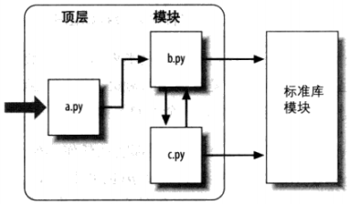

# 目录
* [IDLE](#idle)
* [运行Python](#运行python)
* [Python标准文档模板](#python标准文档模板)
* [可变、不可变数据类型](#可变、不可变数据类型)
* [变量、函数命名](#变量、函数命名)
* [模块](#模块)
* [函数参数](#函数参数)
* [装饰器](#装饰器（decorator）)

# <p align="center">IDLE</p>

###### [<p align="right">back to top ▲</p>](#目录)

IDLE是Python自带的简单的**集成开发环境**（**IDE**, Integrated Development Environment），是一个可以用来编辑、运行、浏览和调试Python程序的GUI。

> IDLE是IDE的一个官方变形，是为了纪念Monty Python成员Eirc Idle而命名的。

# <p align="center">运行Python</p>
###### [<p align="right">back to top ▲</p>](#目录)

## 命令行模式
python *.py
## Python交互模式
在系统提示环境（命令行、Win+R）下输入“python”即可开启一个交互的Python会话

**输入一行，执行一行**

* 优点：适合实验语法和测试已写入文件的代码
* 缺点：输入的代码不会保存，要重新执行必须重新输入

退出交互模式：exit()


# <p align="center">Python标准文档模板</p>
###### [<p align="right">back to top ▲</p>](#目录)

```python
#!/usr/bin/env python
# -*- coding: utf-8 -*-

' a test module '

__author__ = 'Michael Liao'
```
第1行和第2行是标准注释，

第1行注释可以让这个.py文件直接在Unix/Linux/Mac上运行，

第2行注释表示.py文件本身使用标准UTF-8编码；

第4行是一个字符串，表示模块的文档注释，任何模块代码的第一个字符串都被视为模块的文档注释；

第6行使用__author__变量把作者写进去。


# <p align="center">可变、不可变数据类型</p>
###### [<p align="right">back to top ▲</p>](#目录)

***Python，一切皆为对象，一切皆为对象的引用***
* ***可变数据类型：*** list、dict、set
* ***不可变数据类型：*** int、float、string、tuple


* 变量是一个系统表的元素，拥有指向对象的连接的空间
    * 变量名没有类型，类型属于对象
* 对象是分配的一块内存，有足够的空间去表示他们所代表的值
    * 每个对象都有两个标准的头部信息：一个类型标志符去标识这个对象的类型，一个引用的计数器，用来决定是不是可以回收这个对象
* 引用是自动形成的从变量到对象的指针

**id()方法：**
> Return the “identity” of an object. This is an integer (or long integer) which is guaranteed to be unique and constant for this object during its lifetime. Two objects with non-overlapping lifetimes may have the same id()value.

**Python对每个一个对象都提供一个唯一的id值**

* 交互模式下：
    - Python**在一个语句中**对值相同的不可变对象（tuple除外）都解释为了同一个对象
    ```python
    >>> id(1) == id(1)
    True
    >>> id(1000) == id(1000)
    True
    >>> id(10000) == id(10000)
    True
    ```
    - Python对**整型-5~256**都提前构造好了对象，后续所有值在这个范围内的整型都是指向唯一的对象。目的是为了防止经常使用的数字不断的被创建和销毁
    ```python
    >>> a = 1
    >>> b = 1
    >>> id(a) == id(b)
    True
    >>> a = 257
    >>> b = 257
    >>> id(a) == id(b)
    False
    >>> a = -5
    >>> b = -5
    >>> id(a) == id(b)
    True
    >>> a = -6
    >>> b = -6
    >>> id(a) == id(b)
    False
    ```
* 命令行模式下：
    - Python**在一个文件中**对值相同的不可变对象（tuple除外）都解释为同一个对象
    ```python
    a = 257
    b = 257
    print(id(a), id(b), id(257))
    # 199678070416 199678070416 199678070416
    print(a is b, a is 257)
    # True True
    ```
    
```python
>>> x = 257
>>> id(x)
15475528976
>>> x = 258
>>> id(x)
15475529008
>>> if True:
        a = 257
        b = 257
        c = 257
>>> print(id(a), id(b), id(c))
15475529840 15475529840 15475529840
```
***不可变对象，对象的值是不能被改变的：*** id为15475528976的对象的值在没被垃圾回收之前一直都是257，不能改变，如果要把变量x赋值为258，只能将变量x引用的对象从15475528976变为15475529008。

***不可变对象的优点：*** 不管有多少个引用，相同值的对象只占用一块内存（++tuple例外++）。 

***不可变对象的缺点：*** 当需要对变量进行运算从而改变变量的值时，由于是不可变对象的值不能被改变，所以必须创建新的对象，这样就会使得一次次的运算创建了一个个新的对象，不过不再被任何变量引用的对象会被垃圾回收器回收。

```python
>>> if True:
        a = [1, 2, 3]
        b = [1, 2, 3]
        c = [1, 2, 3]
    
>>> print(id(a), id(b), id(c))
15480645448 15480645128 15480645000

# 变量a、b、c引用的对象的id是不同的,其实是创建了三个不同的对象
# 对于可变数据类型的对象来说，值相同的对象也是不同的对象
# 在内存中可能存在多个值相同的对象，它们的id不同
>>> a.append(4)
>>> id(a)
15480645448
>>> a += [2]
>>> id(a)
15480645448
# 对变量a进行操作相当于直接改变了变量a所引用的对象的值
# 对象本身还是那个对象，对象的id不变
>>> a
[1, 2, 3, 4, 2]
```

***可变对象的意思就是说对象的值是可变的，操作变量不会引起新建对象，只是改变了变量所引用的对象的值。***

# <p align="center">变量、函数命名</p>
###### [<p align="right">back to top ▲</p>](#目录)

## 公开的（public）：
abc、x123、PI

可以被直接引用
## 特殊变量：
\_\_author\_\_ , \_\_name\_\_ , \_\_doc\_\_
可以被直接引用，有特殊用途
## 非公开的（private）：
\_xxx , \_\_xxx
不应该被直接引用(“不应该”但不是“不能”)


# <p align="center">模块</p>
###### [<p align="right">back to top ▲</p>](#目录)

## 模块导入
```python
try:
    import cStringIO as StringIO
except ImportError:
    import StringIO
```

模块的三个角色：
* 代码重用
    * 模块可以在文件中永久保存代码，可以按照需要任意次数地重新载入和重新运行模块；
    * 模块是定义变量名的空间，被认作是属性，可以被多个外部的客户端引用。
* 系统命名空间的划分
    * 模块是Python中最高级别的程序组织单元；
    * 模块将变量名封装进了自包含的软件包，这点对避免变量名的冲突很有帮助；
    * 模块是组织系统组件的天然工具。
* 实现共享服务和数据
    * 模块对实现跨系统共享的组件是很方便的，仅需要一个拷贝即可；
    * 如果需要一个全局对象，这个对象会被一个以上的函数或文件使用，可以将它编写在一个模块中以便能够被多个客户端导入。

导入给予了对模块的全局作用域中的变量名的读取权。

Python的程序架构：一个程序 = 一个顶层脚本文件 + 多个模块文件。

**标准库模块：**Python自带了大约200个实用的模块，称为标准链接库。




```python
# b.py
def spam(text):
    print(text, 'spam')

# a.py
import b    
# import语句给文件a.py提供了文件b.py在全局作用域中所定义的所有对象的访问权限
b.spam('gumby')
# 通过变量名b获取它的所有的属性
# b.spam，object.attribute对象属性语法，取出存储对象b中变量名为spam的值
```

## import如何工作

在python中，导入并非只是把一个文件文本插入另一个文件而已。导入其实是运行时的运算，程序第一次导入制定文件时，会执行三个步骤：

1. 找到模块文件；
    > import b，而不是import c:\dir1\b.py，因为Python使用***标准模块搜索路径***来找出import语句对应的模块文件。在标准的import中引入路径和后缀名在语法上是非法的。
2. 编译成字节码文件（需要时）；
    > 遍历模块搜索路径，找到符合import语句的源代码文件后，如果有必要，Python会将其编译成字节码文件。Python会检查文件的时间戳，如果发现.pyc文件比.py文件旧，就会重新生成字节码文件。如果Python在搜索路径上只发现了字节码文件，没有源代码，就会直接加载字节码（因此可以把一个程序只作为字节码文件发布，从而避免发布源代码，这样也可以跳过编译步骤，是程序启动提速）。

    > 只有被导入的文件才会在机器上留下.pyc文件，顶层文件的字节码在内部使用后就丢弃了。因此通常看不到程序顶层文件的.pyc字节码文件，除非这个文件也被其它文件导入。被导入的文件的字节码保存在机器上从而可以提高之后的运行速度。

    > 顶层文件通常设计为直接执行，而不是被导入的。设计一个文件，使其作为程序的顶层文件，并同时扮演被导入的模块工具的角色也是有可能的，这类文件既能执行也能导入。（利用__name__属性）
3. 执行模块的代码来创建其所定义的对象。
    > import操作的最后步骤是执行模块的字节码。文件中的所有语句会依次执行，这个执行步骤会生成模块代码所定义的所有工具。

这三个步骤只在模块第一次导入时才会进行，在此之后，导入相同模块时，会跳过这三个步骤，只提取内存中已加载的模块对象。如果在模块已经加载之后还需要再次导入（例如，为了支持终端用户的定制），可以通过调用reload强制处理这个问题。

Python把载入的模块存储到一个名为sys.modules的表中，并在一次导入操作开始时检查该表，如果模块不存在，则会执行这三个步骤。

> 可以导入sys并打印list(sys.modules.keys())来查看已经导入了哪些模块。

## 模块搜索路径

导入过程最重要的部分是定位要导入的文件（搜索部分）。

搜索路径：
1. 程序的主目录
    > Python会首先在主目录内搜索导入的文件，这一入口与你如何运行代码有关。当你运行一个程序的时候，这个入口就是包含程序顶层脚本文件的目录。当在交互模式下工作时，这个入口就是你当前工作的目录。
2. PYTHONPATH目录（如果已经进行了设置）
    > 之后，Python会从左至右搜索PYTHONPATH环境变量设置中的所有目录。PYTHONPATH是设置包含Python程序文件的目录的列表，你可以把想到如的目录都加进来，Python会使用你的设置来拓展模块搜索的路径。

    > 因为Python会先搜索主目录，所以当导入的文件跨目录时，这个设置才格外重要。
3. 标准链接库目录
    > 接着，Python会自动搜索标准库模块安装在机器上的那些目录。这些目录通常不需要添加到PYTHONPATH或包含到.pth路径文件中。
4. 任何.pth文件的内容（如果存在的话）
    > 最后，Python允许用户把有效的目录在.pth文件中一行一行地罗列出来。这提供了PYTHONPATH设置的一种替代方案。

    > 当内含目录名称的.pth文件放在适当的目录中时（C:\Python\Python36、C:\Python\Python36\Lib\site-packages），可以扮演与PYTHONPATH环境变量设置相同的角色。

这四部分组合起来就变成了sys.path，它是目录名称字符串的列表。

搜索路径的第一和第三部分是自动定义的，但是因为Python会从头到尾搜索这些组件，第二和第四部分可以用于拓展路径，从而包含你自己的源代码目录。

```python
>>>import sys
>>>sys.path
['E:\\JetBrains\\PyCharm 2017.1.5\\helpers\\pydev',
 'E:\\JetBrains\\PyCharm 2017.1.5\\helpers\\pydev',
 'C:\\Python\\Python36\\python36.zip',
 'C:\\Python\\Python36\\DLLs',
 'C:\\Python\\Python36\\lib',
 'C:\\Python\\Python36',
 'C:\\Python\\Python36\\lib\\site-packages',
 'C:\\Python\\Python36\\lib\\site-packages\\win32',
 'C:\\Python\\Python36\\lib\\site-packages\\win32\\lib',
 'C:\\Python\\Python36\\lib\\site-packages\\Pythonwin',
 'C:\\Python\\Python36\\lib\\site-packages\\IPython\\extensions',
 'E:\\MyProjects\\PycharmProjects\\tools',
 'E:/MyProjects/PycharmProjects/tools']
```
可以通过修改sys.path列表直接调整搜索路径，不过这种修改只在脚本运行期间保持。

## 模块文件选择
文件名的后缀（如.py）是刻意从import语句中省略的。Python会选择在搜索路径中第一个符合导入文件名的文件。

例如，import b可能会加载：
* 源代码文件b.py
* 字节码文件b.pyc
* 目录b，包导入
* 编译扩展模块（通常用C或C++编写），导入时使用动态链接（例如，Linux的b.so以及Cygwin和Windows的b.dll或b.pyd）
* 用C编写的编译好的内置模块，并通过静态连接至Python
* ZIP文件组件，导入时自动解压缩
* 内存内映像，对于frozen可执行文件
* Java类，在Jython版本的Python中
* .NET组件，在IronPython版本的Python中

对导入者来说，完全忽略了需要加载的文件类型之间的差异，例如，import b就是读取模块b，根据模块搜索路径，b是什么就是什么，b.attr则是去除模块中的一个元素，可能是Python变量或连接的C函数。某些标准模块实际上使用C编写的而不是Python，这是因为这种透明度，客户端并不在乎文件是什么。

如果在不同的目录中有b.py和b.so，Python总是在从左至右搜索sys.path时加载模块搜索路径的目录中最先出现的相符文件；如果同一目录下有b.py和b.so，Python会遵循一个标准的挑选顺序，不过这个顺序不保证永远不变，所以尽量让模块名独特一些。


## 高级的模块选择概念

利用导入钩子（import hook）可以重新定义Python中import操作所做的事。

### **distutils**

> Python的第三方扩展，通常使用标准链接库中的distutils模块自动安装，distutils会将第三方扩展安装在属于模块自动搜索路径的目录内（通常是Python安装目录树下的Lib\site-packages子目录中），所以不需要路径设置就能使用它们的代码。


# <p align="center">函数参数</p>
###### [<p align="right">back to top ▲</p>](#目录)

## 位置参数（必选参数）
***调用函数时，按照位置顺序传递参数。***
## 默认参数
```python
def enroll(name, gender, age=6, city='Beijing'):
    print('name:', name)
    print('gender:', gender)
    print('age:', age)
    print('city:', city)

# 调用有多个默认参数的函数
# 按顺序提供默认参数
enroll('Bob', 'M', 7)
# 不按顺序提供默认参数时，需要写上参数的名字
enroll('Adam', 'M', city='Tianjin')
```

***默认参数必须指向不变对象:***
```python
def add_end(L=[]):
    L.append('END')
    return L    # L是一个变量，它指向对象[]
>>> add_end()
['END']
>>> add_end()
['END', 'END']
>>> add_end()
['END', 'END', 'END']
```
## 可变参数
```python
def calc(*numbers):
    sum = 0
    for n in numbers:
        sum = sum + n * n
    return sum
```
***可变参数允许你传入0个或任意个参数，这些可变参数在函数调用时自动组装为一个tuple。***
## 关键字参数
```python
def person(name, age, **kw):
    print('name:', name, 'age:', age, 'other:', kw)
```
***关键字参数允许你传入0个或任意个含参数名的参数，这些关键字参数在函数内部自动组装为一个dict。***
## 命名关键字参数
```python
# *, 后面的参数被视为命名关键字参数
def person(name, age, *, city, job):
    print(name, age, city, job)
# 命名关键字参数必须传入参数名，否则将报错
>>> person('Jack', 24, 'Beijing', 'Engineer')
Traceback (most recent call last):
  File "<stdin>", line 1, in <module>
TypeError: person() takes 2 positional arguments but 4 were given
# 由于调用时缺少参数名city和job
# Python解释器把这4个参数均视为位置参数
# 但person()函数仅接受2个位置参数

# 如果函数定义中已经有了一个可变参数，后面的命名关键字参数就不需要特殊分隔符 *,
def person(name, age, *args, city, job):
    print(name, age, args, city, job)
    
# 命名关键字参数可以有缺省值，从而简化调用
def person(name, age, *, city='Beijing', job):
    print(name, age, city, job)
```

***参数定义的顺序必须是：位置参数（必选参数）、默认参数、可变参数和关键字参数。***
```python
def func(a, b, c=0, *args, **kw):
    print('a =', a, 'b =', b, 'c =', c, 'args =', args, 'kw =', kw)
```

# <p align="center">装饰器（Decorator）</p>
###### [<p align="right">back to top ▲</p>](#目录)


* 实质：是一个返回函数的高阶函数
* 参数：要装饰的函数名（并非函数调用）
* 返回：是装饰完的函数名（也非函数调用）
* 作用：为已经存在的对象添加额外的功能
* 特点：不需要对对象做任何的代码上的变动

```python
def decorator(func):
    def wrapper(*args, **kw):
        # do something here
        return func(*args, **kw)    # 执行func，并返回func的返回结果
    return wrapper

# 带参数的decorator
def decoratorWithArg(arg):
    def decorator(func):
        def wrapper(*args, **kw):
            # do something with arg here
            return func(*args, **kw)
        return wrapper
    return decorator
```
***@语法糖***
```python
@decorator
def func():
    pass
# 相当于func = decorator(func)
```