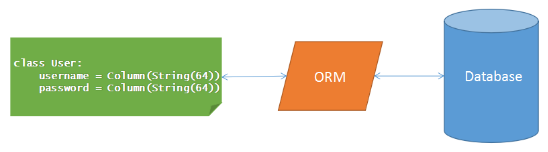
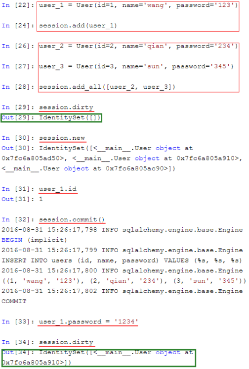
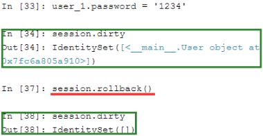

<div style="position: fixed; bottom: 20px; right: 39px; border-radius: 5px; background-color: #797979; z-index: 100;">
    <a href="#目录" style="color: white; border-right: 1px solid white; text-decoration: none; font-size: 14px; font-weight: bold; display: inline-block; padding: 5px 8px; line-height: 20px;">back to top ▲</a>
    <a href="javascript:void(0)" style="color: white; border-right: 1px solid white; text-decoration: none; font-weight: bold; display: inline-block; padding: 5px 8px; line-height: 20px;" onclick="(function(){document.querySelector('.btn.pull-left.js-toolbar-action').click()})()"><i class="fa fa-align-justify"></i></a>
</div>

# 目录

* [virtualenv](#virtualenv)
* [SQLAlchemy](#sqlalchemy)

## Python常用模块Top200

|名次|模块名称|被使用项目数|名次|模块名称|被使用项目数|
|:---|:---|:---|:---|:---|:---|
|1|sys|7858|2|os|6983|
|3|re|5663|4|time|5268|
|5|random|3339|6|datetime|3310|
|7|setuptools|3225|8|logging|3189|
|9|subprocess|2991|10|unittest|2923|
|11|json|2865|12|urllib|2641|
|13|future|2541|14|collections|2295|
|15|shutil|2255|16|string|2254|
|17|threading|2220|18|math|2205|
|19|tempfile|2151|20|urllib2|2095|
|21|socket|2079|22|traceback|2070|
|23|copy|2055|24|optparse|2053|
|25|hashlib|2025|26|StringIO|1812|
|27|django.db|1780|28|distutils.core|1780|
|29|struct|1753|30|itertools|1720|
|31|django.conf|1719|32|types|1667|
|33|django.core.management|1658|34|django.contrib|1604|
|35|glob|1582|36|urlparse|1559|
|37|base64|1555|38|inspect|1523|
|39|django.http|1510|40|django|1496|
|41|cStringIO|1447|42|os.path|1432|
|43|django.shortcuts|1419|44|functools|1395|
|45|argparse|1379|46|operator|1360|
|47|warnings|1345|48|codecs|1308|
|49|django.template|1262|50|django.test|1216|
|51|pickle|1200|52|errno|1133|
|53|pprint|1107|54|signal|1102|
|55|requests|1082|56|cgi|1052|
|57|django.contrib.auth.models|1018|58|getopt|1010|
|59|ConfigParser|972|60|django.core.urlresolvers|963|
|61|httplib|947|62|uuid|938|
|63|pkg_resources|906|64|imp|901|
|65|doctest|899|66|csv|893|
|67|django.db.models|877|68|zipfile|861|
|69|textwrap|860|70|django.utils|844|
|71|gzip|817|72|io|804|
|73|platform|798|74|django.core.exceptions|775|
|75|md5|755|76|xml.dom|753|
|77|binascii|751|78|fnmatch|750|
|79|Queue|744|80|getpass|719|
|81|select|701|82|utils|699|
|83|stat|693|84|numpy|685|
|85|mimetypes|683|86|ctypes|678|
|87|models|673|88|django.contrib.auth.decorators|669|
|89|django.core.management.base|664|90|zlib|649|
|91|simplejson|648|92|thread|644|
|93|distutils|643|94|django.template.loader|632|
|95|fcntl|617|96|contextlib|614|
|97|django.utils.encoding|605|98|decimal|592|
|99|atexit|576|100|locale|575|
|101|django.core|572|102|PIL|554|
|103|cPickle|552|104|calendar|551|
|105|yaml|547|106|multiprocessing|544|
|107|hmac|540|108|django.utils.safestring|540|
|109|django.conf.urls|537|110|weakref|533|
|111|unicodedata|527|112|mock|517|
|113|tarfile|504|114|django.contrib.auth|504|
|115|settings|500|116|smtplib|480|
|117|htmlentitydefs|475|118|array|474|
|119|sqlite3|462|120|google.appengine.api|457|
|121|email|457|122|django.template.defaultfilters|455|
|123|util|454|124|sha|452|
|125|flask|452|126|config|444|
|127|UserDict|440|128|django.contrib.sites.models|439|
|129|shlex|438|130|lxml|436|
|131|difflib|432|132|django.core.mail|431|
|133|BaseHTTPServer|424|134|webbrowser|424|
|135|gc|419|136|django.forms|417|
|137|django.contrib.contenttypes.models|413|138|Image|407|
|139|jinja2|406|140|django.utils.html|396|
|141|bisect|394|142|twisted.internet|384|
|143|django.conf.urls.defaults|379|144|commands|375|
|145|pdb|374|146|pwd|373|
|147|sqlalchemy|368|148|pytest|366|
|149|django.core.cache|364|150|BeautifulSoup|359|
|151|xml.dom.minidom|357|152|django.views.generic.simple|355|
|153|django.views.generic|355|154|xmlrpclib|355|
|155|Cookie|355|156|exceptions|353|
|157|sets|349|158|posixpath|348|
|159|SocketServer|347|160|code|343|
|161|django.core.paginator|338|162|gettext|338|
|163|google.appengine.ext.webapp|336|164|urllib.request|334|
|165|south.db|332|166|urllib.parse|329|
|167|new|329|168|pstats|329|
|169|msvcrt|328|170|builtin|325|
|171|ez_setup|324|172|gtk|323|
|173|django.dispatch|321|174|MySQLdb|318|
|175|HTMLParser|315|176|termios|311|
|177|scipy|311|178|pkgutil|309|
|179|abc|309|180|matplotlib|307|
|181|django.db.models.signals|306|182|six|306|
|183|xml.sax.saxutils|303|184|xml.sax|301|
|185|chardet|298|186|heapq|296|
|187|django.test.client|295|188|cProfile|295|
|189|bs4|290|190|sgmllib|289|
|191|django.utils.functional|287|192|xml.etree|286|
|193|ssl|283|194|tokenize|282|
|195|django.db.models.query|281|196|xml|281|
|197|nose.tools|281|198|nose|275|
|199|pygments|273|200|gobject|270|


# <p align="center" style="border-bottom: 3px solid #e7e7e7;">virtualenv</p>


# <p align="center" style="border-bottom: 3px solid #e7e7e7;">SQLAlchemy</p>

### 常见的SQLAlchemy列类型

|类型名称|python类型|描述|
|:---|:---|:---|
|Integer|int|常规整形，通常为32位|
|SmallInteger|int|短整形，通常为16位|
|BigInteger|int或long|精度不受限整形|
|Float|float|浮点数|
|Numeric|decimal.Decimal|定点数|
|String|str|可变长度字符串|
|Text|str|可变长度字符串，适合大量文本|
|Unicode|unicode|可变长度Unicode字符串|
|Boolean|bool|布尔型|
|Date|datetime.date|日期类型|
|Time|datetime.time|时间类型|
|Interval|datetime.timedelta|时间间隔|
|Enum|str|字符列表|
|PickleType|任意Python对象|自动Pickle序列化|
|LargeBinary|str|二进制|


### 常见的SQLAlchemy列选项

|可选参数|描述|
|:---|:---|
|primary_key|如果设置为True，则为该列表的主键|
|unique|如果设置为True，该列不允许相同值|
|index|如果设置为True，为该列创建索引，查询效率会更高|
|nullable|如果设置为True，该列允许为空。如果设置为False，该列不允许空值|
|default|定义该列的默认值|

### 常见的SQLAlchemy关系选项

|选项名|描述|
|:---|:---|
|backref|在关系的其他模型中添加一个反向引用|
|primary|显示地指定两个模型之间的连接条件。当关系模糊的时候这是必要的|
|lazy|指定如何加载相关条目。可能值有select（使用标准select语句一气呵成加载条目）、immediate（当源对象已经加载后加载条目）、joined（立即加载条目，但是是作为连接）、subquery（立即加载条目，但是是作为子查询）、noload（条目永不加载）和dynamic（会返回另一个查询对象，你可以在加载这些条目时进一步提取）|
|uselist|如果设置为False，使用一个标量而不是列表|
|order_by|指定关系中条目的排序|
|secondary|在多对多关系中指定要使用的关联表名称|
|secondaryjoin|当SQLAlchemy不能自己决定多对多关系的时候指定第二个连接条件|



```python
# 导入：
from sqlalchemy import Column, String, create_engine
from sqlalchemy.orm import sessionmaker
from sqlalchemy.ext.declarative import declarative_base

# 创建对象的基类：
Base = declarative_base()

# 定义User对象：
class User(Base):
	# 表的名字：
	__tablename__ = 'user'

	# 表的结构：
	id = Column(String(20), primary_key=True)
	name = Column(String(20))

# 初始化数据库连接：
# create_engine('数据库://用户名:密码(没有密码则为空)@主机名:端口/数据库名', echo = True)
engine = create_engine('mysql+pymysql://root:@localhost:3306/sqlalchemy')
# 创建DBSession类型：
DBSession = sessionmaker(bind=engine)

# 创建session对象：
session = DBSession()
# 创建User对象
new_user = User(id='6', name='Bob')
new_user1 = User(id='7', name='Bob')
new_user2 = User(id='8', name='Bob')
# 添加到session：
session.add(new_user)
session.add(new_user1)
session.add(new_user2)
# 提交保存到数据库：
session.commit()
# 关闭session
session.close()
```

1. 连接数据库
    ```python
    from sqlalchemy import create_engine
    # create_engine('数据库://用户名:密码(没有密码则为空)@主机名:端口/数据库名', echo = True)
    # create_engine()会返回一个数据库引擎，
    # echo参数为True时，会显示每条执行的SQL语句，生产环境下可关闭
    engine = create_engine('mysql+pymysql://root:@localhost:3306/sqlalchemy', echo = True)
    ```
2. 创建ORM模型
    ```python
    # 基类
    from sqlalchemy.ext.declarative import declarative_base
    # declarative_base()创建了一个基类，这个类的子类可以自动与一个表关联
    Base = declarative_base()
    # 类
    from sqlalchemy import Column, Integer, String
    Class User(Base):
        __tablename__ = 'users'
        id = Column(Integer, primary_key = True)
        name = Column(String(255))
        password = Column(String(255))

    # 创建表
    def init_db():
        # Base.metadata.create_all(engine)会找到Base的所有子类，
        # 并在数据库中建立这些子类对应的表；
        Base.metadata.create_all(engine)
    def drop_db():
        # drop_all()则是删除这些表。
        Base.metadata.drop_all(engine)

    init_db()

    # 查看是否创建成功
    engine.table_names()
    ```
3. 使用Session
    1. 初始化一个Session对象
        ```python
        from sqlalchemy.orm import sessionmaker
        Session = sessionmaker(bind = engine)
        session = Session()
        # 或者
        Session = sessionmaker()
        Session.configure(bind = engine)
        session = Session()
        # sessionmaker()会生成一个数据库会话类。
        # 这个类的实例可以当成一个数据库连接，
        # 它同时还记录了一些查询的数据。
        ```
    2. 执行SQL语句
        ```python
        # 拿到session后，就可以执行SQL了。
        session.execute('create database abc')
        print(session.execute('show databases').fetchall())
        session.execute('use abc')
        # 建user表的过程略
        print(session.execute('select * from user where id = 1').first())
        print(session.execute('select * from user where id = :id', {'id': 1}).first())
        ```
    3. 添加/更新对象

        
    4. 回滚（做了修改但还未提交）

        
    5. 查询
        ```python
        session.query(User).filter_by(name = 'wang')
        session.query(User).filter_by(name = 'wang').first()
        session.query(User).filter_by(password = '123').all()

        for instance in session.query(User).order_by(User.id):
        print(instance.id, instance.name)

        for name in session.query(User.name).filter_by(password = ‘123’):
        print name

        for user in session.query(User).order_by(User.id)[1 : 3]:
        print user.name
        ```
    6. 查询时候的通用过滤符号
        ```python
        # equal
        query.filter(User.name == 'ed')
        # not equal
        query.filter(User.name != 'ed')
        # like 
        query.filter(User.name.like('%ed%'))
        # in
        query.filter(User.name.in_(['ed', 'wendy', 'jack']))
        # not in
        query.filter(~User.name.in_(['ed', 'wendy', 'jack']))

        # use and_()
        from sqlalchemy import and_
        query.filter(and_(User.name == 'ed', User.fullname == 'Ed Jones'))
        # or send multiple expressions to .filter()
        query.filter(User.name == 'ed', User.fullname == 'Ed Jones')

        # or chain multiple filter() / filter_by() calls
        query.filter(User.name == 'ed').filter(User.fullname == 'Ed Jones')
        # or --Make sure you use or_() and not the Python or operator!
        from sqlalchemy import or_
        query.filter(or_(User.name == 'ed', User.name == 'wendy'))
        # match
        query.filter(User.name.match('wendy'))
        ```

[Python SQLAlchemy基本操作和常用技巧](https://www.jb51.net/article/49789.htm)

* ## 使用

```python
from sqlalchemy import func, or_, not_

user = User(name = 'a')
session.add(user)
user = User(name = 'b')
session.add(user)
user = User(name = 'a')
session.add(user)
user = User()
session.add(user)
session.commit()
query = session.query(User)
print query # 显示SQL语句
print query.statement # 同上
for user in query: # 遍历时查询
    print user.name
print query.all() # 返回的是一个类似列表的对象
print query.first().name # 记录不存在时，first()会返回None
print query.one().name # 不存在，或有多行记录时会抛出异常
print query.filter(User.id == 2).first().name
print query.get(2).name # 以主键获取，等效于上句
print query.filter('id = 2').first().name # 支持字符串
query2 = session.query(User.name)
print query2.all() # 每行是个元组
print query2.limit(1).all() # 最多返回1条记录
print query2.offset(1).all() # 从第2条记录开始返回
print query2.order_by(User.name).all()
print query2.order_by('name').all()
print query2.order_by(User.name.desc()).all()
print query2.order_by('name desc').all()
print session.query(User.id).order_by(User.name.desc(), User.id).all()
print query2.filter(User.id == 1).scalar() # 如果有记录，返回第一条记录的第一个元素
print session.query('id').select_from(User).filter('id = 1').scalar()
print query2.filter(User.id > 1, User.name != 'a').scalar() # and
query3 = query2.filter(User.id > 1) # 多次拼接的filter也是and
query3 = query3.filter(User.name != 'a')
print query3.scalar()
print query2.filter(or_(User.id == 1, User.id == 2)).all() # or
print query2.filter(User.id.in_((1, 2))).all() # in
query4 = session.query(User.id)
print query4.filter(User.name == None).scalar()
print query4.filter('name is null').scalar()
print query4.filter(not_(User.name == None)).all() # not
print query4.filter(User.name != None).all()
print query4.count()
print session.query(func.count('*')).select_from(User).scalar()
print session.query(func.count('1')).select_from(User).scalar()
print session.query(func.count(User.id)).scalar()
print session.query(func.count('*')).filter(User.id > 0).scalar() # filter()中包含User，因此不需要指定表
print session.query(func.count('*')).filter(User.name == 'a').limit(1).scalar() == 1 # 可以用limit()限制count()的返回数
print session.query(func.sum(User.id)).scalar()
print session.query(func.now()).scalar() # func后可以跟任意函数名，只要该数据库支持
print session.query(func.current_timestamp()).scalar()
print session.query(func.md5(User.name)).filter(User.id == 1).scalar()
query.filter(User.id == 1).update({User.name: 'c'})
user = query.get(1)
print user.name
user.name = 'd'
session.flush() # 写数据库，但并不提交
print query.get(1).name
session.delete(user)
session.flush()
print query.get(1)
session.rollback()
print query.get(1).name
query.filter(User.id == 1).delete()
session.commit()
print query.get(1)
```

* ## 进阶

```python
# 如何批量插入大批数据？
# 使用非ORM的方法
session.execute(
    User.__table__.insert() ,
    [{'name' : `randint(1, 100)` , 'age' : randint(1, 100)} for i in xrange(10000)]
)
session.commit()

# 如何让执行的 SQL 语句增加前缀？
# 使用 query 对象的 prefix_with() 方法
session.query(User.name).prefix_with('HIGH_PRIORITY').all()
session.execute(User.__table__.insert().prefix_with('IGNORE') , {'id' : 1 , 'name' : '1'})

# 如何替换一个已有主键的记录？
# 使用 session.merge() 方法替代 session.add()，其实就是 SELECT + UPDATE
user = User(id=1, name='ooxx')
session.merge(user)
session.commit()

# 如何使用无符号整数？
# 可以使用MySQL的方言（dialect）
from sqlalchemy.dialects.mysql import INTEGER
id = Column(INTEGER(unsigned = True) , primary_key = True)

# 模型的属性名需要和表的字段名不一样怎么办？
# 开发时遇到过一个奇怪的需求，有个其他系统的表里包含了一个“from”字段，这在 Python 里是关键字，于是只能这样处理了：
from_ = Column('from' , CHAR(10))

# 如何获取字段的长度？
# Column 会生成一个很复杂的对象，想获取长度比较麻烦，这里以 User.name 为例：
User.name.property.columns[0].type.length

#如何指定使用 InnoDB，以及使用 UTF-8 编码？
#最简单的方式就是修改数据库的默认配置。如果非要在代码里指定的话，可以这样：
class User(BaseModel):
    __table_args__ = {
        'mysql_engine' : 'InnoDB' ,
        'mysql_charset' : 'utf8'
}
# MySQL 5.5开始支持存储4字节的UTF-8编码的字符了，iOS里自带的emoji就属于这种。
# 如果是对表来设置的话，可以把上面代码中的utf8改成utf8mb4，DB_CONNECT_STRING里的charset也这样更改。
# 不建议全用utf8mb4代替utf8，因为前者更慢，索引会占用更多空间。

# 如何设置外键约束？
from random import randint
from sqlalchemy import ForeignKey
class User(BaseModel):
    __tablename__ = 'user'
    id = Column(Integer , primary_key = True)
age = Column(Integer)

class Friendship(BaseModel):
    __tablename__ = 'friendship'
    id = Column(Integer , primary_key=True)
    user_id1 = Column(Integer , ForeignKey('user.id'))
    user_id2 = Column(Integer , ForeignKey('user.id'))

for i in xrange(100):
    session.add(User(age = randint(1, 100)))
session.flush() # 或session.commit()，执行完后，user对象的id属性才可以访问（因为 id 是自增的）
for i in xrange(100):
    session.add(Friendship(user_id1 = randint(1, 100) , user_id2 = randint(1, 100)))
session.commit()
session.query(User).filter(User.age < 50).delete()

# 执行这段代码时，你应该会遇到一个错误：
sqlalchemy.exc.IntegrityError: 
(IntegrityError) (1451, 'Cannot delete or update a parent row: a foreign key constraint fails (`ooxx`.`friendship`, CONSTRAINT `friendship_ibfk_1` FOREIGN KEY (`user_id1`) REFERENCES `user` (`id`))') 'DELETE FROM user WHERE user.age < %s' (50,)
# 原因是删除user表的数据，可能会导致friendship的外键不指向一个真实存在的记录。
# 在默认情况下，MySQL会拒绝这种操作，也就是RESTRICT。
# InnoDB还允许指定ON DELETE为CASCADE和SET NULL，前者会删除friendship中无效的记录，后者会将这些记录的外键设为NULL。
# 除了删除，还有可能更改主键，这也会导致friendship的外键失效。于是相应的就有ON UPDATE了。
# 其中CASCADE变成了更新相应的外键，而不是删除。
class Friendship(BaseModel):
    __tablename__ = 'friendship'
    id = Column(Integer, primary_key = True)
    user_id1 = Column(Integer , ForeignKey('user.id' , ondelete = 'CASCADE' , onupdate = 'CASCADE'))
    user_id2 = Column(Integer , ForeignKey('user.id' , ondelete = 'CASCADE' , onupdate = 'CASCADE'))

# 如何连接表？
from sqlalchemy import distinct
from sqlalchemy.orm import aliased

Friend = aliased(User , name = 'Friend')
print session.query(User.id).join(Friendship , User.id == Friendship.user_id1).all() 
# 所有有朋友的用户
# SELECT id , user_id1 FROM User , Friendship WHERE id = user_id1 ;
# SELECT id , user_id1 FROM User INNER JOIN Friendship ON id = user_id1 ;
print session.query(distinct(User.id)).join(Friendship , User.id == Friendship.user_id1).all() 
# 所有有朋友的用户（去掉重复的）
print session.query(User.id).join(Friendship , User.id == Friendship.user_id1).distinct().all() 
# 同上
print session.query(Friendship.user_id2).join(User , User.id == Friendship.user_id1).order_by(Friendship.user_id2).distinct().all() 
# 所有被别人当成朋友的用户
print session.query(Friendship.user_id2).select_from(User).join(Friendship , User.id == Friendship.user_id1).order_by(Friendship.user_id2).distinct().all() 
# 同上，join 的方向相反，但因为不是 STRAIGHT_JOIN，所以 MySQL 可以自己选择顺序
print session.query(User.id , Friendship.user_id2).join(Friendship , User.id == Friendship.user_id1).all() 
# 用户及其朋友
print session.query(User.id , Friendship.user_id2).join(Friendship , User.id == Friendship.user_id1).filter(User.id < 10).all() 
# id 小于 10 的用户及其朋友
print session.query(User.id , Friend.id).join(Friendship , User.id == Friendship.user_id1).join(Friend , Friend.id == Friendship.user_id2).all() 
# 两次 join，由于使用到相同的表，因此需要别名
print session.query(User.id , Friendship.user_id2).outerjoin(Friendship , User.id == Friendship.user_id1).all() 
# 用户及其朋友（无朋友则为 None，使用左连接）

# 为什么无法删除 in 操作查询出来的记录？
session.query(User).filter(User.id.in_((1 , 2 , 3))).delete()
# 抛出这样的异常：
sqlalchemy.exc.InvalidRequestError : Could not evaluate current criteria in Python . Specify 'fetch' or False for the synchronize_session parameter .
但这样是没问题的：
session.query(User).filter(or_(User.id == 1 , User.id == 2 , User.id == 3)).delete()
# 搜了下找到 Sqlalchemy delete subquery 这个问题，提到了 delete 的一个注意点：删除记录时，默认会尝试删除 session 中符合条件的对象，而 in 操作估计还不支持，于是就出错了。解决办法就是删除时不进行同步，然后再让 session 里的所有实体都过期：
session.query(User).filter(User.id.in_((1, 2, 3))).delete(synchronize_session=False)
session.commit() # or session.expire_all()
# 此外，update 操作也有同样的参数，如果后面立刻提交了，那么加上 synchronize_session = False 参数会更快

# 如何扩充模型的基类？
# declarative_base() 会生成一个 class 对象，这个对象的子类一般都和一张表对应。如果想增加这个基类的方法或属性，让子类都能使用，可以有三种方法：
# 1.定义一个新类，将它的方法设置为基类的方法
class ModelMixin(object):
    @classmethod
    def get_by_id(cls , session , id , columns=None , lock_mode=None):
        if hasattr(cls , 'id'):
            scalar = False
            if columns:
                if isinstance(columns , (tuple , list)):
                    query = session.query(*columns)
                else:
                    scalar = True
                    query = session.query(columns)
            else:
                query = session.query(cls)
            if lock_mode:
                query = query.with_lockmode(lock_mode)
            query = query.filter(cls.id == id)
            if scalar:
                return query.scalar()
            return query.first()
        return None
    BaseModel.get_by_id = get_by_id
    @classmethod
    def get_all(cls , session , columns=None , offset=None , limit=None , order_by=None , lock_mode=None):
        if columns:
            if isinstance(columns , (tuple , list)):
                query = session.query(*columns)
            else:
                query = session.query(columns)
                if isinstance(columns , str):
                    query = query.select_from(cls)
        else:
            query = session.query(cls)
        if order_by is not None:
            if isinstance(order_by , (tuple , list)):
                query = query.order_by(*order_by)
            else:
                query = query.order_by(order_by)
        if offset:
            query = query.offset(offset)
        if limit:
            query = query.limit(limit)
        if lock_mode:
            query = query.with_lockmode(lock_mode)
        return query.all()
    BaseModel.get_all = get_all
    @classmethod
    def count_all(cls , session , lock_mode=None):
        query = session.query(func.count('*')).select_from(cls)
        if lock_mode:
            query = query.with_lockmode(lock_mode)
        return query.scalar()
    BaseModel.count_all = count_all
    @classmethod
    def exist(cls , session , id , lock_mode=None):
        if hasattr(cls , 'id'):
            query = session.query(func.count('*')).select_from(cls).filter(cls.id == id)
            if lock_mode:
                query = query.with_lockmode(lock_mode)
            return query.scalar() > 0
        return False
    BaseModel.exist = exist
    @classmethod
    def set_attr(cls , session , id , attr , value):
        if hasattr(cls , 'id'):
            session.query(cls).filter(cls.id == id).update({
                attr: value
            })
            session.commit()
    BaseModel.set_attr = set_attr
    @classmethod
    def set_attrs(cls , session , id , attrs):
        if hasattr(cls , 'id'):
            session.query(cls).filter(cls.id == id).update(attrs)
            session.commit()
BaseModel.set_attrs = set_attrs

# 2.设置 declarative_base() 的 cls 参数：
BaseModel = declarative_base(cls=ModelMixin)
# 这种方法不需要执行“BaseModel.get_by_id = get_by_id”之类的代码。不足之处就是 PyCharm 仍然无法找到这些方法的位置

# 3.设置 __abstract__ 属性：
class BaseModel(BaseModel):
    __abstract__ = True
    __table_args__ = { # 可以省掉子类的 __table_args__ 了
        'mysql_engine' : 'InnoDB',
        'mysql_charset' : 'utf8'
    }
# ...
# 这种方法最简单，也可以继承出多个类
```

```python
# 如何正确使用事务？
# 假设有一个简单的银行系统，一共两名用户：
class User(BaseModel):
    __tablename__ = 'user'
    id = Column(Integer , primary_key=True)
    money = Column(DECIMAL(10 , 2))

class TanseferLog(BaseModel):
    __tablename__ = 'tansefer_log'
    id = Column(Integer , primary_key=True)
    from_user = Column(Integer , ForeignKey('user.id' , ondelete='CASCADE' , onupdate='CASCADE'))
    to_user = Column(Integer , ForeignKey('user.id' , ondelete='CASCADE' , onupdate='CASCADE'))
    amount = Column(DECIMAL(10, 2))

user = User(money=100)
session.add(user)
user = User(money=0)
session.add(user)
session.commit()

# 然后开两个 session，同时进行两次转账操作：
session1 = DB_Session()
session2 = DB_Session()
user1 = session1.query(User).get(1)
user2 = session1.query(User).get(2)
if user1.money >= 100:
    user1.money -= 100
    user2.money += 100
    session1.add(TanseferLog(from_user=1 , to_user=2 , amount=100))
user1 = session2.query(User).get(1)
user2 = session2.query(User).get(2)
if user1.money >= 100:
    user1.money -= 100
    user2.money += 100
    session2.add(TanseferLog(from_user=1 , to_user=2 , amount=100))
session1.commit()
session2.commit()

# 现在看看结果：
>>> user1.money
Decimal('0.00')
>>> user2.money
Decimal('100.00')
>>> session.query(TanseferLog).count()
2L
# 两次转账都成功了，但是只转走了一笔钱，这明显不科学
# 可见 MySQL InnoDB 虽然支持事务，但并不是那么简单的，还需要手动加锁
# 首先来试试读锁：
user1 = session1.query(User).with_lockmode('read').get(1)
user2 = session1.query(User).with_lockmode('read').get(2)
if user1.money >= 100:
    user1.money -= 100
    user2.money += 100
    session1.add(TanseferLog(from_user=1 , to_user=2 , amount=100))
user1 = session2.query(User).with_lockmode('read').get(1)
user2 = session2.query(User).with_lockmode('read').get(2)
if user1.money >= 100:
    user1.money -= 100
    user2.money += 100
    session2.add(TanseferLog(from_user=1 , to_user=2 , amount=100))
session1.commit()
session2.commit()
# 现在在执行session1.commit()的时候，因为user1和user2都被session2加了读锁，所以会等待锁被释放。
# 超时以后，session1.commit()会抛出个超时的异常，如果捕捉了的话，或者session2在另一个进程，那么session2.commit()还是能正常提交的。
# 这种情况下，有一个事务是肯定会提交失败的，所以那些更改等于白做了。

# 接下来看看写锁，把上段代码中的'read'改成'update'即可。这次在执行select的时候就会被阻塞了：
user1 = session2.query(User).with_lockmode('update').get(1)
# 这样只要在超时期间内，session1 完成了提交或回滚，那么 session2 就能正常判断 user1.money >= 100 是否成立了
# 由此可见，如果需要更改数据，最好加写锁
```