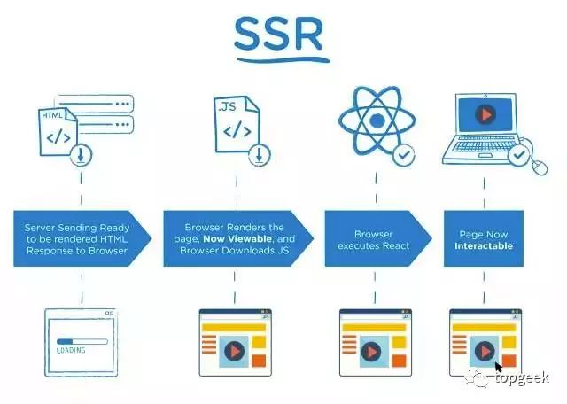
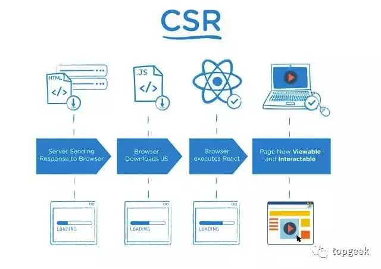
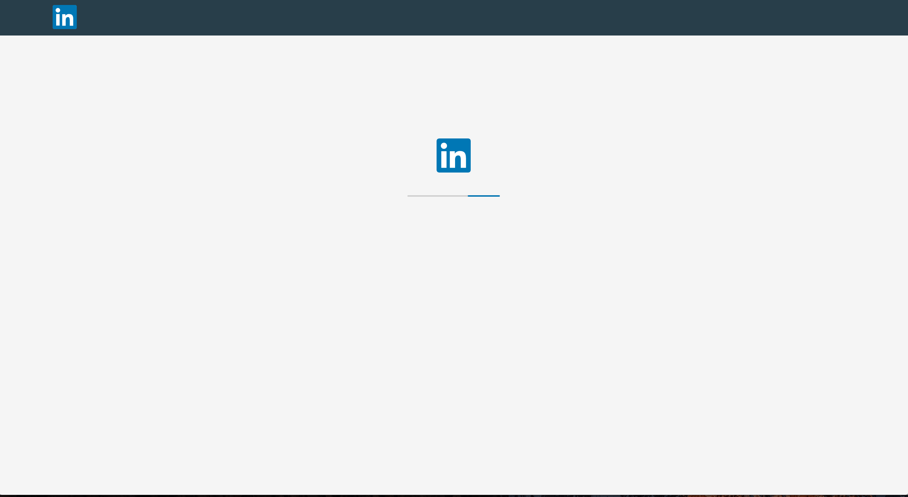
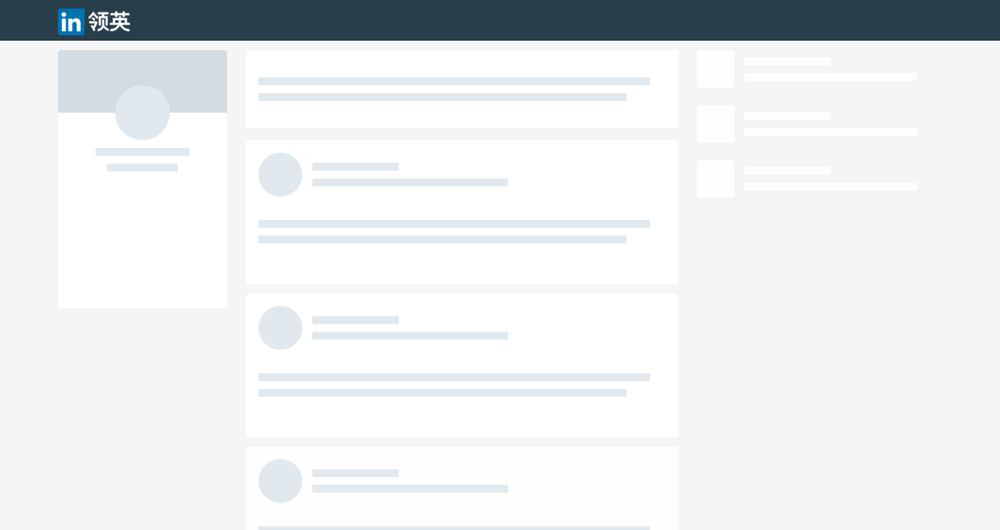

<div style="position: fixed; bottom: 20px; right: 39px; border-radius: 5px; background-color: #797979; z-index: 100;">
    <a href="#服务端渲染和客户端渲染" style="color: white; border-right: 1px solid white; text-decoration: none; font-size: 14px; font-weight: bold; display: inline-block; padding: 5px 8px; line-height: 20px;">back to top ▲</a>
    <a style="cursor: pointer; color: white; border-right: 1px solid white; text-decoration: none; font-weight: bold; display: inline-block; padding: 5px 8px; line-height: 20px;" onclick="(function(){document.querySelector('.btn.pull-left.js-toolbar-action').click()})()"><i class="fa fa-align-justify"></i></a>
</div>

# 服务器端渲染和客户端渲染

「服务器端渲染」指传统的ASP、Java或PHP的渲染机制；「客户端渲染」指使用JS来渲染页面大部分内容，代表是现在流行的SPA（Signal-Page Application，单页面应用）；「同构渲染」指前后端共用JS，首次渲染时使用Node.js来直出HTML。

## 渲染

如果只是想显示一堆不变的数据，那么直接写一个a.html丢到服务器上让客户端访问就可以了。但这是基本不可能的事情，数据一般是变化的。不可能为每套数据写一个视图，所以需要分离数据和视图，然后使用一种技术将数据塞到视图中，这种技术就叫渲染。

这工作放在服务器上做就是服务器端渲染，放在浏览器（客户端）上做就是客户端渲染。

***这里的渲染，是指生成HTML文档的过程。***

## SSR/CSR发展历史

多年前，Web是一群由HTML和CSS构建的静态页面，没有太多的交互性。每个用户行为要求服务器来创建和提供一个完整的页面。服务器端渲染HTML的情况下，浏览器会直接接收到经过服务器计算之后的呈现给用户的最终的HTML字符串，这里的计算是服务器通过解析存放在服务器端的模板文件来完成的，在这种情况下，浏览器只进行了HTML的解析。

客户端渲染起源于JavaScript的兴起，Ajax的大热更是让客户端渲染更加成熟，客户端渲染真正意义上的实现了前后端分离，前端只专注于UI的开发，后端只专注于逻辑的开发，前后端交互只通过约定好的API来交互，后端提供json数据，前端循环json生成DOM插入到页面中。

其实服务器端、客户端的渲染本质是一样的，都是字符串的拼接，将数据渲染进一些固定格式的HTML代码中形成最终的HTML展示在用户页面上。拼接字符串必然会损耗一些性能。

如果在服务器端渲染，那么消耗的是服务器的性能。所以用户量达到一定程度后，服务器端会考虑缓存部分数据，避免消耗过多资源重复渲染一些对及时性要求并不高的地方以节约资源。例如常见的排行榜，可以将渲染后的模块缓存起来，十分钟更新一次。

如果是在客户端渲染，常见的手段，比如是直接生成DOM插入到HTML中，或者是使用一些前端的模板引擎等。它们初次渲染的原理大多是将原HTML中的数据标记（例如{{text}}）替换。客户端渲染的难点在于数据变更后，页面变更时如何节省资源？拿React、Vue来举例子，在数据变更后，它会帮你diff，没有发生改变的部分不会重新渲染。

在一些jQuery用户的角度看来，JS生成HTML无非就是这样的：
```javascript
var e = document.createElement('div');
$('#container').append(e);
```
先生成DOM，然后再插入到其他的DOM里去。纯JS处理DOM确实是一件麻烦事，这也是客户端渲染迟迟没有发展起来的原因之一。

为什么后端模板语言方便简洁？因为它用了与HTML类似的语法。在PHP，JSP页面里面你可以使用大量的HTML，只使用少量的变量注入。使用HTML进行设计明显比纯JS更方便快捷并且直观。那么可以借鉴，解决客户端渲染问题的锦囊就是引入模板，在这里我们称之为**组件（Component）**。

## SSR/CSR对比

客户端渲染，指的是用js去生成HTML，前端做路由。
> 举例：React，Vue等等前端框架。适合单页面应用程序。

服务器端渲染，指的是用后台语言通过一些模版引擎生成HTML。
> 举例：PHP文件、JSP文件、Python的Flask配合Jinja引擎、Django框架、Java配合vm模版引擎、NodeJS配合Jade。适合多页面应用。现在大部分网站还是这种形式。

**服务器端渲染，Server-Side Rendering，SSR**



**客户端渲染，Client-Side Rendering，CSR**



* #### 客户端渲染路线：
    1. 浏览器请求一个HTML；
    2. 服务器返回一个HTML；
    3. 浏览器下载HTML中的js/css文件；
    4. 等待js文件下载完成；
    5. 等待js加载并初始化完成；
    6. js代码运行，由js代码向后端请求数据（Ajax/fetch）；
    7. 等待后端数据返回；
    8. 客户端从无到有的渲染出页面。

* #### 服务器端渲染路线：
    1. 浏览器请求一个HTML；
    2. 服务器端请求数据（内网请求快）；
    3. 服务器初始渲染（服务器性能好，较快）；
    4. 服务器端返回已经有正确内容的页面；
    5. 客户端请求js/css文件；
    6. 等待js文件下载完成；
    7. 等待js加载并初始化完成；
    8. 客户端把剩下一部分渲染完成（内容小，渲染快）。

#### 时间耗时比较：
* 数据请求：服务器在内网进行数据请求，数据响应速度快。客户端在不同网络环境下进行数据请求，且外网http请求开销大，导致时间消耗大（主要原因）；
* 步骤：服务器端是先请求数据然后渲染，而客户端是等待js代码下载、加载完成再请求数据、渲染；
* 渲染性能：服务器端性能比客户端高，渲染速度快（猜测，该项数据不详）；
* 渲染内容：服务器端渲染会把“可视”部分先渲染，然后交给客户端再作部分渲染。而客户端渲染，则是从无到有，需要经历完整的渲染步骤。

对同一个组件，服务器端渲染“可视的”一部分（render/componentWillMount部分代码），为确保组件有完善的生命周期及事件处理，客户端需要再次渲染。即：服务器端渲染，实际上也是需要客户端进行再次地、但开销很小的二次渲染。

在用户体验要求比较高的页面（首屏）、重复较多的公共页面可以考虑使用服务器端渲染，减少Ajax请求和提升用户体验。

#### 从服务器端渲染到客户端渲染，发生了什么变化？
* 计算任务转移 
    原本由服务器执行的渲染任务转移给了浏览器，这在大量用户访问时大大减轻服务器的压力。让后端专注做后端该做的事情，性能将大大提高。现在随着客户端软硬件的发展，也能处理好大多数的渲染工作。

* 放弃前端权限 
    将整个UI逻辑交给客户端以后，一些有经验有能力的用户可能会劫持UI，使得他们能够看到一些不该看到的界面。这似乎违反了安全原则。但是“只在前端强调安全就是耍流氓”，后端不能轻信一切从前端传来的数据，切记一定要做好过滤与验证。只要使用SSL、屏蔽XSS、后端不出漏洞，想伪造身份劫持App还是难以做到的。


* #### 客户端渲染的优势
    * 局部刷新：无需每次都进行完整页面请求；
    * 懒加载：在页面初始时只加载可视区域内的数据，滚动后加载其它数据，可以通过react-lazyload实现；
    * 富交互：使用JS实现各种酷炫效果；
    * 节约服务器成本：省电省钱，JS支持CDN部署，且部署极其简单，只需要服务器支持静态文件即可；
    * 分离设计：服务器来访问数据库提供接口，JS只关注数据获取和展现；
    * JS一次学习，到处使用：可以用来开发Web、Serve、Mobile、Desktop类型的应用。

* #### 服务器端渲染的优势
    * 服务端渲染不需要先下载一堆js后才能看到页面（首屏性能）；
    * SEO：服务器端渲染过程中服务器直出HTML，搜索引擎爬虫可以读取到页面内容，而客户端渲染过程中服务器输出js文件，搜索引擎爬虫无法执行js获取页面中的内容；
    * 服务端渲染不用关心浏览器兼容性问题（随着浏览器发展，这个优点逐渐消失）；
    * 对于电量不给力的手机或平板，减少在客户端的电量消耗很重要。

以上服务端优势其实只有首屏性能和SEO两点比较突出。但现在这两点也慢慢变得微不足道了。React这类支持同构的框架已经能解决这个问题，尤其是Next.js让同构开发变得非常容易。

> 客户端渲染有利于前后端真正解耦、分离，前端专注于UI，后端专注于数据处理，两端通过设计好的API进行交互，这是一个趋势。客户端渲染是未来的主要方向，服务端则会专注于在数据和业务处理上的优势。但由于日趋复杂的软硬件环境和用户体验更高的追求，也不能只拘泥于完全的客户端渲染。同构渲染看似美好，但以目前的发展程度来看，在大型项目中还不具有足够的应用价值，但不妨碍部分使用来优化首屏性能。做同构之前，一定要考虑到浏览器和服务器的环境差异，站在更高层面考虑。


## 客户端渲染的首屏优化问题

* #### 分拆打包
    现在流行的路由库如react-router对分拆打包都有很好的支持。可以按照页面对包进行分拆，并在页面切换时加上一些loading和transition效果。

* #### 交互优化
    首次渲染的问题可以用更好的交互来解决，先看下linkedin的渲染：

    

    

    非常自然，打开渲染并没有白屏，有两段加载动画，第一段是加载资源，第二段是一个加载占位器。过去我们会用loading效果，但过渡性不好，近年流行Skeleton Screen（加载占位图）效果，其实就是在白屏无法避免时，为了解决等待加载过程中白屏或者界面闪烁造成的割裂感的解决方案。

* #### 部分同构
    部分同构可以利用同构的优点，如把核心的部分如菜单和页面骨架通过同构的方式优先渲染出来，给用户提示信息，减少无端的等待时间。