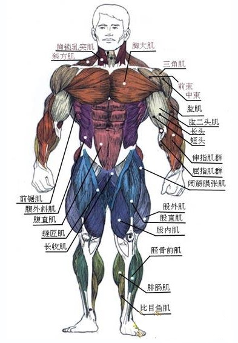
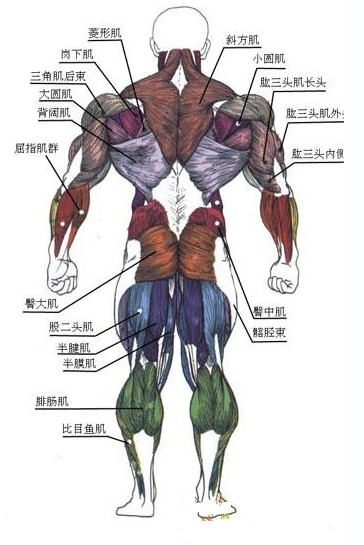

# 健身

## 关于碳水摄入

增减碳水就能增肌减脂？摄入时机才是关键

碳水摄入时间的重要性 
 不只是碳水，三大宏量营养素都有“营养时机”，补充时机选择得好，可以提高训练表现，促进恢复。而碳水又是三大营养素中对摄入时机依赖性最强的，原因是：

碳水是人体主要的能量来源，是稳定血糖的营养素，对运动前的准备、运动中的表现和运动后的恢复这三个阶段都具有近乎决定性的作用。也就是说，碳水的摄入量和时机共同决定了你练得爽还是不爽，结果是大还是不大。

01 / 糖是运动中的首要燃料
碳水化合物分解成糖进入人体后，是最先被身体利用的，优先于蛋白质和脂肪。而且糖是唯一能够同时在有氧和无氧条件下供能的物质，它产生能量的速度比蛋白质和脂肪都要快，在生成ATP的过程中，糖酵解的速率是1.0，糖的有氧氧化是0.5，脂肪有氧氧化是0.25。即使你碳水摄入的少，人体也是要在耗尽糖原之后才开始动用脂肪和分解蛋白质。

02 / 碳水关系运动表现
如果运动中血糖过低，人体的力量、爆发力、敏捷度都会明显下降，甚至可能无法完成单次训练。与运动中血糖相关的因素是运动前的摄入量，随后是运动中的补充。由此可见，运动前中后都需要碳水，但分配有差异（不能平均分配），分配错了，比如把本该在训练前吃的放到了训练后，就会直接影响你的训练状态。

03 / 碳水关系肌肉合成速率
这是力量训练者最在乎的——变大，训练后碳水+蛋白质的补充量和摄入时间，影响着肌肉的合成速率。

增肌期的摄入时机
将一天中50-60%的碳水围绕在训练前中后摄入，其余40-50%可均匀分配在其他时段。之所以围绕训练摄入碳水，原因除了储备糖原之外，还有抑制皮质醇的作用，训练就是皮质醇升高的时候。

01
在训练前
训练前需要足够的肌糖原储备，在2小时内一定要摄入适量碳水，如果在训练前30-40分钟还可以少量补充效果更好。适合训练前2小时内补充的碳水是缓释碳水，各种全麦，低脂酸奶什么的。30分钟时可以来根香蕉、一勺果酱，或者蔓越莓干这些体积不大又能较快提供能量的食物，注意，没有坚果什么事，训练前摄入脂肪会坏事的。

02
在训练过程中
在训练过程中，如果时间不长强度不大，不补充碳水也没大问题，正常补水或者一些必需氨基酸就可以了。如果时间长强度高，则需要补充碳水，以液态形式为佳，以便身体快速吸收利用。因此在训练中啃两口全麦面包是没神马用的，只可能让你胃胀，因为它需要在训练前吃。

在一项碳水和蛋白质对单次力量训练影响的研究中，受试者进行60分钟训练，其中一组摄入6%碳水的液体，一组摄入6%碳水加6g必需氨基酸的溶液，还有一组是安慰剂。结果显示，安慰剂组的血液皮质醇增加了105%，碳水组是11%，碳水加氨基酸组只有7%。

另外一项研究也有类似结论，在两小时的力量训练前补充碳水和蛋白质的混合物，在训练中每15分钟都补充相同溶液，结果他们的蛋白质分解速度降低了8.4%±3.6%，合成提高了49%±22%。为了印证长期效应，研究者将针对单次训练的实验扩大到为期12周的研究，结果还是一样的。在规律力量训练期间，连续12周摄入碳水和必需氨基酸的混合物，优化了肌肉生长和流失的平衡，显著增加了肌纤维的体积。

03
在训练后
训练后是最需要碳水的时刻，理想做法是立刻将碳水配合蛋白质一同摄入，这对恢复糖原非常重要，而且补充蛋白质可以促进糖原再合成并修复肌肉。训练后30分钟最理想，最久也不超过2小时，摄入量是1.5g/Kg，以中高GI碳水为主，扔掉你的糙米和全麦，放心地把白米饭端上来吧。

举例►70kg的小哥哥正在增肌
（每天需摄入350g碳水）
参考分配为：

60%（即约210g）围绕训练前中后，即：

训练前2小时（可能与正餐场合）
50g
训练前30-40分钟
20g
训练中（1-2小时）
20-30g
训练后30分钟-2小时
110-120g

40%（即约140g）均匀分配在其他几餐，即：

正餐1（一般是早餐，如果你不是早上力量训练）
40g
正餐2（如与训练前重合，记得叠加计算）
70g
加餐
30g
*均为为参考量，可根据个人饮食习惯做小幅调整。

减脂期的摄入时机
碳水也是减脂期好盆友。

01
糖原亏空与糖异生
肝糖原的亏空速度：进食3小时后亏空约50%；6小时亏空75%；10小时亏空90%。当体内储存的碳水匮乏时，身体充分燃烧脂肪的能力也将下降，取代糖来供能就是蛋白质。糖异生时，蛋白质和脂肪都会参与供能，但是蛋白质参与的比例更大，这是大家都不想看到的。

02
肌肉大的人更不怕糖
摄入碳水后2-3小时，胰岛素水平逐渐恢复正常，未被消耗的糖原依次储存为肝糖原、肌糖原和脂肪。其实碳水并没有那么容易变成脂肪。大肌肉储存糖的能力更强，从而减少它变成脂肪，这也是为什么我们在减脂时一定要保护肌肉的原因之一。

03
碳水+脂肪是致肥组合
既然碳水没那么容易变脂肪，为什么还会长胖？那是你又吃了脂肪啊！当碳水与脂肪结合，在肌糖原还充足的时候进入体内，不用想了，你肯定要长脂肪了。

04
利用碳水为燃料
如果把碳水作为训练的能量来源（即运动前有库存，训练时又有效被利用），在训练结束后身体将更多的燃烧脂肪。这就是无氧训练（包括力量训练）产生大量的氧债，训练后用更多的脂肪来偿还，即EPOC效应。

当你在减脂期进行力量训练时，碳水的分配比例和增肌期没有太大区别，主要是总量的减少，但是有两个时刻你可以做出一些调整：

训练后的碳水比例。如果增肌期训练后的碳水与蛋白质比例为3:1的话，减脂期可以调整为2:1甚至1:1。

早晨空腹训练。注意，是空腹力量训练，不是有氧训练。这是一个有点极端的操作，如果你身体可以适应的话，进行自重训练还是ok的。碳水可以放在训练之后吃。

举例►70kg的小哥哥正在减脂
（每天摄入220g碳水）
参考分配为：

50%（即约110g）围绕训练前中后，即：
训练前30分钟-2小时（可能与正餐重合）
30g
训练中（1-2小时）
20g
训练后30分钟-2小时
60g

50%（即约110g）均匀分配在其他几餐，即：
正餐1（一般是早餐，如果你不是早上力量训练）
40g 
正餐2（如与训练前重合，记得叠加计算）
50g
加餐
20g

总结时间
1.碳水的作用一是储备糖原，提供能量，二是抑制皮质醇，降低肌肉分解；
2.碳水摄入时机是流动的，效果可能因人而异，但平均分配碳水到三餐一定是不对的；
3.绝大多数情况下，训练前一定要保证足够的碳水摄入，长时间训练时在训练中也需要补充，尽量避免糖异生的发生；
4.碳水需要搭配蛋白质或者氨基酸，才能更好地发挥作用；
5.增肌请重视训练后的一餐，不怕多；减脂也请重视训练后的一餐，别太多。

那些低碳减脂的人，后来都怎么样了？

问题来了，他们为什么要低碳？

运动员备赛。因为要参加健身健美比赛，在赛前需要把皮脂减到最低，“榨干”身体水分。这时候必须低碳，甚至要极端到零碳。

普通减脂人群为什么要低碳？是否有必要低碳？

为什么有些人低碳时感觉还不错呢？

因为身体和感觉会欺骗你。在低碳的初期，你的确会减重，而且皮脂也的确会降低，当你沉浸在成功减脂的喜悦中时，痛苦就没那么明显。“反正我瘦了，身体什么感觉不重要，内心满足就行！”

很好，低碳饮食的确有效果。

低碳减脂原理
碳水化合物、脂肪和蛋白质是我们的三大能量来源，其中碳水是主要的能量担当。当身体没有足够的碳水提供能量时，我们就会更多地动用其它能量物质来代替碳水化合物，此时脂肪和蛋白质就成为新的来源，大量的脂肪经分解代谢产生能量，来维持身体所需。身体通过这一过程动员大量脂肪参与供能，从而实现减脂。

低碳饮食的弊端
如果你只是对碳水稍加控制，连续三五天，这倒不会有什么副作用。但长期低碳，比如持续两周以上，摄入量减半甚至更多，一定会给身体带来副作用。“脑力不济，心情变坏，训练乏力”还只是状态，如果该状态持续下去，则会有如下不良后果。

1. 运动表现下降

运动专家曾做过相关实验，在相同热量摄入的前提下，分成高碳、低碳、高低碳交叉三个组，结果低碳组在进行有氧运动时消耗的氧气最多，而且速度也下降了。相信大多数采用低碳饮食来减脂的人，会辅助大量有氧运动来“加强”减脂效果。那么可以想见，一边低碳一边有氧，这个过程一定是痛苦且低效率的。

那对力量训练的影响呢？也很大！碳水化合物是最直接的能量来源，是无氧糖酵解供能的重要原料，葡萄糖代谢后可以快速产生ATP，帮助我们在健身房完成每一次推拉蹲举。碳水摄入不足时，ATP就无法正常产生，你会马上感到没力气。

因此，不管你是靠力量训练减脂，还是靠有氧运动减脂，低碳都会影响你的状态。这个影响其实不需要长期低碳才会有，只要有两次训练日没有充足碳水，身体马上就有反馈。
 
2. 神经系统疲劳

依赖碳水化合物的不只是肌肉，还有我们的大脑。如果每天能摄入充足的碳水，它分解为葡萄糖之后，有大约120-150g的葡萄糖会被派去给大脑供应能量。如果每天的碳水摄入连这个量都达不到，大脑就会处于“饥饿”状态，表现为反应迟钝，记忆力下降，注意力不集中，一副要罢工的节奏。而且还影响情绪，容易发脾气，这一点你去问问备赛运动员身边的人就知道了（当家属不容易呀！）

因此，低碳饮食会降低血糖浓度，影响大脑正常工作，引发中枢神经系统的疲劳，而这些变化会时时刻刻限制我们的日常活动和前面说到的训练表现。
 
3
损失肌肉
在前面解释低碳减脂的原理时提到，当碳水供应不足，没有葡萄糖可用时，身体就会调动非糖的物质来产生葡萄糖，来源就是脂肪和蛋白质，还有乳酸。这个把非糖物质变成糖的过程叫做“糖异生”。这其实是身体的自我保护，用来在饥饿状态下维持血糖平稳。

低碳减脂的人最高兴也就是这个时刻，脂肪被调去燃烧分解啦！但肌肉的流失也在这个过程中发生。容易忽略的是，蛋白质发生糖异生的速率也很高，甚至会高过脂肪，尤其在既低碳又总热量也低的时候。如果把肌肉看做自己人，把脂肪看做敌人，长期低碳的后果就是，敌死800，自伤1000。

你可能不在乎减去的究竟是什么，就算肌肉和脂肪一起掉，那也是瘦了。但是盒子妹妹要再次敲黑板：长期以流失肌肉为代价的减脂，一定会反弹，并可能让你陷入恶性循环。

长期低碳——肌肉流失，减脂效率降低——继续低碳——继续流失肌肉……

盒子妹妹并不否定低碳对减脂的作用，但是这三个低碳减脂的弊端，你要提前了解。如果只是江湖救急，比如要赶在婚礼前瘦下来，那么可以在热量缺口适中的前提下降低碳水比例，配合有氧运动，适当多补充蛋白质，你可以在短期内看到显著的减脂效果。而随着时间推移，你会发现低碳减脂越到后期越难坚持，可持续性很差，减脂的效果也会越来越小。

盒子妹妹给大家终极建议是：不要轻易低碳、不要长期低碳，更不要依赖它魔法般的短期效果去实现自己“想瘦就瘦”的梦想。大部分周期性地执行低碳饮食的人是出于专业需要，比如健美运动员备赛，耐力运动员控体重，或者格斗、举重等分级别的运动员减重。而运动员因为拥有更多的经验和知识，加上有专业人员指导备赛，他们非常了解自己身体的反应，也清楚这样做的目标。如果普通人效仿这种做法，那只能劝说一句：我们不一样，不一样……

对于那些鼓吹低碳大法好，鼓励没有经验的妹子们不吃碳水，以每天20、30g碳水摄入量为荣的文章和所谓的减脂营，我们把餐盒装满红薯，一笑而过就好。

盒子妹妹说了半天低碳，到底多低算低，多高算高啊？

我们有两种计算方式，两种都可以算出你的正常碳水需求。

以全天摄入比例算
（适合普通减脂人群和初级健身减脂）
全天摄入量的50%来自碳水，这是符合营养素均衡的。

如果想稍降低一点比例，建议从减少5%开始。不要小看这一点点，它足以给你身体带来反应。如果一上来就45%以下，你在减脂后期的空间就小了。

 以体重和运动强度计算
（适合有运动基础的人保持肌肉量）
中等强度运动者，每天摄入4.5-6.5g碳水/kg体重，也就是说75kg的人训练日至少要有338g的碳水摄入。

高强度运动者，每天摄入7-8g碳水/kg体重，还是举例75kg的训练者，他每天需摄入大约525g碳水。
