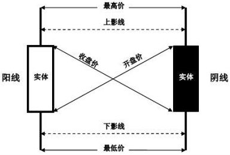
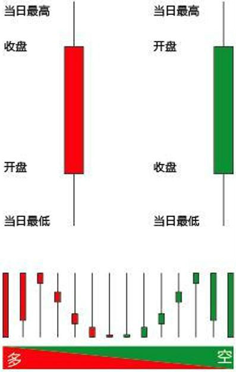

    <a href="#金融" style="color: white; border-right: 1px solid white; text-decoration: none; font-size: 14px; font-weight: bold; display: inline-block; padding: 5px 8px; line-height: 20px;">back to top ▲</a>
    <a style="cursor: pointer; color: white; border-right: 1px solid white; text-decoration: none; font-weight: bold; display: inline-block; padding: 5px 8px; line-height: 20px;" onclick="(function(){document.querySelector('.btn.pull-left.js-toolbar-action').click()})()"><i class="fa fa-align-justify"></i></a>

# 金融

## K线

起源于日本德川幕府时代，最初被米市商人用来记录米市行情与价格波动。

* 日K线：开盘价，收盘价，最高价和最低价；
* 周K线：周一开盘价，周五收盘价，全周最高价和全周最低价；
* 月K线：一个月第一个交易日的开盘价，最后一个交易日的收盘价，全月最高价与全月最低价；
* 年K线、5分钟K线、15分钟K线、30分钟K线和60分钟K线。

|线型名称|开盘价/收盘价波动范围|
|:---|:---|
|极阴线/极阳线|<=0.5%|
|小阴线/小阳线|0.6~1.5%|
|中阴线/中阳线|1.6~3.5%|
|大阴线/大阳线|>=3.6%|

## 市盈率（Price Earnings ratio，即P/E ratio）

市盈率 = 股价 ÷ 每股盈利

|市盈率范围|说明|
|:---|:---|
|<0|公司盈利为负（盈利为负，计算市盈率没有意义，一般软件显示为“-”）|
|0-13|价值被低估|
|14-20|正常水平|
|21-28|价值被高估|
|28+|反映股市出现投机性泡沫|

## 换手率（Turnover Rate）

一定时间内市场中股票转手买卖的频率，反映股票流通性强弱的指标之一。

换手率 = (成交量 ÷ 流通总股数（手）) × 100%

## ETF（Exchange Traded Funds，交易型开放式指数基金）

## 指数

## 隔夜利息

## 头寸