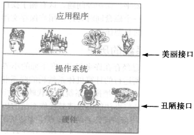

# 操作系统

* 操作系统是一种运行在内核态的软件，为应用程序提供一个资源集的清晰抽象，并管理这些硬件资源；
* 操作系统是管理和控制计算机软硬件资源的计算机程序，是直接运行在“裸机”上的最基本的系统软件，任何其他软件都必须在操作系统的支持下才能运行；
* 操作系统是管理计算机硬件资源，控制其他程序运行并为用户提供交互操作界面的系统软件的集合。操作系统是计算机系统的关键组成部分，负责管理与配置内存、决定系统资源供需的优先次序、控制输入与输出设备、操作网络与管理文件系统等基本任务。

