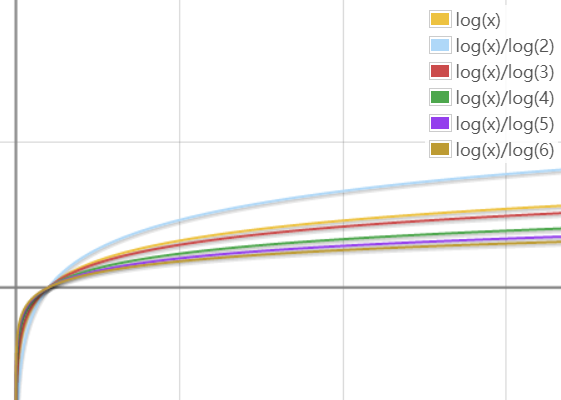

    <a href="#目录" style="color: white; border-right: 1px solid white; text-decoration: none; font-size: 14px; font-weight: bold; display: inline-block; padding: 5px 8px; line-height: 20px;">back to top ▲</a>
    <a style="cursor: pointer; color: white; border-right: 1px solid white; text-decoration: none; font-weight: bold; display: inline-block; padding: 5px 8px; line-height: 20px;" onclick="(function(){document.querySelector('.btn.pull-left.js-toolbar-action').click()})()"><i class="fa fa-align-justify"></i></a>

# 算法

### 算法时间复杂度定义

> 算法中基本操作重复执行的次数是问题规模n的某个函数，用T(n)表示，若有某个辅助函数f(n),使得当n趋近于无穷大时，T(n)/f(n)的极限值为不等于零的常数，则称f(n)是T(n)的同数量级函数。记作T(n)=O(f(n)),称O(f(n))为算法的渐进时间复杂度，简称时间复杂度。

用大写O()来体现算法时间复杂度的记法叫做大O记法。

随着模块n的增大，算法执行的时间的增长率和f(n)的增长率成正比，所以f(n)越小，算法的时间复杂度越低，算法的效率越高。

推导大O阶:
1. 用常数1取代运行时间中的所有加法常数；
2. 在修改后的运行次数函数中，只保留最高阶项；
3. 如果最高阶项存在且不是1，则去除与这个项相乘的常数。

得到的结果就是大O阶。

> 对数（log底数真数）

>> 23 = 8; log28 = 3; 2log28 = 8

>> 负数与零无对数

>> lgx = log10x（常用对数）; lnx = logex（自然对数）

>> logab * logba = 1

>> loga(MN) = logaM + logaN; loga(M/N) = logaM - logaN

>> logaMn = nlogaM; loganM = (1/n)logaM; loganbm = (m/n)logab

>> logab = lnb/lna

>> 

>> 

>> 考虑O(logxn)和O(logyn)，x != y。当n趋于无穷大时logxn/logyn的极限等于lny/lnx，是一个常数，也就是说，在n趋于无穷大的时候，logxn和logyn仅相差一个常数。所以从研究算法的角度来说log的底数不重要，可以直接记为logn。

### 常见的时间复杂度

|执行次数函数|阶|非正式术语|能承受的大致规模|常见算法|
|:---|:---|:---|:---|:---|
|12|O(1)|常数阶|任意|直接输出结果|
|2n+3|O(n)|线性阶|五六百万|贪心算法、扫描和遍历|
|3n2+2n+1|O(n2)|平方阶|两千左右|枚举、动态规划|
|5log2n+20|O(logn)|对数阶|任意|二分查找、快速幂|
|2n+3nlog2n+19|O(nlogn)|nlogn阶|三四十万|带有分治思想的算法，如二分法|
|6n3+2n2+3n+4|O(n3)|立方阶|两百左右|动态规划|
|2n|O(2n)|指数阶|24|搜索|
|n!|O(2n)|-|10|产生全排列|
|nn|O(2n)|-|8|暴力破解密码|

0(1) < O(logn) < O(n) < O(nlogn) < 0(n2) < 0(n3) < 0(2n) < O(n!) < O(nn)