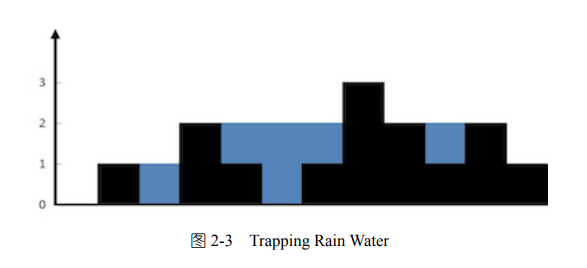

# Code-Puzzle

#### Q: Trapping Rain Water

##### DESCRIPTION
Given n non-negative integers representing an elevation map where the width of each bar is 1, compute how much water it is able to trap after raining.

For example, Given [0,1,0,2,1,0,1,3,2,1,2,1], return 6.



```python

```


#### Q: League Table

> Hard  20min   6 points

##### DESCRIPTION

The LeagueTable class tracks the score of each player in a league. After each game, the player records their score with the record_result function. 

The player's rank in the league is calculated using the following logic:

1. The player with the highest score is ranked first (rank 1). The player with the lowest score is ranked last.
2. If two players are tied on score, then the player who has played the fewest games is ranked higher.
3. If two players are tied on score and number of games played, then the player who was first in the list of players is ranked higher.

Implement the player_rank function that returns the player at the given rank.

For example:

```python
table = LeagueTable(['Mike', 'Chris', 'Arnold'])
table.record_result('Mike', 2)
table.record_result('Mike', 3)
table.record_result('Arnold', 5)
table.record_result('Chris', 5)
print(table.player_rank(1))
```

All players have the same score. However, Arnold and Chris have played fewer games than Mike, and as Chris is before Arnold in the list of players, he is ranked first. Therefore, the code above should display "Chris".

##### ANSWER
```python
from collections import Counter
from collections import OrderedDict

class LeagueTable:
    def __init__(self, players):
        self.standings = OrderedDict([(player, Counter()) for player in players])
    
    def record_result(self, player, score):
        self.standings[player]['games_played'] += 1
        self.standings[player]['score'] += score
      
    def player_rank(self, rank):
        return sorted(self.standings.items(), 
                    key=lambda k_v: (k_v[1]['score'], 
                                     -k_v[1]['games_played'], 
                                     -list(self.standings.keys()).index(k_v[0])))[-rank][0]
```


#### Q: File Owners

> Easy  10min   3 points

##### DESCRIPTION

Implement a group_by_owners function that:

* Accepts a dictionary containing the file owner name for each file name.
* Returns a dictionary containing a list of file names for each owner name, in any order.

For example, for dictionary {'Input.txt': 'Randy', 'Code.py': 'Stan', 'Output.txt': 'Randy'} the group_by_owners function should return {'Randy': ['Input.txt', 'Output.txt'], 'Stan': ['Code.py']}.

##### ANSWER

```python
class FileOwners:

    @staticmethod
    def group_by_owners(files):
        result = dict()
        for file_name, owner_name in files.items():
            if owner_name in result:
                result[owner_name].append(file_name)
            else:
                result[owner_name] = [file_name]
        return result
```


#### Q: Path

> Hard  30min   8 points

##### DESCRIPTION

Write a function that provides change directory (cd) function for an abstract file system.

Notes:

* Root path is '/'.
* Path separator is '/'.
* Parent directory is addressable as '..'.
* Directory names consist only of English alphabet letters (A-Z and a-z).
* The function should support both relative and absolute paths.
* The function will not be passed any invalid paths.
* Do not use built-in path-related functions.

For example:

```python
path = Path('/a/b/c/d')
path.cd('../x')
print(path.current_path)
```

should display '/a/b/c/x'.

##### ANSWER

```python
class Path:
    def __init__(self, path):
        self.current_path = path

    def cd(self, new_path):
        if new_path[0] == '/':
            self.current_path = new_path
            return

        items = self.current_path.split('/')

        for item in new_path.split('/'):
            if (item == '..'):
                if len(items) > 1:
                    items.pop()
            else:
                if len(item) > 0:
                    items.append(item)
                    
        self.current_path = '/'.join(items)
```

#### Q: Ice Cream Machine

> Easy  10min   3 points

##### DESCRIPTION

Implement the IceCreamMachine's scoops method so that it returns all combinations of one ingredient and one topping. If there are no ingredients or toppings, the method should return an empty list.

For example, IceCreamMachine(["vanilla", "chocolate"], ["chocolate sauce"]).scoops() should return [['vanilla', 'chocolate sauce'], ['chocolate', 'chocolate sauce']].

##### ANSWER

```python
class IceCreamMachine:
    
    def __init__(self, ingredients, toppings):
        self.ingredients = ingredients
        self.toppings = toppings
        
    def scoops(self):
        return [[ingredient, topping] for ingredient in self.ingredients for topping in self.toppings]
```

#### Q: Two Sum

> Easy  30min   5 points

##### DESCRIPTION

Write a function that, when passed a list and a target sum, returns two distinct zero-based indices of any two of the numbers, whose sum is equal to the target sum. If there are no two numbers, the function should return None.

For example, find_two_sum([3, 1, 5, 7, 5, 9], 10) should return a single tuple containing any of the following pairs of indices:

* 0 and 3 (or 3 and 0) as 3 + 7 = 10
* 1 and 5 (or 5 and 1) as 1 + 9 = 10
* 2 and 4 (or 4 and 2) as 5 + 5 = 10

##### ANSWER

```python
class TwoSum:
    @staticmethod
    def find_two_sum(numbers, target_sum):
        lookup = {}
        for i in range(len(numbers)):
            lookup[target_sum - numbers[i]] = i
        for i in range(len(numbers)):
            if numbers[i] in lookup and lookup[numbers[i]] != i:
                return (lookup[numbers[i]], i)
        return None
```


#### Q: Palindrome

> Easy  10min   3 points

##### DESCRIPTION

A palindrome is a word that reads the same backward or forward.

Write a function that checks if a given word is a palindrome. Character case should be ignored.

For example, is_palindrome("Deleveled") should return True as character case should be ignored, resulting in "deleveled", which is a palindrome since it reads the same backward and forward.

##### ANSWER
```python
class Palindrome:

    @staticmethod
    def is_palindrome(word):
        word = word.lower()
        return word == word[::-1]
```


#### Q: Binary Search Tree

> Easy  15min   5 points

##### DESCRIPTION

A three-node binary tree.Binary search tree (BST) is a binary tree where the value of each node is larger or equal to the values in all the nodes in that node's left subtree and is smaller than the values in all the nodes in that node's right subtree.


Write a function that checks if a given binary search tree contains a given value.

For example, for the following tree:

* n1 (Value: 1, Left: null, Right: null)
* n2 (Value: 2, Left: n1, Right: n3)
* n3 (Value: 3, Left: null, Right: null)

Call to contains(n2, 3) should return True since a tree with root at n2 contains number 3.

##### ANSWER
```python
import collections

class BinarySearchTree:

    Node = collections.namedtuple('Node', ['left', 'right', 'value'])

    @staticmethod
    def contains(root, value):
        if (root == None):
            return False
        if (value < root.value):
            return BinarySearchTree.contains(root.left, value)
        if (value > root.value):
            return BinarySearchTree.contains(root.right, value)
        return True
```


#### Q: Playlist

> Easy  15min   5 points

##### DESCRIPTION

A playlist is considered a repeating playlist if any of the songs contain a reference to a previous song in the playlist. Otherwise, the playlist will end with the last song which points to None.

Implement a function is_repeating_playlist that returns true if a playlist is repeating or false if it is not.

For example, the following code prints "True" as both songs point to each other.

```python
first = Song("Hello")
second = Song("Eye of the tiger")
    
first.next_song(second)
second.next_song(first)
    
print(first.is_repeating_playlist())
```

##### ANSWER
```python
class Song:
    def __init__(self, name):
        self.name = name
        self.next = None

    def next_song(self, song):
        self.next = song
    
    def is_repeating_playlist(self):
        """
        :returns: (bool) The position of the character.
        """
        songs = set()
        song = self
        while (song != None):
            if (song in songs):
                return True
            
            songs.add(song)
            song = song.next
        
        return False
```
