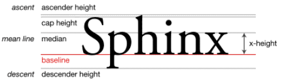

# line-height

对于非替换元素的纯内联元素，其可视高度完全由 line-height 决定。注意这里的措辞—“完全”，什么padding、 border 属性对可视高度是没有任何影响的，这也是我们平常口中的“盒模型”约定俗成说的是块级元素的原因。

“行距”的作用是可以瞬间明确我们的阅读方向

但是在 CSS 中，“行距”分散在当前文字的上方和下方，也就是即使是第一行文字，其上方也
是有“行距”的，只不过这个“行距”的高度仅仅是完整“行距”高度的一半，因此，也被称为“半
行距”。

行距 = 行高 − em-box。转换成 CSS 语言就是：行距 = line-height - font-size。

em-box 是 CSS 世界中比较虚的一个概念，说“虚”并不是胡编乱造的意思，而是我们无
法有效感知这个盒子具体的位置在哪里，但是有一点可以明确，就是其高度正好就是 1em。 em
是一个相对 font-size 大小的 CSS 单位，

“行距”，我们一分为二，就有了“半行距”，分别加在 em-box 上面和下面就构成了文字的完整高度了。

很多人会把文字图形区域看成是 em-box 范围，
实际上这是不正确的，比方说，一些带尾巴的英文字符 q 或者 g，其小尾巴是在 em-box 范围之
外的，而对于汉字，很多字体图形高度实际上要小于 em-box 高度的。

内容区域（content area）出马了。在本书中，内容区域可以近似理解为 Firefox/IE
浏览器下文本选中带背景色的区域。

内容区域和 em-box 是不一样的，内容区域高度受 font-family 和
font-size 双重影响，而 em-box 仅受 font-size 影响，

line-height
可以影响替换元素（如图片的高度）吗？答案是，不可以！

图片为内联元素，会构成一个“行框盒子”，而在 HTML5 文档模式下，每一个“行框盒
子”的前面都有一个宽度为 0 的“幽灵空白节点”，其内联特性表现和普通字符一模一样，所以，
这里的容器高度会等于 line-height 设置的属性值 256px

图文和文字混在一起，由于同属内联元素，因此，会共同形成一个“行框盒子”， line-height 在这个混合元素
的“行框盒子”中扮演的角色是决定这个行盒的最小高度，

对于块级元素， line-height 对其本身是没有任何作用的，我们平时改变 line-height，
块级元素的高度跟着变化实际上是通过改变块级元素里面内联级别元素占据的高度实现的

说“近似”是因为文字字形的垂直中线位置普遍要比真正的“行框盒子”的垂直中线位置
低

* 行高，line-height
* 行距
* 行框盒子
* 幽灵空白节点,每个“行框盒子”都会附带的一个产物—“幽灵空白节点”

vertical-align 的默认值是 baseline，即基线对齐，而基线的定义是字母 x 的
下边缘。因此，内联元素默认都是沿着字母 x 的下边缘对齐的。

在 CSS 世界中，凡是百分比值，均是需要一个相对计算的值，例如， margin 和 padding
是相对于父元素的宽度计算的， line-height 是相对于 font-size 计算的，而这里的 verticalalign 属性的百分比值则是相对于 line-height 的计算值计算的。

---------------------------------------------
20190430

在各种内联相关模型中，凡是涉及垂直方向的排版或者对齐的，都离不开最基本的基线（baseline）。例如，line-height 行高的定义就是两基线的间距，vertical-align 的默认值就是基线，其他中线顶线一类的定义也离不开基线，基线甚至衍生出了很多其他基线概念（如图 5-1 所示）。

基线（baseline）

* line-height 行高的定义是两基线的间距
* vertical-align 的默认值就是基线
* 字母 x 的下边缘（线）就是基线

x-height

* 小写字母 x 的高度；
* 术语描述就是基线和等分线（mean line）（也称作中线，midline）之间的距离。

* ascender height：上下线高度；
* cap height：大写字母高度；
* median：中线；
* descender height：下行线高度。

verticalalign: middle

这里的 middle 是中间的意思。注意，跟上面的 median（中线）不是一个意思。

在 CSS 世界中，middle 指基线往上 1/2 x-height 高度。可以近似理解为字母 x 交叉点位置。