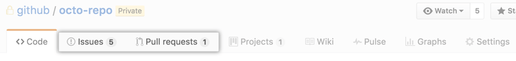
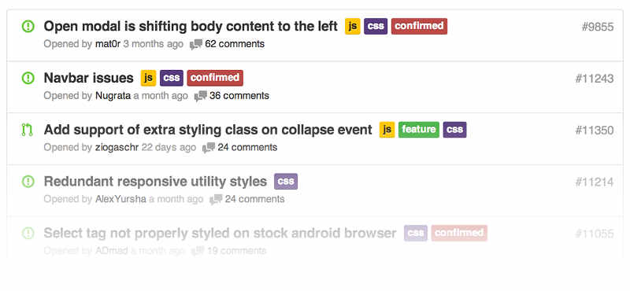

# 目录

* [Git Cheat Sheet](#git-cheat-sheet)
* [Issue](#issue)

# 
Git Cheat Sheet

###### [
back to top ▲
](#目录)

### CREATE
|description|usage|
|:---|:---|
|Clone an existing repository|$ git clone ssh://user@domain.com/repo.git|
|Create a new local repository|$ git init|

### LOCAL CHANGES
|description|usage|
|:---|:---|
|Changed files in your working directory|$ git status|
|Changes to tracked files|$ git diff|
|Add all current changes to the next commit|$ git add .|
|Add some changes in &lt;file&gt; to the next commit|$ git add -p &lt;file&gt;|
|Commit all local changes in tracked files|$ git commit -a|
|Commit previously staged changes|$ git commit|
|Change the last commit. Don't amend published commits!|$ git commit --amend|

### COMMIT HISTORY
|description|usage|
|:---|:---|
|Show all commits, starting with newest|$ git log|
|Show changes over time for a specifc file|$ git log -p &lt;file&gt;|
|Who changed what and when in &lt;file&gt;|$ git blame &lt;file&gt;|

### BRANCHES & TAGS
|description|usage|
|:---|:---|
|List all existing branches|$ git branch -av|
|Switch HEAD branch|$ git checkout &lt;branch&gt;
|Create a new branch based on your current HEAD|$ git branch &lt;new-branch&gt;|
|Create a new tracking branch based on a remote branch|$ git checkout --track &lt;remote/branch&gt;|
|Delete a local branch|$ git branch -d &lt;branch&gt;
|Mark the current commit with a tag|$ git tag &lt;tag-name&gt;|

### UPDATE & PUBLISH
|description|usage|
|:---|:---|
|List all currently confgured remotes|$ git remote -v|
|Show information about a remote|$ git remote show &lt;remote&gt;|
|Add new remote repository, named &lt;remote&gt;|$ git remote add &lt;shortname&gt; &lt;url&gt;|
|Download all changes from &lt;remote&gt;, but don't integrate into HEAD|$ git fetch &lt;remote&gt;|
|Download changes and directly merge/integrate into HEAD|$ git pull &lt;remote&gt; &lt;branch&gt;|
|Publish local changes on a remote|$ git push &lt;remote&gt; &lt;branch&gt;|
|Delete a branch on the remote|$ git branch -dr &lt;remote/branch&gt;|
|Publish your tags|$ git push --tags|

### MERGE & REBASE
|description|usage|
|:---|:---|
|Merge &lt;branch&gt; into your current HEAD|$ git merge &lt;branch&gt;|
|Rebase your current HEAD onto &lt;branch&gt;. Don't rebase published commits!|$ git rebase &lt;branch&gt;|
|Abort a rebase|$ git rebase --abort|
|Continue a rebase after resolving conflicts|$ git rebase --continue|
|Use your confgured merge tool to solve conflicts|$ git mergetool|
|Use your editor to manually solve conflicts and (after resolving) mark file as resolved|$ git add &lt;resolved-file&gt;|
| |$ git rm &lt;resolved-file&gt;|

### UNDO
|description|usage|
|:---|:---|
|Discard all local changes in your working directory|$ git reset --hard HEAD|
|Discard local changes in a specifc file|$ git checkout HEAD &lt;file&gt;|
|Revert a commit (by producing a new commit with contrary changes)|$ git revert &lt;commit&gt;|
|Reset your HEAD pointer to a previous commit …and discard all changes since then|$ git reset --hard &lt;commit&gt;|
|…and preserve all changes as unstaged changes|$ git reset &lt;commit&gt;|
|…and preserve uncommitted local changes|$ git reset --keep &lt;commit&gt;|

# 
Issue

###### [
back to top ▲
](#目录)

Issue（译"问题"或"事务"）指一项待完成的工作，通常与系统的改进相关：
* 一个软件的bug
* 一项功能建议
* 一项待完成的任务
* 文档缺失的报告

每个Issue应该包含该问题的所有信息和历史，使后来的人只看这个Issue，就能了解问题的所有方面和过程。

> Issue起源于客服部门。用户打电话反映问题，客服就创建一个工单（ticket），后续的每一个处理步骤、每一次与用户的交流，都要更新工单，记录全部信息。这就是Issue的前身。

> 因此，Issue的原始功能是问题追踪和工单管理，后来不断扩展，逐渐演变成全功能的项目管理工具，还可以用于制定和实施软件的开发计划。

专门管理Issue的软件，叫做Issue跟踪管理系统（Issue tracking system）。Issue跟踪管理系统应该具有以下功能：
* 项目管理 
    * 指定Issue的优先级 
    * 指定Issue所在的阶段 
    * 分配负责Issue的处理人员 
    * 制定日程 
    * 监控进度，提供统计
* 团队合作 
    * 讨论 
    * 邮件通知
* 代码管理 
    * 将Issue关联源码 
    * 将Issue关联代码提交与合并

## 基本使用

* 每个Github代码仓库都有一个Issues面板。

    

* 进入该面板，点击"New Issue"按钮，就可以新建Issue。

    

    上图是新建Issue的界面，左侧填入Issue的标题和内容，右侧是四个配置项（只有项目管理者才能看到）。
    * Assignees：人员
    * Labels：标签
    * Projects：项目
    * Milestone：里程碑

### Assignees

Assignees选择框用于从当前仓库的所有成员之中，指派某个Issue的处理人员。

### Labels

Issue可以贴上标签，这样有利于分类管理和过滤查看。

#### 常用 Label

对于大型项目，每个Issue至少应该有两个Label，一个表示性质，另一个表示优先级。

* 性质Label：

    

* 优先级Label：
    * 高优先级（High）：对系统有重大影响，只有解决它之后，才能去完成其他任务。
    * 普通优先级（Medium）：对系统的某个部分有影响，用户的一部分操作会达不到预期效果。
    * 低优先级（Low）：对系统的某个部分有影响，用户几乎感知不到。
    * 微不足道（Trivial）：对系统的功能没有影响，通常是视觉效果不理想，比如字体和颜色不满意。

### Milestone

Milestone，"里程碑"，用作Issue的容器，相关Issue可以放在一个Milestone里面。常见的例子是不同的版本（version）和迭代（sprint），都可以做成Milestone。

#### 新建Milestone：

1. 在Issues面板的首页，点击Milestones按钮；

    

2. 接着再点击New milestone按钮，然后填写Milestone的名称和内容，还可以指定到期时间。

## 全局视图

Issues面板只能查看和操作当前仓库，Github还提供全局视图，让用户查看和操作所有与自己相关的Issue。

访问[github.com/issues](https://github.com/issues)，就可以打开全局视图。里面的Issue分成三类：

* Created：你创建的Issue
* Assigned：分配给你的Issue
* Mentioned：提及你的Issue

Created和Assigned的含义显而易见，Mentioned是指他人在Issue里面@了你：

> It looks like the new widget form is broken on Safari. When I try and create the widget, Safari crashes. This is reproducible on 10.8, but not 10.9. Maybe a browser bug?/cc @kneath @jresig

全局视图还提供了搜索、过滤和排序功能:

## 看板功能

看板（Kanban）是敏捷开发的重要手段，主要用于项目的进度管理。所有需要完成的任务，都做成卡片，贴在一块白板上面，这就是看板。

常见的可将项目周期分成三列：

* Todo （待开发）
* Doing （开发中）
* Done （已完成）

可以根据实际情况，分出更多的列：

* Todo（待安排）
* Plan（计划）
* Develop（开发）
* Test（测试）
* Deploy（部署）
* Done（已完成）

### Github的看板功能

Github提供Issue看板：

1. 首先，在仓库首页进入Projects面板；

    

2. 然后，点击New Project按钮，新建一个Project，比如"2.0 版"；
3. 接着，点击Add column按钮，为该项目新建若干列；
4. 最后，将Issue分配到对应的列，就新建成功了一个看板视图。

    
    
**Issue可以从一列拖到另一列，表示从一个阶段进入另一个阶段。**