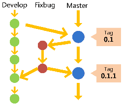
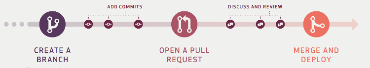
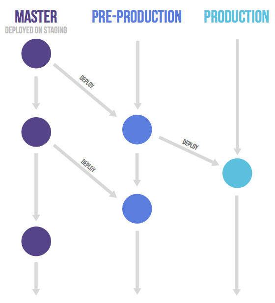

<div style="position: fixed; bottom: 20px; right: 39px; border-radius: 5px; background-color: #797979; z-index: 100;">
    <a href="#目录" style="color: white; border-right: 1px solid white; text-decoration: none; font-size: 14px; font-weight: bold; display: inline-block; padding: 5px 8px; line-height: 20px;">back to top ▲</a>
    <a style="cursor: pointer; color: white; border-right: 1px solid white; text-decoration: none; font-weight: bold; display: inline-block; padding: 5px 8px; line-height: 20px;" onclick="(function(){document.querySelector('.btn.pull-left.js-toolbar-action').click()})()"><i class="fa fa-align-justify"></i></a>
</div>

# 工作流程及分支管理

* [Git flow](#git-flow)
* [GitHub flow](#github-flow)
* [GitLab flow](#gitlab-flow)

“工作流程”在英语中叫做“workflow”或者“flow”，意为水流，比喻项目像水流那样，顺畅、自然地向前流动，不会发生冲击、对撞、甚至漩涡。

> **功能驱动式开发（feature-driven development，FDD）**：需求是开发的起点，先有需求再有功能分支（feature branch）或者补丁分支（hotfix branch）。完成开发后，该分支就合并到主分支，然后被删除。

# <p align="center">Git flow</p>

### 特点一：

**项目存在两个长期分支：**


* 主分支（master）：代码库应该有且仅有一个主分支，用于存放对外发布的版本，任何时候在这个分支拿到的，都是稳定的分布版。所有提供给用户使用的正式版本，都在这个主分支上发布。Git主分支的名字，默认叫做master，它是自动建立的，版本库初始化以后，默认就是在主分支上进行开发；


* 开发分支（develop）：用于日常开发，存放最新的开发版。这个分支可用来生成代码的最新隔夜版本（nightly）。如果想正式对外发布，就在Master分支上，对Develop分支进行“合并”（merge）。


```bash
# Git创建develop分支
git checkout -b develop master

# 将develop分支发布到master分支：
# 1. 切换到master分支
git checkout master

# 2. 对develop分支进行合并
git merge --no-ff develop
```

默认情况下，Git执行"快进式合并"（fast-farward merge），会直接将master分支指向develop分支；使用--no-ff参数后，会在master分支上生成一个新节点再执行合并。为保证版本演进的清晰，我们希望采用这种做法：


### 特点二：

**项目存在三种短期分支：**

常设分支只需要Master和Develop这两条就够了。但是除了常设分支，还需要一些临时性分支用于应对一些特定目的的版本开发，一旦完成开发，它们就会被合并进develop或master，然后被删除。

* 功能分支（feature branch）：为开发某种特定功能，从Develop分支上面分出来的。开发完成后，要再并入Develop。功能分支命名可以采用“feature-*”的形式；


```bash
# 创建一个功能分支
git checkout -b feature-x develop

# 开发完成后，将功能分支合并到develop分支
git checkout develop
git merge --no-ff feature-x

# 删除feature分支
git branch -d feature-x
```

* 预发分支（release branch）：发布正式版本之前（即合并到Master分支之前），可能需要有一个预发布的版本进行测试。预发布分支是从Develop分支上面分出来的，预发布结束以后，必须合并进Develop和Master分支。预发分支命名可以采用“release-*”的形式；


```bash
# 创建一个预发布分支
git checkout -b release-1.2 develop

# 确认没有问题后，合并到master分支
git checkout master
git merge --no-ff release-1.2

# 对合并生成的新节点，做一个标签
git tag -a 1.2

# 再合并到develop分支
git checkout develop
git merge --no-ff release-1.2

# 最后，删除预发布分支
git branch -d release-1.2
```

* 补丁分支（hotfix branch）：软件正式发布以后，难免会出现bug。这时就需要创建一个分支，进行bug修补。补丁分支是从Master分支上面分出来的。修补结束后再合并进Master和Develop分支。补丁分支命名可以采用“fixbug-*”的形式。



```bash
# 创建一个修补bug分支
git checkout -b fixbug-0.1 master

# 修补结束后，合并到master分支
git checkout master
git merge --no-ff fixbug-0.1
git tag -a 0.1.1

# 再合并到develop分支
git checkout develop
git merge --no-ff fixbug-0.1

# 最后，删除“修补bug分支”
git branch -d fixbug-0.1
```


# <p align="center">GitHub flow</p>

GitHub flow是Git flow的简化版，专门配合"持续发布"，是github.com使用的工作流程。



1. 根据需求，从master拉出新分支，不区分功能分支或补丁分支；
2. 新分支开发完成后，或者需要讨论的时候，就向master发起一个pull request（简称PR）；
3. Pull Request既是一个通知，让别人注意到你的请求，又是一种对话机制，大家一起评审和讨论你的代码。对话过程中，你还可以不断提交代码；
4. 你的Pull Request被接受，合并进master，重新部署后，原来你拉出来的那个分支就被删除。（先部署再合并也可。）

> 对于“持续发布”的产品，GitHub flow是最合适的流程。但GitHub flow假设master分支的更新与产品的发布是一致的，即默认master分支的最新代码就是当前的线上代码。但有时实际情况并非如此，代码合并进入master分支，并不代表它就能立刻发布。比如，苹果商店的APP提交审核以后，等一段时间才能上架。这时，如果还有新的代码提交，master分支就会与刚发布的版本不一致。另一个例子是，有些公司有发布窗口，只有指定时间才能发布，这也会导致线上版本落后于master分支。上面这种情况，只有master一个主分支就不够用了。通常，你不得不在master分支以外，另外新建一个production分支跟踪线上版本。


# <p align="center">GitLab flow</p>

GitLab flow是Git flow与GitHub flow的综合，它吸取了两者的优点，既有适应不同开发环境的弹性，又有单一主分支的简单和便利，是Gitlab.com推荐的做法。

#### 上游优先（upsteam first）

GitLab flow最大的原则叫做“上游优先”（upsteam first），即只存在一个主分支master，它是所有其他分支的“上游”。只有上游分支采纳的代码变化才能应用到其他分支。

GitLab flow分成两种情况，适应不同的开发流程：

* #### 持续发布

对于“持续发布”的项目，它建议在master分支以外再建立不同的环境分支。比如，“开发环境”的分支是master，“预发环境”的分支是pre-production，“生产环境”的分支是production。

开发分支是预发分支的“上游”，预发分支又是生产分支的“上游”。代码的变化，必须由“上游”向“下游”发展。比如，生产环境出现了bug，这时就要新建一个功能分支，先把它合并到master，确认没有问题，再cherry-pick到pre-production，这一步也没有问题，才进入production。

只有紧急情况，才允许跳过上游，直接合并到下游分支。



* #### 版本发布

对于“版本发布”的项目，建议每一个稳定版本都要从master分支拉出一个分支，比如2-3-stable、2-4-stable等等。

以后，只有修补bug，才允许将代码合并到这些分支，并且此时要更新小版本号。


## 小技巧

* ### Pull Request

功能分支合并进master分支，必须通过Pull Request（GitLab里叫Merge Request）。

Pull Request本质是一种对话机制，可以在提交的时候，@相关人员或团队，引起他们的注意。

* ### Protected branch

master分支应该受到保护，不是每个人都可以修改这个分支，以及拥有审批Pull Request的权力。

GitHub和GitLab都提供“保护分支”（Protected branch）功能。

* ### Issue

Issue用于Bug追踪和需求管理。建议先新建Issue，再新建对应的功能分支。功能分支总是为了解决一个或多个Issue。

功能分支的名称，可以与issue的名字保持一致，并且以issue的编号起首，比如“15-require-a-password-to-change-it”。

开发完成后，在提交说明里可以写上"fixes #14"或者"closes #67"。Github规定，只要commit message里面有以下动词 + 编号，就会关闭对应的issue。

close closes closed fix fixes fixed resolve resolves resolved

这种方式还可以一次关闭多个issue，或者关闭其他代码库的issue，格式是username/repository#issue_number。

Pull Request被接受以后，issue关闭，原始分支就应该删除。如果以后该issue重新打开，新分支可以复用原来的名字。

* ### Merge节点

Git有两种合并：

1. “直进式合并”（fast forward），不生成单独的合并节点；
2. “非直进式合并”（none fast-forword），会生成单独节点。

前者不利于保持commit信息的清晰，也不利于以后的回滚，建议总是采用后者（即使用--no-ff参数）。只要发生合并，就要有一个单独的合并节点。

* ### Squash多个commit

为了便于他人阅读你的提交，也便于cherry-pick或撤销代码变化，在发起Pull Request之前，应该把多个commit合并成一个。（前提是，该分支只有你一个人开发，且没有跟master合并过）


