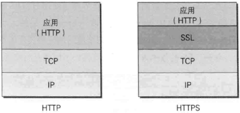

    <a href="#目录" style="color: white; border-right: 1px solid white; text-decoration: none; font-size: 14px; font-weight: bold; display: inline-block; padding: 5px 8px; line-height: 20px;">back to top ▲</a>
    <a style="cursor: pointer; color: white; border-right: 1px solid white; text-decoration: none; font-weight: bold; display: inline-block; padding: 5px 8px; line-height: 20px;" onclick="(function(){document.querySelector('.btn.pull-left.js-toolbar-action').click()})()"><i class="fa fa-align-justify"></i></a>

HTTPS，安全增强版的HTTP，S表示TLS、SSL。HTTPS是HTTP与安全套接口层(SSL)的结合，使HTTP的协议数据在传输过程中更安全。

HTTPS = HTTP + 加密 + 认证 + 完整性保护

HTTPS不是应用程序的新协议，而是HTTP通信接口部分使用SSL（Secure Socket Layer）和TLS（Transport Layer Security）协议代替而已。

SSL是独立于HTTP的协议，其它应用层协议如SMTP和Telnet都可以配合SSL协议使用。

* 共享密钥加密（Common key crypto system）

加密和解密使用同一个密钥的方式称为共享秘钥加密，也称对称秘钥加密

* 公开密钥加密（Public-key cryptography）

公开密钥加密使用一对非对称的密钥，一把私钥（private key），一把公钥（public key）

[公钥与私钥](https://www.linuxprobe.com/public-private-key.html)

认证机关的公开密钥必须安全地转交给客户端，使用通信方式很难实现安全转交，所以大多数浏览器开发商发布版本时会事先在浏览器内部植入常用认证机构的公开密钥。

