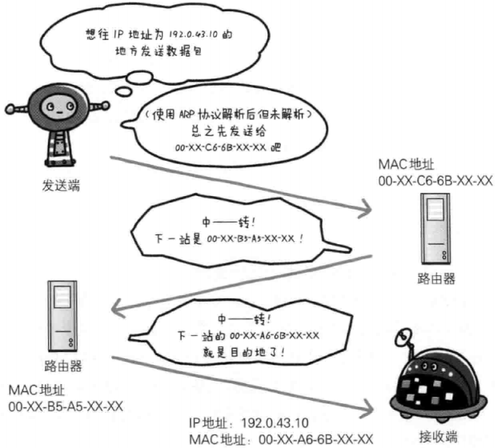
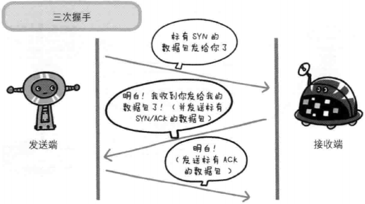

# HTTP

## TCP/IP协议族

先简单介绍一下TCP/IP协议族。通常使用的网络（包括互联网）是在TCP/IP协议族的基础上运作的，它包含了各种各样的内容：从电缆规格到IP地址选定方法、寻找异地用户的方法、双方建立通信的顺序，以及Web页面显示的处理步骤等等。HTTP是它的一个子集。


TCP/IP协议族是分层的，它借鉴了OSI（Open System Interconnection）七层网络模型建立TCP/IP四层模型：
* 应用层：决定了向用户提供应用服务时的通信的活动；
* 传输层：提供处于网络连接中的两台计算机之间的数据传输；
* 网络层（又称网络互联层）：用来处理在网络上流动的数据包。数据包是网络传输的最小数据单位。该层规定了通过怎样的路径到达对方计算机，并把数据包传送给对方；
* 链路层（又称数据链路层，网络接口层）：用来处理链接网络的硬件部分。包括控制操作系统、硬件的设备驱动、NIC（Network Interface Card，网络适配器，即网卡），以及光纤等物理课件部分（还包括连接器等一切传输媒介）。硬件上的范畴均在链路层的作用范围之内。

> OSI模型，即开放式通信系统互联参考模型（Open System Interconnection, OSI/RM, Open Systems Interconnection Reference Model），是国际标准化组织(ISO)提出的一个试图使各种计算机在世界范围内互连为网络的标准框架。事实上被TCP/IP四层模型淘汰。

<table>
    <tr>
        <td><strong>OSI七层网络模型</strong></td>
        <td><strong>TCP/IP四层模型</strong></td>
        <td><strong>对应的网络协议</strong></td>
    </tr>
    <tr>
        <td>应用层（Application）</td>
        <td rowspan="3">应用层</td>
        <td>HTTP, TFTP, FTP, NFS, WAIS, SMTP, POP3, IMAP4, Telnet</td>
    </tr>
    <tr>
        <td>表示层（Presentation）</td>
        <td>Rlogin, SNMP, Gopher</td>
    </tr>
    <tr>
        <td>会话层（Session）</td>
        <td>SMTP, DNS</td>
    </tr>
    <tr>
        <td>传输层（Transport）</td>
        <td>传输层</td>
        <td>TCP, UDP</td>
    </tr>
    <tr>
        <td>网络层（Network）</td>
        <td>网络层（又称网络互联层）</td>
        <td>IP, ICMP, ARP, RARP, AKP, UUCP</td>
    </tr>
    <tr>
        <td>数据链路层（Data Link）</td>
        <td rowspan="2">链路层（又称数据链路层，网络接口层）</td>
        <td>FDDI, Ethernet, Arpanet, PDN, SLIP, PPP</td>
    </tr>
    <tr>
        <td>物理层（Physical）</td>
        <td>IEEE 802.1A, IEEE 802.2到IEEE 802.11</td>
    </tr>
</table>

```
FTP: File Transfer Protocol
SMTP: Simple Mail Transfer Rotocol
POP3: Post Office Protocol 3
IMAP4: Internet Mail Access Protocol
```


发送端从应用层至链路层传数据时，数据每经过一层时必定会被打上一个该层所属的首部信息，数据一层层封装（encapsulate）。反之，接收端从链路层至应用层接收数据时，数据每经过一层时会把对应的首部去掉：


### 负责传输的IP协议

IP（Internet Protocol，网际协议），位于网络层。可能有人会把“IP”和“IP地址”搞混，“IP”其实是一种协议名称。

IP协议的作用是把各种数据包传送给对方，而要确保传送到对方哪里，最重要满足两个条件：IP地址和MAC地址（Media Access Control Address）。

* IP地址指明节点被分配到的地址，IP地址可变换；
* MAC地址指网卡所属的固定地址，MAC地址基本不会改变。

在网络中，通信双方通常要经过多台计算机和网络设备中转才能连接到对方。在进行中转时，会利用下一站中转设备的MAC地址来搜索下一个中转目标。这是会使用ARP协议（Address Resolution Protocol，地址解析协议）：ARP是一种用来解析地址的协议，可以根据IP地址反查出对应的MAC地址。

在到达通信目标前的中转过程中，无论哪台计算机、哪台网络设备都无法全面掌握网络中的细节，它们只能获取粗略的传输路线，这种机制叫做路由选择（routing）。




### 确保可靠性的TCP协议

TCP（Transmission Control Protocol，传输控制协议），位于传输层，提供可靠地字节流服务。

字节流服务（Byte Stream Service）是指，为了传输方便，将大块数据分割为报文段（segment）为单位的数据包进行管理。

**TCP协议将大数据分割传送，并可以确认数据最终是否送达对方。**

为了确保数据到达目标，TCP协议采用三次握手（three-way handshaking）策略，握手过程中使用了TCP的标志（flag）——SYN（synchronize）和ACK（acknowledgement）：

1. 发送端先发送一个带SYN标志的数据包给接收端；
2. 接收端收到后回传一个带有SYN/ACK标志的数据包确认收到；
3. 最后发送端再回传一个带ACK标志的数据包表示“握手”结束。

若握手过程莫名中断，TCP协议会以相同的顺序再次发送相同的数据包。




### 负责域名解析的DNS服务

DNS（Domain Name System，域名系统），位于应用层，提供域名到IP地址之间的解析服务。

计算机可以被赋予IP地址，也可以被赋予主机名和域名。比如：www.hackr.jp。

用户通常使用主机名或域名来访问对方计算机，而计算机则是通过IP地址来寻找计算机。因此，DNS服务应运而生：DNS协议提供通过域名查找IP地址，或通过IP地址反查域名的服务。


HTTP（HyperText Transfer Protocol），超文本传输协议，是应用层协议，是一种请求/响应式的协议。一个客户端与服务器建立连接后，发送一个请求给服务器；服务器接到请求后，给予相应的响应信息。

HTTPS，安全增强版的HTTP，S表示TLS、SSL。HTTPS是HTTP与安全套接口层(SSL)的结合，使HTTP的协议数据在传输过程中更安全。

## HTTP报文

用于HTTP协议交互的信息成为HTTP报文。请求端（客户端）的HTTP报文叫请求报文，响应端（服务器端）的叫做响应报文。HTTP报文是由多行数据（用CR+LF做换行符）构成的字符串文本。HTTP报文大致可分为报文首部和报文主体两部分，两者由最初出现的空行（用CR+LF做换行符）隔开。通常，并不一定要有报文主体。


### HTTP请求报文格式


* HTTP请求报文
    * 报文首部
        * 请求行，包含请求方法、请求URI、HTTP版本：
            * 请求方法（GET/POST/DELETE/PUT/HEAD）
            * 请求资源的URI路径
            * HTTP版本号
            ```http
            GET /index.html HTTP/1.1
            ```
        * 首部字段，包含表示请求的各种条件和属性的各类首部：
            * 请求首部字段
            * 通用首部字段
            * 实体首部字段
        * 其他，可能包含HTTP的RFC里未定义的首部（Cookie等）。
    * 空行（CR+LF），首部结束标志
    * 报文主体，这部分并不是每个请求必须的。

> Request For Comments（RFC），是一系列以编号排定的文件。所有关于Internet的正式标准都以RFC文档出版。

### HTTP响应报文格式


* HTTP响应报文
    * 报文首部
        * 状态行，包含HTTP版本，表名响应结果的状态码和原因短语：
            * HTTP版本号
            * 状态码
            * 原因短语
            ```http
            HTTP/1.1 200 OK
            ```
        * 首部字段，包含表示响应的各种条件和属性的各类首部：
            * 请求首部字段
            * 通用首部字段
            * 实体首部字段
        * 其他，可能包含HTTP的RFC里未定义的首部（Cookie等）。
    * 空行（CR+LF），首部结束标志。
    * 报文主体