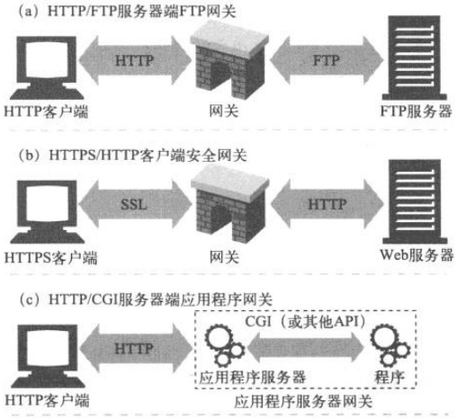
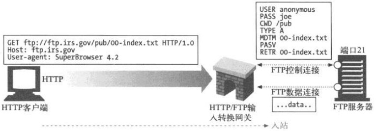
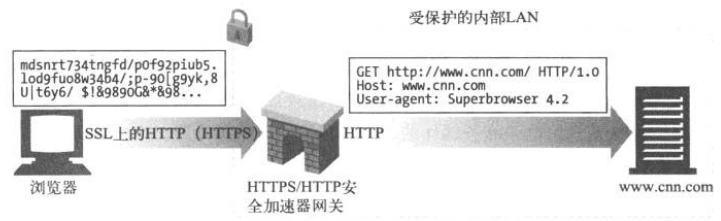

    <a href="#目录" style="color: white; border-right: 1px solid white; text-decoration: none; font-size: 14px; font-weight: bold; display: inline-block; padding: 5px 8px; line-height: 20px;">back to top ▲</a>
    <a href="javascript:void(0)" style="color: white; border-right: 1px solid white; text-decoration: none; font-weight: bold; display: inline-block; padding: 5px 8px; line-height: 20px;" onclick="(function(){document.querySelector('.btn.pull-left.js-toolbar-action').click()})()"><i class="fa fa-align-justify"></i></a>

# 目录

# 网关

翻译器

资源和应用程序之间的粘合剂

应用程序向网关发出一条请求，网关提供一条响应

网关可以向数据库发送查询语句，或动态生成内容

* a) 
    1. 网关收到对 FTP URL 的 HTTP 请求；
    2. 网关打开 FTP 连接并向 FTP 服务器发送适当命令；
    3. 将文档与正确的 HTTP 首部通过 HTTP 返回。
* b) 
    1. 网关通过 SSL 收到一条加密的 Web 请求；
    2. 网关对请求进行解密（网关上要安装适当的服务器证书），然后发给目标服务器一条普通的 HTTP 请求。
* c)
    1. 网关通过应用程序服务器网关 API，将 HTTP 客户端连接到服务器端的应用程序上。
    2. 上网购物、看天气预报，或查询股票报价时，访问的就是应用程序服务器网关。

## 客户端与服务器端网关

* Web 网关在一侧使用 HTTP 协议，在另一侧使用另一种协议；
* 在不同 HTTP 版本间进行转换的 Web 代理像网关一样，它们执行复杂的逻辑，在各个端点间进行沟通。但它们在两侧都使用 HTTP， 所以技术上讲它们是代理。

#### HTTP/*：服务器端 Web 网关

请求流入服务器时，服务端 Web 网关会将客户端 HTTP 请求转换为其他协议：

网关收到一条对 FTP 资源的 HTTP请求：`ftp://ftp.irs.gov/pub/00-index.txt`

网关会打开一条到服务器 FTP 端口的 FTP 连接，通过 FTP 协议获取对象，网关会做以下事：

* 发送 USER 和 PASS 命令登录服务器；
* 发布 CWD 命令，转移到服务器上的目标目录；
* 将下载类型设置为 ASCII；
* 用 MDTM 获取文档的最后修改时间；
* 用 PASV 告诉服务器有数据获取请求到达；
* 用 RETR 请求进行对象获取；
* 打开到 FTP 服务器的数据连接，服务器端口由控制信道返回；一旦数据信道打开，就将对象内容送回网关。

完成获取后，会将对象放在一条 HTTP 响应中返回客户端。

#### HTTP/HTTPS：服务器端安全网关

可以通过网关对所有输入的 Web 请求加密，客户端用普通的 HTTP 浏览 Web 内容，但网关会自动加密用户的对话。

#### HTTPS/HTTP：客户端安全加速器网关

客户端安全加速器网关中通常有专用的解密硬件，可以减轻服务器负荷，并且更快的解密安全流量。网关在网关和服务器之间发送的是未加密的流量，所以要确保网关和服务器之间的网络是安全的。

## 资源网关

