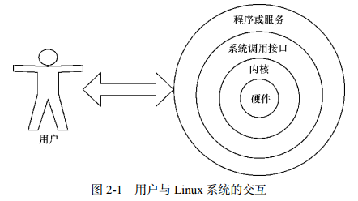
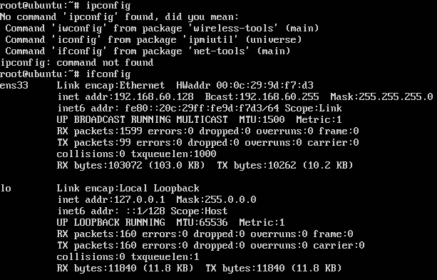
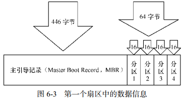
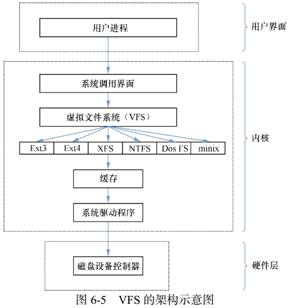

# 目录

* [基本指令](#基本指令)
    * [执行查看帮助命令](#执行查看帮助命令)
    * [常用系统工作命令](#常用系统工作命令)
    * [系统状态检测命令](#系统状态检测命令)
    * [工作目录切换命令](#工作目录切换命令)
    * [文本文件编辑命令](#文本文件编辑命令)
    * [文件目录管理命令](#文件目录管理命令)
    * [打包压缩与搜索命令](#打包压缩与搜索命令)
* [tmux](#tmux)
* [vim](#vim)
* [配置](#配置)
* [用户身份与文件权限](#用户身份与文件权限)
* [存储结构与磁盘划分](#存储结构与磁盘划分)

___在 Linux 系统中一切都是文件，而配置一个服务就是在修改其配置文件的参数。___

### Linux翻页方法
* Linux翻屏（翻页）：
    * shift+PgUp/PgDn
    * 输入的命令后面加管道命令：date --help |more / date --help |less
* tmux翻屏（翻页）：ctrl+b PgUp/PgDn

# <p align="center">基本指令</p>
###### [<p align="right">back to top ▲</p>](#目录)

计算机硬件由运算器、控制器、存储器、输入/输出设备等共同组成，让各种硬件设备各司其职且又能协同运行的东西是系统内核。Linux系统的内核负责完成对硬件资源的分配、调度等管理任务。用户通过基于系统调用接口开发出的程序或服务来管理计算机。

Shell是一个命令行工具。Shell（也称为**终端**或**壳**）充当人与内核（硬件）之间的翻译官，用户把一些命令“告诉”终端，它就会调用相应的程序服务去完成某些工作。

主流Linux系统默认的终端是Bash（Bourne-Again SHell）解释器。Bash解释器作为命令行终端有以下4项优势：
今后的学习和生产工作中细细体会 Linux 系统命令行的美妙之处，真正从心里爱上它们。
* 通过上下方向键来调取过往执行过的Linux命令；
* 命令或参数仅需输入前几位就可以用Tab键补全；
* 具有强大的批处理脚本；
* 具有实用的环境变量功能。

Linux系统中以点（.）开头的文件均代表隐藏文件，这些文件大多数为系统服务文件。



__命令名称 [命令参数] [命令对象]__

命令参数可以使用长格式，也可以用短格式，两者分别用--与-作为前缀。长格式与长格式不能合并，长格式与短格式不能合并，但短格式和短格式可以合并，合并后仅保留一个-（减号）即可。

在系统终端中执行一个命令后想立即停止它，可以同时按下Ctrl + C，这样将立即终止该命令的进程。有些命令在执行时不断在屏幕上输出信息，影响后续命令输入，可以在执行命令时在末尾加上一个&符号，这样命令会进入系统后台来执行。

### 执行查看帮助命令
* #### man (MANual pages)
man命令中常用按键及用途
|按键|用途|
|:---|:---|
|空格键|向下翻一页|
|PaGe down|向下翻一页|
|PaGe up|向上翻一页|
|home|直接前往首页|
|end|直接前往尾页|
|/|从上至下搜索某个关键词，如“/linux”|
|?|从下至上搜索某个关键词，如“?linux”|
|n|定位到下一个搜索到的关键词|
|N|定位到上一个搜索到的关键词|
|q|退出帮助文档|

man命令帮助信息的结构以及意义
|结构名称|代表意义|
|:---|:---|
|NAME|命令的名称|
|SYNOPSIS|参数的大致使用方法|
|DESCRIPTION|介绍说明|
|EXAMPLES|演示（附带简单说明）|
|OVERVIEW|概述|
|DEFAULTS|默认的功能|
|OPTIONS|具体的可用选项（带介绍）|
|ENVIRONMENT|环境变量|
|FILES|用到的文件|
|SEE ALSO|相关的资料|
|HISTORY|维护历史与联系方式|

### 常用系统工作命令
* #### echo
用于在终端输出字符串或变量提取后的值：**echo [字符串 | $变量]**

```bash
[root@linuxprobe ~]# echo Linuxprobe.Com
该命令会在终端屏幕上显示如下信息：
Linuxprobe.Com

使用$变量的方式提取变量SHELL的值，并将其输出到屏幕上：
[root@linuxprobe ~]# echo $SHELL
/bin/bash
```
* #### date
用于显示及设置系统的时间或日期：**date [选项] [+指定的格式]**

|参数|作用|
|:---|:---|
|%t|跳格[Tab 键]|
|%H|小时（00～23）|
|%I|小时（00～12）|
|%M|分钟（00～59）|
|%S|秒（00～59）|
|%j|今年中的第几天|
```bash
按照默认格式查看当前系统时间：
[root@linuxprobe ~]# date
Mon Aug 24 16:11:23 CST 2017

按照“年-月-日 小时:分钟:秒”的格式查看当前系统时间：
[root@linuxprobe ~]# date "+%Y-%m-%d %H:%M:%S"
2017-08-24 16:29:12

将系统的当前时间设置为2017年9月1日8点30分：
[root@linuxprobe ~]# date -s "20170901 8:30:00"
Fri Sep 1 08:30:00 CST 2017

参数%j可用来查看今天是当年中的第几天：
[root@linuxprobe ~]# date "+%j"
244
这个参数能够很好地区分备份时间的新旧，数字越大，越靠近当前时间。
```

* #### reboot
用于重启系统：**reboot**

重启操作涉及硬件资源的管理权限，默认只能使用root管理员来重启。
* #### poweroff
用于关闭系统：**poweroff**

关机操作涉及硬件资源的管理权限，默认只能使用root管理员来关闭电脑。
* #### wqet
用于在终端中下载网络文件：**wget [参数] 下载地址**

|参数|作用|
|:---|:---|
|-b|后台下载模式|
|-P|下载到指定目录|
|-t|最大尝试次数|
|-c|断点续传|
|-p|下载页面内所有资源，包括图片、视频等|
|-r|递归下载|

```bash
使用wget命令下载网络文件：
[root@linuxprobe ~]# wget http://www.linuxprobe.com/docs/LinuxProbe.pdf

使用wget命令递归下载www.linuxprobe.com网站内所有页面数据以及文件：
[root@linuxprobe ~]# wget -r -p http://www.linuxprobe.com
下载完后会自动保存到当前路径下一个名为www.linuxprobe.com的目录中
```
* #### ps (Process Status)
用于查看系统中的进程状态：**ps [参数]**

|参数|作用|
|:---|:---|
|-a|显示所有进程（包括其他用户的进程）|
|-u|用户以及其他详细信息|
|-x|显示没有控制终端的进程|

**合理管理进程可以优化系统的性能。**

在Linux系统中，有5种常见的进程状态：

|进程状态|含义|
|:---|:---|
|R（运行）|进程正在运行或在运行队列中等待|
|S（中断）|进程处于休眠中，当某个条件形成后或者接收到信号时，则脱离该状态|
|D（不可中断）|进程不响应系统异步信号，即便用kill命令也不能将其中断|
|Z（僵死）|进程已经终止，但进程描述符依然存在, 直到父进程调用wait4()系统函数后将进程释放|
|T（停止）|进程收到停止信号后停止运行|

执行**ps aux**命令后会看到进程状态：
> ps命令允许参数不加减号（-），可直接写成ps aux。

|USER|PID|%CPU|%MEM|VSZ|RSS|TTY|STAT|START|TIME|COMMAND|
|:---|:---|:---|:---|:---|:---|:---|:---|:---|:---|:---|
|进程所有者|进程ID|运算器占用率|内存占用率|虚拟内存使用量（单位KB）|占用固定内存量（单位KB）|所在终端|进程状态|被启动的时间|实际使用CPU的时间|命令名称与参数|
* #### top
用于动态地监视进程活动与系统负载等信息：**top**

top能够动态地查看系统运维状态，可以它看作Linux中的“强化版的Windows任务管理器”。


|行数|含义|
|:---|:---|
|第1行|系统时间、运行时间、登录终端数、系统负载（三个数值分别为1分钟、5分钟、15分钟内的平均值，数值越小意味着负载越低）|
|第2行|进程总数、运行中的进程数、睡眠中的进程数、停止的进程数、僵死的进程数|
|第3行|用户占用资源百分比、系统内核占用资源百分比、改变过优先级的进程资源百分比、空闲的资源百分比等|
|第4行|物理内存总量、内存使用量、内存空闲量、作为内核缓存的内存量|
|第5行|虚拟内存总量、虚拟内存使用量、虚拟内存空闲量、已被提前加载的内存量|
* #### pidof
用于查询某个指定服务进程的PID值：**pidof [参数] [服务名称]**

每个进程的进程号码值（PID）是唯一的，可以通过PID来区分不同的进程。
```bash
使用如下命令来查询本机上sshd服务程序的PID：
[root@linuxprobe ~]# pidof sshd
2156
```
* #### kill
用于终止某个指定PID的服务进程：**kill [参数] [进程 PID]**
* #### killall
用于终止某个指定名称的服务所对应的全部进程：**killall [参数] [进程名称]**

复杂软件的服务程序会有多个进程协同为用户提供服务，可以使用killall命令来批量结束某个服务程序带有的全部进程：
```bash
[root@linuxprobe ~]# pidof httpd
13581 13580 13579 13578 13577 13576
[root@linuxprobe ~]# killall httpd
[root@linuxprobe ~]# pidof httpd
[root@linuxprobe ~]#
```

### 系统状态检测命令
* #### ifconfig
用于获取网卡配置与网络状态等信息：**ifconfig [网络设备] [参数]**

主要查看的是网卡名称、inet参数后面的IP地址、ether参数后面的网卡物理地址（MAC地址），以及RX、TX的接收数据包与发送数据包的个数及累计流量：


* #### uname
用于查看系统内核与系统版本等信息：**uname [-a]**

使用uname命令一般会搭配-a参数来完整地查看当前系统的内核名称、主机名、内核发行版本、节点名、系统时间、硬件名称、硬件平台、处理器类型以及操作系统名称等信息：
```bash
[root@linuxprobe ~]# uname -a
Linux linuxprobe.com 3.10.0-123.el7.x86_64 #1 SMP Mon May 5 11:16:57 EDT 2017
x86_64 x86_64 x86_64 GNU/Linux
```

要查看当前系统版本的详细信息，需要查看redhat-release文件：
```bash
[root@linuxprobe ~]# cat /etc/redhat-release
Red Hat Enterprise Linux Server release 7.0 (Maipo)
```
* #### uptime
用于查看系统的负载信息：**uptime**

uptime命令可以显示当前系统时间、系统已运行时间、启用终端数量以及平均负载值等信息。
平均负载值指的是系统在最近1分钟、5分钟、15分钟内的压力情况（下面加粗的信息部分）；负载值越低越好，尽量不要长期超过1，在生产环境中不要超过5：
```bash
[root@linuxprobe ~]# uptime
22:49:55 up 10 min, 2 users, load average: 0.01, 0.19, 0.18
```
* #### free
用于显示当前系统中内存的使用量信息：**free [-h]**

为保证Linux系统不会因资源耗尽而突然宕机，运维人员需要时刻关注内存的使用量。

在使用free命令时可以结合-h参数以更人性化的方式输出当前内存的实时使用量信息。

||内存总量|已用量|可用量|进程共享的内存量|磁盘缓存的内存量|缓存的内存量|
|:---|:---|:---|:---|:---|:---|:---|
||total|used|free|shared|buffers|cached|
|Mem|1.8GB|1.3GB|542MB|9.8MB|1.6MB|413MB|
|-/+ buffers/cache||869MB|957MB||||
|Swap|2.0GB|0|2.0GB|||||

* #### who
用于查看当前登入主机的用户终端信息：**who [参数]**

|登陆的用户名|终端设备|登录到系统的时间|
|:---|:---|:---|
|root|:0|2017-08-24 17:52 (:0)|
|root|pts/0|2017-08-24 17:52 (:0)|
* #### last
用于查看所有系统的登录记录：**last [参数]**

这些信息都是以日志文件的形式保存在系统中，因此黑客可以很容易地对内容进行篡改。不要单纯以该命令的输出信息判断系统有无被恶意入侵！
```bash
[root@linuxprobe ~]# last
root pts/0 :0 Mon Aug 24 17:52 still logged in
root :0 :0 Mon Aug 24 17:52 still logged in
(unknown :0 :0 Mon Aug 24 17:50 - 17:52 (00:02)
reboot system boot 3.10.0-123.el7.x Tue Aug 25 01:49 - 18:17 (-7:-32)
root pts/0 :0 Mon Aug 24 15:40 - 08:54 (7+17:14)
root pts/0 :0 Fri Jul 10 10:49 - 15:37 (45+04:47)
………………省略部分登录信息………………
```
* #### history
用于显示历史执行过的命令：**history [-c]**

可以自定义/etc/profile文件中的HISTSIZE变量值控制显示条数；

使用-c参数会清空所有的命令历史记录；

可以使用“!编码数字”的方式来重复执行某一次的命令；

历史命令会被保存到用户家目录中的.bash_history文件中。
```bash
[root@linuxprobe ~]# history
1 tar xzvf VMwareTools-9.9.0-2304977.tar.gz
2 cd vmware-tools-distrib/
3 ls
4 ./vmware-install.pl -d
5 reboot
6 df -h
7 cd /run/media/
8 ls
9 cd root/
10 ls
11 cd VMware\ Tools/
12 ls
13 cp VMwareTools-9.9.0-2304977.tar.gz /home
14 cd /home
15 ls
16 tar xzvf VMwareTools-9.9.0-2304977.tar.gz
17 cd vmware-tools-distrib/
18 ls
19 ./vmware-install.pl -d
20 reboot
21 history
[root@linuxprobe ~]# !15
anaconda-ks.cfg Documents initial-setup-ks.cfg Pictures Templates
Desktop Downloads Music Public Videos
```

* #### sosreport
用于收集系统配置及架构信息并输出诊断文档：**sosreport**

Linux系统出现故障需要联系技术支持人员时，大多数时候都要先用这个命令来简单收集系统的运行状态和服务配置信息，以便让技术支持人员能够远程解决一些小问题，亦或让他们能提前了解某些复杂问题。


### 工作目录切换命令
* #### pwd (Print Working Directory)
用于显示用户当前所处的工作目录：**pwd [选项]**

* #### cd (Change Directory)
用于切换工作路径：**cd [目录名称]**

cd -：返回到上一次所处的目录；

cd ..：进入上级目录；

cd ~：切换到当前用户的家目录；

cd ~username：切换到其他用户的家目录。

* #### ls (LiSt)
用于显示目录中的文件信息：**ls [选项] [文件]**
使用“-a”参数可以看到全部文件（包括隐藏文件），使用“-l”参数可以查看文件的属性、大小等详细信息，使用“-d”参数可以查看目录属性信息。

```bash
查看当前目录中的所有文件并输出这些文件的属性信息
[root@linuxprobe ~]# ls -al
total 60
dr-xr-x---. 14 root root 4096 May 4 07:56 .
drwxr-xr-x. 17 root root 4096 May 4 15:55 ..
-rw-------. 1 root root 1213 May 4 15:44 anaconda-ks.cfg
-rw-------. 1 root root 957 May 4 07:54 .bash_history
-rw-r--r--. 1 root root 18 Dec 28 2013 .bash_logout
-rw-r--r--. 1 root root 176 Dec 28 2013 .bash_profile
………………省略………………

查看/etc目录的权限与属性信息
[root@linuxprobe ~]# ls -ld /etc
drwxr-xr-x. 132 root root 8192 Jul 10 10:48 /etc
```


### 文本文件编辑命令
* #### cat (CATenate)
用于查看纯文本文件（内容较少的）：**cat [选项] [文件]**

使用“-n”参数可以显示行号。

* #### more
用于查看纯文本文件（内容较多的）：**more [选项]文件**

more命令会在最下面用百分比提示已经阅读了多少内容。还可以使用空格键或回车键向下翻页。

* #### head
用于查看纯文本文档的前N行：**head [选项] [文件]**
```bash
查看文本中前5行的内容
[root@linuxprobe ~]# head -n 5 initial-setup-ks.cfg
#version=RHEL7
# X Window System configuration information
xconfig --startxonboot
# License agreement
eula --agreed
```

* #### tail
用于查看纯文本文档的后N行或持续刷新内容：**tail [选项] [文件]**

操作与head命令相似，“tail -n 20 文件名”可以查看文本后20行的内容。

tail命令最强悍的功能是可以持续刷新一个文件的内容，可以用来实时查看最新日志文件：**tail -f 文件名**

* #### tr (TRaslate)
用于替换文本文件中的字符：**tr [原始字符] [目标字符]**

先使用cat命令读取待处理的文本，然后通过管道符把这些文本内容传递给tr命令进行替换操作。
```bash
[root@linuxprobe ~]# cat anaconda-ks.cfg | tr [a-z] [A-Z]
#VERSION=RHEL7
# SYSTEM AUTHORIZATION INFORMATION
AUTH --ENABLESHADOW --PASSALGO=SHA512
# USE CDROM INSTALLATION MEDIA
CDROM
………………省略………………
```

* #### wc (Word Count)
用于统计指定文本的行数、字数、字节数：**wc [参数] 文本**

|参数|作用|
|:---|:---|
|-l|只显示行数|
|-w|只显示单词数|
|-c|只显示字节数|

在Linux系统中，passwd用于保存系统账户信息的文件，要统计当前系统中有多少个用户，可以使用下面的命令来进行查询：
```bash
[root@linuxprobe ~]# wc -l /etc/passwd
38 /etc/passwd
```

* #### stat
用于查看文件的具体存储信息和时间等信息：**stat 文件名称**

* #### cut
用于按“列”提取文本字符：**cut [参数] 文本**

按列搜索，要使用-f参数来设置需要看的列数，还要使用-d参数来设置间隔符号。

```bash
[root@linuxprobe ~]# head -n 2 /etc/passwd
root:x:0:0:root:/root:/bin/bash
bin:x:1:1:bin:/bin:/sbin/nologin

passwd保存用户数据信息，每一项值之间是采用冒号来间隔的，
下述命令用于提取出passwd文件中的用户名信息，
即提取以冒号（：）为间隔符号的第一列内容：
[root@linuxprobe ~]# cut -d: -f1 /etc/passwd
root
bin
daemon
adm
………………省略………………
```

* #### diff (DIFFerence)
用于比较多个文本文件的差异：**diff [参数] 文件**

diff是判断文件是否被篡改的有力神器：

使用--brief参数可以确认两个文件是否不同；

使用-c参数可以详细比较出多个文件的差异之处。


### 文件目录管理命令
* #### touch
用于创建空白文件或设置文件的时间：**touch [选项] [文件]**

|参数|作用|
|:---|:---|
|-a|仅修改“读取时间”（atime）|
|-m|仅修改“修改时间”（mtime）|
|-d|同时修改atime与mtime|

```bash
使用ls命令查看一个文件的修改时间
[root@linuxprobe ~]# ls -l anaconda-ks.cfg
-rw-------. 1 root root 1213 May 4 15:44 anaconda-ks.cfg

修改这个文件
[root@linuxprobe ~]# echo "Visit the LinuxProbe.com to learn linux skills" >> anaconda-ks.cfg
[root@linuxprobe ~]# ls -l anaconda-ks.cfg
-rw-------. 1 root root 1260 Aug 2 01:26 anaconda-ks.cfg

通过touch命令把修改后的文件时间设置成修改之前的时间
[root@linuxprobe ~]# touch -d "2017-05-04 15:44" anaconda-ks.cfg
[root@linuxprobe ~]# ls -l anaconda-ks.cfg
-rw-------. 1 root root 1260 May 4 15:44 anaconda-ks.cfg
```

* #### mkdir (MaKe DIRectory)
用于创建空白的目录：**mkdir [选项] 目录**

可以结合-p参数来递归创建出具有嵌套叠层关系的文件目录：
```bash
[root@linuxprobe ~]# mkdir linuxprobe
[root@linuxprobe ~]# cd linuxprobe
[root@linuxprobe linuxprobe]# mkdir -p a/b/c/d/e
[root@linuxprobe linuxprobe]# cd a
[root@linuxprobe a]# cd b
[root@linuxprobe b]#
```

* #### cp (CoPy)
用于复制文件或目录：**cp [选项] 源文件 目标文件**

如果目标文件是目录，会把源文件复制到该目录中；

如果目标文件也是普通文件，会询问是否要覆盖它；

如果目标文件不存在，执行正常的复制操作。

|参数|作用|
|:---|:---|
|-p|保留原始文件的属性|
|-d|若对象为“链接文件”，则保留该“链接文件”的属性|
|-r|递归持续复制（用于目录）|
|-i|若目标文件存在则询问是否覆盖|
|-a|相当于-pdr（p、 d、 r 为上述参数）|

* #### mv (MoVe)
用于剪切文件或将文件重命名：**mv [选项] 源文件 [目标路径|目标文件名]**

剪切不同于复制，它会默认把源文件删除掉，只保留剪切后的文件。如果在同一个目录中对一个文件进行剪切操作，其实就是对其进行重命名。

* #### rm (ReMove)
用于删除文件或目录：**rm [选项] 文件**

在Linux中删除文件时，系统会默认询问是否要执行删除操作，如果不想看到这种反复的确认信息，可在rm命令后跟上-f参数来强制删除。

想要删除一个目录，需要在rm命令后面加-r参数。

* #### dd (Disk Dump)
用于按照指定大小和个数的数据块来复制文件或转换文件：**dd [参数]**

|参数|作用|
|:---|:---|
|if|输入的文件名称|
|of|输出的文件名称|
|bs|设置每个“块”的大小|
|count|设置要复制“块”的个数|

Linux系统中有一个名为/dev/zero的设备文件。这个文件不会占用系统存储空间，但却可以提供无穷无尽的数据，可以使用它作为dd命令的输入文件，来生成一个指定大小的文件。

```bash
用dd命令从/dev/zero设备文件中取出大小为560MB的数据块，
然后保存成名为560_file的文件:
[root@linuxprobe ~]# dd if=/dev/zero of=560_file count=1 bs=560M
1+0 records in
1+0 records out
587202560 bytes (587 MB) copied, 27.1755 s, 21.6 MB/s

Linux系统中可以直接使用dd命令来压制出光盘镜像文件，
将它变成一个可立即使用的iso镜像:
[root@linuxprobe ~]# dd if=/dev/cdrom of=RHEL-server-7.0-x86_64-LinuxProbe.Com.iso
7311360+0 records in
7311360+0 records out
3743416320 bytes (3.7 GB) copied, 370.758 s, 10.1 MB/s
```

bs块大小与count块个数的关系：

小明的饭量（即需求）是一个固定的值，盛饭勺子的大小即bs块大小，用勺子盛饭的次数即count块个数。小明要想吃饱（满足需求）需要在勺子大小（bs块大小）与用勺子盛饭的次数（count块个数）之间进行平衡。勺子越大，用勺子盛饭的次数就越少。

**bs与count都是用来指定容量的大小，只要能满足需求，可随意组合搭配方式。**

* #### file
用于查看文件的类型：**file 文件名**

在Linux系统中，文本、目录、设备等所有这些一切都统称为文件。
```bash
[root@linuxprobe ~]# file anaconda-ks.cfg
anaconda-ks.cfg: ASCII text
[root@linuxprobe ~]# file /dev/sda
/dev/sda: block special
```


### 打包压缩与搜索命令
* #### tar (Tape ARchive)
用于对文件进行打包压缩或解压：**tar [选项] [文件]**

在Linux系统中，常见的文件格式比较多，其中主要使用的是.tar或.tar.gz或.tar.bz2格式。

|参数|作用|
|:---|:---|
|-c|创建压缩文件|
|-x|解开压缩文件|
|-t|查看压缩包内有哪些文件|
|-z|用Gzip压缩或解压|
|-j|用bzip2压缩或解压|
|-v|显示压缩或解压的过程|
|-f|目标文件名|
|-p|保留原始的权限与属性|
|-P|使用绝对路径来压缩|
|-C|指定解压到的目录|

使用时根据文件的后缀来决定应使用何种格式参数进行解压。

在执行某些压缩或解压操作时，可能需要花费数个小时，推荐使用-v参数向用户不断显示压缩或解压的过程以判断打包进度。 

一般使用“**tar -czvf 压缩包名称.tar.gz 要打包的目录**”对指定的文件进行打包压缩；相应的解压命令为“**tar -xzvf 压缩包名称.tar.gz**”。

* #### grep (Global Regular Expression Print)
用于在文本中执行关键词搜索，并显示匹配的结果：**grep [选项] [文件]**

|参数|作用|
|:---|:---|
|-b|将可执行文件（binary）当作文本文件（text）来搜索|
|-c|仅显示找到的行数|
|-i|忽略大小写|
|-n|显示行号|
|-v|反向选择—仅列出没有“关键词”的行|

最最常用的参数：-n，-v。
```bash
/etc/passwd文件是保存着所有的用户信息，
一旦用户的登录终端被设置成/sbin/nologin，
则不再允许登录系统，
因此可以用grep命令找出不允许登录系统的所有用户信息:
[root@linuxprobe ~]# grep /sbin/nologin /etc/passwd
bin:x:1:1:bin:/bin:/sbin/nologin
daemon:x:2:2:daemon:/sbin:/sbin/nologin
adm:x:3:4:adm:/var/adm:/sbin/nologin
lp:x:4:7:lp:/var/spool/lpd:/sbin/nologin
………………省略部分输出过程信息………………
```

* #### find
用于按照指定条件来查找文件：**find [查找路径] 寻找条件 操作**

|参数|作用|
|:---|:---|
|-name|匹配名称|
|-perm|匹配权限（mode为完全匹配， -mode为包含即可）|
|-user|匹配所有者|
|-group|匹配所有组|
|-mtime -n +n|匹配修改内容的时间（-n指n天以内，+n指n天以前）|
|-atime -n +n|匹配访问文件的时间（-n指n天以内，+n指n天以前）|
|-ctime -n +n|匹配修改文件权限的时间（-n指n天以内，+n指n天以前）|
|-nouser|匹配无所有者的文件|
|-nogroup|匹配无所有组的文件|
|-newer f1 !f2|匹配比文件f1新但比f2旧的文件|
|--type b/d/c/p/l/f|匹配文件类型（后面的字母参数依次表示块设备、目录、字符设备、管道、链接文件、文本文件）|
|-size|匹配文件的大小（+50KB为查找超过50KB的文件，而-50KB为查找小于50KB的文件）|
|-prune|忽略某个目录|
|-exec …… {}\;|后面可跟用于进一步处理搜索结果的命令|

```bash
根据文件系统层次标准（Filesystem Hierarchy Standard）协议，
Linux系统中的配置文件会保存到/etc目录中，
想获取到该目录中所有以host开头的文件列表：
[root@linuxprobe ~]# find /etc -name "host*" -print
/etc/avahi/hosts
/etc/host.conf
/etc/hosts
/etc/hosts.allow
………………省略………………

在整个系统中搜索权限中包括SUID权限的所有文件，
只需使用-4000即可：
[root@linuxprobe ~]# find / -perm -4000 -print
/usr/bin/fusermount
/usr/bin/su
/usr/bin/umount
………………省略………………
```

-exec参数用于把find命令搜索到的结果交由紧随其后的命令作进一步处理。虽然exec是长格式形式，但依然只需要一个减号（-）。

```bash
“-exec {} \;”，{}表示find命令搜索到的每一个文件，
命令结尾必须是“\;”：
[root@linuxprobe ~]# find / -user linuxprobe -exec cp -a {} /root/findresults/ \;
```


# <p align="center">tmux</p>
###### [<p align="right">back to top ▲</p>](#目录)

***终端复用命令行工具***
* __会话（Session）操作__
    * __tmux ls__ 列出所有会话
    * __tmux new -s foo__ 新建名为foo的会话
    * __tmux a -t foo__ 进入名为foo的会话
    * __tmux detach__ 退出当前会话
    * __tmux kill-session -t foo__ 删除名为foo的会话
    * __tmux kill-server__ 删除所有会话
    * __Ctrl+b $__ 重命名当前会话
    * __Ctrl+b s__ 选择会话列表
* __窗口（Window）操作__
    * __Ctrl+b c__ 新建窗口
    * __Ctrl+b w__ 窗口列表选择
    * __Ctrl+b &__ 关闭当前窗口
    * __Ctrl+b ,__ 重命名窗口
* __窗格（Pane）操作__
    * __Ctrl+b %__ 左右分屏
    * __Ctrl+b "__ 上下分屏
    * __Ctrl+b ↑↓←→__ 上下左右选择窗格
    * __Ctrl+b x__ 关闭当前窗格
    * __Ctrl+b Space__ 切换窗格布局
    * __Ctrl+b {__ 当前窗格前移
    * __Ctrl+b }__ 当前窗格后移
    * __Ctrl+b z__ 最大化当前窗格，再次执行恢复原来大小
    * __Ctrl+b q__ 显示窗格序号，序号出现期间按下对应的数字可跳转至对应的窗格

# <p align="center">Vim</p>
###### [<p align="right">back to top ▲</p>](#目录)

#### Vim 编辑器中设置了三种模式：
* ##### 命令模式：控制光标移动，可对文本进行复制、粘贴、删除和查找等工作。
* ##### 输入模式：正常的文本录入。
* ##### 末行模式：保存或退出文档，以及设置编辑环境。


每次运行Vim编辑器时，默认进入命令模式，此时需要先切换到输入模式后再进行文档编写工作，而每次在编写完文档后需要先返回命令模式，然后再进入末行模式，执行文档的保存或退出操作。

**命令模式中最常用的一些命令：**

|命令|作用|
|:---|:---|
|dd|删除（剪切）光标所在整行|
|5dd|删除（剪切）从光标处开始的 5 行|
|yy|复制光标所在整行|
|5yy|复制从光标处开始的 5 行|
|n|显示搜索命令定位到的下一个字符串|
|N|显示搜索命令定位到的上一个字符串|
|u|撤销上一步的操作|
|p|将之前删除（dd）或复制（yy）过的数据粘贴到光标后面|

末行模式主要用于保存或退出文件，以及设置Vim编辑器的工作环境，还可以让用户执行外部的Linux命令或跳转到所编写文档的特定行数。在命令模式中输入一个冒号就可以切换到末行模式。

**末行模式中可用的命令：**

|命令|作用|
|:---|:---|
|:w|保存|
|:q|退出|
|:q!|强制退出（放弃对文档的修改内容）|
|:wq!|强制保存退出|
|:set nu|显示行号|
|:set nonu|不显示行号|
|:命令|执行该命令|
|:s/one/two|将当前光标所在行的第一个one替换成two|
|:s/one/two/g|将当前光标所在行的所有one替换成two|
|:%s/one/two/g|将全文中的所有one替换成two|
|?字符串|在文本中从下至上搜索该字符串|
|/字符串|在文本中从上至下搜索该字符串|


# <p align="center">Linux中的配置文件</p>
###### [<p align="right">back to top ▲</p>](#目录)

## 配置主机名称
## 配置网卡信息
## 配置Yum软件仓库
## /etc/sudoers
## /etc/passwd
## /etc/ssh/sshd_config

# <p align="center">用户身份与文件权限</p>
###### [<p align="right">back to top ▲</p>](#目录)

## 用户身份与能力
> 设计Linux系统的初衷之一就是为了满足多个用户同时工作的需求。在安装Linux操作系统时特别要求设置root管理员密码，root管理员就是存在于所有类UNIX系统中的超级用户。它拥有最高的系统所有权，能够管理系统的各项功能，如添加/删除用户、启动/关闭服务进程、开启/禁用硬件设备等。以root管理员的身份工作时不会受到系统的限制。

Linux系统的管理员之所以是root，并不是因为它的名字叫root，而是因为该用户的身份号码即UID（User IDentification）的数值为0。在Linux系统中，UID就相当于我们的身份证号码一样具有唯一性，因此可通过用户的UID值来判断用户身份。在RHEL 7系统中，用户身份有下面这些：
* 管理员，UID为0：系统的管理员用户；
* 系统用户，UID为1～999：Linux为避免因某个服务程序出现漏洞而被黑客提权至整台服务器，默认服务程序会有独立的系统用户负责运行，进而有效控制被破坏范围；
* 普通用户，UID从1000始：由管理员创建的用于日常工作的用户。

**UID不能冲突，且管理员创建的普通用户的UID默认从1000开始（即使前面有闲置的号码）。**

为方便管理属于同一组的用户，Linux中还引入了用户组的概念。通过使用用户组号码（GID，Group IDentification），我们可以把多个用户加入到同一个组中，从而方便为组中的用户统一规划权限或指定任务。

在Linux中创建每个用户时，将自动创建一个与其同名的基本用户组，而且这个基本用户组只有该用户一个人。如果该用户以后被归纳入其他用户组，则这个其他用户组称之为扩展用户组。一个用户只有一个基本用户组，但是可以有多个扩展用户组。

### useradd命令
useradd用于创建新的用户：**useradd [选项] 用户名**

|参数|作用|
|:---|:---|
|-d|指定用户的家目录（默认为/home/username）|
|-e|账户的到期时间，格式为YYYY-MM-DD.|
|-u|指定该用户的默认UID|
|-g|指定一个初始的用户基本组（必须已存在）|
|-G|指定一个或多个扩展用户组|
|-N|不创建与用户同名的基本用户组|
|-s|指定该用户的默认Shell解释器|

使用该命令创建用户账户时，默认的用户家目录会被存放在/home目录中，默认的Shell解释器为/bin/bash，而且默认会创建一个与该用户同名的基本用户组。

### groupadd命令
groupadd用于创建用户组：**groupadd [选项] 群组名**

### usermod命令
usermod用于修改用户属性：**usermod [选项] 用户名**

|参数|作用|
|:---|:---|
|-c|填写用户账户的备注信息|
|-d -m|-m与-d连用，可重新指定用户的家目录并自动把旧的数据转移过去|
|-e|账户的到期时间，格式为YYYY-MM-DD|
|-g|变更所属用户组|
|-G|变更扩展用户组|
|-L|锁定用户禁止其登录系统|
|-U|解锁用户，允许其登录系统|
|-s|变更默认终端|
|-u|修改用户的UID|

Linux系统中的一切都是文件，因此在系统中创建用户也就是修改配置文件的过程。用户的信息保存在/etc/passwd文件中，可以直接用文本编辑器来修改其中的用户参数项目，也可以用usermod命令修改已经创建的用户信息。

### passwd命令 (PASSWorD)
passwd用于修改用户密码、过期时间、认证信息等：**passwd [选项] [用户名]**

|参数|作用|
|:---|:---|
|-l|锁定用户，禁止其登录|
|-u|解除锁定，允许用户登录|
|--stdin|允许通过标准输入修改用户密码，如echo "NewPassWord" \| passwd --stdin Username|
|-d|使该用户可用空密码登录系统|
|-e|强制用户在下次登录时修改密码|
|-S|显示用户的密码是否被锁定，以及密码所采用的加密算法名称|

普通用户只能使用passwd命令修改自身的系统密码，而root管理员则有权限修改其他所有人的密码。

### userdel命令
userdel用于删除用户：**userdel [选项] 用户名**

|参数|作用|
|:---|:---|
|-f|强制删除用户|
|-r|同时删除用户及用户家目录|

如果某位用户后续不再会登录到系统中，则可以通过userdel命令删除该用户的所有信息。在执行删除操作时，该用户的家目录默认会保留下来，此时可以使用-r参数将其删除。


## 文件权限与归属

Linux系统中一切都是文件，Linux系统使用不同的字符来区分不同的文件类型：
* -：普通文件
* d：目录文件
* l：链接文件
* b：块设备文件
* c：字符设备文件
* p：管道文

每个文件都有所属的所有者和所有组，并且规定了文件的所有者、所有组以及其他人对文件所拥有的可读（r）、可写（w）、可执行（x）等权限。

**对于一般文件**：“可读”表示能够读取文件的实际内容；“可写”表示能够编辑、新增、修改、删除文件的实际内容；“可执行”则表示能够运行一个脚本程序；

**对于目录文件**：“可读”表示能够读取目录内的文件列表；“可写”表示能够在目录内新增、删除、重命名文件；而“可执行”则表示能够进入该目录。

文件的读、写、执行权限可以简写为rwx，亦可分别用数字4、2、1来表示，文件所有者，所属组及其他用户权限之间无关联。

<table>
    <tr>
        <td colspan="1" style="background-color: gray; font-weight: bolder;">权限分配</td>
        <td colspan="3" style="background-color: gray; font-weight: bolder;">文件所有者</td>
        <td colspan="3" style="background-color: gray; font-weight: bolder;">文件所属组</td>
        <td colspan="3" style="background-color: gray; font-weight: bolder;">其他用户</td>
    </tr>
    <tr>
    	<td>权限项</td>
    	<td>读</td>
    	<td>写</td>
    	<td>执行</td>
    	<td>读</td>
    	<td>写</td>
    	<td>执行</td>
    	<td>读</td>
    	<td>写</td>
    	<td>执行</td>
    </tr>
    <tr>
    	<td>字符表示</td>
    	<td>r</td>
    	<td>w</td>
    	<td>x</td>
    	<td>r</td>
    	<td>w</td>
    	<td>x</td>
    	<td>r</td>
    	<td>w</td>
    	<td>x</td>
    </tr>
    <tr>
    	<td>数字表示</td>
    	<td>4</td>
    	<td>2</td>
    	<td>1</td>
    	<td>4</td>
    	<td>2</td>
    	<td>1</td>
    	<td>4</td>
    	<td>2</td>
    	<td>1</td>
    </tr>
</table>

文件权限的数字法表示基于字符表示（rwx）的权限计算而来，其目的是简化权限的表示。例如，若某个文件的权限为7则代表可读、可写、可执行（4+2+1）；若权限为6则代表可读、可写（4+2）。

如果一个文件，其所有者拥有可读、可写、可执行的权限，其文件所属组拥有可读、可写的权限；而且其他人只有可读的权限。那么，这个文件的权限就是rwxrw-r--，数字法表示即为764。


上图包含了文件的类型、访问权限、所有者（属主）、所属组（属组）、占用的磁盘大小、修改时间和文件名称等信息。

该文件的类型为普通文件，所有者权限为可读、可写（rw-），所属组权限为可读（r--），除此以外的其他人也只有可读权限（r--），文件的磁盘占用大小是34298字节，最近一次的修改时间为4月2日的凌晨23分，文件的名称为install.log。


## 文件的特殊权限
SUID、SGID与SBIT是对文件权限进行设置的特殊权限位，可以与一般权限同时使用，以弥补一般权限不能实现的功能。

### SUID
对二进制程序进行设置，可以让二进制程序的执行者临时拥有属主的权限（仅对拥有执行权限的二进制程序有效）。

例如，所有用户都可以执行passwd命令来修改自己的用户密码，而用户密码保存在/etc/shadow文件中。这个文件的默认权限是000，也就是说除了root管理员以外，所有用户都没有查看或编辑该文件的权限。但是，在使用passwd命令时如果加上SUID特殊权限位，就可让普通用户临时获得程序所有者的身份，把变更的密码信息写入到shadow文件中。

这很像古代的手持尚方宝剑的钦差大臣，他手持的尚方宝剑代表的是皇上的权威，因此可以惩戒贪官，但这并不意味着他永久成为了皇上。这只是一种有条件的、临时的特殊权限授权方法。

```bash
[root@linuxprobe ~]# ls -l /etc/shadow
----------. 1 root root 1004 Jan 3 06:23 /etc/shadow
[root@linuxprobe ~]# ls -l /bin/passwd
-rwsr-xr-x. 1 root root 27832 Jan 29 2017 /bin/passwd
```

查看passwd命令属性时发现所有者的权限由rwx变成了rws，其中x改变成s就意味着该文件被赋予了 SUID 权限。

如果原本的权限是rw-，没有x执行权限，那么被赋予特殊权限后将变成大写的S。


### SGID
SGID主要实现如下两种功能：
* 让执行者临时拥有属组的权限（对拥有执行权限的二进制程序进行设置）；
* 在某个目录中创建的文件自动继承该目录的用户组（只可以对目录进行设置）。

早期的Linux系统中，/dev/kmem是一个字符设备文件，用于存储内核程序要访问的数据，权限为：
```bash
cr--r----- 1 root system 2, 1 Feb 11 2017 kmem
```
除了root管理员或属于system组成员外，所有用户都没有读取该文件的权限。

平时我们在查看系统的进程状态时，为了能够获取到进程的状态信息，可在用于查看系统进程状态的ps命令文件上增加SGID特殊权限位。查看ps命令文件的属性信息：
```bash
-r-xr-sr-x 1 bin system 59346 Feb 11 2017 ps
```
由于ps命令被增加了SGID特殊权限位，所以当用户执行该命令时，也就临时获取到了system用户组的权限，从而可以顺利地读取设备文件了。

每个文件都有其归属的所有者和所属组，当创建或传送一个文件后，这个文件就会自动归属于执行这个操作的用户（即该用户是文件的所有者）。

如果现在需要在一个部门内设置共享目录，让部门内的所有人员都能够读取目录中的内容，那么就可以创建部门共享目录后，在该目录上设置SGID特殊权限位。这样，部门内的任何人员在里面创建的任何文件都会归属于该目录的所属组，而不再是自己的基本用户组。此时用到的是SGID的第二个功能，即在某个目录中创建的文件自动继承该目录的用户组（只可以对目录进行设置）。

```bash
[root@linuxprobe ~]# cd /tmp
[root@linuxprobe tmp]# mkdir testdir
[root@linuxprobe tmp]# ls -ald testdir/
drwxr-xr-x. 2 root root 6 Feb 11 11:50 testdir/
[root@linuxprobe tmp]# chmod -Rf 777 testdir/
[root@linuxprobe tmp]# chmod -Rf g+s testdir/
[root@linuxprobe tmp]# ls -ald testdir/
drwxrwsrwx. 2 root root 6 Feb 11 11:50 testdir/

// 上述命令设置好目录的777权限（确保普通用户可以向其中写入文件），并为该目录设置了SGID特殊权限位

[root@linuxprobe tmp]# su - linuxprobe
Last login: Wed Feb 11 11:49:16 CST 2017 on pts/0
[linuxprobe@linuxprobe ~]$ cd /tmp/testdir/
[linuxprobe@linuxprobe testdir]$ echo "linuxprobe.com" > test
[linuxprobe@linuxprobe testdir]$ ls -al test
-rw-rw-r--. 1 linuxprobe root 15 Feb 11 11:50 test
```

#### chmod命令 (CHange MODe)
用来设置文件或目录的权限：**chmod [参数] 权限 文件或目录名称**

如果要把一个文件的权限设置成其所有者可读可写可执行、所属组可读可写、其他人没有任何权限，则相应的字符法表示为rwxrw----，其对应的数字法表示为760。
```bash
[root@linuxprobe ~]# ls -al test
-rw-rw-r--. 1 linuxprobe root 15 Feb 11 11:50 test
[root@linuxprobe ~]# chmod 760 test
[root@linuxprobe ~]# ls -l test
-rwxrw----. 1 linuxprobe root 15 Feb 11 11:50 test
```

#### chown命令 (CHange OWNer)
用来设置文件或目录的所有者和所属组：**chown [参数] 所有者:所属组 文件或目录名称**
```bash
[root@linuxprobe ~]# ls -l test
-rwxrw----. 1 linuxprobe root 15 Feb 11 11:50 test
[root@linuxprobe ~]# chown root:bin test
[root@linuxprobe ~]# ls -l test
-rwxrw----. 1 root bin 15 Feb 11 11:50 test
```

chmod和chown命令是用于修改文件属性和权限的最常用命令，***它们在针对目录进行操作时需要加上大写参数-R来表示递归操作***，即对目录内所有的文件进行整体操作。


### SBIT
大学里的很多老师都要求学生将作业上传到服务器的特定共享目录中，为防止“破坏分子”删除其他同学的作业，要设置SBIT（Sticky Bit）特殊权限位（也可以称之为特殊权限位之保护位）。SBIT特殊权限位可确保用户只能删除自己的文件，而不能删除其他用户的文件。换句话说，当对某个目录设置了SBIT粘滞位权限后，那么该目录中的文件就只能被其所有者执行删除操作了。

当目录被设置SBIT特殊权限位后，文件的其他人权限部分的x执行权限就会被替换成t或者T。原本有x执行权限则会写成t，原本没有x执行权限则会被写成T。

```bash
[root@linuxprobe tmp]# su - linuxprobe
Last login: Wed Feb 11 12:41:20 CST 2017 on pts/0
[linuxprobe@linuxprobe tmp]$ ls -ald /tmp
drwxrwxrwt. 17 root root 4096 Feb 11 13:03 /tmp
[linuxprobe@linuxprobe ~]$ cd /tmp
[linuxprobe@linuxprobe tmp]$ echo "Welcome to linuxprobe.com" > test
[linuxprobe@linuxprobe tmp]$ chmod 777 test
[linuxprobe@linuxprobe tmp]$ ls -al test
-rwxrwxrwx. 1 linuxprobe linuxprobe 10 Feb 11 12:59 test

[root@linuxprobe tmp]# su - blackshield
Last login: Wed Feb 11 12:41:29 CST 2017 on pts/1
[blackshield@linuxprobe ~]$ cd /tmp
[blackshield@linuxprobe tmp]$ rm -f test
rm: cannot remove ‘test’: Operation not permitted
```

***其实，文件能否被删除并不取决于自身的权限，而是看其所在目录是否有写入权限。***

对目录设置SBIT特殊权限位，用chmod命令就可以了。对应的参数o+t代表设置SBIT保护位权限：
```bash
[root@linuxprobe tmp]# cd ~
[root@linuxprobe ~]# mkdir linux
[root@linuxprobe ~]# chmod -R o+t linux/
[root@linuxprobe ~]# ls -ld linux/
drwxr-xr-t. 2 root root 6 Feb 11 19:34 linux/
```


## 文件的隐藏属性
Linux系统中的文件除了具备一般权限和特殊权限之外，还有一种隐藏权限，即被隐藏起来的权限，默认情况下不能直接被用户发觉。

明明权限充足但却无法删除某个文件，或仅能在日志文件中追加内容而不能修改或删除内容，这在一定程度上阻止了黑客篡改系统日志的图谋，因此这种隐藏权限也保障了Linux系统的安全性。

### chattr命令 (CHange ATTRibute)
用于设置文件的隐藏权限：**chattr [+/-参数] 文件**

* 要把某个隐藏功能添加到文件上，**chattr +参数 文件**；
* 要把某个隐藏功能移出文件，**chattr -参数 文件**。

|参数|作用|
|:---|:---|
|i|无法对文件进行修改；若对目录设置了该参数，则仅能修改其中的子文件内容而不能新建或删除文件|
|a|仅允许补充（追加）内容，无法覆盖/删除内容（Append Only）|
|S|文件内容在变更后立即同步到硬盘（sync）|
|s|彻底从硬盘中删除，不可恢复（用0填充原文件所在硬盘区域）|
|A|不再修改这个文件或目录的最后访问时间（atime）|
|b|不再修改文件或目录的存取时间|
|D|检查压缩文件中的错误|
|d|使用dump命令备份时忽略本文件/目录|
|c|默认将文件或目录进行压缩|
|u|当删除该文件后依然保留其在硬盘中的数据，方便日后恢复|
|t|让文件系统支持尾部合并（tail-merging）|
|X|可以直接访问压缩文件中的内容|

```bash
[root@linuxprobe ~]# echo "for Test" > linuxprobe
[root@linuxprobe ~]# rm linuxprobe
rm: remove regular file ‘linuxprobe’? y

[root@linuxprobe ~]# echo "for Test" > linuxprobe
[root@linuxprobe ~]# chattr +a linuxprobe
[root@linuxprobe ~]# rm linuxprobe
rm: remove regular file ‘linuxprobe’? y
rm: cannot remove ‘linuxprobe’: Operation not permitted
```

### lsattr命令 (LiSt ATTRibute)
用于显示文件的隐藏权限：**lsattr [参数] 文件**

***文件的隐藏权限必须使用lsattr命令来查看，使用ls命令则看不出来。***

```bash
[root@linuxprobe ~]# ls -al linuxprobe
-rw-r--r--. 1 root root 9 Feb 12 11:42 linuxprobe

[root@linuxprobe ~]# lsattr linuxprobe
-----a---------- linuxprobe
[root@linuxprobe ~]# chattr -a linuxprobe
[root@linuxprobe ~]# lsattr linuxprobe
---------------- linuxprobe
[root@linuxprobe ~]# rm linuxprobe
rm: remove regular file ‘linuxprobe’? y
```


## 文件访问控制列表
> 一般权限、特殊权限、隐藏权限有一个共性：权限是针对某一类用户设置的。如果希望对某个指定的用户进行单独的权限控制，就需要用到文件的访问控制列表（ACL）了。通俗来讲，基于普通文件或目录设置ACL其实就是针对指定的用户或用户组设置文件或目录的操作权限。如果针对某个目录设置了ACL，则目录中的文件会继承其ACL；若针对文件设置了ACL，则文件不再继承其所在目录的ACL。

切换普通用户，然后尝试进入root管理员的家目录中。在没有针对普通用户对root管理员的家目录设置ACL之前，其执行结果如下所示：
```bash
[root@linuxprobe ~]# su - linuxprobe
Last login: Sat Mar 21 16:31:19 CST 2017 on pts/0
[linuxprobe@linuxprobe ~]$ cd /root
-bash: cd: /root: Permission denied
[linuxprobe@linuxprobe root]$ exit
```

### setfacl命令 (SET File ACL)
用于管理文件的ACL规则：**setfacl [参数] 文件名称**

文件的ACL提供在所有者、所属组、其他人的读/写/执行权限之外的特殊权限控制，使用setfacl命令可以针对单一用户或用户组、单一文件或目录来进行读/写/执行权限的控制。

针对目录文件要使用-R递归参数；针对普通文件使用-m参数；要删除某个文件的ACL，可以使用-b参数。

下面来设置用户在/root目录上的权限：
```bash
[root@linuxprobe ~]# setfacl -Rm u:linuxprobe:rwx /root
[root@linuxprobe ~]# su - linuxprobe
Last login: Sat Mar 21 15:45:03 CST 2017 on pts/1
[linuxprobe@linuxprobe ~]$ cd /root
[linuxprobe@linuxprobe root]$ ls
anaconda-ks.cfg Downloads Pictures Public
[linuxprobe@linuxprobe root]$ cat anaconda-ks.cfg
[linuxprobe@linuxprobe root]$ exit
```

用ls命令看不到ACL表信息，但是却可以看到文件的权限最后一个点（.）变
成了加号（+）,这就意味着该文件已经设置了ACL了。

### getfacl命令 (GET File ACL)
用于显示文件上设置的ACL信息：**getfacl 文件名称**

下面用getfacl命令显示在root管理员家目录上设置的所有ACL信息：
```bash
[root@linuxprobe ~]# getfacl /root
getfacl: Removing leading '/' from absolute path names
# file: root
# owner: root
# group: root
user::r-x
user:linuxprobe:rwx
group::r-x
mask::rwx
other::---
```

## su命令与sudo服务
在生产环境中还是要对安全多一份敬畏之心，不要用root管理员去做所有事情。因为一旦执行了错误的命令，可能会直接导致系统崩溃。

Linux系统为了安全性考虑，使得许多系统命令和服务只能被root管理员来使用，但这也让普通用户受到了更多的权限束缚，从而导致无法顺利完成特定的工作任务。


### su命令 (Swith User)
使当前用户在不退出登录的情况下切换到其他用户：
```bash
[root@linuxprobe ~]# id
uid=0(root) gid=0(root) groups=0(root)
[root@linuxprobe ~]# su - linuxprobe
Last login: Wed Jan 4 01:17:25 EST 2017 on pts/0
[linuxprobe@linuxprobe ~]$ id
uid=1000(linuxprobe) gid=1000(linuxprobe) groups=1000(linuxprobe) context=unconfined_
u:unconfined_r:unconfined_t:s0-s0:c0.c1023
```

su命令与用户名之间有一个减号（-），这意味着完全切换到新的用户，即把环境变量信息也变更为新用户的相应信息，而不是保留原始的信息。强烈建议在切换用户身份时添加这个减号（-）。

从root管理员切换到普通用户时不需要密码验证，从普通用户切换成root管理员需要密码验证。

### sudo命令 (SuperUser DO)
用于给普通用户提供额外的权限来完成原本root管理员才能完成的任务：**sudo [参数] 命令名称**
|参数|作用|
|:---|:---|
|-h|列出帮助信息|
|-l|列出当前用户可执行的命令|
|-u|用户名或UID值 以指定的用户身份执行命令|
|-k|清空密码的有效时间，下次执行sudo时需要再次进行密码验证|
|-b|在后台执行指定的命令|
|-p|更改询问密码的提示语|

sudo命令具有如下功能：
* 限制用户执行指定的命令：
* 记录用户执行的每一条命令；
* 配置文件（/etc/sudoers）提供集中的用户管理、权限与主机等参数；
* 验证密码的后5分钟内（默认值）无须再让用户再次验证密码。

可以使用sudo命令提供的visudo命令来配置用户权限。这条命令在配置用户权限时将禁止多个用户同时修改sudoers配置文件，还可以对配置文件内的参数进行语法检查，并在发现参数错误时进行报错。

***只有root管理员才能使用visudo命令编辑sudo服务的配置文件***

```bash
[root@linuxprobe ~]# visudo
96 ##
97 ## Allow root to run any commands anywhere
98 root ALL=(ALL) ALL
99 linuxprobe ALL=(ALL) ALL
```
**谁可以使用 允许使用的主机=(以谁的身份) 可执行命令的列表**

```
[root@linuxprobe ~]# su - linuxprobe
Last login: Thu Sep 3 15:12:57 CST 2017 on pts/1
[linuxprobe@linuxprobe ~]$ sudo -l
[sudo] password for linuxprobe: 输入linuxprobe用户的密码
Matching Defaults entries for linuxprobe on this host:
requiretty, !visiblepw, always_set_home, env_reset, env_keep="COLORS
DISPLAY HOSTNAME HISTSIZE INPUTRC KDEDIR LS_COLORS", 
env_keep+="MAIL PS1 PS2 QTDIR USERNAME LANG LC_ADDRESS LC_CTYPE", 
env_keep+="LC_COLLATE LC_IDENTIFICATION LC_MEASUREMENT LC_MESSAGES", 
env_keep+="LC_MONETARY LC_NAME LC_NUMERIC LC_PAPER LC_TELEPHONE", 
env_keep+="LC_TIME LC_ALL LANGUAGE LINGUAS _XKB_CHARSET XAUTHORITY",
secure_path=/sbin\:/bin\:/usr/sbin\:/usr/bin
User linuxprobe may run the following commands on this host:
(ALL) ALL
```

作为一名普通用户，是看不到root管理员的家目录（/root）中的文件信息的，但是，只需要在想执行的命令前面加上sudo命令就可以了：
```bash
[linuxprobe@linuxprobe ~]$ ls /root
ls: cannot open directory /root: Permission denied
[linuxprobe@linuxprobe ~]$ sudo ls /root
anaconda-ks.cfg Documents initial-setup-ks.cfg Pictures Templates
Desktop Downloads Music Public Videos
```

要让某个用户只能使用root管理员的身份执行指定的命令，一定要给出该命令的绝对路径，否则系统会识别不出来：
```bash
[linuxprobe@linuxprobe ~]$ exit
logout
[root@linuxprobe ~]# whereis cat
cat: /usr/bin/cat /usr/share/man/man1/cat.1.gz /usr/share/man/man1p/cat.1p.gz
[root@linuxprobe ~]# visudo
96 ##
97 ## Allow root to run any commands anywhere
98 root ALL=(ALL) ALL
99 linuxprobe ALL=(ALL) /usr/bin/cat
```

保存，退出，切换到指定普通用户，尝试正常查看某个文件的内容，系统提示没有权限。再用sudo命令就可以顺利地查看文件内容了：
```bash
[root@linuxprobe ~]# su - linuxprobe
Last login: Thu Sep 3 15:51:01 CST 2017 on pts/1
[linuxprobe@linuxprobe ~]$ cat /etc/shadow
cat: /etc/shadow: Permission denied
[linuxprobe@linuxprobe ~]$ sudo cat /etc/shadow
root:$6$GV3UVtX4ZGg6ygA6$J9pBuPGUSgZslj83jyoI7ThJla9ZAULku3BcncAYF00Uwk6Sqc4E36
MnD1hLtlG9QadCpQCNVJs/5awHd0/pi1:16626:0:99999:7:::
bin:*:16141:0:99999:7:::
daemon:*:16141:0:99999:7:::
adm:*:16141:0:99999:7:::
lp:*:16141:0:99999:7:::
sync:*:16141:0:99999:7:::
shutdown:*:16141:0:99999:7:::
halt:*:16141:0:99999:7:::
mail:*:16141:0:99999:7:::
operator:*:16141:0:99999:7:::
games:*:16141:0:99999:7:::
ftp:*:16141:0:99999:7:::
nobody:*:16141:0:99999:7:::
………………省略部分文件内容………………
```

每次执行sudo命令后都要验证当前登录用户密码，可以添加NOPASSWD参数，使用户执行sudo命令时不再需要密码验证：
```bash
[linuxprobe@linuxprobe ~]$ exit
logout
[root@linuxprobe ~]# whereis poweroff
poweroff: /usr/sbin/poweroff /usr/share/man/man8/poweroff.8.gz
[root@linuxprobe ~]# visudo
………………省略部分文件内容………………
96 ##
97 ## Allow root to run any commands anywhere
98 root ALL=(ALL) ALL
99 linuxprobe ALL=NOPASSWD: /usr/sbin/poweroff
………………省略部分文件内容………………
```


# <p align="center">存储结构与磁盘划分</p>
###### [<p align="right">back to top ▲</p>](#目录)

“Linux系统中一切都是文件”，在Linux系统中目录、字符设备、块设备、套接字、打印机等都被抽象成了文件。

Linux系统中不存在C/D/E/F等盘符，一切文件都是从“根（/）”目录开始，并按照文件系统层次化标准（FHS）采用树形结构来存放文件，以及定义了常见目录的用途。

Linux系统中的文件和目录名称严格区分大小写，root、rOOt、Root、rooT均代表不同目录，并且文件名称中不得包含斜杠（/）。


**文件系统层次化标准（FHS， Filesystem Hierarchy Standard）**
是根据无数Linux系统用户和开发者的经验而总结出来的，是用户在Linux系统中存储文件时需要遵守的规则，用于指导我们应该把文件保存到什么位置，以及告诉用户应该在何处找到所需的文件。

|目录名称|应防止文件的内容|
|:---|:---|
|/boot|开机所需文件—内核、开机菜单以及所需配置文件等|
|/dev (DEVices)|以文件形式存放任何设备与接口|
|/etc (Editable Text Configuration)|配置文件|
|/home|用户家目录|
|/bin (BINaries)|存放单用户模式下还可以操作的命令|
|/lib (LIBrary)|开机时用到的函数库，以及/bin 与/sbin 下面的命令要调用的函数|
|/sbin (Superuser BINaries)|开机过程中需要的命令|
|/media|用于挂载设备文件的目录|
|/opt (OPTional application software packages)|放置第三方的软件|
|/root|系统管理员的家目录|
|/srv|一些网络服务的数据文件目录|
|/tmp (TeMPorary)|任何人均可使用的“共享”临时目录|
|/proc (PROCesses)|虚拟文件系统，例如系统内核、进程、外部设备及网络状态等|
|/usr/local (Unix Shared Resources)|用户自行安装的软件|
|/usr/sbin|Linux系统开机时不会使用到的软件/命令/脚本|
|/usr/share|帮助与说明文件，也可放置共享文件|
|/var (VARiable)|主要存放经常变化的文件，如日志|
|/lost+found|当文件系统发生错误时，将一些丢失的文件片段存放在这里|

路径指如何定位到某个文件，分为绝对路径与相对路径。

绝对路径（absolute path）是从根目录（/）开始写起的文件或目录名称，相对路径（relative path）是相对于当前路径的写法。


## 物理设备的命名规则
Linux系统中一切都是文件，硬件设备也不例外。

系统内核中的udev (Userspace DEVices)设备管理器会自动把硬件名称规范起来，让用户可以通过设备文件的名字猜出设备大致的属性以及分区信息等。

udev设备管理器的服务会一直以守护进程的形式运行，并侦听内核发出的信号来管理/dev目录下的设备文件。

|硬件设备|文件名称|
|:---|:---|
|IDE设备|/dev/hd[a-d]|
|SCSI/SATA/U盘|/dev/sd[a-p]|
|软驱|/dev/fd[0-1]|
|打印机|dev/lp[0-15]|
|光驱|/dev/cdrom|
|鼠标|/dev/mouse|
|磁带机|/dev/st0或/dev/ht0|

一台主机上可以有多块硬盘，系统采用a～p来代表16块不同的硬盘（默认从a开始
分配），硬盘的分区编号也有讲究：
* 主分区或扩展分区编号从1开始，到4结束；
* 逻辑分区从编号5开始。

> /dev目录中sda设备之所以是a，并不是由插槽顺序决定的，而是由系统内核的识别顺序来决定的，恰巧很多主板的插槽顺序就是系统内核的识别顺序，因此才会被命名为/dev/sda。在使用iSCSI网络存储设备时会发现，明明主板上第二个插槽空着，系统却能识别到/dev/sdb这个设备就是这个道理。

> 分区的数字编码不一定是强制顺延下来的，也可能是手工指定的。sda3只能表示是编号为3的分区，不能判断sda设备上已经存在了3个分区。


/dev/目录中保存的应当是硬件设备文件；sd表示是存储设备；a表示系统中同类接口中第一个被识别到的设备；5表示这个设备是一个逻辑分区。

**“/dev/sda5”** 表示 **“这是系统中第一块被识别到的硬件设备中分区编号为5的逻辑分区的设备文件”**。

> 硬盘设备由大量扇区组成，每个扇区容量为512字节。其中第一个扇区最重要，它保存着主引导记录与分区表信息。第一个扇区中，主引导记录占用446字节，分区表为64字节，结束符占用2字节；分区表中每记录一个分区信息需要16字节，这样一来最多只有4个分区信息可以写到第一个扇区中，这4个分区就是4个主分区。




***主分区不能超过4个***

> 第一个扇区最多只能创建出4个分区？为了解决分区个数不够的问题，可以将第一个扇区的分区表中16字节（原本要写入主分区信息）的空间（称之为扩展分区）拿出来指向另外一个分区。也就是说，扩展分区其实并不是一个真正的分区，更像一个占用16字节分区表空间的指针——一个指向另外一个分区的指针。这样一来，用户可以选择使用3个主分区加1个扩展分区，然后在扩展分区中创建出数个逻辑分区，从而来满足多分区（大于4个）的需求。


## 文件系统与数据资料

用户在硬件存储设备中执行的文件建立、写入、读取、修改、转存与控制等操作都是依靠文件系统完成的。文件系统的作用是合理规划硬盘，以保证用户正常的使用需求。

Linux系统支持数十种的文件系统，而最常见的文件系统有：
* Ext3：能在系统异常宕机时避免文件系统资料丢失，能自动修复数据的不一致与错误。然而，当硬盘容量较大时，所需的修复时间也会很长，且不能百分之百地保证资料不会丢失。它把整个磁盘的每个写入动作的细节预先记录下来，在发生异常宕机后回溯追踪到被中断的部分尝试进行修复。
* Ext4：Ext3的改进版本，RHEL 6系统中默认的文件管理系统，支持高达 1EB（1EB=1,073,741,824GB）的存储容量，能够有无限多的子目录。Ext4文件系统能够批量分配block块，从而极大的提高读写效率。
* XFS：一种高性能的日志文件系统，RHEL 7系统中默认的文件管理系统，它的优势是在发生意外宕机后可以快速地恢复可能被破坏的文件，而且强大的日志功能只用花费极低的计算和存储性能。最大可支持18EB的存储容量，几乎满足了所有需求。

在拿到了一块新的硬盘存储设备后，需要先分区，然后再格式化文件系统，最后才能挂载并正常使用。硬盘的分区操作取决于需求和硬盘大小；也可以选择不进行分区，但必须对硬盘进行格式化处理。

日常在硬盘保存的数据很多，Linux系统中有一个名为super block的“硬盘地图”。Linux把每个文件的权限与属性记录在inode中，每个文件占用一个独立的inode表格，该表格的大小默认为128字节，里面记录着如下信息：
* 该文件的访问权限（read、write、execute）；
* 该文件的所有者与所属组（owner、group）；
* 该文件的大小（size）；
* 该文件的创建或内容修改时间（ctime）；
* 该文件的最后一次访问时间（atime）；
* 该文件的修改时间（mtime）；
* 文件的特殊权限（SUID、SGID、SBIT）；
* 该文件的真实数据地址（point）。

文件的实际内容保存在block块中（大小可以是1KB、2KB或4KB），一个inode默认大小仅为128B（Ext3），记录一个block消耗4B。当文件的inode被写满后，Linux系统会自动分配出一个block块，专门用于像inode那样记录其他block块的信息，这样把各个block块的内容串到一起，就能够让用户读到完整的文件内容了。

对于存储文件内容的block块，有下面两种常见情况（以4KB的block大小为例）：
* 文件很小（1KB），但依然会占用一个block，因此会潜在地浪费3KB；
* 文件很大（5KB），会占用两个block（5KB-4KB后剩下的1KB也要占用一个block）。

为了使用户在读取或写入文件时不用关心底层硬盘结构，Linux内核中的软件层为用户程序提供了一个VFS（Virtual File System，虚拟文件系统）接口，用户在操作文件时实际上是对VFS进行操作。

文件系统在VFS下隐藏了自己的特性和细节，这样用户在日常使用时会觉得“文件系统都是一样的”，也就可以随意使用各种命令在任何文件系统中进行各种操作了（比如使用cp命令来复制文件）。



## 挂载硬件设备

当用户需要使用硬盘设备或分区中的数据时，需要先将其与一个已存在的目录文件进行关联，这个关联动作就是“挂载”。

### mount命令
用于挂载文件系统：**mount 文件系统 挂载目录**

挂载是在使用硬件设备前所执行的最后一步操作。只需使用mount命令把硬盘设备或分区与一个目录文件进行关联，就能在这个目录中看到硬件设备中的数据了。

|参数|作用|
|:---|:---|
|-a|挂载所有在/etc/fstab中定义的文件系统|
|-t|指定文件系统类型|

对于比较新的Linux系统来讲，一般不需要使用-t参数来指定文件系统的类型，Linux系统会自动进行判断。mount的-a参数会在执行后自动检查/etc/fstab文件中有无疏漏被挂载的设备文件，如果有，则进行自动挂载操作。

```bash
把设备/dev/sdb2 挂载到/backup目录
[root@linuxprobe ~]# mount /dev/sdb2 /backup
```

按照上面的方法执行mount命令后就能立即使用文件系统了，但系统在重启后挂载会失效，也就是说我们需要每次开机后都手动挂载一下。

如果想让硬件设备和目录永久地进行自动关联，就必须把挂载信息按照格式“设备文件 挂载目录 格式类型 权限选项 是否备份 是否自检”写入到/etc/fstab文件中。这个文件中包含着挂载所需的诸多信息项目。

|字段|意义|
|:---|:---|
|设备文件|一般为设备的路径+设备名称 ，也可以写唯一识别码（UUID，Universally Unique Identifier）|
|挂载目录|指定要挂载到的目录，需在挂载前创建好|
|格式类型|指定文件系统的格式，比如Ext3、Ext4、XFS、SWAP、iso9660（此为光盘设备）等|
|权限选项|若设为defaults，则默认权限为：rw, suid, dev, exec, auto, nouser, async|
|是否备份|若为1则开机后使用dump进行磁盘备份，为0则不备份|
|是否自检|若为1则开机后自动进行磁盘自检，为0则不自检|

```bash
[root@linuxprobe ~]# vim /etc/fstab
# #
/etc/fstab
# Created by anaconda on Wed May 4 19:26:23 2017
# #
Accessible filesystems, by reference, are maintained under '/dev/disk'
# See man pages fstab(5), findfs(8), mount(8) and/or blkid(8) for more info
#
/dev/mapper/rhel-root / xfs defaults 1 1
UUID=812b1f7c-8b5b-43da-8c06-b9999e0fe48b /boot xfs defaults 1 2
/dev/mapper /rhel-swap swap swap defaults 0 0
/dev/cdrom /media/cdrom iso9660 defaults 0 0

将文件系统为ext4的硬件设备/dev/sdb2在开机后自动挂载到/backup目录上，并保持默认权限且无需开机自检
/dev/sdb2 /backup ext4 defaults 0 0
```

### umount命令 (UnMOUNT)
用于撤销已经挂载的设备文件：**umount [挂载点/设备文件]**

卸载意味着不再使用硬件的设备资源；卸载操作只要说明想要取消关联的设备文件或挂载目录的一项即可，一般不需要加其他额外的参数。

```bash
手动卸载掉/dev/sdb2设备文件
[root@linuxprobe ~]# umount /dev/sdb2
```

## 添加硬盘设备

### fdisk命令
用于管理磁盘分区：**fdisk [磁盘名称]**

这条命令的参是交互式的。

|参数|作用|
|:---|:---|
|m|查看全部可用的参数|
|n|添加新的分区|
|d|删除某个分区信息|
|l|列出所有可用的分区类型|
|t|改变某个分区的类型|
|p|查看分区信息|
|w|保存并退出|
|q|不保存直接退出|

```bash
使用fdisk命令来管理/dev/sdb硬盘设备
[root@linuxprobe ~]# fdisk /dev/sdb
Welcome to fdisk (util-linux 2.23.2).
Changes will remain in memory only, until you decide to write them.
Be careful before using the write command.
Device does not contain a recognized partition table
Building a new DOS disklabel with disk identifier 0x47d24a34.

输入参数p来查看硬盘设备内已有的分区信息，
其中包括了硬盘的容量大小、扇区个数等信息
Command (m for help): p
Disk /dev/sdb: 21.5 GB, 21474836480 bytes, 41943040 sectors
Units = sectors of 1 * 512 = 512 bytes
Sector size (logical/physical): 512 bytes / 512 bytes
I/O size (minimum/optimal): 512 bytes / 512 bytes
Disk label type: dos
Disk identifier: 0x47d24a34
Device Boot Start End Blocks Id System

输入参数n尝试添加新的分区
Command (m for help): n
Partition type:
p primary (0 primary, 0 extended, 4 free)
e extended

输入参数p创建主分区，
输入参数e创建扩展分区
Select (default p): p

输入主分区的编号。
主分区的编号范围是1～4
Partition number (1-4, default 1): 1

系统提示定义起始的扇区位置，
按回车保留默认设置即可，
系统会自动计算出最靠前的空闲扇区的位置
First sector (2048-41943039, default 2048):此处敲击回车
Using default value 2048

系统要求定义分区的结束扇区位置，即定义整个分区的大小是多少。
不用去计算扇区的个数，只需要输入+2G即可创建出一个容量为2GB的硬盘分区
Last sector, +sectors or +size{K,M,G} (2048-41943039, default 41943039): +2G
Partition 1 of type Linux and of size 2 GiB is set

使用参数p查看硬盘设备中的分区信息
Command (m for help): p
Disk /dev/sdb: 21.5 GB, 21474836480 bytes, 41943040 sectors
Units = sectors of 1 * 512 = 512 bytes
Sector size (logical/physical): 512 bytes / 512 bytes
I/O size (minimum/optimal): 512 bytes / 512 bytes
Disk label type: dos
Disk identifier: 0x47d24a34
Device Boot Start End Blocks Id System

看到一个名称为/dev/sdb1、
起始扇区位置为2048、结束扇区位置为4196351的主分区
/dev/sdb1 2048 4196351 2097152 83 Linux

敲击参数w后回车，这样分区信息才是真正的写入成功
Command (m for help): w
The partition table has been altered!
Calling ioctl() to re-read partition table.
Syncing disks.

Linux系统会自动把这个硬盘主分区抽象成/dev/sdb1设备文件。
我们可以用file命令查看该文件的属性，
有时候系统并没有自动把分区信息同步给Linux内核，
我们可以输入partprobe命令手动将分区信息同步到内核，
一般推荐连续两次执行该命令，效果会更好。
如果使用这个命令都无法解决问题，就重启计算机。
[root@linuxprobe ]# file /dev/sdb1
/dev/sdb1: cannot open (No such file or directory)
[root@linuxprobe ]# partprobe
[root@linuxprobe ]# partprobe
[root@linuxprobe ]# file /dev/sdb1
/dev/sdb1: block special
```

### mkfs命令 (MaKe FileSystem)
用于格式化操作：**mkfs.文件类型名称 存储设备分区**

如果硬件存储设备没有进行格式化，则Linux无法得知怎么在其上写入数据。因此，在对存储设备进行分区后还需要进行格式化操作。

在Shell终端中输入mkfs后再敲击两下Tab键，会有如下效果：
```bash
[root@linuxprobe ~]# mkfs
mkfs mkfs.cramfs mkfs.ext3 mkfs.fat mkfs.msdos mkfs.xfs
mkfs.btrfs mkfs.ext2 mkfs.ext4 mkfs.minix mkfs.vfat
```

```bash
格式化为XFS文件系统
[root@linuxprobe ~]# mkfs.xfs /dev/sdb1
meta-data=/dev/sdb1 isize=256 agcount=4, agsize=131072 blks
= sectsz=512 attr=2, projid32bit=1
= crc=0
data = bsize=4096 blocks=524288, imaxpct=25
= sunit=0 swidth=0 blks
naming =version 2 bsize=4096 ascii-ci=0 ftype=0
log =internal log bsize=4096 blocks=2560, version=2
= sectsz=512 sunit=0 blks, lazy-count=1
realtime =none extsz=4096 blocks=0, rtextents=0
```

完成存储设备的分区和格式化操作，就可以挂载并使用存储设备了：
1. 首先创建一个用于挂载设备的挂载点目录；
2. 然后用mount命令将存储设备与挂载点进行关联；
3. 最后用df -h命令查看挂载状态和硬盘使用量信息。

```bash
[root@linuxprobe ~]# mkdir /newFS
[root@linuxprobe ~]# mount /dev/sdb1 /newFS/
[root@linuxprobe ~]# df -h
Filesystem              Size    Used    Avail   Use%    Mounted on
/dev/mapper/rhel-root   18G     3.5G    15G     20%     /
devtmpfs                905M    0       905M    0%      /dev
tmpfs                   914M    140K    914M    1%      /dev/shm
tmpfs                   914M    8.8M    905M    1%      /run
tmpfs                   914M    0       914M    0%      /sys/fs/cgroup
/dev/sr0                3.5G    3.5G    0       100%    /media/cdrom
/dev/sda1               497M    119M    379M    24%     /boot
/dev/sdb1               2.0G    33M     2.0G    2%      /newFS
```

### du命令 (Disk Usage)
用于查看一个或多个文件占用了多大的硬盘空间：**du [选项] [文件]**

可以使用du -sh /*命令查看Linux系统根目录下所有一级目录分别占用的空间大小。


## 添加交换分区

> SWAP（交换）分区是一种通过在硬盘中预先划分一定的空间，然后将把内存中暂时不常用的数据临时存放到硬盘中，以便腾出物理内存空间让更活跃的程序服务来使用的技术，其设计目的是为了解决真实物理内存不足的问题。只有当真实的物理内存耗尽后才会调用交换分区的资源。

交换分区划分建议：在生产环境中，交换分区的大小一般为真实物理内存的1.5～2 倍。

```bash
[root@linuxprobe ~]# fdisk /dev/sdb
Welcome to fdisk (util-linux 2.23.2).
Changes will remain in memory only, until you decide to write them.
Be careful before using the write command.
Device does not contain a recognized partition table
Building a new DOS disklabel with disk identifier 0xb3d27ce1.
Command (m for help): n
Partition type:
p primary (1 primary, 0 extended, 3 free)
e extendedSelect (default p): p
Partition number (2-4, default 2):
First sector (4196352-41943039, default 4196352):
Using default value 4196352

取出一个大小为5GB的主分区作为交换分区资源
Last sector, +sectors or +size{K,M,G} (4196352-41943039, default 41943039): +5G
Partition 2 of type Linux and of size 5 GiB is set
Command (m for help): p
Disk /dev/sdb: 21.5 GB, 21474836480 bytes, 41943040 sectors
Units = sectors of 1 * 512 = 512 bytes
Sector size (logical/physical): 512 bytes / 512 bytes
I/O size (minimum/optimal): 512 bytes / 512 bytes
Disk label type: dos
Disk identifier: 0xb0ced57f
Device Boot Start End Blocks Id System
/dev/sdb1 2048 4196351 2097152 83 Linux
/dev/sdb2 4196352 14682111 5242880 83 Linux
Command (m for help): w
The partition table has been altered!
Calling ioctl() to re-read partition table.
WARNING: Re-reading the partition table failed with error 16: Device or resource busy.
The kernel still uses the old table. The new table will be used at
the next reboot or after you run partprobe(8) or kpartx(8)
Syncing disks.

使用SWAP分区专用的格式化命令mkswap，
对新建的主分区进行格式化操作
[root@linuxprobe ~]# mkswap /dev/sdb2
Setting up swapspace version 1, size = 5242876 KiB
no label, UUID=2972f9cb-17f0-4113-84c6-c64b97c40c75

使用free -m命令查看交换分区大小
[root@linuxprobe ~]# free -m
                    total   used    free    shared  buffers cached
Mem:                1483    782     701     9       0       254
-/+ buffers/cache:  526     957
Swap:               2047    0       2047

使用swapon命令把准备好的SWAP分区设备正式挂载到系统中
[root@linuxprobe ~]# swapon /dev/sdb2

使用free -m命令查看交换分区大小变化（由2047MB增加到7167MB）
[root@linuxprobe ~]# free -m
                    total   used    free    shared  buffers cached
Mem:                1483    785     697     9       0       254
-/+ buffers/cache:  530     953
Swap:               7167    0       7167

为了使新的交换分区设备在重启后依然生效，
需要按照下面格式将相关信息写入到配置文件中
[root@linuxprobe ~]# vim /etc/fstab
# #
/etc/fstab
# Created by anaconda on Wed May 4 19:26:23 2017
# #
Accessible filesystems, by reference, are maintained under '/dev/disk'
# See man pages fstab(5), findfs(8), mount(8) and/or blkid(8) for more info
#
/dev/mapper/rhel-root   /       xfs     defaults 1 1
………………省略………………
/dev/sdb2               swap    swap    defaults 0 0
```


## 磁盘容量配额