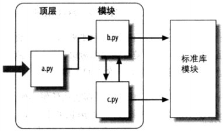
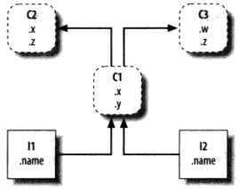
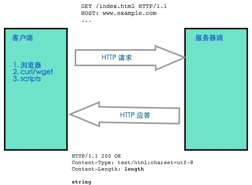
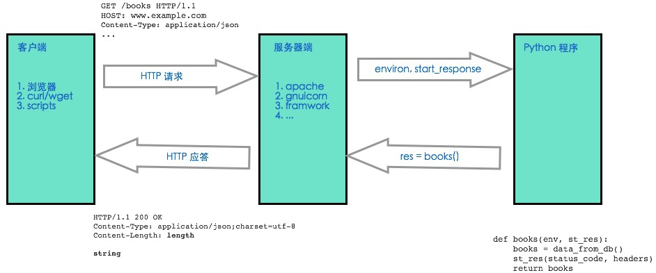
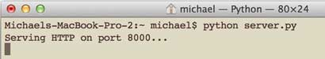
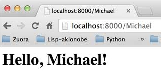

# 目录
* [IDLE](#idle)
* [运行Python](#运行python)
* [Python标准文档模板](#python标准文档模板)
* [可变、不可变数据类型](#可变、不可变数据类型)
* [变量、函数命名](#变量、函数命名)
* [函数参数](#函数参数)
* [异常](#异常)
* [模块](#模块)
* [类与OOP](#类与oop)
* [元类](#元类)
* [装饰器](#装饰器（decorator）)
* [with](#with)
* [WSGI（Web Server Gateway Interface）](#wsgi（web-server-gateway-interface）)

# <p align="center">IDLE</p>

###### [<p align="right">back to top ▲</p>](#目录)

IDLE是Python自带的简单的**集成开发环境**（**IDE**, Integrated Development Environment），是一个可以用来编辑、运行、浏览和调试Python程序的GUI。

> IDLE是IDE的一个官方变形，是为了纪念Monty Python成员Eirc Idle而命名的。

# <p align="center">运行Python</p>
###### [<p align="right">back to top ▲</p>](#目录)

## 命令行模式
python *.py
## Python交互模式
在系统提示环境（命令行、Win+R）下输入“python”即可开启一个交互的Python会话

**输入一行，执行一行**

* 优点：适合实验语法和测试已写入文件的代码
* 缺点：输入的代码不会保存，要重新执行必须重新输入

退出交互模式：exit()


# <p align="center">Python标准文档模板</p>
###### [<p align="right">back to top ▲</p>](#目录)

```python
#!/usr/bin/env python
# -*- coding: utf-8 -*-

' a test module '

__author__ = 'Michael Liao'
```
第1行和第2行是标准注释，

第1行注释可以让这个.py文件直接在Unix/Linux/Mac上运行，

第2行注释表示.py文件本身使用标准UTF-8编码；

第4行是一个字符串，表示模块的文档注释，任何模块代码的第一个字符串都被视为模块的文档注释；

第6行使用__author__变量把作者写进去。


# <p align="center">可变、不可变数据类型</p>
###### [<p align="right">back to top ▲</p>](#目录)

***Python，一切皆为对象，一切皆为对象的引用***
* ***可变数据类型：*** list、dict、set
* ***不可变数据类型：*** int、float、string、tuple


* 变量是一个系统表的元素，拥有指向对象的连接的空间
    * 变量名没有类型，类型属于对象
* 对象是分配的一块内存，有足够的空间去表示他们所代表的值
    * 每个对象都有两个标准的头部信息：一个类型标志符去标识这个对象的类型，一个引用的计数器，用来决定是不是可以回收这个对象
* 引用是自动形成的从变量到对象的指针

**id()方法：**
> Return the “identity” of an object. This is an integer (or long integer) which is guaranteed to be unique and constant for this object during its lifetime. Two objects with non-overlapping lifetimes may have the same id()value.

**Python对每个一个对象都提供一个唯一的id值**

* 交互模式下：
    - Python**在一个语句中**对值相同的不可变对象（tuple除外）都解释为了同一个对象
    ```python
    >>> id(1) == id(1)
    True
    >>> id(1000) == id(1000)
    True
    >>> id(10000) == id(10000)
    True
    ```
    - Python对**整型-5~256**都提前构造好了对象，后续所有值在这个范围内的整型都是指向唯一的对象。目的是为了防止经常使用的数字不断的被创建和销毁
    ```python
    >>> a = 1
    >>> b = 1
    >>> id(a) == id(b)
    True
    >>> a = 257
    >>> b = 257
    >>> id(a) == id(b)
    False
    >>> a = -5
    >>> b = -5
    >>> id(a) == id(b)
    True
    >>> a = -6
    >>> b = -6
    >>> id(a) == id(b)
    False
    ```
* 命令行模式下：
    - Python**在一个文件中**对值相同的不可变对象（tuple除外）都解释为同一个对象
    ```python
    a = 257
    b = 257
    print(id(a), id(b), id(257))
    # 199678070416 199678070416 199678070416
    print(a is b, a is 257)
    # True True
    ```
    
```python
>>> x = 257
>>> id(x)
15475528976
>>> x = 258
>>> id(x)
15475529008
>>> if True:
        a = 257
        b = 257
        c = 257
>>> print(id(a), id(b), id(c))
15475529840 15475529840 15475529840
```
***不可变对象，对象的值是不能被改变的：*** id为15475528976的对象的值在没被垃圾回收之前一直都是257，不能改变，如果要把变量x赋值为258，只能将变量x引用的对象从15475528976变为15475529008。

***不可变对象的优点：*** 不管有多少个引用，相同值的对象只占用一块内存（**tuple例外**）。 

***不可变对象的缺点：*** 当需要对变量进行运算从而改变变量的值时，由于是不可变对象的值不能被改变，所以必须创建新的对象，这样就会使得一次次的运算创建了一个个新的对象，不过不再被任何变量引用的对象会被垃圾回收器回收。

```python
>>> if True:
        a = [1, 2, 3]
        b = [1, 2, 3]
        c = [1, 2, 3]
    
>>> print(id(a), id(b), id(c))
15480645448 15480645128 15480645000

# 变量a、b、c引用的对象的id是不同的,其实是创建了三个不同的对象
# 对于可变数据类型的对象来说，值相同的对象也是不同的对象
# 在内存中可能存在多个值相同的对象，它们的id不同
>>> a.append(4)
>>> id(a)
15480645448
>>> a += [2]
>>> id(a)
15480645448
# 对变量a进行操作相当于直接改变了变量a所引用的对象的值
# 对象本身还是那个对象，对象的id不变
>>> a
[1, 2, 3, 4, 2]
```

***可变对象的意思就是说对象的值是可变的，操作变量不会引起新建对象，只是改变了变量所引用的对象的值。***


# <p align="center">变量、函数命名</p>
###### [<p align="right">back to top ▲</p>](#目录)

## 公开的（public）：
abc、x123、PI

可以被直接引用
## 特殊变量：
\_\_author\_\_ , \_\_name\_\_ , \_\_doc\_\_
可以被直接引用，有特殊用途
## 非公开的（private）：
\_xxx , \_\_xxx
不应该被直接引用(“不应该”但不是“不能”)
# <p align="center">函数参数</p>
###### [<p align="right">back to top ▲</p>](#目录)

## 位置参数（必选参数）
***调用函数时，按照位置顺序传递参数。***
## 默认参数
```python
def enroll(name, gender, age=6, city='Beijing'):
    print('name:', name)
    print('gender:', gender)
    print('age:', age)
    print('city:', city)

# 调用有多个默认参数的函数
# 按顺序提供默认参数
enroll('Bob', 'M', 7)
# 不按顺序提供默认参数时，需要写上参数的名字
enroll('Adam', 'M', city='Tianjin')
```

***默认参数必须指向不变对象:***
```python
def add_end(L=[]):
    L.append('END')
    return L    # L是一个变量，它指向对象[]
>>> add_end()
['END']
>>> add_end()
['END', 'END']
>>> add_end()
['END', 'END', 'END']
```
## 可变参数
```python
def calc(*numbers):
    sum = 0
    for n in numbers:
        sum = sum + n * n
    return sum
```
***可变参数允许你传入0个或任意个参数，这些可变参数在函数调用时自动组装为一个tuple。***
## 关键字参数
```python
def person(name, age, **kw):
    print('name:', name, 'age:', age, 'other:', kw)
```
***关键字参数允许你传入0个或任意个含参数名的参数，这些关键字参数在函数内部自动组装为一个dict。***
## 命名关键字参数
```python
# *, 后面的参数被视为命名关键字参数
def person(name, age, *, city, job):
    print(name, age, city, job)
# 命名关键字参数必须传入参数名，否则将报错
>>> person('Jack', 24, 'Beijing', 'Engineer')
Traceback (most recent call last):
  File "<stdin>", line 1, in <module>
TypeError: person() takes 2 positional arguments but 4 were given
# 由于调用时缺少参数名city和job
# Python解释器把这4个参数均视为位置参数
# 但person()函数仅接受2个位置参数

# 如果函数定义中已经有了一个可变参数，后面的命名关键字参数就不需要特殊分隔符 *,
def person(name, age, *args, city, job):
    print(name, age, args, city, job)
    
# 命名关键字参数可以有缺省值，从而简化调用
def person(name, age, *, city='Beijing', job):
    print(name, age, city, job)
```

***参数定义的顺序必须是：位置参数（必选参数）、默认参数、可变参数和关键字参数。***
```python
def func(a, b, c=0, *args, **kw):
    print('a =', a, 'b =', b, 'c =', c, 'args =', args, 'kw =', kw)
```


# <p align="center">异常</p>
###### [<p align="right">back to top ▲</p>](#目录)

```
BaseException
 +-- SystemExit
 +-- KeyboardInterrupt
 +-- GeneratorExit
 +-- Exception
      +-- StopIteration
      +-- StopAsyncIteration
      +-- ArithmeticError
      |    +-- FloatingPointError
      |    +-- OverflowError
      |    +-- ZeroDivisionError
      +-- AssertionError
      +-- AttributeError
      +-- BufferError
      +-- EOFError
      +-- ImportError
      |    +-- ModuleNotFoundError
      +-- LookupError
      |    +-- IndexError
      |    +-- KeyError
      +-- MemoryError
      +-- NameError
      |    +-- UnboundLocalError
      +-- OSError
      |    +-- BlockingIOError
      |    +-- ChildProcessError
      |    +-- ConnectionError
      |    |    +-- BrokenPipeError
      |    |    +-- ConnectionAbortedError
      |    |    +-- ConnectionRefusedError
      |    |    +-- ConnectionResetError
      |    +-- FileExistsError
      |    +-- FileNotFoundError
      |    +-- InterruptedError
      |    +-- IsADirectoryError
      |    +-- NotADirectoryError
      |    +-- PermissionError
      |    +-- ProcessLookupError
      |    +-- TimeoutError
      +-- ReferenceError
      +-- RuntimeError
      |    +-- NotImplementedError
      |    +-- RecursionError
      +-- SyntaxError
      |    +-- IndentationError
      |         +-- TabError
      +-- SystemError
      +-- TypeError
      +-- ValueError
      |    +-- UnicodeError
      |         +-- UnicodeDecodeError
      |         +-- UnicodeEncodeError
      |         +-- UnicodeTranslateError
      +-- Warning
           +-- DeprecationWarning
           +-- PendingDeprecationWarning
           +-- RuntimeWarning
           +-- SyntaxWarning
           +-- UserWarning
           +-- FutureWarning
           +-- ImportWarning
           +-- UnicodeWarning
           +-- BytesWarning
           +-- ResourceWarning
```


# <p align="center">模块</p>
###### [<p align="right">back to top ▲</p>](#目录)

## 模块导入
```python
try:
    import cStringIO as StringIO
except ImportError:
    import StringIO
```

模块的三个角色：
* 代码重用
    * 模块可以在文件中永久保存代码，可以按照需要任意次数地重新载入和重新运行模块；
    * 模块是定义变量名的空间，被认作是属性，可以被多个外部的客户端引用。
* 系统命名空间的划分
    * 模块是Python中最高级别的程序组织单元；
    * 模块将变量名封装进了自包含的软件包，这点对避免变量名的冲突很有帮助；
    * 模块是组织系统组件的天然工具。
* 实现共享服务和数据
    * 模块对实现跨系统共享的组件是很方便的，仅需要一个拷贝即可；
    * 如果需要一个全局对象，这个对象会被一个以上的函数或文件使用，可以将它编写在一个模块中以便能够被多个客户端导入。

导入给予了对模块的全局作用域中的变量名的读取权。

Python的程序架构：一个程序 = 一个顶层脚本文件 + 多个模块文件。

**标准库模块：**Python自带了大约200个实用的模块，称为标准链接库。




```python
# b.py
def spam(text):
    print(text, 'spam')

# a.py
import b    
# import语句给文件a.py提供了文件b.py在全局作用域中所定义的所有对象的访问权限
b.spam('gumby')
# 通过变量名b获取它的所有的属性
# b.spam，object.attribute对象属性语法，取出存储对象b中变量名为spam的值
```

## import如何工作

在Python中，导入并非只是把一个文件文本插入另一个文件而已。导入其实是运行时的运算，程序第一次导入制定文件时，会执行三个步骤：

1. 找到模块文件；
    > import b，而不是import c:\dir1\b.py，因为Python使用***标准模块搜索路径***来找出import语句对应的模块文件。在标准的import中引入路径和后缀名在语法上是非法的。
2. 编译成字节码文件（需要时）；
    > 遍历模块搜索路径，找到符合import语句的源代码文件后，如果有必要，Python会将其编译成字节码文件。Python会检查文件的时间戳，如果发现.pyc文件比.py文件旧，就会重新生成字节码文件。如果Python在搜索路径上只发现了字节码文件，没有源代码，就会直接加载字节码（因此可以把一个程序只作为字节码文件发布，从而避免发布源代码，这样也可以跳过编译步骤，是程序启动提速）。

    > 只有被导入的文件才会在机器上留下.pyc文件，顶层文件的字节码在内部使用后就丢弃了。因此通常看不到程序顶层文件的.pyc字节码文件，除非这个文件也被其它文件导入。被导入的文件的字节码保存在机器上从而可以提高之后的运行速度。

    > 顶层文件通常设计为直接执行，而不是被导入的。设计一个文件，使其作为程序的顶层文件，并同时扮演被导入的模块工具的角色也是有可能的，这类文件既能执行也能导入。（利用__name__属性）
3. 执行模块的代码来创建其所定义的对象。
    > import操作的最后步骤是执行模块的字节码。文件中的所有语句会依次执行，这个执行步骤会生成模块代码所定义的所有工具。

这三个步骤只在模块第一次导入时才会进行，在此之后，导入相同模块时，会跳过这三个步骤，只提取内存中已加载的模块对象。如果在模块已经加载之后还需要再次导入（例如，为了支持终端用户的定制），可以通过调用reload强制处理这个问题。

Python把载入的模块存储到一个名为sys.modules的表中，并在一次导入操作开始时检查该表，如果模块不存在，则会执行这三个步骤。

> 可以导入sys并打印list(sys.modules.keys())来查看已经导入了哪些模块。

## 模块搜索路径

导入过程最重要的部分是定位要导入的文件（搜索部分）。

搜索路径：
1. 程序的主目录
    > Python会首先在主目录内搜索导入的文件，这一入口与你如何运行代码有关。当你运行一个程序的时候，这个入口就是包含程序顶层脚本文件的目录。当在交互模式下工作时，这个入口就是你当前工作的目录。
2. PYTHONPATH目录（如果已经进行了设置）
    > 之后，Python会从左至右搜索PYTHONPATH环境变量设置中的所有目录。PYTHONPATH是设置包含Python程序文件的目录的列表，你可以把想到如的目录都加进来，Python会使用你的设置来拓展模块搜索的路径。

    > 因为Python会先搜索主目录，所以当导入的文件跨目录时，这个设置才格外重要。
3. 标准链接库目录
    > 接着，Python会自动搜索标准库模块安装在机器上的那些目录。这些目录通常不需要添加到PYTHONPATH或包含到.pth路径文件中。
4. 任何.pth文件的内容（如果存在的话）
    > 最后，Python允许用户把有效的目录在.pth文件中一行一行地罗列出来。这提供了PYTHONPATH设置的一种替代方案。

    > 当内含目录名称的.pth文件放在适当的目录中时（C:\Python\Python36、C:\Python\Python36\Lib\site-packages），可以扮演与PYTHONPATH环境变量设置相同的角色。

这四部分组合起来就变成了sys.path，它是目录名称字符串的列表。

搜索路径的第一和第三部分是自动定义的，但是因为Python会从头到尾搜索这些组件，第二和第四部分可以用于拓展路径，从而包含你自己的源代码目录。

```python
>>>import sys
>>>sys.path
# 交互环境下sys.path第一个路径是一个空项，对应当前目录。
['', 
'C:\\Python\\Python36\\python36.zip', 
'C:\\Python\\Python36\\DLLs', 
'C:\\Python\\Python36\\lib', 
'C:\\Python\\Python36', 
'C:\\Python\\Python36\\lib\\site-packages', 
'C:\\Python\\Python36\\lib\\site-packages\\win32', 
'C:\\Python\\Python36\\lib\\site-packages\\win32\\lib', 
'C:\\Python\\Python36\\lib\\site-packages\\Pythonwin']

# foo.py
import sys
print(sys.path)

# 运行
E:\MyProjects\PycharmProjects\bao>python foo.py
['E:\\MyProjects\\PycharmProjects\\bao', 
'C:\\Python\\Python36\\python36.zip', 
'C:\\Python\\Python36\\DLLs', 
'C:\\Python\\Python36\\lib', 
'C:\\Python\\Python36', 
'C:\\Python\\Python36\\lib\\site-packages', 
'C:\\Python\\Python36\\lib\\site-packages\\win32', 
'C:\\Python\\Python36\\lib\\site-packages\\win32\\lib', 
'C:\\Python\\Python36\\lib\\site-packages\\Pythonwin']
```
可以通过修改sys.path列表直接调整搜索路径，不过这种修改只在脚本运行期间保持。

## 模块文件选择
文件名的后缀（如.py）是刻意从import语句中省略的。Python会选择在搜索路径中第一个符合导入文件名的文件。

例如，import b可能会加载：

* 源代码文件b.py
* 字节码文件b.pyc
* 目录b，包导入
* 编译扩展模块（通常用C或C++编写），导入时使用动态链接（例如，Linux的b.so以及Cygwin和Windows的b.dll或b.pyd）
* 用C编写的编译好的内置模块，并通过静态连接至Python
* ZIP文件组件，导入时自动解压缩
* 内存内映像，对于frozen可执行文件
* Java类，在Jython版本的Python中
* .NET组件，在IronPython版本的Python中

对导入者来说，完全忽略了需要加载的文件类型之间的差异，例如，import b就是读取模块b，根据模块搜索路径，b是什么就是什么，b.attr则是去除模块中的一个元素，可能是Python变量或连接的C函数。某些标准模块实际上使用C编写的而不是Python，这是因为这种透明度，客户端并不在乎文件是什么。

如果在不同的目录中有b.py和b.so，Python总是在从左至右搜索sys.path时加载模块搜索路径的目录中最先出现的相符文件；如果同一目录下有b.py和b.so，Python会遵循一个标准的挑选顺序，不过这个顺序不保证永远不变，所以尽量让模块名独特一些。


## 高级的模块选择概念

利用导入钩子（import hook）可以重新定义Python中import操作所做的事。

### **distutils**

> Python的第三方扩展，通常使用标准链接库中的distutils模块自动安装，distutils会将第三方扩展安装在属于模块自动搜索路径的目录内（通常是Python安装目录树下的Lib\site-packages子目录中），所以不需要路径设置就能使用它们的代码。


## 模块的创建

对于会执行但不会被导入的顶层文件而言，.py后缀可有可无，但是如果要将文件作为模块导入，则必须以.py后缀结尾。

也可以使用C或C++（或Java，Python语言的Jython实现）这类外部语言编写代码创建Python模块，这类模块称为**扩展模块**。


## 模块的使用

import会读取整个模块，from用于获取模块中特定的变量。

* ### import module
    * import将整个module模块赋值给变量module。

* ### from module import var/var1, var2.../*
    * from import将module模块中一个或多个变量赋值给另一个模块中同名的变量；
    * from import的第一步也是普通的导入操作，会把整个模块导入到内存中，只加载模块文件的一部分是不可能的;
    * 使用from module import *会把一个命名空间融合到另一个，会使得模块的命名空间分割特性消失。

```python
from module import var1, var2
# 等效于
import module
var1 = module.var1
var2 = module.var2
del module  # Get rid of the module name
```

```python
# small.py
x = 1
y = [1, 2]
# end small.py

>>>from small import x, y
>>>x = 42
# 变量x，int，是不可变对象，此处的x和small中的x指向不同的对象
>>>x
42
>>>y[0] = 42
# 变量y，list，是可变对象，此处的y和small中的y指向同一个对象
>>>y
[42, 2]
>>>import small
>>>small.x
1
>>>small.y
[42, 2]
```

```python
# small.py
x = 1
y = [1, 2]
# end small.py

>>>import small
>>>small
# 变量small，变量名small指向模块对象
# <module 'small' from '...\\small.py'>
>>>small.x = 42
# 直接修改模块对象中的x
>>>small.y[0] = 42
# 直接修改模块对象中的y
>>>small.x
42
>>>small.y
[42, 2]
>>>from small import x, y
# 等效于
# import small
# x = small.x
# y = small.y
# del small
>>>x
42
>>>x = 43
>>>small.x
42
# 变量x，int，是不可变对象，此处的x和small中的x指向不同的对象
# 修改变量x，small中的x不变
>>>y
[42, 2]
>>>y[0] = 43
>>>small.y
[43, 2]
# 变量y，list，是可变对象，此处的y和small中的y指向同一个对象
# 修改变量y，small中的y不变
```

### 导入只发生一次

模块会在第一次导入时载入并执行（**不管是import还是from import**），且仅在第一次如此。因为该操作开销较大，默认情况下Python只对每个文件的每个进程做一次操作，之后的导入操作都只会取出已加载的模块对象。

```python
# simple.py
print("Hello")
spam = 1
# end simple.py

>>>import simple
# First import: loads and runs file's code
Hello
>>>simple.spam
1
>>>simple.spam = 2
>>>import simple
# 第二次及其后的导入不会重新执行此模块的代码，
# 只是从Python内部模块表中取出已创建的模块对象。
# 因此spam不会再次进行初始化：
>>>simple.spam
2
```

```python
# simple.py
print("Hello")
spam = [1, 2, 3]
# end simple.py

>>>from simple import spam
# First import: loads and runs file's code
Hello
>>>spam
[1, 2, 3]
# 修改simple.py中的代码
# spam = [1, 2, 3, 4]
>>>import simple
# 第二次及其后的导入不会重新执行此模块的代码，
# 只是从Python内部模块表中取出已创建的模块对象。
# 因此spam不会再次进行初始化：
>>>simple.spam
[1, 2, 3]
```

```python
# simple.py
print("Hello")
spam = [1, 2, 3]
# end simple.py

>>>from simple import spam
# First import: loads and runs file's code
Hello
>>>spam
[1, 2, 3]
>>>spam.append(4)
>>>spam
[1, 2, 3, 4]
>>>import simple
# 第二次及其后的导入不会重新执行此模块的代码，
# 只是从Python内部模块表中取出已创建的模块对象。
# 因此spam不会再次进行初始化：
>>>simple.spam
[1, 2, 3, 4]
```

### import和from import是赋值语句

和def一样，import和from import是隐性的赋值语句，而不是编译期间的声明，可以被嵌套在if、def等其他语句中。

## 模块命名空间

**模块对应于文件，Python会建立模块对象，以包含模块文件内的所有变量名。所以，模块就是命名空间（变量名所在的场所），模块内的变量名就是模块对象的属性。**

### 文件生成命名空间

在模块文件顶层（即不在函数或类的主体内）每一个赋值了的变量名都会成为该模块的属性。

* 模块语句会在首次导入时执行；
* 顶层的赋值语句会创建模块属性；
* 模块的命名空间能通过属性\_\_dict\_\_获取；
* 模块是一个独立的作用域（本地变量就是全局变量）。

### 导入和作用域

导入并不会赋予被导入文件中的代码对上层代码的可见度：被导入文件无法看见进行导入的文件内的变量名：

* 函数绝对无法看到其他函数内的变量名，除非他们从物理上处于这个函数内；
* 模块程序代码绝对无法看见其他模块内的变量名，除非明确地进行了导入。

**在Python中，一段程序的作用域完全由程序在文件中的实际位置决定，作用域绝不会被函数调用或模块导入影响。**

```python
# moda.py
X = 88
def f():
    glabal X
    X = 99
# end moda.py

# modb.py
X = 11
import moda
moda.f()
# 执行时，moda.f修改moda中的X。
# moda.f的全局作用域一定是定义它的文件，而非调用它的文件
print(X, moda.X)
# end modb.py

% python modb.py
11 99
```

### 命名空间的嵌套

**导入不会使命名空间发生向上的嵌套，但会发生向下的嵌套。利用属性的点号运算路径，有可能深入到任意嵌套的模块中并读取其属性。**

```python
# mod3.py
X = 3

# mod2.py
X = 2
import mod3
print(X, end=' ')   # My global X 
print(mod3.X)       # mod3's X
# mod3无法看见mod2内的变量名

# mod1.py
X = 1
import mod2
print(X, end=' ')       # My global X
print(mod2.X, end=' ')  # mod2's X
print(mod2.mod3.X)      # Nested mod3's X
# mod2无法看见mod1内的变量名

# 运行mod1.py
% python mod1.py
2 3
1 2 3
```

**mod1.py中，import mod2，然后使用mod2.mod3.X是合法的，但是不可以import mod2.mod3。**
这是包（目录）导入的语法。包导入也会形成模块命名空间嵌套，但是其导入语句会反映目录树结构，而非简单的导入链。

## 重载模块

* 模块只会在流程中第一次导入时加载和执行该模块的代码；
* 之后的导入只会使用已加载的模块对象，而不会重载或重新执行文件的代码；
* reload函数会强制加载模块的代码重新载入并重新执行。

### reload基础

与import不同：
* reload是Python的内置函数，不是语句；
* 传给reload的是已存在的**模块对象**，不是变量名；
* reload在Python3.0中位于模块之中，必须导入自己。

```python
import module

...use module.attributes...

from imp import reload
reload(module)
...use module.attributes...
```

**调用reload时，Python会重读文件的源代码，重新执行其顶层语句。**

**reload会在适当的地方修改模块对象，reload并不会删除并重建模块对象。**

* reload会重新执行模块文件的代码覆盖现有命名空间，而非进行删除再重建；
* 文件中顶层赋值语句会使得变量名换成新值；
* **重载会影响所有import读取了模块的客户端**：因为使用import的客户端需要通过点号运算符取出属性，在重载后，它们会发现模块对象中变成了新的值；
* **重载只会对以后使用from的客户端造成影响**：之前使用from读取属性的客户端并不会受到重载的影响，那些客户端引用的依然是重载前所取出的旧对象。

```python
# simple.py
print("Hello")
spam = [1, 2, 3]
baz = [4, 5, 6]
# end simple.py

>>>from simple import spam
# First import: loads and runs file's code
Hello
>>>spam
[1, 2, 3]
>>>spam.append(4)
>>>spam
[1, 2, 3, 4]
>>>import simple
# 注意，没有打印出“Hello”，
# 说明没有重新执行此模块的代码。
>>>simple.spam
[1, 2, 3, 4]
# 第二次及其后的导入不会重新执行此模块的代码，
# 只是从Python内部模块表中取出已创建的模块对象。
# 因此spam不会再次进行初始化：
>>>import imp
# 先将simple.py中的baz修改为[4, 5, 6, 7]
>>>imp.reload(simple)
Hello
<module 'simple' from '...\\simple.py'>
>>>simple.spam
[1, 2, 3]
# 重载会影响所有import读取了模块的客户端
>>>spam
[1, 2, 3, 4]
# 之前使用from读取属性的客户端并不会受到重载的影响，
# 那些客户端引用的依然是重载前所取出的旧对象。
>>>from simple import baz
>>>baz
[4, 5, 6, 7]
# 重载只会对以后使用from的客户端造成影响
```

**模块重载的意义：**

> 除了可以在交互模式下重载外，模块重载在较大系统中也很有用。如果重新启动系统代价太大，可以在执行期间定期自动重载Python定制的程序代码，这样在系统执行时就可以采用用户的修改，每次Python代码修改时就不需要停止并重启。


## 包导入基础

> 除了模块名外，导入也可以指定目录路径。Python代码的目录称为包，因此这类导入称为包导入。包导入就是把计算机上的目录变成一个Python命名空间，而属性则对应于目录中所包含的子目录和模块文件。

> 当多个同名的程序文件安装在某一机器上时，包导入可以用来解决导入的不确定性。

* **import dir1.dir2.mod**
* **from dir1.dir2.mod import x**

**dir0\dir1\dir2\mod.py     # or mod.pyc, mod.so. etc.**

“点号路径”是对应于机器上目录层次的路径，这些导入意味着dir1位于某个容器目录dir0中，***dir0目录可以在Python模块搜索路径中找到***。

### \_\_init\_\_.py包文件

**包导入语句的路径中每个目录内都必须有\_\_init\_\_.py文件，否则导入包会失败。**

dir0\dir1\dir2.mod.py

import dir1.dir2.mod

* dir1和dir2中必须有\_\_init\_\_.py文件；
* dir0是容器,不需要\_\_init\_\_.py文件，如果有也会被忽略；
* dir0必须在模块搜索路径上。

\_\_init\_\_.py文件扮演了包初始化的钩子、替目录产生模块命名空间以及使用目录导入时实现from ... import *的角色：

* #### **包的初始化：**
    > Python首次导入某个目录时，会自动执行该目录下的\_\_init\_\_.py文件中的所有代码。可以用它来创建所需要的数据文件、连接数据库等。直接执行\_\_init\_\_.py文件没什么用，当包首次读取时，它会自动运行。

* #### **模块命名空间的初始化：**
    > 在包导入的模型中，脚本内的目录路径在导入后会变成真实的嵌套对象路径。在上个例子中，导入后，表达式dir1.dir2会运行，并返回一个模块对象，此对象的命名空间包含了dir2的\_\_init\_\_.py文件所赋值的所有变量名。

* #### __from ... import *__
    > 可以在\_\_init\_\_.py文件内使用__all__列表来定义目录以from ... import *形式导入时需要导出什么。在__init__.py文件中，__all__列表指当包（目录）名称使用from ... import *时，应该导入的子模块的名称清单。如果没有设定__all__，from ... import *不会自动加载嵌套于该目录内的子模块。取而代之的是，只加载该目录的__init__.py文件中赋值语句定义的变量名，包括该文件中程序代码明确导入的任何子模块。

## 包导入实例

```python
# dir1\__init__.py
print('dir1 init')
x = 1

# dir1\dir2\__init__.py
print('dir2 init')
y = 2

# dir1\dir2\mod.py
print('in mod.py')
z = 3

% python
>>>import dir1.dir2.mod
dir1 init
dir2 init
in mod.py
>>>
>>>import dir1.dir2.mod
>>>
>>>from imp import reload
>>>reload(dir1)
dir1 init
<module 'dir' from 'dir1\__init__.pyc'>
>>>
>>>reload(dir1.dir2)
dir2 init
<module 'dir1.dir2' from 'dir1\dir2\__init__.pyc'>
>>>dir1
<module 'dir1' from 'dir1\__init__.pyc'>
>>>dir1.dir2
<module 'dir1.dir2' from 'dir1\dir2\__init__.pyc'>
>>>dir1.dir2.mod
<module 'dir1.dir2.mod' from 'dir1\dir2\mod.pyc'>
>>>dir1.x
1
>>>dir1.dir2.y
2
>>>dir1.dir2.mod.z
3
```

## 包对应的from import语句和import语句

import语句和包一起使用时，必须经常重新输入路径：

```python
>>>dir2.mod
NameError: name 'dir2' is not defined
>>>mod.z
NameError: name 'mod' is not defined
```

使用from import语句可以避免每次读取时都要重新输入路径：

```python
>>>from dir1.dir2 import mod
dir1 init
dir2 init
in mod.py
>>>mod.z
3
>>>from dir1.dir2.mod import z
>>>z
3
>>>import dir1.dir2.mod as mod
>>>mod.z
3
```

**更重要的是，如果你改变了目录树结构，from import语句只需在程序中更新一次路径，而import则需要修改很多地方。**

## 为什么要用包导入

包让导入更具信息性，并且可作为组织工具，简化模块的搜索路径，而且可以解决模糊性。

* 包导入提供了程序文件的目录信息，可以轻松找到文件，从而可以作为组织工具使用；
    * 没有包导入时，通常要通过查看模块走走路径才能找出文件；
    * 如果根据功能把文件组织成子目录，包导入会让模块扮演的角色更为明显，也使代码更具可读性。
    ```python
    import utilities
    # 正常导入模块搜索路径上某个目录内的文件，
    # 与下面包含路径的导入相比，提供的信息就更少
    import database.client.utilities
    ```
* 包导入可以大幅简化PYTHONPATH和.pth文件搜索路径设置；
    * 如果所有跨目录的导入都使用包导入，且让这些包导入都相对于一个共同的根目录，把所有Python程序代码都存在其中，在搜索路径上就只需要一个单独的接入点：通用的根目录。
* 包导入让你想导入的文件更明确，从而解决了模糊性。

```python
root\
    system1\
        __init__.py
        utilities.py
        main.py
        other.py
    system2\
        __init__.py
        utilities.py
        main.py
        other.py
    system3\            # Here or elsewhere
        __init__.py     # Your new code here
        myfile.py

# myfile.py
# 目录名称让模块的引用变得具有唯一性。
# 如果使用import utilities，
# 因为搜索路径本质上是线性的，搜索总是从左至右扫描，
# 所以一定会得到搜索路径上最左侧的目录内的utilities.py，
# 而永远无法导入另一个目录中的utilities.py。
import system1.utilities
import system2.utilities
system1.utilities.function('spam')
system2.utilities.function('eggs')
```

\_\_init\_\_.py文件加入system1和system2目录中使其工作，但不需要在根目录中添加。只有代码中import语句所列出的目录才需要\_\_init\_\_.py文件。Python首次通过包的目录处理导入时，\_\_init\_\_.py文件会自动运行。

技术上讲， system3不需要放在根目录下：只有被导入的代码包需要。然而，因为不知道何时模块可能在其他程序中使用，还是将其放在通用的根目录下以避免以后类似的变量名冲突问题。


## 包相对导入

### 为什么要用包导入
```python
mypkg\
    __init__.py
    main.py
    string.py
```


# <p align="center">类与OOP</p>
###### [<p align="right">back to top ▲</p>](#目录)

OOP（Object Oriented Programming，面向对象的程序设计）

object.attributes

通过代码建立连接对象树，每次使用object.attribute表达式时，Python会“爬树”来搜索属性：



> 类树，底端有两个实例（I1和I2），在它上面有个类（C1），顶端有两个超类（superclass）（C2和C3）。所有这些对象都是命名空间（变量的封装），继承就是由下向上搜索此树，来寻找属性名所出现的最低的地方。超类提供了所有子类共享的行为，由于搜索是由下向上的，子类可能会在树中较低位置重新定义超类的变量名，从而覆盖超类定义的属性。

* 类：实例工厂；
* 实例：程序中的具体元素。

1. I1.x和I2.x在C1中找到x并停止搜索，因为C1比C2位置**更低**；
2. I1.y和I2.y在C1中找到y，因为这里是y唯一出现的地方；
3. I1.z和I2.z在C2中找到z，因为C2比C3**更靠左**；
4. I2.name在I2中找到name，不需要爬树。

方法可以通过实例或类进行调用，Python把隐含的实例传进方法中的第一个特殊的参数，习惯上称其为self。

类连接至超类的方式是将超类列在类头部的括号内，其从左至右的顺序会决定树中的顺序。

类和实例是两种不同的对象类型，但在树中，它们几乎完全相同：都用来作为命名空间（变量的封装）。

类与模块的一个差异：内存中特定模块只有一个实例（所以要重载模块以取得其新代码），对类而言，只要需要，制作多少实例都可以。

多重继承：在类树中，类有一个以上的超类，超类在小括号中从左到右的顺序决定了其在类树中从左到右的搜索顺序。

当def出现在类的内部时，通常称为方法，而且会自动接收第一个特殊参数（self），这个参数提供了被处理的实例的参照值。

多态是指方法的意义取决于要用方法的对象。

在很多领域，你可以取得或购买超类集合体，即所谓的软件框架（framework），把常见程序设计任务实现成类，可以让你在应用程序中混合。这些框架可能提供一些数据库借口、测试协议、GUI工具箱等等。利用这些框架，只需编写子类，填入所需的一两个方法。树中较高位置的框架类会替你做绝大多数工作。在OOP中写程序，需要做的就是通过编写自己的子类，结合和定制已调试的代码。


# <p align="center">元类</p>
###### [<p align="right">back to top ▲</p>](#目录)

type()函数既可以返回一个对象的类型，又可以创建出新的类型

1. class的名称；
2. 继承的父类集合，注意Python支持多重继承，如果只有一个父类，别忘了tuple的单元素写法；
3. class的方法名称与函数绑定，这里我们把函数fn绑定到方法名hello上。

除了使用type()动态创建类以外，要控制类的创建行为，还可以使用metaclass。

metaclass允许你创建类或者修改类，你可以把类看成是metaclass创建出来的“实例”。

按照默认习惯，metaclass的类名总是以Metaclass结尾，以便清楚地表示这是一个metaclass：

```python
# metaclass是类的模板，所以必须从`type`类型派生：
class ListMetaclass(type):
    def __new__(cls, name, bases, attrs):
        attrs['add'] = lambda self, value: self.append(value)
        return type.__new__(cls, name, bases, attrs)
```

有了ListMetaclass，我们在定义类的时候还要指示使用ListMetaclass来定制类，传入关键字参数metaclass：

```python
class MyList(list, metaclass=ListMetaclass):
    pass
```

当我们传入关键字参数metaclass时，魔术就生效了，它指示Python解释器在创建MyList时，要通过ListMetaclass.__new__()来创建，在此，我们可以修改类的定义，比如，加上新的方法，然后，返回修改后的定义。

__new__()方法接收到的参数依次是：

1. 当前准备创建的类的对象；
2. 类的名字；
3. 类继承的父类集合；
4. 类的方法集合。

ORM全称“Object Relational Mapping”，即对象-关系映射，就是把关系数据库的一行映射为一个对象，也就是一个类对应一个表，这样，写代码更简单，不用直接操作SQL语句。

要编写一个ORM框架，所有的类都只能动态定义，因为只有使用者才能根据表的结构定义出对应的类来。

```python
class User(Model):
    # 定义类的属性到列的映射：
    id = IntegerField('id')
    name = StringField('username')
    email = StringField('email')
    password = StringField('password')

# 创建一个实例：
u = User(id=12345, name='Michael', email='test@orm.org', password='my-pwd')
# 保存到数据库：
u.save()
```


# <p align="center">装饰器（Decorator）</p>
###### [<p align="right">back to top ▲</p>](#目录)


* 实质：是一个返回函数的高阶函数
* 参数：要装饰的函数名（并非函数调用）
* 返回：是装饰完的函数名（也非函数调用）
* 作用：为已经存在的对象添加额外的功能
* 特点：不需要对对象做任何的代码上的变动

```python
def decorator(func):
    def wrapper(*args, **kw):
        # do something here
        return func(*args, **kw)    # 执行func，并返回func的返回结果
    return wrapper

# 带参数的decorator
def decoratorWithArg(arg):
    def decorator(func):
        def wrapper(*args, **kw):
            # do something with arg here
            return func(*args, **kw)
        return wrapper
    return decorator
```
***@语法糖***
```python
@decorator
def func():
    pass
# 相当于func = decorator(func)
```


# <p align="center">with</p>
###### [<p align="right">back to top ▲</p>](#目录)

```python
class DummyResource:
    def __init__(self, tag):
        self.tag = tag
        print('Resource [%s]' % tag)
    def __enter__(self):
        print('[Enter %s]: Allocate resource.' % self.tag)
        return self   # 返回实例，赋值给as后的变量
    def __exit__(self, exc_type, exc_value, exc_tb):    # 异常类型，异常值，异常
        print('[Exit %s]: Free resource.' % self.tag)
        if exc_tb is None:
            print('[Exit %s]: Exited without exception.' % self.tag)
        else:
            print('[Exit %s]: Exited with exception raised.' % self.tag)
            return False   # 可以省略，缺省的None也是被看做是False

    def bar(self):
        print("barbarbar!!!")


with DummyResource('Normal') as foo:
    print('[with-body] Run without exceptions.')
    foo.bar()

# Resource [Normal]
# [Enter Normal]: Allocate resource.
# [with-body] Run without exceptions.
# barbarbar!!!
# [Exit Normal]: Free resource.
# [Exit Normal]: Exited without exception.


with DummyResource('With-Exception'):
    print('[with-body] Run with exception.')
    raise Exception(123)
    print('[with-body] Run with exception. Failed to finish statement-body!')

# Traceback (most recent call last):
# Resource [With-Exception]
#   File "D:/MyProjects/Sort/oop.py", line 26, in <module>
#     raise Exception(123)
# [Enter With-Exception]: Allocate resource.
# Exception: 123
# [with-body] Run with exception.
# [Exit With-Exception]: Free resource.
# [Exit With-Exception]: Exited with exception raised.
# <class 'Exception'> 123 <traceback object at 0x02D33F58>
# 
# Process finished with exit code 1
```


# <p align="center">WSGI（Web Server Gateway Interface）</p>
###### [<p align="right">back to top ▲</p>](#目录)

Web应用的本质就是：

1. 浏览器发送一个HTTP请求；

    ```
    # 内容包括了 method、 url、 protocol version 以及头部的信息
    GET /Index.html HTTP/1.1\r\n
    Connection: Keep-Alive\r\n
    Accept: */*\r\n
    User-Agent: Sample Application\r\n
    Host: www.microsoft.com\r\n\r\n
    ```
2. 服务器收到请求，生成一个HTML文档；
3. 服务器把HTML文档作为HTTP响应的Body发送给浏览器；

    ```
    # HTTP 响应（不包括数据）可能是如下的内容
    HTTP/1.1 200 OK
    Server: Microsoft-IIS/5.0\r\n
    Content-Location: http://www.microsoft.com/default.htm\r\n
    Date: Tue, 25 Jun 2002 19:33:18 GMT\r\n
    Content-Type: text/html\r\n
    Accept-Ranges: bytes\r\n
    Last-Modified: Mon, 24 Jun 2002 20:27:23 GMT\r\n
    Content-Length: 26812\r\n
    ```
4. 浏览器收到HTTP响应，从HTTP Body取出HTML文档并显示。

最简单的Web应用就是先把HTML用文件保存好，用一个现成的HTTP服务器软件，接收用户请求，从文件中读取HTML，返回。Apache、Nginx、Lighttpd等这些常见的静态服务器就是干这件事情的：



如果要动态生成HTML，就需要把上述步骤自己来实现。

面向http的Python程序需要关心哪些内容：

* 请求
	* 请求的方法method
	* 请求的地址url
	* 请求的内容
	* 请求的头部header
	* 请求的环境信息
* 响应
	* 状态码status_code
	* 响应的数据
	* 响应的头部

不过，接受HTTP请求、解析HTTP请求、发送HTTP响应都是苦力活，如果我们自己来写这些底层代码，还没开始写动态HTML呢，就得花个把月去读HTTP规范。

正确的做法是底层代码由专门的服务器软件实现，我们用Python专注于生成HTML文档。实际生产中，Python程序是放在服务器的http server（比如Apache，Nginx 等）上的。

> Python Web开发中，服务端程序可以分为两个部分，一是服务器程序，二是应用程序。前者负责把客户端请求接收，整理，后者负责具体的逻辑处理。为了方便应用程序的开发，我们把常用的功能封装起来，成为各种Web开发框架，例如Django，Flask，Tornado。不同的框架有不同的开发方式，但是无论如何，开发出的应用程序都要和服务器程序配合，才能为用户提供服务。这样，服务器程序就需要为不同的框架提供不同的支持。这样混乱的局面无论对于服务器还是框架，都是不好的。对服务器来说，需要支持各种不同框架，对框架来说，只有支持它的服务器才能被开发出的应用使用。

> 这时候，标准化就变得尤为重要。我们可以设立一个标准，只要服务器程序支持这个标准，框架也支持这个标准，那么他们就可以配合使用。一旦标准确定，双方各自实现。这样，服务器可以支持更多支持标准的框架，框架也可以使用更多支持标准的服务器。

***服务器程序怎么把接受到的请求传递给Python呢？怎么在网络的数据流和Python的结构体之间转换呢？***

这就是WSGI做的事情：

> **WSGI，官方定义是，Web Server Gateway Interface，从名字可以看出这东西是一个Gateway，网关，网关的作用就是在协议之间进行转换。WSGI就像是一座桥梁，一边连着http server，另一边连着Python程序。WSGI的任务就是把上面的数据在http server和Python程序之间进行简单友好地传递。WSGI是一套关于服务器端和程序端的规范，或者说统一的接口，它是一个标准，被定义在[PEP 333](https://www.python.org/dev/peps/pep-0333/)。http server和Python程序都要遵守这个标准，实现这个标准的约定内容，才能正常工作。WSGI使我们不必接触TCP连接、HTTP原始请求和响应格式，只需要专心用Python编写Web业务。**

> **WSGI是服务器程序与应用程序的一个约定，它规定了双方各自需要实现什么接口，提供什么功能，以便二者能够配合使用。**



## Python应用程序端

1. 应用程序需要是一个可调用的对象；
    * 函数
    * 类，这时候，用这个类生成实例的过程就相当于调用这个类
    * 实例，它的类实现了\_\_call\_\_方法    
2. 可调用对象接收两个参数；
    ```python
    # callable function
    def application(environ, start_response):
        pass

    # callable class
    class Application:
        def __init__(self, environ, start_response):
            pass

    # callable object
    class ApplicationObj:
        def __call__(self, environ, start_response):
            pass
    ```
3. 可调用对象要返回一个值，这个值是可迭代的。
    ```python
    HELLO_WORLD = b"Hello world!\n"

    # callable function
    def application(environ, start_response):
        return [HELLO_WORLD]

    # callable class
    class Application:
        def __init__(self, environ, start_response):
            pass

        def __iter__(self):
            yield HELLO_WORLD

    # callable object
    class ApplicationObj:
        def __call__(self, environ, start_response):
            return [HELLO_WORLD]
    ```

> 由于框架已经把WSGI中规定的一些东西封装起来了，我们平时用框架时，看不到这些东西，只需要直接实现我们的逻辑，再返回一个值就好了。其它的东西框架帮我们做好了。这也是框架的价值所在，把常用的东西封装起来，让使用者只需要关注最重要的东西。

WSGI接口定义非常简单，它只要求Web开发者实现一个可调用的对象（函数；类；实现了\_\_call\_\_方法的类的实例），就可以响应HTTP请求：

```python
# hello.py
# 1. 可调用对象是一个函数
# application函数就是符合WSGI标准的一个HTTP处理函数，它接收两个参数：
# environ：WSGI的环境信息，一个包含所有HTTP请求信息的dict对象；
# start_response：发送HTTP响应的函数。
def application(environ, start_response):
    """
    这里的可调用对象是application这个函数。
    使用方法类似于：
    for result in application(environ, start_response):
        do_something(result)
    """
    # start_response接收两个参数，HTTP响应码和一个HTTP Header组成的list，
    # 每个Header用一个包含两个str的tuple表示。
    start_response('200 OK', [('Content-Type', 'text/html')])
    # 发送HTTP响应的Header，
    # 注意Header只能发送一次，也就是只能调用一次start_response()函数。

    return [b'<h1>Hello, Web!</h1>']
    # 然后，函数的返回值b'<h1>Hello, web!</h1>'将作为HTTP响应的Body发送给浏览器。
    # 返回必须是iterable

# 2. 可调用对象是一个类
class Application:
    """
    这里的可调用对象是Application这个类，调用它就能生成可以迭代的结果。
    使用方法类似于：
    for result in Application(environ, start_response):
        do_something(result)
    """
    def __init__(self, environ, start_response):
        self.environ = environ
        self.start = start_response

    def __iter__(self):
        status = '200 OK'
        response_headers = [('Content-type', 'text/plain')]
        self.start(status, response_headers)
        yield "<h1>Hello, Web!</h1>"

# 3. 可调用对象是一个实例
class Application:
    """
    这里的可调用对象是Application的实例，使用方法类似于：
    app = Application()
    for result in app(environ, start_response):
        do_something(result)
    """
    def __init__(self):
        pass

    def __call__(self, environ, start_response):
        status = '200 OK'
        response_headers = [('Content-type', 'text/plain')]
        self.start(status, response_headers)
        yield "<h1>Hello, Web!</h1>"
```

有了WSGI，我们只需要关心如何从environ这个dict对象拿到HTTP请求信息，然后构造HTML，通过start_response()发送Header，最后返回Body。

application函数本身没有涉及到任何解析HTTP的部分，也就是说，底层代码不需要我们自己编写，我们只负责在更高层次上考虑如何响应请求就可以了。

## http server服务器程序端

**application函数怎么调用？**

* 如果我们自己调用，两个参数environ和start_response我们没法提供，返回的bytes也没法发给浏览器；
* 所以application()函数必须由WSGI服务器来调用。

Python内置了一个WSGI服务器，这个模块叫wsgiref，它完全符合WSGI标准，但不考虑任何运行效率，仅供开发和测试使用。

```python
# server.py
from wsgiref.simple_server import make_server
from hello import application

# 创建一个服务器，IP地址为空，端口8000，处理函数application
httpd = make_server('', 8000, application)
print('Serving HTTP on port 8000...')
# 开始监听HTTP请求
httpd.server_forever()
```

1. 启动WSGI服务器

    
2. 访问http://localhost:8000/

    
3. 可以看到wsgiref打印的log信息

    

改进这个Web应用，从environ里读取PATH_INFO，显示更加动态的内容：
```python
# hello.py
def application(environ, start_response):
    start_response('200 OK', [('Content-Type', 'text/html')])
    body = '<h1>Hello, %s!</h1>' % (environ['PATH_INFO'][1:] or 'Web')
    return [body.encode('utf-8')]
```

可以在地址栏输入用户名作为URL的一部分，将返回Hello, xxx!：



无论多么复杂的Web应用程序，入口都是一个WSGI处理函数。HTTP请求的所有输入信息都可以通过environ获得，HTTP响应的输出都可以通过start_response()加上函数返回值作为Body。

复杂的Web应用程序，光靠一个WSGI函数来处理还是太底层了，我们需要在WSGI之上再抽象出Web框架，进一步简化Web开发。

## middleware

有些功能可能介于服务器程序和应用程序之间，例如，服务器拿到了客户端请求的URL, 不同的URL需要交由不同的函数处理，这个功能叫做URL Routing，这个功能就可以放在二者中间实现，这个中间层就是middleware。

middleware对服务器程序和应用是透明的，也就是说，服务器程序以为它就是应用程序，而应用程序以为它就是服务器。这就告诉我们，middleware需要把自己伪装成一个服务器，接受应用程序，调用它，同时middleware还需要把自己伪装成一个应用程序，传给服务器程序。

无论是服务器程序，middleware还是应用程序，都在服务端，为客户端提供服务，之所以把他们抽象成不同层，就是为了控制复杂度，使得每一次都不太复杂，各司其职。

```python
# URL Routing middleware

# urlrouting函数，相当于一个函数生成器，
# 你给它不同的url-app映射关系，
# 它会生成相应的具有url routing功能的middleware。
def urlrouting(url_app_mapping):
    # 函数midware_app就是一个简单的middleware
    # 对应用程序而言，它是一个服务器，
    # 为应用程序提供了参数，并且调用了应用程序
    def midware_app(environ, start_response):
        url = environ['PATH_INFO']
        app = url_app_mapping[url]
        result = app(environ, start_response)
        return result
    # 对服务器而言，它是一个应用程序，
    # 是一个可调用对象，有两个参数，返回一个可调用对象
    return midware_app
```


# <p align="center">异步IO</p>
###### [<p align="right">back to top ▲</p>](#目录)


解决CPU的高速执行能力和IO设备的龟速严重不匹配的问题，多线程和多进程是一种方法。

另一种方法是异步IO。当代码需要执行一个耗时的IO操作时，它只发出IO指令，不等待IO结果，然后就去执行其他代码了。一段时间后，当IO返回结果时，再通知CPU进行处理。


```python
do_some_code()
f = open('/path/to/file', 'r')
r = f.read() # <== 线程停在此处等待IO操作结果
# IO操作完成后线程才能继续执行:
do_some_code(r)
```

同步IO模型的代码是无法完成异步IO的。

异步IO模型需要一个__消息循环__，在消息循环中，主线程不断地重复“读取消息-处理消息”这一过程：

```python
loop = get_event_loop()
while True:
    event = loop.get_event()
    process_event(event)
```

遇到IO操作时，代码只负责发出IO请求，不等待IO结果，然后直接结束本轮消息处理，进入下一轮消息处理过程。当IO操作完成后，将收到一条“IO完成”的消息，处理该消息时就可以直接获取IO操作结果。

在“发出IO请求”到收到“IO完成”的这段时间里，同步IO模型下，主线程只能挂起；但异步IO模型下，主线程并没有休息，而是在消息循环中继续处理其他消息。这样，__在异步IO模型下，一个线程就可以同时处理多个IO请求，并且没有切换线程的操作__。对于大多数IO密集型的应用程序，使用异步IO将大大提升系统的多任务处理能力。