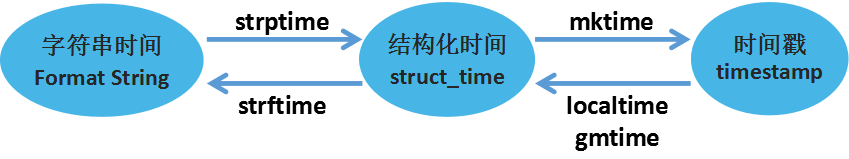

# 目录

* [sys](#sys)
* [os](#os)
* [re](#re)
* [string](#string)
* [time](#time)
* [datetime](#datetime)
* [threading](#threading)

## Python常用模块Top200

|名次|模块名称|被使用项目数|名次|模块名称|被使用项目数|
|:---|:---|:---|:---|:---|:---|
|1|sys|7858|2|os|6983|
|3|re|5663|4|time|5268|
|5|random|3339|6|datetime|3310|
|7|setuptools|3225|8|logging|3189|
|9|subprocess|2991|10|unittest|2923|
|11|json|2865|12|urllib|2641|
|13|future|2541|14|collections|2295|
|15|shutil|2255|16|string|2254|
|17|threading|2220|18|math|2205|
|19|tempfile|2151|20|urllib2|2095|
|21|socket|2079|22|traceback|2070|
|23|copy|2055|24|optparse|2053|
|25|hashlib|2025|26|StringIO|1812|
|27|django.db|1780|28|distutils.core|1780|
|29|struct|1753|30|itertools|1720|
|31|django.conf|1719|32|types|1667|
|33|django.core.management|1658|34|django.contrib|1604|
|35|glob|1582|36|urlparse|1559|
|37|base64|1555|38|inspect|1523|
|39|django.http|1510|40|django|1496|
|41|cStringIO|1447|42|os.path|1432|
|43|django.shortcuts|1419|44|functools|1395|
|45|argparse|1379|46|operator|1360|
|47|warnings|1345|48|codecs|1308|
|49|django.template|1262|50|django.test|1216|
|51|pickle|1200|52|errno|1133|
|53|pprint|1107|54|signal|1102|
|55|requests|1082|56|cgi|1052|
|57|django.contrib.auth.models|1018|58|getopt|1010|
|59|ConfigParser|972|60|django.core.urlresolvers|963|
|61|httplib|947|62|uuid|938|
|63|pkg_resources|906|64|imp|901|
|65|doctest|899|66|csv|893|
|67|django.db.models|877|68|zipfile|861|
|69|textwrap|860|70|django.utils|844|
|71|gzip|817|72|io|804|
|73|platform|798|74|django.core.exceptions|775|
|75|md5|755|76|xml.dom|753|
|77|binascii|751|78|fnmatch|750|
|79|Queue|744|80|getpass|719|
|81|select|701|82|utils|699|
|83|stat|693|84|numpy|685|
|85|mimetypes|683|86|ctypes|678|
|87|models|673|88|django.contrib.auth.decorators|669|
|89|django.core.management.base|664|90|zlib|649|
|91|simplejson|648|92|thread|644|
|93|distutils|643|94|django.template.loader|632|
|95|fcntl|617|96|contextlib|614|
|97|django.utils.encoding|605|98|decimal|592|
|99|atexit|576|100|locale|575|
|101|django.core|572|102|PIL|554|
|103|cPickle|552|104|calendar|551|
|105|yaml|547|106|multiprocessing|544|
|107|hmac|540|108|django.utils.safestring|540|
|109|django.conf.urls|537|110|weakref|533|
|111|unicodedata|527|112|mock|517|
|113|tarfile|504|114|django.contrib.auth|504|
|115|settings|500|116|smtplib|480|
|117|htmlentitydefs|475|118|array|474|
|119|sqlite3|462|120|google.appengine.api|457|
|121|email|457|122|django.template.defaultfilters|455|
|123|util|454|124|sha|452|
|125|flask|452|126|config|444|
|127|UserDict|440|128|django.contrib.sites.models|439|
|129|shlex|438|130|lxml|436|
|131|difflib|432|132|django.core.mail|431|
|133|BaseHTTPServer|424|134|webbrowser|424|
|135|gc|419|136|django.forms|417|
|137|django.contrib.contenttypes.models|413|138|Image|407|
|139|jinja2|406|140|django.utils.html|396|
|141|bisect|394|142|twisted.internet|384|
|143|django.conf.urls.defaults|379|144|commands|375|
|145|pdb|374|146|pwd|373|
|147|sqlalchemy|368|148|pytest|366|
|149|django.core.cache|364|150|BeautifulSoup|359|
|151|xml.dom.minidom|357|152|django.views.generic.simple|355|
|153|django.views.generic|355|154|xmlrpclib|355|
|155|Cookie|355|156|exceptions|353|
|157|sets|349|158|posixpath|348|
|159|SocketServer|347|160|code|343|
|161|django.core.paginator|338|162|gettext|338|
|163|google.appengine.ext.webapp|336|164|urllib.request|334|
|165|south.db|332|166|urllib.parse|329|
|167|new|329|168|pstats|329|
|169|msvcrt|328|170|builtin|325|
|171|ez_setup|324|172|gtk|323|
|173|django.dispatch|321|174|MySQLdb|318|
|175|HTMLParser|315|176|termios|311|
|177|scipy|311|178|pkgutil|309|
|179|abc|309|180|matplotlib|307|
|181|django.db.models.signals|306|182|six|306|
|183|xml.sax.saxutils|303|184|xml.sax|301|
|185|chardet|298|186|heapq|296|
|187|django.test.client|295|188|cProfile|295|
|189|bs4|290|190|sgmllib|289|
|191|django.utils.functional|287|192|xml.etree|286|
|193|ssl|283|194|tokenize|282|
|195|django.db.models.query|281|196|xml|281|
|197|nose.tools|281|198|nose|275|
|199|pygments|273|200|gobject|270|


# <p align="center">sys</p>

###### [<p align="right">back to top ▲</p>](#目录)

> This module provides access to some variables used or maintained by the interpreter and to functions that interact strongly with the interpreter.

> sys模块用来访问由解释器使用或维护的变量和与解释器进行交互的函数。

> sys模块负责程序与python解释器的交互，提供了一系列的函数和变量，用于操控python的运行时环境。

## sys常用属性/方法

|属性/方法|用途|
|:---|:---|
|sys.argv|命令行参数List，第一个元素是程序本身路径|
|sys.modules|返回系统导入的模块字段，key是模块名，value是模块|
|sys.modules.keys()|返回所有已经导入的模块列表|
|sys.exc_info()|获取当前正在处理的异常类,exc_type、exc_value、exc_traceback当前处理的异常详细信息|
|sys.exit(n)|退出程序，正常退出时exit(0)|
|sys.hexversion|获取Python解释程序的版本值，16进制格式如：0x020403F0|
|sys.version|获取Python解释程序的版本信息|
|sys.maxint|最大的Int值（python3.0中，sys.maxint不存在了，因为int的大小不再受到限制）|
|sys.maxsize|The largest supported length of containers. sys.maxsize can be used as an integer larger than any practical list or string index.|
|sys.maxunicode|最大的Unicode值|
|sys.path|返回模块的搜索路径，初始化时使用PYTHONPATH环境变量的值|
|sys.platform|返回操作系统平台名称|
|sys.stdout|标准输出。sys.stdout.write('hello' + '\n') 等于 print('hello')|
|sys.stdin|标准输入。sys.stdin.readline()会将标准输入全部获取，包括末尾的'\n'，因此用len计算长度时是把换行符'\n'算进去了的；sys.stdin.input()获取输入时返回的结果是不包含末尾的换行符'\n'的。|
|sys.stderr|错误输出|
|sys.exec_prefix|返回平台独立的python文件安装的位置|
|sys.byteorder|本地字节规则的指示器，big-endian平台的值是'big',little-endian平台的值是'little'|
|sys.copyright|记录python版权相关的东西|
|sys.api_version|解释器的C的API版本|

* ### sys.argv

用于获取当前正在执行的命令行命令的参数列表(list)。

|变量|解释|
|:---|:---|
|sys.argv[0]|当前程序名|
|sys.argv[1]|第一个参数|
|sys.argv[0]|第二个参数|

参考代码：

```python
# encoding: utf-8
# filename: argv_test.py
import sys
# 获取脚本名字
print 'The name of this program is: %s' %(sys.argv[0])
# 获取参数列表
print 'The command line arguments are:'
for i in sys.argv:
    print i
# 统计参数个数
print 'There are %s arguments.'%(len(sys.argv)-1)
```

运行结果：

```
E:\p>python argv_test.py arg1 arg2 arg3
The name of this program is: argv_test.py
The command line arguments are:
argv_test.py
arg1
arg2
arg3
There are 3 arguments.
```

* ### sys.platform

获取当前执行环境的平台，win32表示Windows 32bit操作系统，linux2表示是linux平台。

```python
# linux 
>>> import sys
>>> sys.platform
'linux2'

# windows
>>> import sys
>>> sys.platform
'win32'
```

* ### sys.path

目录列表，模块搜索路径。
```python
>>>import sys
>>>sys.path
# 交互环境下sys.path第一个路径是一个空项，对应当前目录。
['', 
'C:\\Python\\Python36\\python36.zip', 
'C:\\Python\\Python36\\DLLs', 
'C:\\Python\\Python36\\lib', 
'C:\\Python\\Python36', 
'C:\\Python\\Python36\\lib\\site-packages', 
'C:\\Python\\Python36\\lib\\site-packages\\win32', 
'C:\\Python\\Python36\\lib\\site-packages\\win32\\lib', 
'C:\\Python\\Python36\\lib\\site-packages\\Pythonwin']

# foo.py
import sys
print(sys.path)

# 运行
E:\MyProjects\PycharmProjects\bao>python foo.py
['E:\\MyProjects\\PycharmProjects\\bao', 
'C:\\Python\\Python36\\python36.zip', 
'C:\\Python\\Python36\\DLLs', 
'C:\\Python\\Python36\\lib', 
'C:\\Python\\Python36', 
'C:\\Python\\Python36\\lib\\site-packages', 
'C:\\Python\\Python36\\lib\\site-packages\\win32', 
'C:\\Python\\Python36\\lib\\site-packages\\win32\\lib', 
'C:\\Python\\Python36\\lib\\site-packages\\Pythonwin']
```

* ### sys.builtin\_module\_names

返回一个tuple，包含内建模块的名字。

```python
>>>import sys
>>>sys.builtin_module_names
('_ast', '_bisect', '_blake2', '_codecs', '_codecs_cn', '_codecs_hk', 
'_codecs_iso2022', '_codecs_jp', '_codecs_kr', '_codecs_tw', '_collections', 
'_csv', '_datetime', '_functools', '_heapq', '_imp', '_io', '_json', '_locale', 
'_lsprof', '_md5', '_multibytecodec', '_opcode', '_operator', '_pickle', 
'_random', '_sha1', '_sha256', '_sha3', '_sha512', '_signal', '_sre', '_stat', 
'_string', '_struct', '_symtable', '_thread', '_tracemalloc', '_warnings', 
'_weakref', '_winapi', 'array', 'atexit', 'audioop', 'binascii', 'builtins', 
'cmath', 'errno', 'faulthandler', 'gc', 'itertools', 'marshal', 'math', 'mmap', 
'msvcrt', 'nt', 'parser', 'sys', 'time', 'winreg', 'xxsubtype', 'zipimport', 'zlib')
```

代码示例：

```python
# find_module.py
# encoding: utf-8

import sys
# print sys.builtin_module_names
def find_module(module):
    if module in sys.builtin_module_names:
        print module," => ","__builtin__"
    else:
        print module,"=> ",__import__(module).__file__

find_module('os')
find_module('sys')
find_module('strop')
find_module('zlib')
find_module('string')

# 运行结果：
os =>  E:\Python27\lib\os.pyc
sys  =>  __builtin__
strop  =>  __builtin__
zlib  =>  __builtin__
string =>  E:\Python27\lib\string.pyc
```

* ### sys.exit(n)

调用sys.exit(n)可以中途退出程序，当参数非0时，会引发一个SystemExit异常，从而可以在主程序中捕获该异常。

```python
# encoding: utf-8
import sys
print 'running...'
try:
    sys.exit(1)
except SystemExit:
    print 'SystemExit exit 1'

print 'exited'

# 运行结果：
running...
SystemExit exit 1
exited
```


# <p align="center">os</p>

###### [<p align="right">back to top ▲</p>](#目录)

> This module provides a portable way of using operating system dependent functionality.

> os模块提供了一种方便的使用操作系统函数的方法。

> os模块负责程序与操作系统的交互，提供了访问操作系统底层的接口。

## os常用属性/方法

|属性/方法|用途|
|:---|:---|
|os.name|windows是nt，linux是posix|
|os.remove()|删除文件|
|os.rename()|重命名文件|
|os.walk()|生成目录树下的所有文件名|
|os.chdir()|改变目录|
|os.mkdir()/makedirs()|创建目录/多层目录|
|os.rmdir()/removedirs()|删除目录/多层目录|
|os.listdir()|列出指定目录的文件，不给参数默认输出当前路径下所有文件|
|os.getcwd()|取得当前工作目录|
|os.stat()|查看文件/目录状态信息|
|os.chmod()|改变目录权限|
|os.chown()|改变文件的属主、属组，但需要有足够的权限|
|os.path.basename()|去掉目录路径，返回文件名|
|os.path.dirname()|去掉文件名，返回目录路径|
|os.path.join()|将分离的各部分组合成一个路径名|
|os.path.split()|返回 (dirname(), basename()) 元组|
|os.path.splitext()|返回 (filename, extension) 元组|
|os.path.getatime()\getctime()\getmtime()|分别返回最近访问、创建、修改时间|
|os.path.getsize()|返回文件大小|
|os.path.exists()|是否存在|
|os.path.isabs()|是否为绝对路径|
|os.path.isdir()|是否为目录|
|os.path.isfile()|是否为文件|


# <p align="center">re</p>

###### [<p align="right">back to top ▲</p>](#目录)

## re模块下的函数

* ### compile(pattern)：创建模式对象

```python
import re
pat = re.compile('A')
m = pat.search('CBA')
# 等价于re.search('A','CBA')

print m
<_sre.SRE_Match object at 0x9d690c8>
# 匹配到了，返回MatchObject（True）

m = pat.search('CBD')
print m
None
# 没有匹配到，返回None（False）
```

* ### search(pattern, string)：在字符串中寻找模式

```python
m = re.search('asd','ASDasd')
print m
<_sre.SRE_Match object at 0xb72cd6e8>
# 匹配到了，返回MatchObject（True）
m = re.search('asd','ASDASD')
print m
None
# 没有匹配到，返回None（False）
```

* ### match(pattern, string)：在字符串开始处匹配模式

```python
pat = re.compile('a')
print pat.match('Aasd')
None
print pat.match('aASD')
<_sre.SRE_Match object at 0xb72cd6e8>

# 上面的函数返回都可以在if条件语句中进行判断
if pat.match('asd'):
    print 'OK'

# 找到返回
OK

if re.search('a','ASD'):
    print "OK"

# 没有找到
```

* ### split(pattern, string)：根据模式分割字符串，返回列表

```python
re.split(',','a,s,d,asd')
# 返回列表
['a', 's', 'd', 'asd']

pat = re.compile(',')
pat.split('a,s,d,asd')
# 返回列表
['a', 's', 'd', 'asd']

re.split('[, ]+','a ,  s  ,d     ,,,,,asd')
# 正则匹配：[, ]+
['a', 's', 'd', 'asd']

re.split('[, ]+','a ,  s  ,d     ,,,,,asd',maxsplit=2)
# maxsplit，最多分割次数
['a', 's', 'd     ,,,,,asd']

pat = re.compile('[, ]+')
# 正则匹配：[, ]+
pat.split('a ,  s  ,d     ,,,,,asd',maxsplit=2)
# maxsplit，最多分割次数
['a', 's', 'd     ,,,,,asd']
```

* ### findall(pattern, string)：列表形式返回所有匹配项

```python
re.findall('a','ASDaDFGAa') 
['a', 'a']
# 列表形式返回匹配到的字符串

pat = re.compile('a')
pat.findall('ASDaDFGAa')
['a', 'a']
# 列表形式返回匹配到的字符串

pat = re.compile('[A-Z]+')
# 正则匹配：'[A-Z]+'
pat.findall('ASDcDFGAa')
['ASD', 'DFGA']
# 找到匹配到的字符串

pat = re.compile('[A-Z]')
pat.findall('ASDcDFGAa')
# 正则匹配：'[A-Z]'
['A', 'S', 'D', 'D', 'F', 'G', 'A']
# 找到匹配到的字符串

pat = re.compile('[A-Za-z]')
# 正则匹配：'[A-Za-z]'
pat.findall('ASDcDFGAa')
['A', 'S', 'D', 'c', 'D', 'F', 'G', 'A', 'a'] 
```

* ### sub(pat, repl, string)：用repl替换pat

```python
re.sub('a', 'A', 'abcasd')
#找到a用A替换，下面见和group的配合使用
'AbcAsd'

pat = re.compile('a')
pat.sub('A', 'abcasd')
'AbcAsd'

pat = re.compile(r'www\.(.*)\..{3}')
# 在Python的string前面加上"r"，是为了告诉编译器这个string是raw string（原生字符串），不要转译反斜杠"\"。
# 例如，在raw string中，\n是两个字符，\和n，而不会被转译为换行符。
# 由于正则表达式和\会有冲突，因此，当一个字符串使用了正则表达式后，最好在前面加上'r'。

# 与大多数编程语言相同，正则表达式里使用"\"作为转义字符，这就可能造成反斜杠困扰。
# 假如你需要匹配文本中的字符"\"，那么使用string表示的正则表达式里将需要4个反斜杠"\\\\"：
# 前两个和后两个分别用于在编程语言里转义成反斜杠，转换成两个反斜杠后再在正则表达式里转义成一个反斜杠。
# Python里的“原生字符串”很好地解决了这个问题，"\\\\"可以使用r"\\"表示。
# 同样，匹配一个数字的"\\d"可以写成r"\d"。
# 有了原生字符串，你再也不用担心是不是漏写了反斜杠，写出来的表达式也更直观。

# 并不是说加了"r"后"\"就没有转译功能，总之直接记住1句话：
# 当一个字符串使用了正则表达式后，最好在前面加上"r"，这样你再也不用担心是不是漏写了反斜杠，写出来的表达式也更直观。
pat.match('www.dxy.com').group(1)
'dxy'

re.sub(r'www\.(.*)\..{3}', r'\1', 'hello,www.dxy.com')
'hello,dxy'

pat.sub(r'\1', 'hello,www.dxy.com')
'hello,dxy'
# r'\1'是第一组的意思，
# 通过正则匹配找到符合规则的"www.dxy.com"，取得组1字符串去替换整个匹配。

pat = re.compile(r'(\w+) (\w+)')
# 正则表达式
s = 'hello world ! hello hz !'

pat.findall('hello world ! hello hz !')
[('hello', 'world'), ('hello', 'hz')]
pat.sub(r'\2 \1',s)
# 通过正则得到组1(hello)，组2(world)，再通过sub去替换。
# 即组1替换组2，组2替换组1，调换位置。  
'world hello!hz hello!'
```


# <p align="center">string</p>

###### [<p align="right">back to top ▲</p>](#目录)

### 常用方法

|常用方法|描述|
|:---|:---|
|str.capitalize()|把字符串的首字母大写|
|str.center(width)|将原字符串用空格填充成一个长度为width的字符串，原字符串内容居中|
|str.count(s)|返回字符串s在str中出现的次数|
|str.decode(encoding='UTF-8',errors='strict')|以指定编码格式解码字符串|
|str.encode(encoding='UTF-8',errors='strict')|以指定编码格式编码字符串|
|str.endswith(s)|判断字符串str是否以字符串s结尾|
|str.find(s)|返回字符串s在字符串str中的位置索引，没有则返回-1|
|str.index(s)|和find()方法一样，但是如果s不存在于str中则会抛出异常|
|str.isalnum()|如果str至少有一个字符并且都是字母或数字则返回True，否则返回False|
|str.isalpha()|如果str至少有一个字符并且都是字母则返回True，否则返回False|
|str.isdigit()|如果str只包含数字则返回True否则返回False|
|str.islower()|如果str存在区分大小写的字符，并且都是小写则返回True否则返回False|
|str.isspace()|如果str中只包含空格，则返回True，否则返回False|
|str.istitle()|如果str是标题化的(单词首字母大写)则返回True，否则返回False|
|str.isupper()|如果str存在区分大小写的字符，并且都是大写则返回True否则返回False|
|str.ljust(width)|返回一个原字符串左对齐的并使用空格填充至长度width的新字符串|
|str.lower()|转换str中所有大写字符为小写|
|str.lstrip()|去掉str左边的不可见字符|
|str.partition(s)|用s将str切分成三个值|
|str.replace(a, b)|将字符串str中的a替换成b|
|str.rfind(s)|类似于find()函数，不过是从右边开始查找|
|str.rindex(s)|类似于index()，不过是从右边开始|
|str.rjust(width)|返回一个原字符串右对齐的并使用空格填充至长度width的新字符串|
|str.rpartition(s)|类似于partition()函数，不过是从右边开始查找|
|str.rstrip()|去掉str右边的不可见字符|
|str.split(s)|以s为分隔符切片str|
|str.splitlines()|按照行分隔，返回一个包含各行作为元素的列表|
|str.startswith(s)|检查字符串str是否是以s开头，是则返回True，否则返回False|
|str.strip()|等于同时执行rstrip()和lstrip()|
|str.title()|返回“标题化”的str，所有单词都是以大写开始，其余字母均为小写|
|str.upper()|返回str所有字符为大写的字符串|
|str.zfill(width)|返回长度为width的字符串，原字符串str右对齐，前面填充0|

### 字符串常量

|常数|含义|
|:---|:---|
|string.ascii_lowercase|小写字母，'abcdefghijklmnopqrstuvwxyz'|
|string.ascii_uppercase|大写的字母，'ABCDEFGHIJKLMNOPQRSTUVWXYZ'|
|string.ascii\_letters|ascii\_lowercase和ascii\_uppercase常量的连接串|
|string.digits|数字0到9的字符串，'0123456789'|
|string.hexdigits|字符串，'0123456789abcdefABCDEF'|
|string.letters|字符串，'abcdefghijklmnopqrstuvwxyzABCDEFGHIJKLMNOPQRSTUVWXYZ'|
|string.lowercase|小写字母的字符串，'abcdefghijklmnopqrstuvwxyz'|
|string.octdigits|字符串，'01234567'|
|string.punctuation|所有标点字符|
|string.printable|可打印的字符的字符串，包含数字、字母、标点符号和空格|
|string.uppercase|大学字母的字符串，'ABCDEFGHIJKLMNOPQRSTUVWXYZ'|
|string.whitespace|空白字符' \t\n\r\x0b\x0c'|

## 字符串模板Template

通过string.Template可以为Python定制字符串的替换标准：

```python
>>>from string import Template
>>>s = Template('$who like $what')
>>>print s.substitute(who='i', what='python')
i like python

>>>print s.safe_substitute(who='i') 
# 使用safe_substitute，缺少key时不会抛错
# 使用substitute，缺少key时会抛错
i like $what

>>>Template('${who}LikePython').substitute(who='I') # 在字符串内时使用{}
'ILikePython'
```

Template的高级用法：通过继承string.Template，重写变量delimiter（定界符）和idpattern（替换格式），定制不同形式的模板：

```python
import string

template_text = '''$: $de
with_underscore: %with_underscore
notunderscored: %notunderscored
'''

d = {'de': 'replaced',
     'with_underscore': 'replaced',
     'notunderscored': 'replaced'}

class MyTemplate(string.Template):
    # 重写模板，定界符(delimiter)为"%"，替换模式（idpattern）必须包含下划线"_"
    delimiter = '%'
    idpattern = '[a-z]+_[a-z]+'

print string.Template(template_text).safe_substitute(d)
# 采用原来的Template渲染

print MyTemplate(template_text).safe_substitute(d)
# 使用重写后的MyTemplate渲染

# 输出：
# $: replaced
# with_underscore: %with_underscore
# notunderscored: %notunderscored
# 
# $: $de
# with_underscore: replaced
# notunderscored: %notunderscored
# 
# 原生的Template只会渲染界定符为$的情况，
# 重写后的MyTemplate会渲染界定符为%且替换格式带有下划线的情况。
```

## 字符串常用技巧

* #### 反转字符串

```python
>>> s = '1234567890'
>>> print s[::-1]
0987654321
```

* #### 连接字符串

**尽量使用join()连接字符串，因为“+”号连接n个字符串需要申请n-1次内存，使用join()只需申请1次内存。**

* #### 分割固定长度字符串

```python
>>> import re
>>> s = '1234567890'
>>> re.findall(r'.{1,3}', s)
['123', '456', '789', '0']
```

* #### 使用()括号生成字符串

```python
sql = ('SELECT count() FROM table '
       'WHERE id = "10" '
       'GROUP BY sex')
print sql

# SELECT count() FROM table WHERE id = "10" GROUP BY sex
```

* #### 将print的字符串写入文件

```python
>>> print >> open("somefile.txt", "w+"), "Hello World"
# python3写法：print("Hello World!", file=open("somefile.txt", "w+"))
# 将Hello World写入文件somefile.txt
```


# <p align="center">time</p>

###### [<p align="right">back to top ▲</p>](#目录)

在Python中，有三种方式表示时间：
1. **时间戳(timestamp)**：时间戳表示的是从1970年1月1日00:00:00开始按秒计算的偏移量。运行type(time.time())，返回float类型的timestamp
2. **格式化时间字符串(Format String)**
3. **结构化时间(struct\_time)**：struct\_time元组共有9个元素（年，月，日，时，分，秒，一年中第几周，一年中第几天，夏令时）

> UTC（Coordinated Universal Time，世界协调时）也叫格林威治天文时间，是世界标准时间。在我国为UTC+8。

> DST（Daylight Saving Time，夏令时），又称阳光节约时。是一种为节约能源而人为调整地方时间的制度，利用夏季天亮得早这一自然现象，人为地将时间提前一小时。这样可以使人们早起早睡，以充分利用光照资源，减少照明时间，从而节约照明用电。

```python
>>> import time

# 时间戳
>>> time.time()
1529905431.7368107

# time.strftime(format[, t])
# 将日期转换为字符串，可选参数是一个struct_time对象。
>>> time.strftime("%Y-%m-%d %X")
'2018-06-25 13:44:15'
>>> time.strftime('Weekday: %w; Day of the yesr: %j.')
'Weekday: 1; Day of the yesr: 176.'
>>> time.strftime("%Y-%m-%d %H:%M:%S", time.gmtime())
'2018-06-25 09:43:38'

# time.strptime(string, format)
# 按指定格式解析（parse）一个表示时间的字符串，返回struct_time对象
>>> time.strptime('2009-06-23 15:30:53', '%Y-%m-%d %H:%M:%S')
time.struct_time(tm_year=2009, tm_mon=6, tm_mday=23, tm_hour=15, tm_min=30, tm_sec=53, tm_wday=1, tm_yday=174, tm_isdst=-1)

# 本地时区的struct_time
>>> time.localtime()
time.struct_time(tm_year=2018, tm_mon=6, tm_mday=25, tm_hour=13, tm_min=44, tm_sec=30, tm_wday=0, tm_yday=176, tm_isdst=0)

# UTC时区的struct_time
>>> time.gmtime()
time.struct_time(tm_year=2018, tm_mon=6, tm_mday=25, tm_hour=5, tm_min=44, tm_sec=44, tm_wday=0, tm_yday=176, tm_isdst=0)

# 接收struct_time对象作为参数，返回用秒数来表示时间的浮点数
>>> time.mktime(time.localtime())
1529920484.0

# time.asctime()
# struct_time -> '%a %b %d %H:%M:%S %Y'
>>> time.asctime(time.localtime())
'Mon Jun 25 18:04:02 2018'

# time.ctime()
# timestamp -> '%a %b %d %H:%M:%S %Y'
>>> time.ctime(time.time())
'Mon Jun 25 18:04:23 2018'

# time.sleep()
# 调用time.sleep来挂起当前进程。time.sleep接收一个浮点型参数，表示进程挂起的时间。
>>> time.sleep(3.6)

# time.clock()
# 在Windows上，返回第一次调用该方法到现在的秒数，精确度高于1微秒
# 可用来记录程序执行时间
>>> time.clock()
3.208019535555764e-07
>>> time.clock()
1.8889197571657532
```




# <p align="center">datetime</p>

###### [<p align="right">back to top ▲</p>](#目录)

datetime模块定义了以下几个类：

* datetime.date：表示日期的类。常用属性有year，month，day；
* datetime.time：表示时间的类。常用属性有hour，minute，second，microsecond；
* datetime.datetime：表示日期时间的类；
* datetime.timedelta：表示时间间隔，即两个时间点之间的长度；
* datetime.tzinfo：与时区有关的相关信息。

datetime模块定义了两个常量：datetime.MINYEAR和datetime.MAXYEAR，分别表示datetime所能表示的最小、最大年份。MINYEAR = 1，MAXYEAR = 9999。

**注：以上类型的对象都是不可变（immutable）的。**

### date类

* #### class datetime.date(year, month, day)

    * year的范围是[MINYEAR, MAXYEAR]，即[1, 9999]；
    * month的范围是[1, 12]（月份从1开始）；
    * day的最大值根据给定的year，month决定。例如闰年2月份有29天。

* #### date类的常用类属性与类方法：

    * date.max、date.min：date对象所能表示的最大、最小日期；
    * date.resolution：date对象表示日期的最小单位，天；
    * date.today()：返回表示当前本地日期的date对象；
    * date.fromtimestamp(timestamp)：根据给定的时间戮，返回一个date对象；
    * date.fromordinal(ordinal)：将Gregorian日历时间转换为date对象（Gregorian Calendar：一种日历表示方法，类似于我国的农历，西方国家使用较多，此处不详细讨论）。

* #### date实例的常用属性与方法：
    * date.year、date.month、date.day：年、月、日；
    * date.replace([year[, month[, day]]])：生成一个新的日期对象（原有对象仍保持不变），用参数指定的年，月，日代替原有对象中的属性；
    * date.timetuple()：返回对应的time.struct_time对象；
    * date.toordinal()：返回对应的Gregorian Calendar日期；
    * date.weekday()：返回星期几，0-6，0表示星期一；
    * data.isoweekday()：返回星期几，1-7，1表示星期一；
    * date.isocalendar()：返回一个元组，(year, month, day)；
    * date.isoformat()：返回字符串，'YYYY-MM-DD'；
    * date.strftime(fmt)：返回自定义格式化字符串。

* #### date类对某些操作进行了重载，允许对日期进行如下操作：

```python
# date2 = date1 + timedelta   # 日期加上一个间隔，返回一个新的日期对象
# date2 = date1 – timedelta   # 日期隔去间隔，返回一个新的日期对象
# timedelta = date1 – date2   # 两个日期相减，返回一个时间间隔对象
# date1 < date2               # 两个日期进行比较

>>> now = date.today()
>>> tomorrow = now.replace(day = 26)
>>> delta = tomorrow - now
>>> print("now:", now, "tomorrow:", tomorrow)
now: 2018-06-25 tomorrow: 2018-06-26
>>> print("timedelta:", delta)
timedelta: 1 day, 0:00:00
>>> print(now + delta)
2018-06-26
>>> print(tomorrow > now)
True
```

**注：对日期进行操作时，要防止日期超出它所能表示的范围。**


### time类

* #### class datetime.time(hour[, minute[, second[, microsecond[, tzinfo]]]])
    * hour范围，[0, 24)
    * minute范围，[0, 60)
    * second范围，[0, 60)
    * microsecond范围，[0, 1000000)
    * tzinfo表示时区信息

* #### time类的常用类属性：
    * time.min、time.max：time类所能表示的最小、最大时间。time.min = time(0, 0, 0, 0)， time.max = time(23, 59, 59, 999999)；
    * time.resolution：time的最小单位，1微秒；

* #### time实例的常用属性和方法：
    * time.hour、time.minute、time.second、time.microsecond：时、分、秒、微秒；
    * time.tzinfo：时区信息；
    * time.replace([hour[, minute[, second[, microsecond[, tzinfo]]]]])：创建一个新的时间对象（原有对象仍保持不变），用参数指定的时、分、秒、微秒代替原有对象中的属性；
    * time.isoformat()：返回字符串，'HH:MM:SS'；
    * time.strftime(fmt)：返回自定义格式化字符串。


### datetime类

datetime是date与time的结合体，包括date与time的所有信息。

* #### datetime.datetime(year, month, day[, hour[, minute[, second[, microsecond[, tzinfo]]]]])
    * 要注意参数值的范围。

* #### datetime类的常用类属性与类方法：
    * datetime.min、datetime.max：datetime类所能表示的最小、最大值；
    * datetime.resolution：datetime最小单位；
    * datetime.today()：返回一个表示当前本地时间的datetime对象；
    * datetime.now([tz])：返回一个表示当前本地时间的datetime对象，如果提供了参数tz，则获取tz参数所指时区的本地时间；
    * datetime.utcnow()：返回一个当前UTC时间的datetime对象；
    * datetime.fromtimestamp(timestamp[, tz])：根据时间戮创建datetime对象，参数tz指定时区信息；
    * datetime.utcfromtimestamp(timestamp)：根据时间戮创建datetime对象；
    * datetime.combine(date, time)：根据date和time，创建datetime对象；
    * datetime.strptime(date_string, format)：将格式字符串转换为datetime对象。

* #### datetime实例的常用属性与方法：
    * datetime.year、month、day、hour、minute、second、microsecond、tzinfo；
    * datetime.date()：获取date对象；
    * datetime.time()：获取time对象；
    * datetime.replace([year[, month[, day[, hour[, minute[, second[, microsecond[, tzinfo]]]]]]]])；
    * datetime.timetuple()；
    * datetime.utctimetuple()；
    * datetime.toordinal()；
    * datetime.weekday()；
    * datetime.isocalendar()；
    * datetime.isoformat([sep])；
    * datetime.ctime()：返回一个'Mon Jun 25 19:51:43 2018'格式的字符串，等效于time.ctime(time.mktime(dt.timetuple()))；
    * datetime.strftime(format)。


### 格式化字符串

datetime、date、time都提供了strftime()方法，该方法接收一个格式字符串，输出日期时间的字符串表示。

|符号|意义|
|:---|:---|
|%a|星期几的简写，'Mon'|
|%A|星期几的全称，'Monday'|
|%b|月份的简写，'Jun'|
|%B|月份的全称，'June'|
|%c|标准的日期和时间时间串，'Mon Jun 25 14:18:09 2018'|
|%C|年份的前两位数字，'20'|
|%d|每月的第几天[01, 31]，'01'|
|%D|月/天/年，'06/01/18'|
|%e|每月的第几天[1, 31]，' 1'（注意1前面有一个空格），'25'|
|%f|微秒[0, 999999]|
|%F|年-月-日，'2018-06-05'|
|%g|年份的后两位数字[00, 99]，'09'|
|%G|年份[0001, 9999]，'2018'，使用基于周的年|
|%h|简写的月份名，'Jun'|
|%H|24小时制的小时[00, 23]，'00'，'14'|
|%I|12小时制的小时[01, 12]，'01'，'12'|
|%j|每年的第几天[001, 366]，'001'，'176'，'366'|
|%m|月份[01, 12]，'06'|
|%M|分钟数[00, 59]，'00'，'28'|
|%n|新行符，'\n'|
|%p|本地的AM或PM的等价显示，'PM'|
|%r|12小时制的时间，'02:01:08 PM'|
|%R|小时和分钟，hh:mm，'14:31'，'04:01'|
|%S|秒数[00, 60]，'05'，'60'|
|%t|水平制表符，'\t'|
|%T|时:分:秒，hh:mm:ss，'04:03:04'，'14:03:04'|
|%u|星期几[1, 7]，星期一为1，'1'|
|%U|每年的第几周[00, 53]，把星期日当做标记，'00'（2018-01-01，星期一），'01'（2017-01-01，星期日）|
|%V|每年的第几周[00, 53]，'53'（2016-01-01，星期五），'52'（2017-01-01，星期日），使用基于周的年|
|%w|星期几[0, 6]，星期日为0，'0'，'1'|
|%W|每年的第几周[00, 53]，把星期一当做标记，'01'（2018-01-01，星期一），'00'（2017-01-01，星期日），'01'（2017-01-02，星期一）|
|%x|标准的日期字符串，'06/05/18'|
|%X|标准的时间字符串，'06:08:00'|
|%y|年份的后两位[00, 99]，'18'|
|%Y|年份[0001, 9999]，'2018'，'0001'|
|%z|当前时区与格林威治标准时间的时间差，'+0800'|
|%Z|当前时区的名称，'CST'|
|%%|百分号，'%'|


# <p align="center">threading</p>

###### [<p align="right">back to top ▲</p>](#目录)


#### 死锁模型
```python
import threading
import time

class MyThread(threading.Thread):
    def __init__(self):
        threading.Thread.__init__(self)

    def run(self):
        print('[%s]: %s is running' % (time.ctime(), self.name))
        self.foo()
        self.bar()
    def foo(self):
        print('[%s]: %s is trying to get LOCKA' % (time.ctime(), self.name))
        LockA.acquire()
        print('[%s]: %s GET LOCKA' % (time.ctime(), self.name))

        print('[%s]: %s is trying to get LOCKB' % (time.ctime(), self.name))
        LockB.acquire()
        print('[%s]: %s GET LOCKB' % (time.ctime(), self.name))

        print('[%s]: %s is gonna release LOCKB' % (time.ctime(), self.name))
        LockB.release()
        print('[%s]: %s LOSE LOCKB' % (time.ctime(), self.name))

        print('[%s]: %s is going to sleep' % (time.ctime(), self.name))
        time.sleep(1)
        print('[%s]: %s is awake now, runing again' % (time.ctime(), self.name))

        print('[%s]: %s is gonna release LOCKA' % (time.ctime(), self.name))
        LockA.release()
        print('[%s]: %s LOSE LOCKA' % (time.ctime(), self.name))


    def bar(self):
        print('[%s]: %s is trying to get LOCKB' % (time.ctime(), self.name))
        LockB.acquire()
        print('[%s]: %s GET LOCKB' % (time.ctime(), self.name))

        print('[%s]: %s is trying to get LOCKA' % (time.ctime(), self.name))
        LockA.acquire()
        print('[%s]: %s GET LOCKA' % (time.ctime(), self.name))

        print('[%s]: %s is gonna release LOCKA' % (time.ctime(), self.name))
        LockA.release()
        print('[%s]: I am %s LOSE LOCKA' % (time.ctime(), self.name))

        print('[%s]: %s is gonna release LOCKB' % (time.ctime(), self.name))
        LockB.release()
        print('[%s]: I am %s LOSE LOCKB' % (time.ctime(), self.name))


LockA = threading.Lock()
LockB = threading.Lock()

for i in range(9):
    t = MyThread()
    t.start()

# 运行结果可能不同
# [Wed Aug 22 10:03:15 2018]: Thread-1 is running
# [Wed Aug 22 10:03:15 2018]: Thread-1 is trying to get LOCKA
# [Wed Aug 22 10:03:15 2018]: Thread-1 GET LOCKA
# [Wed Aug 22 10:03:15 2018]: Thread-1 is trying to get LOCKB
# [Wed Aug 22 10:03:15 2018]: Thread-1 GET LOCKB
# [Wed Aug 22 10:03:15 2018]: Thread-1 is gonna release LOCKB
# [Wed Aug 22 10:03:15 2018]: Thread-1 LOSE LOCKB
# [Wed Aug 22 10:03:15 2018]: Thread-1 is going to sleep
# [Wed Aug 22 10:03:15 2018]: Thread-2 is running
# [Wed Aug 22 10:03:15 2018]: Thread-2 is trying to get LOCKA
# [Wed Aug 22 10:03:15 2018]: Thread-3 is running
# [Wed Aug 22 10:03:15 2018]: Thread-3 is trying to get LOCKA
# [Wed Aug 22 10:03:15 2018]: Thread-4 is running
# [Wed Aug 22 10:03:15 2018]: Thread-4 is trying to get LOCKA
# [Wed Aug 22 10:03:15 2018]: Thread-5 is running
# [Wed Aug 22 10:03:15 2018]: Thread-5 is trying to get LOCKA
# [Wed Aug 22 10:03:15 2018]: Thread-6 is running
# [Wed Aug 22 10:03:15 2018]: Thread-6 is trying to get LOCKA
# [Wed Aug 22 10:03:15 2018]: Thread-7 is running
# [Wed Aug 22 10:03:15 2018]: Thread-7 is trying to get LOCKA
# [Wed Aug 22 10:03:15 2018]: Thread-8 is running
# [Wed Aug 22 10:03:15 2018]: Thread-8 is trying to get LOCKA
# [Wed Aug 22 10:03:15 2018]: Thread-9 is running
# [Wed Aug 22 10:03:15 2018]: Thread-9 is trying to get LOCKA
# [Wed Aug 22 10:03:16 2018]: Thread-1 is awake now, runing again
# [Wed Aug 22 10:03:16 2018]: Thread-1 is gonna release LOCKA
# [Wed Aug 22 10:03:16 2018]: Thread-1 LOSE LOCKA
# [Wed Aug 22 10:03:16 2018]: Thread-1 is trying to get LOCKB
# [Wed Aug 22 10:03:16 2018]: Thread-1 GET LOCKB
# [Wed Aug 22 10:03:16 2018]: Thread-1 is trying to get LOCKA
# [Wed Aug 22 10:03:16 2018]: Thread-2 GET LOCKA
# [Wed Aug 22 10:03:16 2018]: Thread-2 is trying to get LOCKB
```