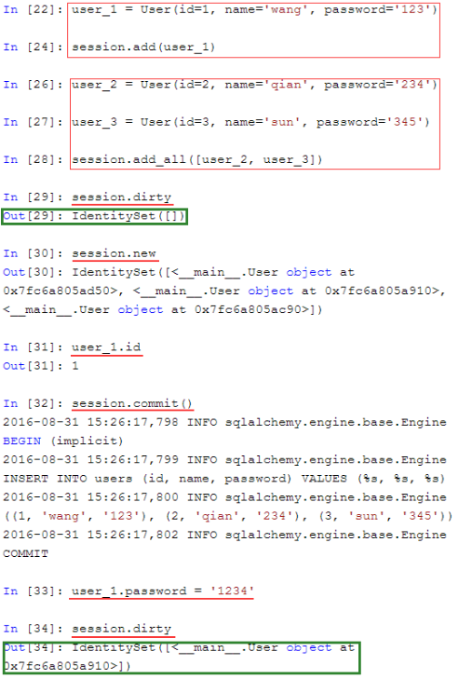

# 目录
* [SQLAlchemy](#sqlalchemy)


# <p align="center">SQLAlchemy</p>

###### [<p align="right">back to top ▲</p>](#目录)

### 常见的SQLAlchemy列类型

|类型名称|python类型|描述|
|:---|:---|:---|
|Integer|int|常规整形，通常为32位|
|SmallInteger|int|短整形，通常为16位|
|BigInteger|int或long|精度不受限整形|
|Float|float|浮点数|
|Numeric|decimal.Decimal|定点数|
|String|str|可变长度字符串|
|Text|str|可变长度字符串，适合大量文本|
|Unicode|unicode|可变长度Unicode字符串|
|Boolean|bool|布尔型|
|Date|datetime.date|日期类型|
|Time|datetime.time|时间类型|
|Interval|datetime.timedelta|时间间隔|
|Enum|str|字符列表|
|PickleType|任意Python对象|自动Pickle序列化|
|LargeBinary|str|二进制|


### 常见的SQLAlchemy列选项

|可选参数|描述|
|:---|:---|
|primary_key|如果设置为True，则为该列表的主键|
|unique|如果设置为True，该列不允许相同值|
|index|如果设置为True，为该列创建索引，查询效率会更高|
|nullable|如果设置为True，该列允许为空。如果设置为False，该列不允许空值|
|default|定义该列的默认值|

### 常见的SQLAlchemy关系选项

|选项名|描述|
|:---|:---|
|backref|在关系的其他模型中添加一个反向引用|
|primary|显示地指定两个模型之间的连接条件。当关系模糊的时候这是必要的|
|lazy|指定如何加载相关条目。可能值有select（使用标准select语句一气呵成加载条目）、immediate（当源对象已经加载后加载条目）、joined（立即加载条目，但是是作为连接）、subquery（立即加载条目，但是是作为子查询）、noload（条目永不加载）和dynamic（会返回另一个查询对象，你可以在加载这些条目时进一步提取）|
|uselist|如果设置为False，使用一个标量而不是列表|
|order_by|指定关系中条目的排序|
|secondary|在多对多关系中指定要使用的关联表名称|
|secondaryjoin|当SQLAlchemy不能自己决定多对多关系的时候指定第二个连接条件|


```python
# 导入：
from sqlalchemy import Column, String, create_engine
from sqlalchemy.orm import sessionmaker
from sqlalchemy.ext.declarative import declarative_base

# 创建对象的基类：
Base = declarative_base()

# 定义User对象：
class User(Base):
	# 表的名字：
	__tablename__ = 'user'

	# 表的结构：
	id = Column(String(20), primary_key=True)
	name = Column(String(20))

# 初始化数据库连接：
# create_engine('数据库://用户名:密码(没有密码则为空)@主机名:端口/数据库名', echo = True)
engine = create_engine('mysql+pymysql://root:@localhost:3306/sqlalchemy')
# 创建DBSession类型：
DBSession = sessionmaker(bind=engine)

# 创建session对象：
session = DBSession()
# 创建User对象
new_user = User(id='6', name='Bob')
new_user1 = User(id='7', name='Bob')
new_user2 = User(id='8', name='Bob')
# 添加到session：
session.add(new_user)
session.add(new_user1)
session.add(new_user2)
# 提交保存到数据库：
session.commit()
# 关闭session
session.close()
```

1. 连接数据库
    ```python
    from sqlalchemy import create_engine
    # create_engine('数据库://用户名:密码(没有密码则为空)@主机名:端口/数据库名', echo = True)
    # create_engine()会返回一个数据库引擎，
    # echo参数为True时，会显示每条执行的SQL语句，生产环境下可关闭
    engine = create_engine('mysql+pymysql://root:@localhost:3306/sqlalchemy', echo = True)
    ```
2. 创建ORM模型
    ```python
    # 基类
    from sqlalchemy.ext.declarative import declarative_base
    # declarative_base()创建了一个基类，这个类的子类可以自动与一个表关联
    Base = declarative_base()
    # 类
    from sqlalchemy import Column, Integer, String
    Class User(Base):
        __tablename__ = 'users'
        id = Column(Integer, primary_key = True)
        name = Column(String(255))
        password = Column(String(255))

    # 创建表
    def init_db():
        # Base.metadata.create_all(engine)会找到Base的所有子类，
        # 并在数据库中建立这些子类对应的表；
        Base.metadata.create_all(engine)
    def drop_db():
        # drop_all()则是删除这些表。
        Base.metadata.drop_all(engine)

    init_db()

    # 查看是否创建成功
    engine.table_names()
    ```
3. 使用Session
    1. 初始化一个Session对象
        ```python
        from sqlalchemy.orm import sessionmaker
        Session = sessionmaker(bind = engine)
        session = Session()
        # 或者
        Session = sessionmaker()
        Session.configure(bind = engine)
        session = Session()
        # sessionmaker()会生成一个数据库会话类。
        # 这个类的实例可以当成一个数据库连接，
        # 它同时还记录了一些查询的数据。
        ```
    2. 执行SQL语句
        ```python
        # 拿到session后，就可以执行SQL了。
        session.execute('create database abc')
        print(session.execute('show databases').fetchall())
        session.execute('use abc')
        # 建user表的过程略
        print(session.execute('select * from user where id = 1').first())
        print(session.execute('select * from user where id = :id', {'id': 1}).first())
        ```
    3. 添加/更新对象

        
    4. 回滚（做了修改但还未提交）

        
    5. 查询
        ```python
        session.query(User).filter_by(name = 'wang')
        session.query(User).filter_by(name = 'wang').first()
        session.query(User).filter_by(password = '123').all()

        for instance in session.query(User).order_by(User.id):
        print(instance.id, instance.name)

        for name in session.query(User.name).filter_by(password = ‘123’):
        print name

        for user in session.query(User).order_by(User.id)[1 : 3]:
        print user.name
        ```
    6. 查询时候的通用过滤符号
        ```python
        # equal
        query.filter(User.name == 'ed')
        # not equal
        query.filter(User.name != 'ed')
        # like 
        query.filter(User.name.like('%ed%'))
        # in
        query.filter(User.name.in_(['ed', 'wendy', 'jack']))
        # not in
        query.filter(~User.name.in_(['ed', 'wendy', 'jack']))

        # use and_()
        from sqlalchemy import and_
        query.filter(and_(User.name == 'ed', User.fullname == 'Ed Jones'))
        # or send multiple expressions to .filter()
        query.filter(User.name == 'ed', User.fullname == 'Ed Jones')

        # or chain multiple filter() / filter_by() calls
        query.filter(User.name == 'ed').filter(User.fullname == 'Ed Jones')
        # or --Make sure you use or_() and not the Python or operator!
        from sqlalchemy import or_
        query.filter(or_(User.name == 'ed', User.name == 'wendy'))
        # match
        query.filter(User.name.match('wendy'))
        ```
