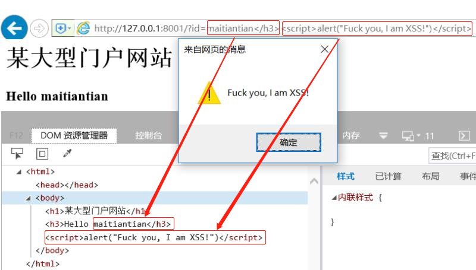
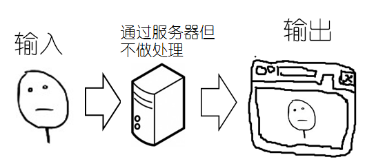
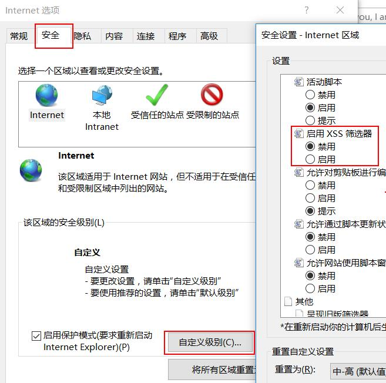

<div style="position: fixed; bottom: 20px; right: 39px; border-radius: 5px; background-color: #797979; z-index: 100;">
    <a href="#目录" style="color: white; border-right: 1px solid white; text-decoration: none; font-size: 14px; font-weight: bold; display: inline-block; padding: 5px 8px; line-height: 20px;">back to top ▲</a>
    <a href="javascript:void(0)" style="color: white; border-right: 1px solid white; text-decoration: none; font-weight: bold; display: inline-block; padding: 5px 8px; line-height: 20px;" onclick="(function(){document.querySelector('.btn.pull-left.js-toolbar-action').click()})()"><i class="fa fa-align-justify"></i></a>
</div>

# <p align="center" style="border-bottom: 3px solid #e7e7e7;">CSRF和XSS</p>

## CSRF

**CSRF，Cross Site Request Forgery，跨站请求伪造。**

#### 浏览器的Cookie策略

Cookie是服务器发送到用户浏览器并保存在本地的一小块数据，它会在浏览器下次向同一服务器再发起请求时被携带并发送到服务器上。

Cookie主要用于以下三个方面：

* 会话状态管理（如用户登录状态、购物车、游戏分数或其它需要记录的信息）
* 个性化设置（如用户自定义设置、主题等）

Cookie分为两种：

* Session Cookie(会话Cookie)：会话Cookie是最简单的Cookie，不需要指定过期时间（Expires）或者有效期（Max-Age），仅在会话期内有效，浏览器关闭之后它会被自动删除。
* Permanent Cookie(持久性Cookie)：与会话Cookie不同，持久性Cookie可以指定一个特定的过期时间（Expires）或有效期（Max-Age）。

```
res.setHeader('Set-Cookie', ['mycookie=222', 'test=3333; expires=Sat, 21 Jul 2018 00:00:00 GMT;']);

// 上述代码创建了两个Cookie：mycookie和test，前者属于会话Cookie，后者则属于持久性Cookie。
```

每个Cookie都有与之关联的域，域的范围通过donmain属性指定。

* 第一方Cookie（first-party cookie）：Cookie的域和正在访问的页面的域相同；
    > 访问网站www.a.com，这个网站设置了一个Cookie，Cookie的域为www.a.com，Cookie的域和正在访问的页面的域相同，这就是第一方Cookie；
    
* 第三方Cookie（third-party cookie）：Cookie的域和正在访问的页面的域不同。
    > 网站www.a.com页面里用到了网站www.b.com的一张图片，浏览器在向网站www.b.com请求图片时，网站www.b.com也设置了一个Cookie，Cookie的域为www.b.com，Cookie的域和正在访问的页面的域不同，这就是第三方Cookie。

**Cookie只会发送给设置它的服务器。**

#### 通过Cookie进行CSRF攻击

假设有一个bbs站点：www.c.com，当登录后的用户发起如下GET请求时，会删除ID指定的帖子：
```
http://www.c.com:8002/content/delete/:id
```

1. 用户A登录网站www.c.com，网站在用户A的浏览器上设置了如下cookie：
    ```
    res.setHeader('Set-Cookie', ['user=A; expires=Sat, 21 Jul 2018 00:00:00 GMT; domain=www.c.com']);
    ```

2. CSRF攻击者准备的网站中有如下代码：
    ```html
    <p>CSRF攻击者准备的网站</p>
    
    ```

3. 当用户A访问攻击者的网站时，浏览器会向网站www.c.com发起一个删除用户帖子的请求。（**请求是由浏览器发起的，浏览器上存有网站www.c.com设置的Cookie，浏览器向网站www.c.com发起请求时会带上这个Cookie**）


#### CSRF攻击的防范

* ##### 验证码（对抗CSRF攻击最简洁而有效的防御方法）
    * CSRF攻击往往是在用户不知情的情况下构造了网络请求。而验证码可以强制用户必须与应用进行交互，才能完成最终请求；
    * 缺点：不可能给网站所有的操作都加上验证码。

* ##### Referer Check
    * HTTP报文头部有一个字段叫Referer，它记录了该HTTP请求的来源地址。通过 Referer Check，可以检查请求是否来自正确的“源”；
    * Referer Check不仅能防范CSRF攻击，还能“防止图片盗链”。

* ##### 添加token验证
    * CSRF攻击之所以能够成功，是因为攻击者可以完全伪造用户的请求。请求中所有的用户验证信息都是存在于Cookie中，因此攻击者可以直接利用用户自己的Cookie来通过安全验证。要抵御CSRF，关键在于在请求中放入攻击者不能伪造的信息，并且该信息不存在于Cookie之中；
    * 可以在HTTP请求中以参数的形式加入一个随机产生的token，并在服务器端建立一个拦截器来验证这个token，如果请求中没有token或者token内容不正确，则可能是CSRF攻击从而拒绝该请求。


## XSS

**XSS，Cross Site Script，跨站脚本攻击。**

原本缩写是CSS，为了和层叠样式表(Cascading Style Sheet)有所区分，因而在安全领域叫做XSS。

> XSS攻击指攻击者向网站注入恶意的客户端代码，通过恶意脚本对客户端网页进行篡改，从而在用户浏览网页时，对用户浏览器进行控制或者获取用户隐私数据。


*没有反射型XSS、存储型XSS、DOM XSS这种分类，因为分类依据都不同。*

* #### 反射型XSS

    **特点：见缝插针。**

1. 发现存在反射XSS的URL；
2. 根据输出点的环境构造XSS代码，进行编码、缩短(为了增加迷惑性，可有可无)；
3. 发送给受害人；
4. 受害打开后，执行XSS代码，完成hacker想要的功能(获取cookies、url、浏览器信息、IP等等)；


```javascript
// 启动一个服务处理请求

const http = require('http');
const url = require('url');
const querystring = require('querystring');

function handleRequest(req, res){
	//获取返回的url对象的query属性值 
	var arg = url.parse(req.url).query;
	//将arg参数字符串反序列化为一个对象
	var params = querystring.parse(arg);
	//请求的方式
	console.log("method - " + req.method);
	//请求的url
	console.log("url - " + req.url);
	//获取参数param
	console.log("param - " + params.param);
	//获取参数id
	console.log("id- " + params.id);

	res.setHeader('Access-Control-Allow-Origin', '*');
	res.writeHead(200, {'Content-Type': 'text/html; charset=UTF-8'});
	res.write('<h1>某大型门户网站</h1><h3>Hello '+params.id+'</h3>');
	res.end();
}

const server = new http.Server();
server.listen(8001, '127.0.0.1');
server.on('request', handleRequest);
```





* #### 持久型XSS

    又称储蓄型，存储型。

    **特点：持久型XSS把恶意代码保存到服务端。**



比较常见的一个场景是攻击者在社区或论坛上写下一篇包含恶意JavaScript代码的文章或评论，文章或评论发表后，所有访问该文章或评论的用户，都会在他们的浏览器中执行这段恶意的JavaScript代码。


#### XSS攻击的防范

* ##### HttpOnly防止劫取Cookie
    浏览器将禁止页面的JavaScript访问带有HttpOnly属性的Cookie。

* ##### 输入检查
    * 不要相信用户的任何输入。对用户的输入进行检查、过滤和转义
    * 输入检查一般是检查用户输入的数据中是否包含<，>等特殊字符，如果存在，则对特殊字符进行过滤或编码，这种方式也称为XSS Filter；

* ##### 输出检查
    在变量输出到HTML页面时，使用编码或转义的方式来防御XSS攻击。

#### 关闭浏览器的XSS筛选器

* ##### IE
    Internet选项 > 安全 > 自定义级别 > 启动XSS筛选器 > 禁用

    

* ##### Chrome
    "C:\Program Files (x86)\Google\Chrome\Application\chrome.exe" --args --disable-xss-auditor

    确认后重启Chrome。

    
    