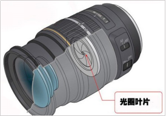
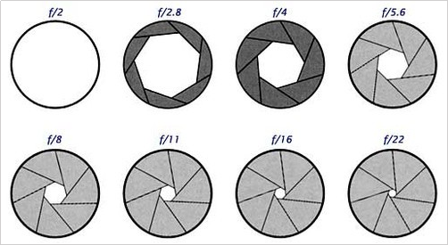
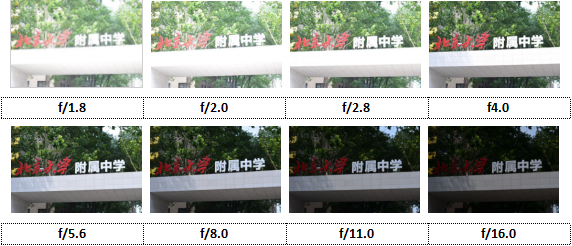
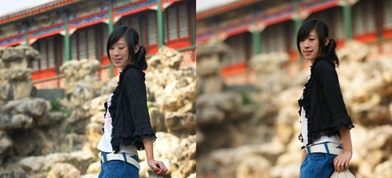
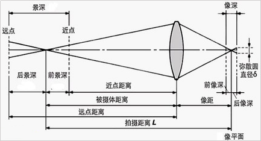
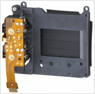
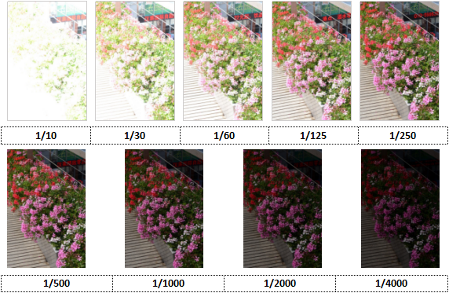
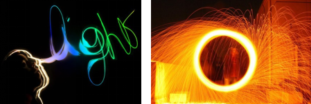
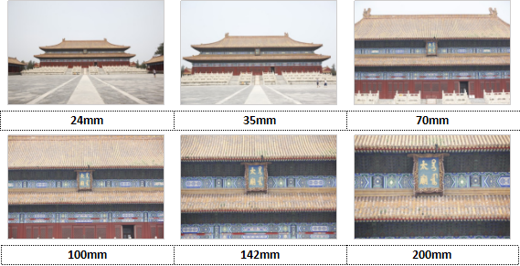

# 
相机参数

## 光圈

光圈：英文名称为Aperture，它的大小决定着通过镜头进入感光元件的光线的多少，通常我们用F值来表达光圈的大小。

### 光圈特性（一）：控制进光量

> 一般来说完整的光圈值系列如下：f1.0，f1.4，f2.0，f2.8，f4.0，f5.6，f8.0，f11，f16，f22，f32，f44，f64。

1. 光圈 f 值越小，通光孔径越大（如上图所示），在同一单位时间内的进光量便越多；
2. 光圈 f 值越大，通光孔径越小，在同一单位时间内的进光量便越少；
3. 而且上一级的进光量刚好是下一级的两倍，例如光圈从F8调整到5.6 ，进光量便多一倍，我们也说光圈开大了一级。

> 光圈的大小决定了相机的进光量。在拍摄照片中，进光量的大小直接决定了画面的明暗，在相同曝光时间里光圈大的进光量就多，光圈小的进光量也就少。

上面的图片充分的验证了光圈越大画面就越亮，光圈越小画面也就越暗这个关系。所以在平时拍照时如果天气晴朗，我们可以适当缩小光圈来控制光线进入；如果是在夜晚我们最好加大光圈拍摄以保证足够的进光量。

#### **总结：**
* **光圈的数值越小，光圈孔径越大，进光量越多，画面也就越明亮。**
* **光圈的数值越大，光圈孔径越小，进光量越少，画面也就越灰暗。**

### 光圈特性（二）：控制景深

景深：我们在使用相机进行拍摄时，调节相机镜头，使距离相机一定距离的景物清楚成像的过程，叫做对焦，那个景物所在的点，称为对焦点，因为“清楚”并不是一种绝对的概念，所以，**对焦点前（靠近相机）、后一定距离内的景物的成像都可以是清楚的，这个前后范围的总和，就叫做景深**，意思是**只要在这个范围之内的景物，都能清楚地拍摄到，超过这个范围就不能清楚的被拍摄**。其次，**前景深小于后后景深**，也就是说，精确对焦之后，对焦点前面只有很短一点距离内的景物能清楚成像，而对焦点后面很长一段距离内的景物，都是清楚的，**二者距离比例约为1:2**。

景深的深浅，与很多方面有关，但关系最大的就是光圈了。光圈越小（即F数值越大），景深就越大；光圈越大（即F数值越小）景深就越小。

> 建议各位朋友在拍摄风景的时候尽量使用F8、F11这样的小光圈拍摄，这样拍出来的风景照片远近都是清楚的；而在拍摄人像的时候可以选择F4、F2这样的大光圈拍摄，大光圈可以很好的虚化背景来突出主体人物。

#### **总结：**
* **光圈的数值越小，光圈孔径越大，景深越浅，背景虚化越明显。**
* **光圈的数值越大，光圈孔径越小，景深越深，背景虚化越不明显。**

## 快门

快门：控制照相机曝光时间的机件。

### 快门特性（一）：控制进光量

> 快门速度单位是“秒”，常见的快门速度有：1 1/2 1/4 1/8 1/15 1/30 1/60 1/125 1/250 1/500 1/1000 1/2000等。

相邻两级的快门速度的曝光量相差一倍，我们常说相差一级。如1/60秒比1/125秒的曝光量多一倍，即1/60秒比1/125秒速度慢一级或称低一级。

> 和光圈一样快门也有控制进光量的作用。如果把进光量比作水管里的水，光圈就是通过调节水管粗细来控制水量，而快门就如同水管的开关一样，通过调节开关开启的时间长短来控制水量。

在光线充足的情况下我们可以适当的提高快门速度来捕捉精彩的瞬间。在夜晚或者暗光环境下我们就要适当的延长快门速度，来保证相机足够的曝光。一般来说相机在显示快门速度时为了方便显示所以只显示分母，即1/250秒显示为250，1/50秒显示为50，然而5秒显示为5"。

> 一般来说人手持相机拍摄时快门速度不能低于1/30秒，不然很容易因为抖动而拍虚，如果必须要使用慢速快门，那最好给相机配备一个三脚架。

#### **总结：**
* **快门速度越快，光线通过时间越短，画面越暗。**
* **快门速度越慢，光线通过时间越长，画面越亮。**

### 快门特性（二）：不同的拍摄效果

> 高速快门一般用作于捕捉物体瞬间的美，比如在拍摄一些转瞬即逝的画面或者拍摄运动速度较快的物体时就需要我们用到高速快门。

> 较低的快门速度能让我们拍摄出过程美，当你要拍的是夜晚的车水马龙，快门时间就要拉长，常见照片中丝绢般的水流效果也要用慢速快门才能拍出来。快门时间可以手动调节到很长，有的时候甚至可以达到几小时。

#### **总结:**
* **快门速度越快，越能抓拍瞬间，表现瞬间美**
* **快门速度越慢，越能捕捉过程，表现过程美**

### 光圈与快门应合理搭配

> 光圈和快门的组合就形成了曝光量，在曝光量一定的情况下，这个组合不是唯一的。不同的组合虽然可以达到相同的曝光量，但是所拍摄出来的图片效果是不相同的。

**在相机模式拨盘上标有A和S档，它们分别是光圈优先档和快门优先档。**

> 在光圈优先的情况下，我们可以通过改变光圈的大小来轻松地控制景深，相机会在保证曝光量的前提下自动为其配备合适的快门速度。A档的优势是使用者只要专心的根据自己所需的景深大小来设置光圈，不用将其他心思放在快门速度的配置上，由此来提高拍摄效率。

> 快门优先是在手动定义快门的情况下通过相机测光而获取光圈值。快门优先多用于拍摄运动的物体上，特别是在体育运动拍摄中最常用。很多朋友在拍摄运动物体时发现，往往拍摄出来的主体是模糊的，这多半就是因为快门的速度不够快。在这种情况下你可以使用快门优先模式，大概确定一个快门值，然后进行拍摄。并且物体的运行一般都是有规律的，那么快门的数值也可以大概估计，例如拍摄行人，快门速度只需要1/125秒就差不多了，而拍摄下落的水滴则需要1/1000秒。

## 光圈快门大总结
#### **光圈：**
* **光圈的数值越小，光圈孔径越大，进光量越多，画面就越明亮，景深越浅。**
* **光圈的数值越大，光圈孔径越小，进光量越少，画面就越灰暗，景深越深。**

#### **快门：**
* **快门速度越快，光线通过时间越短，画面越暗，越能抓拍瞬间。**
* **快门速度越慢，光线通过时间越长，画面越亮，越能表现过程。**

## ISO
ISO：相机感光元件的感光速度。

> 在数码相机中感光度ISO的大小代表着感光元件对光线强弱的敏感程度，当ISO设置的越高，感光元件就对光线就越敏感。这样给我们带来的好处就是我们可以在光线不足的情况下通过提高ISO来保证我们的快门速度。比如在体育摄影时，当环境光线不足，然而我们又必须要保证使用很高的快门速度来抓拍运动员的瞬间动作时，在这种情况下我们就可以通过提高相机ISO来实现曝光的准确。

### 高ISO的副作用：噪点

提高感光度的大小让我们在暗光环境下也能拍出明亮的照片。可是在我们提高感光度的同时它也给我们带来了一个副作用——噪点的增加。

> 噪点（noise）主要是指感光元件CCD（CMOS）将光线作为信号接收并输出的过程中所产生的图像中粗糙的部分，也是指图像中不该出现的外来像素点。

> 在提高相机ISO的同时照片噪点数量也会随之增加。我们平时拍照时应当选择合适的ISO数值，并不是ISO越高越好。一般来说在晴天光线充足的环境下我们应该尽可能的将相机ISO设置在最低档，因为相机在使用最低档ISO拍摄时所拍出的照片画面质量是最好的；当遇到阴天或者是在室内进行拍照时我们可以适当的提高相机ISO，来保证画面的明亮。

#### **总结：**
* **ISO感光度越高，感光元件对光线越敏感，所拍照片就越明亮，噪点也就越多。**
* **ISO感光度越低，感光元件对光线越不敏感，所拍照片就越暗，噪点也就越少。**

## 焦距

焦距：焦距是指从镜头的光学中心（主点）到成像面（焦点）的距离。

焦距越长，则越能将远方的物体放大成像；焦距越短，则越能拍摄更宽广的范围。

常把焦距分为超**广角**、**广角**、**标准**、**中焦**、**长焦**和**望远**。

|超广角|广角|标准|中焦|长焦|望远|
|:---:|:---:|:---:|:---:|:---:|:---:|
|＜24mm|24mm~40mm|40mm~55mm|55mm~135mm|135mm~300mm|>300mm|

当对同一距离远的同一个被摄目标拍摄时，镜头焦距越长所成的象越大，镜头焦距越短所成的象越小。

#### **总结：**
* **焦距数值越小，能拍摄越广的范围。**
* **焦距数值越大，能拍摄越远的物体。**

> 广角镜头有着广阔的拍摄范围，但因为它有着明显的镜头畸变，所以在拍摄人像上并不给力；长焦镜头能将远处的物体拉近，十分适合拍摄特写，但是并不能拍摄较大的场面。

|焦段范围|名称|主要作用|
|:---:|:---:|:---:|
|10mm左右|超广角段|风景摄影，纪实摄影等，照出来角度非常大，很有冲击力|
|24mm左右|小广角段|主要用于风景、纪实摄影等，旅游纪念照用这个焦段不错|
|50mm左右|标准焦段|视角平易近人，变形少，主要用于风景、人像、纪实摄影等|
|85mm左右|中焦段|这个焦段主要用于拍人像，静物等|
|200mm左右|长焦段|这个焦段常用于抓拍，特写等，可较远距离拍摄|
|500mm左右|超长焦段|这个焦段可以打鸟了，也就是拍鸟，隔一个操场远都能轻松偷拍|

对于初学者而言，一般会选择套机镜头，诸如18mm-55mm，18mm-105mm，或者是变焦范围更大的18mm-200mm。

18mm-200mm号称镜头中的“一镜走天下”广角和长焦都有，出门旅游时带上这样一支镜头无论是拍风景还是人像特写都能轻松应对，免去换镜头的麻烦。

18mm-55mm虽然变焦倍率较小，但是它的成像效果在这三支镜头中是最好的，因为在变焦镜头中，变焦倍数为3倍左右的镜头成像效果最好。

## ISO和焦距总结：

* **ISO感光度越高，感光元件对光线越敏感，所拍照片就越明亮，噪点也就越多;**
* **ISO感光度越低，感光元件对光线越不敏感，所拍照片就越暗，噪点也就越少。**
* **焦距数值越小，镜头焦距越短，越能拍摄广阔的范围，景深越深;**
* **焦距数值越大，镜头焦距越长，越能拍摄较远的物体，景深越浅。**

## 相机四大参数各显神通

在拍摄时首先我们要确定拍摄的事物是否需要注重拍摄速度？也就是说您是想要抓住被摄物运动的瞬间还是想展现其过程的美感。如果您需要，那么我们就使应先确定其快门速度。如果不需要，那就先确定使用的光圈吧。

当手持拍摄时，50mm焦距不要低于1/60，这是一个安全快门，比1/60还低的话画面很容易因抖动而虚掉。 

当你想要的曝光组合无法手持拍摄时，就要轮到ISO出场了，在这种情况下为了完成拍摄任务我们只能选择牺牲掉一些画面质量了。

镜头焦距的选择是根据您的构图而定的，当然也会在一定程度上影响到景深，这就要看您个人的创意了。