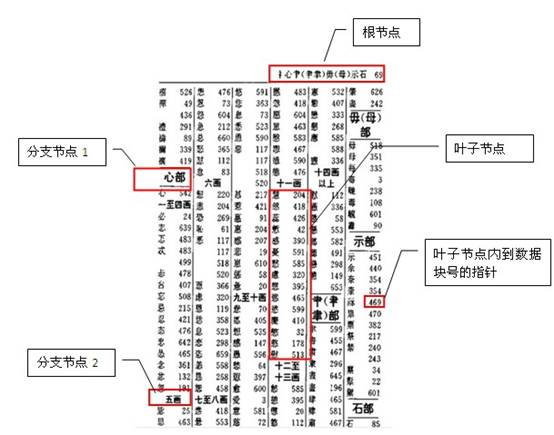

    <a href="#目录" style="color: white; border-right: 1px solid white; text-decoration: none; font-size: 14px; font-weight: bold; display: inline-block; padding: 5px 8px; line-height: 20px;">back to top ▲</a>
    <a href="javascript:void(0)" style="color: white; border-right: 1px solid white; text-decoration: none; font-weight: bold; display: inline-block; padding: 5px 8px; line-height: 20px;" onclick="(function(){document.querySelector('.btn.pull-left.js-toolbar-action').click()})()"><i class="fa fa-align-justify"></i></a>

# 索引

1. 一个表中可以建多个索引，就如一本字典可以建多个目录一样（按拼音、笔划、部首等等）；
2. 一个索引也可以由多个字段组成，称为组合索引，如上图就是一个按部首+笔划的组合目录。

我们一般在什么字段上建索引？

在什么字段上建索引需要对业务及数据充分分析后再能得出结果。主键及外键通常都要有索引，其它需要建索引的字段应满足以下条件：

1. 字段出现在查询条件中，并且查询条件可以使用索引；
2. 语句执行频率高，一天会有几千次以上；
3. 通过字段条件可筛选的记录集很小，那数据筛选比例是多少才适合？经验公式，可用于快速评估：
    1. 小表(记录数小于10000行的表)：筛选比例<10%；
    2. 大表：(筛选返回记录数)<(表总记录数*单条记录长度)/10000/16
        单条记录长度≈字段平均内容长度之和+字段数*2

只通过索引访问数据

有些时候，我们只访问表中的几个字段，且字段内容较少，我们可以为这几个字段单独建立一个组合索引，这样就可以直接只通过访问索引就能得到数据，一般索引占用的磁盘空间比表小很多，所以这种方式可以大大减少磁盘IO开销。

如：select id,name from company where type='2';

如果这个SQL经常使用，我们可以在type,id,name上创建组合索引：

create index my\_comb\_index on company(type,id,name);

有了这个组合索引后，SQL就可以直接通过my\_comb\_index索引返回数据，不需要访问company表。

还是拿字典举例：有一个需求，需要查询一本汉语字典中所有汉字的个数，如果我们的字典没有目录索引，那我们只能从字典内容里一个一个字计数，最后返回结果。如果我们有一个拼音目录，那就可以只访问拼音目录的汉字进行计数。如果一本字典有1000页，拼音目录有20页，那我们的数据访问成本相当于全表访问的50分之一。

切记，性能优化是无止境的，当性能可以满足需求时即可，不要过度优化。在实际数据库中我们不可能把每个SQL请求的字段都建在索引里，所以这种只通过索引访问数据的方法一般只用于核心应用，也就是那种对核心表访问量最高且查询字段数据量很少的查询。